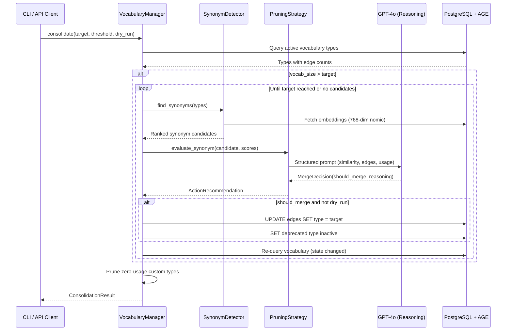
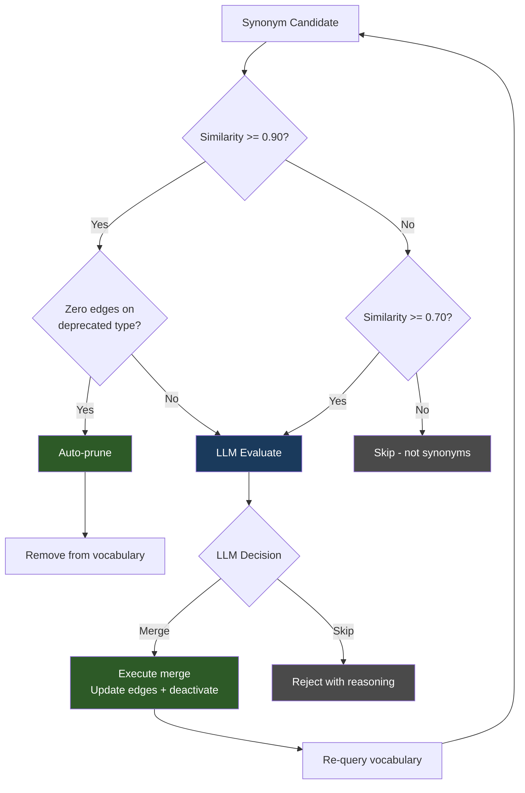
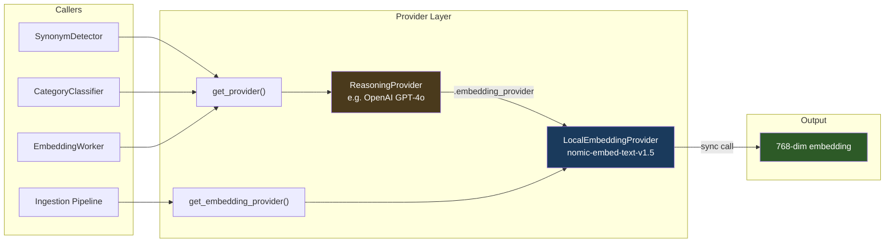

# Understanding: Vocabulary Lifecycle & Grounded LLM Decisions

How and why the vocabulary management system works.

## The Problem

As documents are ingested, the LLM invents relationship types organically —
IMPLIES, SUPPORTS, HISTORICALLY_PRECEDED, etc. Over time the vocabulary sprawls:
near-duplicates appear, some types accumulate zero edges, others become
structurally irrelevant. Something needs to govern this lifecycle.

## The Key Insight

The system computes objective mathematical scores for every relationship type:
grounding strength, similarity to other types, edge counts, traversal frequency,
bridge importance, polarity positioning, epistemic status. These numbers
describe reality.

A human reviewing vocabulary decisions would look at these same numbers and
compute a function: "low value, no bridges, similar to another type → merge."
If the human ignored the numbers and went with gut feeling, they'd be
inconsistent, biased, and worse than the math.

An LLM, given the same numbers as context, computes the same function — but
also brings reasoning that a pure threshold cannot: "these types look
numerically similar but capture different semantic intent." This is the same
external reasoning a human would bring, and a capable LLM does it at
comparable quality.

**Therefore: math grounds the LLM, the LLM reasons over the math, and the
combination is more consistent than a human in the loop.**

The human's role is bringing external information *into* the graph (new
documents, new knowledge domains), not reviewing vocabulary hygiene decisions
that the system can make objectively.

## How Consolidation Works

The consolidation pipeline follows a loop: score candidates, ask the LLM,
execute the decision, re-score (since the vocabulary changed), repeat.



Key behaviors:
- **Target-gated**: Live mode only works when vocab size exceeds the target.
  `--target 90` with 63 types is a no-op. Use a target below current size to
  trigger merges, or `--dry-run` to preview candidates regardless of target.
- **Re-query loop**: After each merge, the vocabulary state changes — types
  disappear, edge counts shift. Live mode re-fetches similarity before the
  next candidate. Dry-run evaluates all candidates against the initial state.
- **Prune after merge**: Zero-usage custom types are removed after the merge
  loop completes. Builtin types are never pruned.

## Decision Model

Candidates route through three tiers based on similarity and the LLM's
judgment:



The LLM receives a structured prompt with embedding similarity, edge counts,
and usage context. It returns a merge/skip decision with reasoning. The
reasoning is displayed in the CLI and stored in the audit trail. The LLM
correctly handles cases that pure thresholds miss:
- Directional inverses (HAS_PART/PART_OF look similar but are opposites)
- Semantic distinctions (CONTRASTS_WITH/EQUIVALENT_TO share embedding space)
- Genuinely redundant types (DEFINED_AS/DEFINED, INCREASES/ENHANCES)

## Embedding Architecture

All embedding generation flows through a single consistent path. The reasoning
provider (used for extraction and consolidation decisions) and the embedding
provider (used for vector similarity) are separate but connected:



Design constraints:
- `generate_embedding()` is **sync** across all providers — never awaited.
- `OpenAIProvider.generate_embedding()` delegates to `self.embedding_provider`.
  If none is configured, it raises `RuntimeError` (no silent fallback to
  OpenAI's text-embedding-3-small — that would create a dimension mismatch).
- Dimension guards in `SynonymDetector._cosine_similarity()` catch mismatches
  at comparison time with a clear error message.
- Stale embedding detection in `_get_edge_type_embedding()` auto-regenerates
  when a cached embedding's dimensions don't match expectations.

## CLI Commands

```
kg vocab list                          # Show all types with categories, edges, status
kg vocab consolidate                   # Execute merges + prune (live)
kg vocab consolidate --dry-run         # Preview candidates without executing
kg vocab consolidate --target N        # Set target vocab size (default 90)
kg vocab consolidate --threshold 0.85  # LLM auto-execute threshold
kg vocab merge TYPE_A TYPE_B           # Manual merge

kg job list -s pending                 # Status aliases: pending, running, done, failed
kg job cleanup -s done --confirm       # Delete completed jobs
```

Status aliases (`pending` → `awaiting_approval`, `running` → `processing`,
`done` → `completed`) are resolved by a shared `resolveStatusFilter()` utility
used across all job subcommands.

## Known Limitations

- **Duplicated LLM dispatch**: `llm_evaluate_merge()` and `_call_llm()` in
  `pruning_strategies.py` have independent provider-dispatch logic. A shared
  helper would reduce maintenance surface.
- **Stale embedding bootstrap**: `_expected_dims` is inferred from the first
  embedding encountered. If that first embedding is itself stale, the guard
  inverts — regenerating correct embeddings instead of stale ones. Works in
  practice because model transitions are infrequent, but fragile.
- **Pending reviews lack persistence**: `get_pending_reviews()` and
  `approve_action()` exist but are in-memory only. Low priority since the
  primary path is fully automated.
