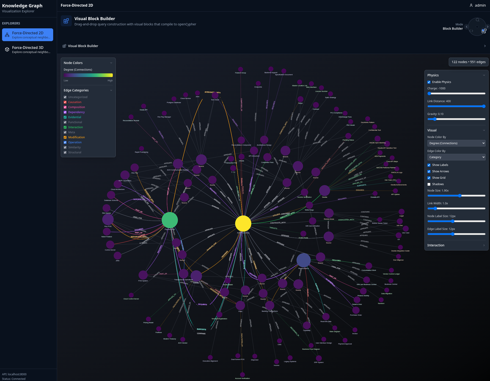

# Knowledge Graph System

A system that externalizes the latent space of an LLM into a queryable PostgreSQL database.

## The Core Concept

Standard LLMs encode knowledge implicitly in neural weights. When you ask a question, the model reconstructs understanding from these weights, but this "thinking" is transient - it exists only for the duration of the forward pass. Once the token is generated, the reasoning state disappears.

This system takes a different approach: **knowledge is explicit in graph structure**.

When an LLM processes a document, instead of discarding the understanding, we serialize the neural activation pattern into a persistent data structure - concepts as nodes, relationships as edges, embeddings as coordinates. The result is an externalized, queryable representation of what the LLM "understood."

This creates what might be called a **Large Concept Model**: where concepts are first-class entities that can be queried, traversed, filtered, and reasoned about directly.

## How It Differs from Standard RAG

Standard Retrieval-Augmented Generation retrieves text chunks by vector similarity and stuffs them into the context window. This works, but:

- **No relationships**: RAG finds similar chunks but doesn't know how they connect
- **No accumulation**: Each query starts fresh; the system doesn't learn your domain
- **No verification**: All retrieved chunks are treated as equally true

This system extracts concepts and relationships from documents, then stores them in Apache AGE (PostgreSQL graph extension). When you query:

1. **Vector search** finds semantically similar concepts (like RAG)
2. **Graph traversal** shows how they relate (ENABLES, CONTRADICTS, SUPPORTS)
3. **Grounding scores** indicate evidence strength based on accumulated support
4. **Source links** trace back to original text for verification

The graph accumulates knowledge across documents. Early ingestions populate from scratch; later ingestions match existing concepts and add relationships. Hit rates climb from 0% to 60%+ as the system learns your domain.

## How It Differs from GraphRAG

Microsoft's GraphRAG and similar systems also build knowledge graphs from text, but with different execution models:

- **Batch vs Online**: GraphRAG typically performs expensive community detection in batch. This system uses recursive upsert - the graph updates immediately with each document.
- **Static vs Evolving**: GraphRAG creates summaries at build time. This system calculates grounding at query time from current evidence.
- **Assumed truth vs Probabilistic truth**: GraphRAG assumes text is true. This system explicitly models support and contradiction, producing confidence scores.

The key innovation is **identity by semantic similarity**: concepts merge when their embeddings are ≥85% similar, not by string matching. "User Authentication" and "Auth System" become the same node if they share semantic space.

## Key Mechanisms

### Truth as Geometry

Traditional knowledge bases store truth as boolean flags. This system calculates truth as a geometric projection.

Instead of classifying each relationship as "support" or "contradiction" (which fails because SUPPORTS and CONTRADICTS are 81% similar in embedding space), the system:

1. Defines opposing concept pairs (SUPPORTS/CONTRADICTS, ENABLES/PREVENTS, etc.)
2. Computes a "polarity axis" from their difference vectors
3. Projects each relationship embedding onto this axis

The result is a continuous grounding score from -1.0 (contradicted) to +1.0 (well-supported), rather than binary extremes. A concept with 47 supporting edges and 12 contradicting edges doesn't get grounding=1.0; it gets grounding=0.77, reflecting the actual evidence distribution.

### Emergent Vocabulary

The system starts with 30 seed relationship types (ENABLES, SUPPORTS, CONTRADICTS). The LLM creates new types as needed during extraction - FACILITATES, UNDERPINS, CONSTRAINS, whatever the domain requires.

New vocabulary gets:
- **Category** from embedding similarity to seeds (FACILITATES → similar to ENABLES → "causation")
- **Direction** from LLM reasoning (outward: from acts on to; inward: from receives from to)
- **Confidence** per relationship instance

After ingestion, the system consolidates: merge semantically similar types, prune unused ones. This mimics biological memory - generate broadly during learning, prune during consolidation. The vocabulary naturally compacts to high-value relationships that survived selection pressure.

### Semantic Diversity as Authenticity Signal

Authentic knowledge connects to diverse independent domains. Fabricated narratives are semantically homogeneous - they only reference themselves.

The system measures this by calculating the entropy of embedding vectors for a concept's neighbors:

- **High diversity** (37%): Concept connects to physics, geology, engineering, optics
- **Low diversity** (23%): Concept connects only to closely related terms

This metric distinguishes well-grounded concepts from echo chambers, without requiring human judgment about content.

## Practical Usage

```bash
# Ingest documents
kg ingest file research_paper.pdf --ontology "Research"
kg ingest file whiteboard_diagram.jpg --ontology "Research"

# Search by meaning
kg search query "recursive patterns"

# Get full details with evidence
kg search details concept-id-123

# Find paths between concepts
kg search connect "authentication" "security"
```

**Components:**
- **Apache AGE + PostgreSQL** - Graph storage with openCypher, vector embeddings, RBAC
- **FastAPI REST API** - Extraction pipeline with job management and cost estimates
- **TypeScript CLI + MCP Server** - Command-line interface and agent integration
- **React Visualization** - Interactive graph exploration

## Visual Overview

### Graph Exploration

Navigate concepts through force-directed visualization with relationship traversal.


*Interactive graph showing concepts as nodes and relationships as edges. Click to explore, right-click for context menus, hover for details.*


*Finding paths between concepts shows how ideas connect across documents.*

### Multiple Query Interfaces

**Semantic Search** - Find concepts by meaning with similarity tuning


**Visual Query Builder** - Construct queries with drag-and-drop blocks that compile to openCypher




### CLI and Integration

**Command-Line Interface** - Full-featured CLI for all operations


**MCP Server** - Connect to Claude Desktop or Claude Code for agent-driven operations


### Vocabulary Management

**Custom Edge Types** - Domain-specific vocabulary that the system learns and consolidates


## Quick Start

### Automated Setup (5 minutes)

```bash
./quickstart.sh
```

This interactive script generates secrets, starts containers, configures defaults, installs the CLI, and prompts for your OpenAI API key.

Uses development defaults (admin password: `Password1!`, database password: `password`) for quick evaluation.

### Manual Setup

**Prerequisites:** Docker or Podman with Compose

```bash
# 1. Generate infrastructure secrets
./operator/lib/init-secrets.sh --dev

# 2. Start infrastructure (PostgreSQL + Garage + operator)
./operator/lib/start-infra.sh

# 3. Configure via operator container
docker exec -it kg-operator python /workspace/operator/configure.py admin
docker exec kg-operator python /workspace/operator/configure.py ai-provider openai --model gpt-4o
docker exec kg-operator python /workspace/operator/configure.py embedding 2
docker exec -it kg-operator python /workspace/operator/configure.py api-key openai

# 4. Start application (API + web UI)
./operator/lib/start-app.sh
# API: http://localhost:8000/docs
# Web: http://localhost:3000

# 5. Install CLI (optional)
cd client && ./install.sh && cd ..

# 6. Ingest and query
kg ingest file document.txt --ontology "My Research"
kg search query "your topic"
```

**Three ways to explore:**
- **CLI**: `kg` commands for querying and management
- **Web UI**: http://localhost:3000 for interactive visualization
- **MCP Server**: Connect via Claude Desktop/Code

### Container Images

Pre-built images from GitHub Container Registry:

```bash
docker pull ghcr.io/aaronsb/knowledge-graph-system/kg-api:latest
docker pull ghcr.io/aaronsb/knowledge-graph-system/kg-web:latest
docker pull ghcr.io/aaronsb/knowledge-graph-system/kg-operator:latest
```

## When To Use This

**Agent Memory** - Persistent memory for AI agents. Store observations, decisions, patterns as queryable concepts. Build institutional knowledge that doesn't reset with each conversation.

**Research Synthesis** - Navigate documents by concept relationships instead of linear reading. Discover connections you didn't know existed. Build timelines from causal relationships.

**CI/CD Intelligence** - Analyze commits and pull requests to build understanding of architectural changes. Discover what features enable what capabilities, what fixes prevent what bugs.

**Business Analysis** - Extract decisions and dependencies from meeting threads. Track entities in financial records. Map customer feedback to product features.

The pattern generalizes: any text content becomes a queryable knowledge graph with explicit relationships.

## Architecture

**PostgreSQL + Apache AGE** - Graph database with openCypher query support. All data (graph, jobs, config) in one database.

**Operator Architecture** - Configuration managed through dedicated operator container. No local Python installation required.

**Modular AI Providers** - OpenAI, Anthropic, or Ollama for extraction. Local or cloud embeddings.

**Evidence Preservation** - Every concept links to source quotes with document and paragraph references.

**Job Approval Workflow** - Pre-ingestion cost estimates. Manual or auto-approval.

**Content Deduplication** - SHA-256 hashing prevents reprocessing identical documents.

## Technology Stack

- PostgreSQL 16 + Apache AGE (graph database)
- FastAPI (async REST API)
- Python 3.11+ (extraction pipeline)
- TypeScript/Node.js (CLI + MCP server)
- React + Vite (visualization)
- D3.js / react-force-graph (graph rendering)
- OpenAI / Anthropic (LLM providers)
- Docker Compose (orchestration)

## Documentation

**Getting Started:**
- [Quick Start Guide](docs/guides/QUICKSTART.md) - Full setup walkthrough
- [MCP Setup](docs/manual/03-integration/01-MCP_SETUP.md) - Claude integration
- [AI Providers](docs/manual/02-configuration/01-AI_PROVIDERS.md) - Configuration options

**Understanding the System:**
- [Architecture Overview](docs/architecture/ARCHITECTURE_OVERVIEW.md) - How components fit together
- [Architecture Decisions](docs/architecture/ARCHITECTURE_DECISIONS.md) - ADR index (67 decisions)
- [Concepts & Terminology](docs/manual/06-reference/04-CONCEPTS_AND_TERMINOLOGY.md) - Ontologies, grounding, vocabulary

**Key Architecture Decisions:**
- [ADR-044](docs/architecture/ADR-044-probabilistic-truth-convergence.md) - Probabilistic truth from contradiction resolution
- [ADR-058](docs/architecture/ADR-058-polarity-axis-triangulation.md) - Truth as geometric projection
- [ADR-063](docs/architecture/ADR-063-semantic-diversity-authenticity.md) - Semantic diversity as authenticity signal
- [ADR-052](docs/architecture/ADR-052-vocabulary-expansion-consolidation.md) - Vocabulary expansion-consolidation cycle

**Full Documentation:** [docs/README.md](docs/README.md)

## Project Structure

```
knowledge-graph-system/
├── src/api/              # FastAPI REST server
│   ├── lib/              # Core libraries (extraction, graph, AI)
│   ├── routes/           # API endpoints
│   └── workers/          # Background processing
│
├── client/               # TypeScript CLI + MCP server
│
├── viz-app/              # React visualization
│
├── operator/             # Platform configuration
│
├── schema/               # Database schema + migrations
│
└── docs/                 # Documentation
    ├── architecture/     # 67 ADRs
    ├── manual/           # User manual
    └── guides/           # Standalone guides
```

## License

**Elastic License 2.0**

- Free for individuals (homelab, learning, experimentation)
- Free for companies (internal use at any scale)
- Free for product integration
- Not permitted: offering as a managed service to third parties

See [LICENSE-COMMERCIAL.md](LICENSE-COMMERCIAL.md) for commercial licensing.

## Acknowledgments

Built with [Apache AGE](https://age.apache.org/), [Model Context Protocol](https://modelcontextprotocol.io/), [FastAPI](https://fastapi.tiangolo.com/), [OpenAI](https://openai.com/), and [Anthropic](https://anthropic.com/).
