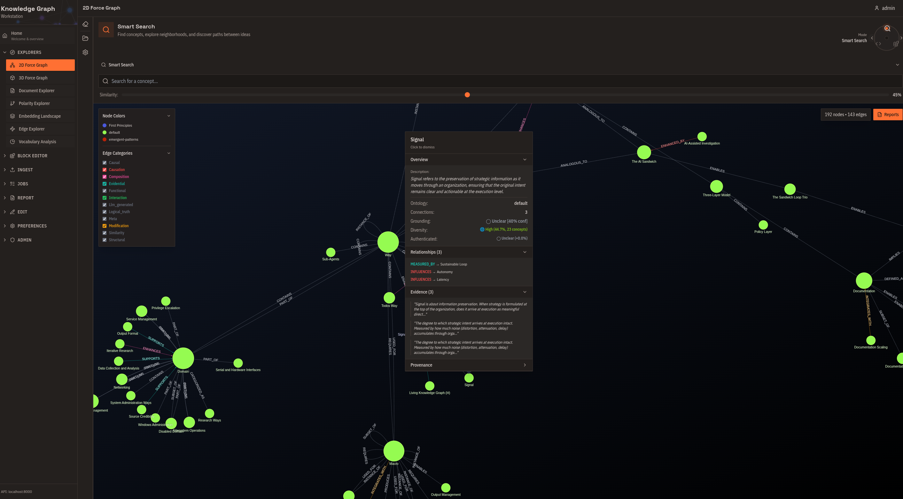
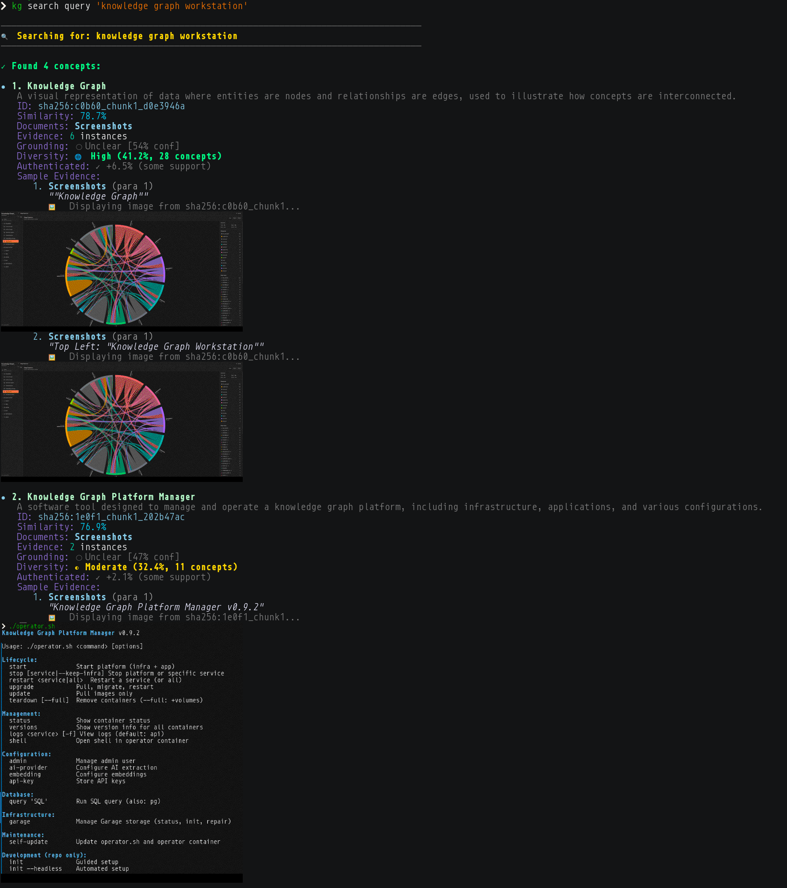
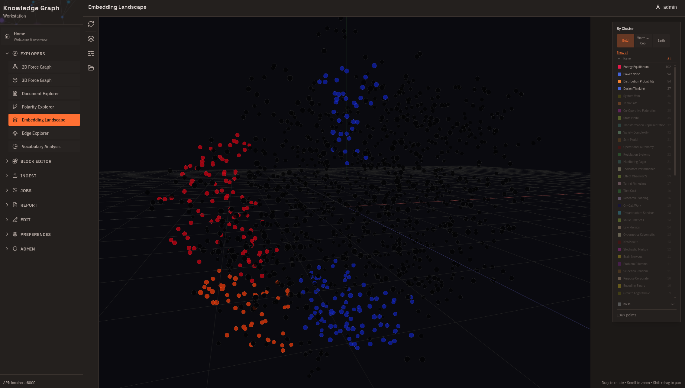

# Knowledge Graph System

A semantic knowledge graph that extracts concepts from documents, tracks how well-supported they are, and remembers where sources disagree.



## Quick Start

### Install Client Tools

The `kg` CLI, MCP server (for AI assistants), and optional FUSE filesystem:

```bash
curl -fsSL https://raw.githubusercontent.com/aaronsb/knowledge-graph-system/main/client-manager.sh | bash
```

Or just the CLI: `npm install -g @aaronsb/kg-cli`

### Deploy the Platform

Run your own knowledge graph backend:

```bash
curl -fsSL https://raw.githubusercontent.com/aaronsb/knowledge-graph-system/main/install.sh | bash
```

Or from source:
```bash
git clone https://github.com/aaronsb/knowledge-graph-system.git
cd knowledge-graph-system
./operator.sh init    # Interactive setup
./operator.sh start   # Start containers
```

**Access points:**
- **Web UI**: http://localhost:3000
- **API**: http://localhost:8000/docs
- **CLI**: `kg search "your query"`

See [Quick Start Guide](docs/operating/quick-start.md) for details.

## See It In Action


*Interactive graph exploration with smart search, concept clustering, and relationship visualization*


*Command-line search returns concepts with source images rendered inline via chafa*


*t-SNE embedding landscape with auto-detected clusters, named by topic via TF-IDF*

## What You Can Do

**Ingest documents** — PDFs, markdown, images, text. The system extracts concepts, relationships, and evidence automatically.

**Search by meaning** — "economic downturn" finds content about recessions, crashes, and crises even if those exact words aren't used.

**Explore connections** — Find paths between concepts. See how ideas relate across documents.

**Check confidence** — Every result includes grounding scores. Know what's well-supported vs. contested.

**Trace sources** — Every concept links back to the original text or image that generated it.

**Query via AI** — MCP server integration lets Claude and other assistants use the graph as persistent memory.

**Navigate via filesystem** — Mount the graph as a FUSE filesystem. Use `ls`, `grep`, `find` on semantic space.

## Use Cases


*Obsidian's graph view rendering knowledge graph relationships via the FUSE filesystem — no plugin needed*

**Research synthesis** — Ingest papers, find connections across them, see where authors disagree. Grounding scores tell you which claims have broad support.

**Technical documentation** — Extract architecture concepts from diagrams, meeting notes, design docs. Query how components relate.

**Agent memory** — Give AI assistants persistent, grounded memory. They can check confidence before making claims.


*Claude Desktop using MCP to search, explore relationships, and validate claims against the knowledge graph*

**Spatial understanding** — Ingest place photos. The graph learns physical relationships without coordinates.

**Compliance/audit** — Full provenance chain. Every concept traces to source evidence.

## Architecture

```
Documents ──→ [FastAPI] ──→ LLM Extraction ──→ [PostgreSQL + AGE]
                  │                                    │
                  │                              [graph_accel]
                  │                            in-memory traversal
                  │                                    │
              [Garage S3]                        [AGE graph store]
               doc storage                     source of truth (ACID)
                  │                                    │
              [React + D3] ←──── REST API ────→ [FastAPI]
            web visualization                   query + ingest
                  │
           [CLI / MCP / FUSE]
           client interfaces
```

- **PostgreSQL + Apache AGE** — Graph database with native openCypher queries. ACID transactions, schema integrity, vector search (pgvector).
- **graph_accel** — In-memory graph traversal accelerator. A Rust PostgreSQL extension that maintains an adjacency structure in shared memory for instant BFS/shortest-path at any depth. AGE handles writes; graph_accel handles reads. Epoch-based invalidation ensures the read model is never stale. ([ADR-201](docs/architecture/database-schema/ADR-201-in-memory-graph-acceleration-extension.md))
- **FastAPI** — Extraction pipeline and REST API
- **React + D3** — Interactive graph visualization and exploration
- **TypeScript CLI** — Command-line interface and MCP server for AI assistant integration
- **Ollama** — Optional local inference (air-gapped operation)
- **Garage** — S3-compatible object storage for document assets

## Documentation

| Audience | Start Here |
|----------|------------|
| Understanding the concepts | [docs/concepts/](docs/concepts/) |
| Deploying and operating | [docs/operating/](docs/operating/) |
| Using the system | [docs/features/](docs/features/) |
| Architecture decisions | [docs/architecture/](docs/architecture/) |

96 Architecture Decision Records document the design evolution.

## Background

Most systems that store knowledge for retrieval — vector databases, RAG pipelines, knowledge graphs — optimize for finding relevant content. They can tell you *what* matches your query. They can't tell you how well-supported it is, whether sources disagree about it, or where the evidence actually came from.

This system adds an epistemic layer on top of the graph. Every concept carries a **grounding score** computed from supporting vs. contradicting evidence — not a label, but a measurement. A concept backed by 47 sources with 12 contradictions scores differently than one with a single unchallenged mention. When sources disagree, the system preserves both sides rather than picking a winner.

**Semantic diversity** provides a second signal. Well-established knowledge tends to connect across independent domains. Narrow claims that only reference each other score lower. In testing, Apollo 11 mission data showed 37.7% diversity across 33 concepts; moon landing conspiracy content showed 23.2% across 3.

The system also handles images. Feed it street view photos and the extracted relationships ("next to", "across from", "visible from") naturally encode spatial topology — no coordinates needed.

### How It Compares

| Capability | This System | GraphRAG | Zep/Graphiti | Vector DBs |
|------------|-------------|----------|--------------|------------|
| Contradiction detection | Native (mathematical) | LLM-dependent | Limited | No |
| Grounding scores | Continuous -1 to +1 | Source citations only | No | Similarity only |
| Semantic diversity | Yes (authenticity signal) | No | No | No |
| Epistemic status | Per-relationship | No | No | No |
| FUSE filesystem | Yes | No | No | No |
| Air-gapped operation | Yes (Ollama) | Cloud required | Cloud required | Some local |
| Dynamic vocabulary | Emergent + consolidation | Fixed schema | Fixed schema | N/A |

Zep/Graphiti has better temporal tracking (bi-temporal model). GraphRAG has broader community adoption. This system fills the gap for epistemic metrics — measuring confidence rather than just retrieving content.

## Why Try It

If you need:
- **Epistemic reliability** — knowing *how sure* you should be, not just *what* the answer is
- **Contradiction awareness** — preserving disagreement rather than hiding it
- **Full provenance** — tracing every claim to source evidence
- **Local operation** — running without cloud API dependencies
- **Unix integration** — using standard tools on semantic data

This system was built for those requirements. Most alternatives optimize for retrieval accuracy or comprehensiveness. We optimize for *knowing what you know and how well you know it*.

## License

**Elastic License 2.0** — Free for internal use and product integration. Not permitted as a managed service.

## Acknowledgments

Built with [Apache AGE](https://age.apache.org/), [Model Context Protocol](https://modelcontextprotocol.io/), [FastAPI](https://fastapi.tiangolo.com/), and local inference via [Ollama](https://ollama.ai/).
