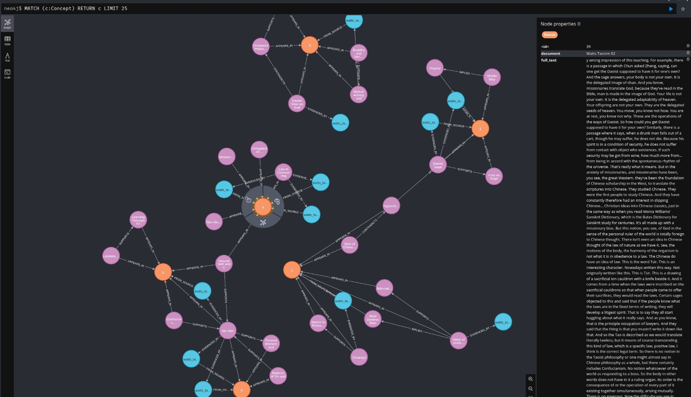

# Knowledge Graph System

**Transform documents into queryable concept networks, not just retrievable text.**



## What This Is

A knowledge graph system using LLM extraction, Neo4j storage, and vector search. Built on Model Context Protocol (MCP) for multi-agent access.

📊 **[Technical Assessment](docs/ASSESSMENT.md)** - Architecture comparison, research context, implementation details *(Oct 5, 2025)*

**Core Pattern:**
Iterative graph traversal during ingestion. Each chunk:
1. Queries recent concepts from graph
2. Feeds context to LLM
3. Extracts new concepts and relationships
4. Upserts to graph
5. Next chunk uses enriched graph

The graph serves as both output and active input. Inspired by how coding agents replay conversation context.

**Measured Results:**
From ingestion logs (`logs/ingest_*.log`):
- 17 chunks, 16,617 words processed
- Chunk 1: 0% hit rate (graph empty)
- Chunk 11: 60% hit rate
- Chunk 15: 62.5% hit rate
- 63 concepts created, 28 linked to existing, 84 relationships

**Architecture:**
- Neo4j graph database with vector indexes
- MCP server for Claude Desktop integration
- Python ingestion pipeline with checkpoint/resume
- CLI for direct queries
- Full-text + vector search

**Production Path:**
- GitHub Actions integration for automated ingestion
- Batch processing for large document sets
- Scale testing and operational hardening

---

## What is This?

Most AI systems retrieve text chunks based on similarity. This system **extracts concepts, understands relationships, and builds a persistent knowledge graph** that can be explored, traversed, and queried semantically.

Instead of asking "what text is similar to my query?", you ask:
- "What concepts relate to uselessness in Taoist philosophy?"
- "Show me evidence for the AI Sandwich model"
- "How does variety connect to human-AI collaboration?"

**The difference:**
- 🔍 **RAG**: Find similar text → stuff into context → hope for the best
- 🕸️ **Knowledge Graph**: Extract concepts → model relationships → traverse connections → provide evidence

## Why Does This Matter?

Traditional RAG systems:
- Rebuild knowledge on every query (ephemeral)
- Retrieve based on vector similarity alone
- Treat documents as isolated text chunks
- Provide no concept-level understanding

This system:
- ✅ **Persistent concept extraction** - ideas become first-class entities with labels and search terms
- ✅ **Relationship modeling** - concepts IMPLY, SUPPORT, CONTRADICT each other
- ✅ **Graph traversal** - explore connections between ideas, not just similarity scores
- ✅ **Evidence provenance** - every concept links back to source quotes
- ✅ **Cross-document synthesis** - concepts from different sources automatically connect
- ✅ **Multi-modal access** - Query via MCP (for LLMs), CLI (for humans), or Neo4j Browser (visual)

## Live Example

After ingesting Alan Watts lectures and a technical paper on AI systems:

```bash
# Query: "uselessness"
→ Found: "Value of Uselessness" (89.5% similarity)
  Evidence: "The whole notion of something of life...being useful...
             is to a Taoist absurd."
  Related to: "Ideal Useless Man" → "Admiration of Nature"

# Query: "variety requisite human capability"
→ Found: "Requisite Variety" (Ashby's Law)
  Relationships: SUPPORTS "AI Sandwich Systems Model"
                IMPLIES "Variety Mismatch" failure patterns
  Evidence: 3 source quotes with paragraph references
```

The system understood:
- Taoist philosophy concepts across multiple lectures
- Technical framework relationships in the AI paper
- How "variety" functions as a mechanism, not just a keyword

## Quick Start

**Prerequisites:** Docker, Python 3.11+, Node.js 18+

```bash
# 1. Setup system (one-time)
./scripts/setup.sh

# 2. Configure AI provider (OpenAI or Anthropic)
./scripts/configure-ai.sh

# 3. Ingest documents into an ontology
./scripts/ingest.sh file1.txt --name "My Ontology"
./scripts/ingest.sh file2.txt --name "My Ontology"  # Adds to same ontology

# 4. Query the graph
source venv/bin/activate
python cli.py search "your query here"
python cli.py details <concept-id>
python cli.py ontology list  # List all ontologies
python cli.py ontology info "My Ontology"  # View ontology details
python cli.py database stats  # Database statistics
python cli.py --json ontology list  # JSON output for tool integration
```

**For Claude Desktop/Code integration:** See [MCP Setup Guide](docs/MCP_SETUP.md)

## How It Works

```
Document → Smart Chunking → LLM Extraction → Graph Construction → Semantic Query
            ↓                ↓                 ↓                   ↓
         Boundaries      Concepts +        Neo4j with          Vector Search
         Detected        Relationships     Evidence Links      + Traversal
```

1. **Smart Chunking**: Breaks documents at natural boundaries (paragraphs, sentences) with context overlap
2. **Concept Extraction**: LLM identifies concepts, evidence quotes, and relationships
3. **Graph Construction**: Stores in Neo4j with vector embeddings for similarity search
4. **Deduplication**: Automatically merges similar concepts across chunks/documents
5. **Query & Traverse**: Semantic search + graph traversal with evidence retrieval

## Architecture Highlights

- **Multi-Document Ontologies**: Group related documents into named ontologies - concepts automatically connect across files
- **Graph-Aware Chunking**: Queries recent concepts before processing new chunks, enabling cross-chunk relationship detection
- **Vector Deduplication**: Uses cosine similarity to merge concepts across document boundaries
- **Checkpoint & Resume**: Position tracking for large documents - resume if interrupted
- **Modular AI Providers**: Swap between OpenAI, Anthropic, or add your own
- **Full-Text + Vector Search**: Combined semantic and exact-match capabilities
- **Evidence Preservation**: Every concept links to source quotes with paragraph references

## Use Cases

**Research & Learning:**
- Explore philosophical texts by concept relationships, not linear reading
- Connect ideas across multiple papers or books
- Find evidence for specific claims with source attribution

**Documentation Understanding:**
- Navigate large codebases by architectural concepts
- Understand design decisions and their relationships
- Trace dependencies between system components

**Knowledge Synthesis:**
- Find connections between seemingly unrelated documents
- Build concept maps from lecture series or technical documentation
- Generate semantic overviews without reading everything linearly

## What Makes This Different?

This is **not** a new embedding model or vector database. It's a synthesis:

1. **LLM-powered extraction** (not just embeddings) - understands concepts, not just words
2. **Graph storage** (not vector-only) - models relationships between ideas
3. **Evidence-based retrieval** (not just chunks) - provides source quotes for every concept
4. **Persistent knowledge** (not ephemeral RAG) - builds understanding over time
5. **Human + AI queryable** (not just AI) - CLI, MCP, and Neo4j Browser access

## Learn More

- 📖 [Concept Deep Dive](docs/CONCEPT.md) - Why knowledge graphs vs RAG
- 🏗️ [Architecture](docs/ARCHITECTURE.md) - How the system works
- 🚀 [Quick Start Guide](docs/QUICKSTART.md) - Get running in 5 minutes
- 🔌 [MCP Setup Guide](docs/MCP_SETUP.md) - Configure Claude Desktop/Code integration
- 💡 [Examples & Demos](docs/EXAMPLES.md) - Real queries with actual results
- ⚙️ [AI Provider Configuration](docs/AI_PROVIDERS.md) - OpenAI, Anthropic, or custom
- 📚 [Concepts & Terminology](docs/CONCEPTS_AND_TERMINOLOGY.md) - Understanding ontologies, stitching, pruning, and graph integrity
- 💾 [Backup & Restore Guide](docs/BACKUP_RESTORE.md) - Protecting your LLM token investment

## Project Structure

```
knowledge-graph-system/
├── scripts/                # Management scripts
│   ├── setup.sh           # Initial system setup
│   ├── reset.sh           # Clear database and restart
│   ├── ingest.sh          # Ingest documents (smart chunking)
│   └── configure-ai.sh    # Configure AI provider
│
├── ingest/                 # Python ingestion pipeline
│   ├── ingest_chunked.py  # Main ingestion with chunking
│   ├── chunker.py         # Smart text chunking
│   ├── llm_extractor.py   # LLM concept extraction
│   └── neo4j_client.py    # Graph database operations
│
├── mcp-server/            # MCP server for Claude Desktop
│   └── src/
│       ├── index.ts       # MCP server entry point
│       └── neo4j.ts       # Neo4j queries and operations
│
├── schema/
│   └── init.cypher        # Neo4j schema and indexes
│
└── docs/                  # Documentation
    ├── CONCEPT.md         # Why knowledge graphs
    ├── ARCHITECTURE.md    # System design
    ├── QUICKSTART.md      # Getting started
    ├── MCP_SETUP.md       # Claude Desktop/Code integration
    └── EXAMPLES.md        # Real query examples
```

## Technology Stack

- **Neo4j 5.15+** - Graph database with vector search
- **Python 3.11+** - Ingestion pipeline
- **OpenAI / Anthropic** - LLM concept extraction
- **Node.js 18+** - MCP server
- **Docker Compose** - Infrastructure

## Current Status

**Working:**
- ✅ Document ingestion with smart chunking
- ✅ LLM concept extraction (OpenAI & Anthropic)
- ✅ Graph construction with relationships
- ✅ Vector similarity search
- ✅ Full-text search
- ✅ MCP server for Claude Desktop
- ✅ CLI for direct querying
- ✅ Checkpoint & resume for large documents
- ✅ Cross-document concept deduplication

**Roadmap:**
- [ ] Async ingestion with job queues
- [ ] Advanced graph algorithms (PageRank, community detection)
- [ ] Web UI for exploration
- [ ] Export to GraphML/JSON
- [ ] Incremental updates (avoid re-processing)

## Contributing

This is an experimental project exploring the boundaries between RAG, knowledge graphs, and LLM-powered extraction. Feedback, issues, and contributions welcome.

## License

[Add your license here]

## Acknowledgments

Built with:
- [Neo4j](https://neo4j.com/) - Graph database platform
- [Model Context Protocol](https://modelcontextprotocol.io/) - LLM integration standard
- [OpenAI](https://openai.com/) / [Anthropic](https://anthropic.com/) - LLM providers

---

*Not just retrieval. Understanding.*
