# Knowledge Graph System

**Transform documents into queryable concept networks. Not retrieval - understanding.**

## What This Is

A complete knowledge graph platform that extracts concepts and relationships from any text, stores them in a production-grade graph database, and provides multiple interfaces for exploration and analysis.

**Four integrated components:**

1. **Apache AGE + PostgreSQL** - Production graph database with openCypher queries, vector search, and full RBAC
2. **FastAPI REST API** - LLM-powered extraction pipeline with job management and cost controls
3. **TypeScript CLI + MCP Server** - Unified command-line interface and Model Context Protocol server for agent integration
4. **React Visualization Explorer** - Interactive graph visualization with smart search, visual query builder, and openCypher editor

Feed it research papers, meeting notes, code commits, or philosophical texts. The system identifies concepts, understands their relationships, and preserves evidence trails back to source material. Query by meaning, not keywords. Traverse connections between ideas, not just similarity scores.

**The difference matters:** Traditional RAG retrieves text chunks that match your query. Knowledge graphs reveal how concepts *relate* - what enables what, what contradicts what, what emerges from what. The graph grows smarter with each document, automatically connecting new concepts to existing knowledge.

---

📚 **[Read the full documentation →](https://aaronsb.github.io/knowledge-graph-system/)**

Complete guides, architecture decisions, and API reference hosted on GitHub Pages.

---

## Visual Overview

### Interactive Graph Visualization

Explore concept relationships through interactive force-directed graphs with advanced visual features including 3D-style shadows, dynamic legend, context menus, and real-time node information.

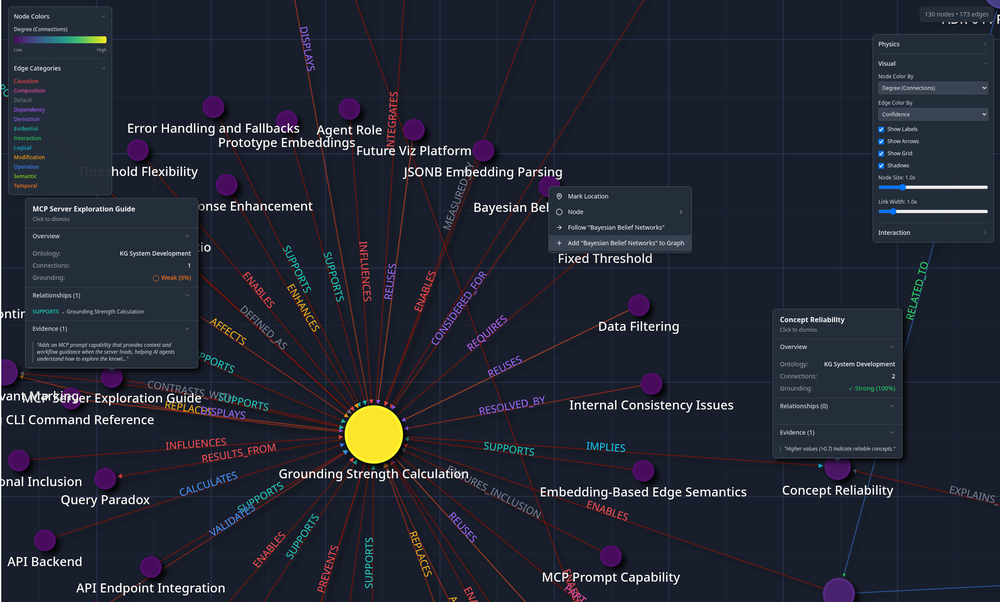

*Force-directed graph with 3D shadows, reference grid, nested context menus, collapsible legend, and interactive info boxes showing concept details and relationships.*

Search semantically, find paths between ideas, and visualize how knowledge connects across your corpus.

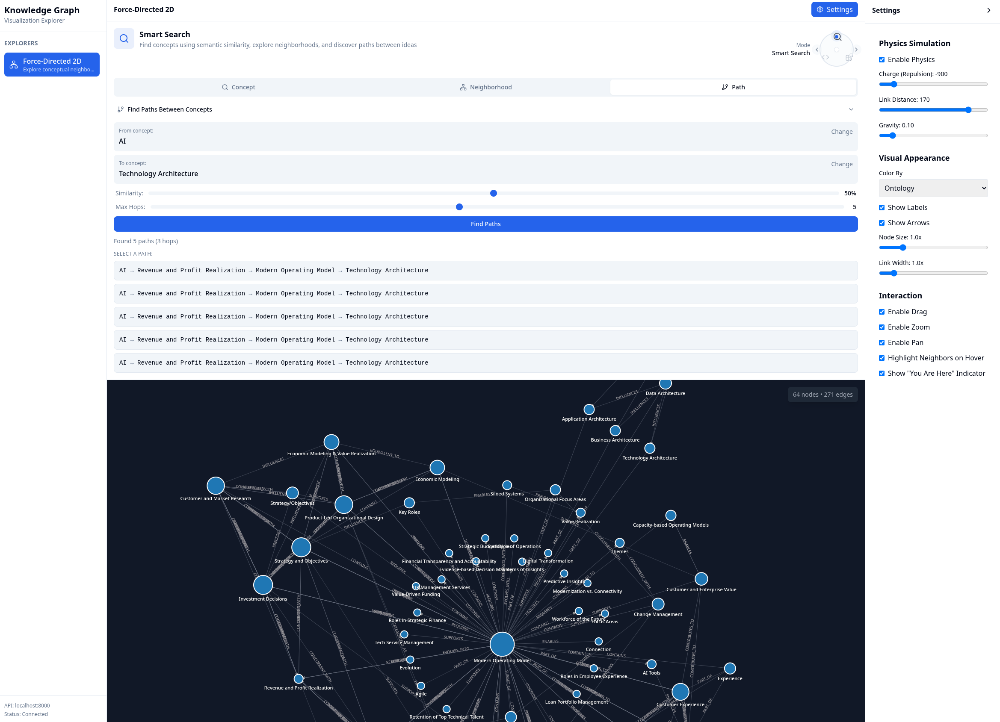

*Finding paths between concepts and exploring relationship neighborhoods reveals how ideas connect across documents.*

### Multiple Query Interfaces

**Smart Search** - Semantic concept search with similarity tuning and neighborhood exploration

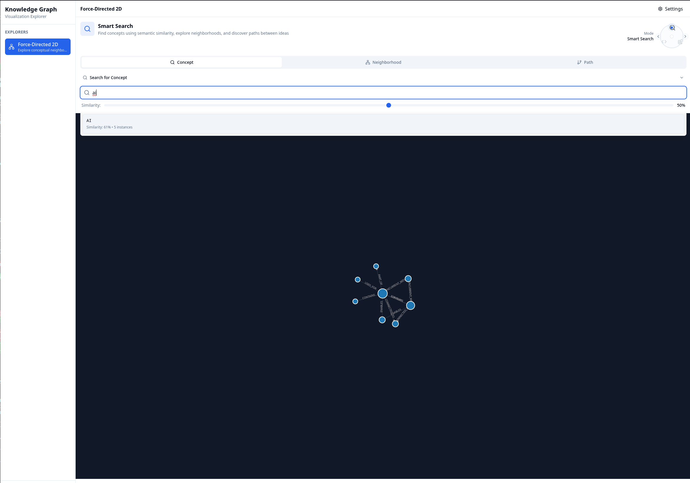

**Visual Query Builder** - Drag-and-drop block-based openCypher query construction

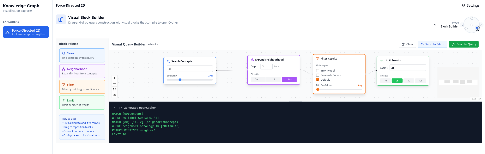

**Direct openCypher** - Write openCypher queries directly for advanced graph traversal

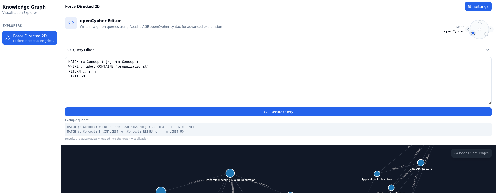

### Command-Line Interface

Full-featured CLI for ingestion, querying, and system management.

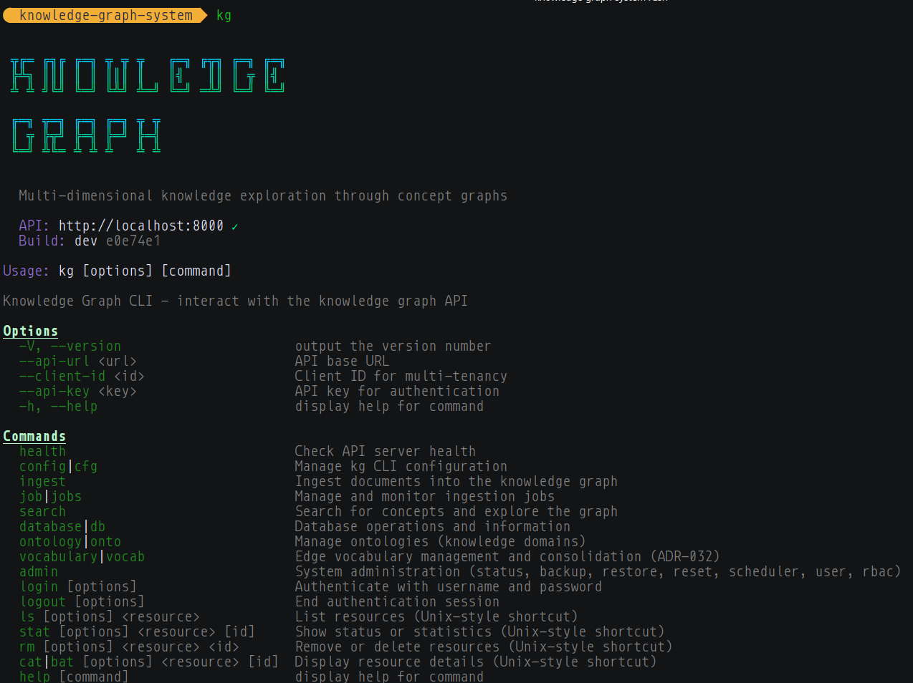

### REST API Documentation

Interactive API documentation with OpenAPI (Swagger) and ReDoc interfaces.

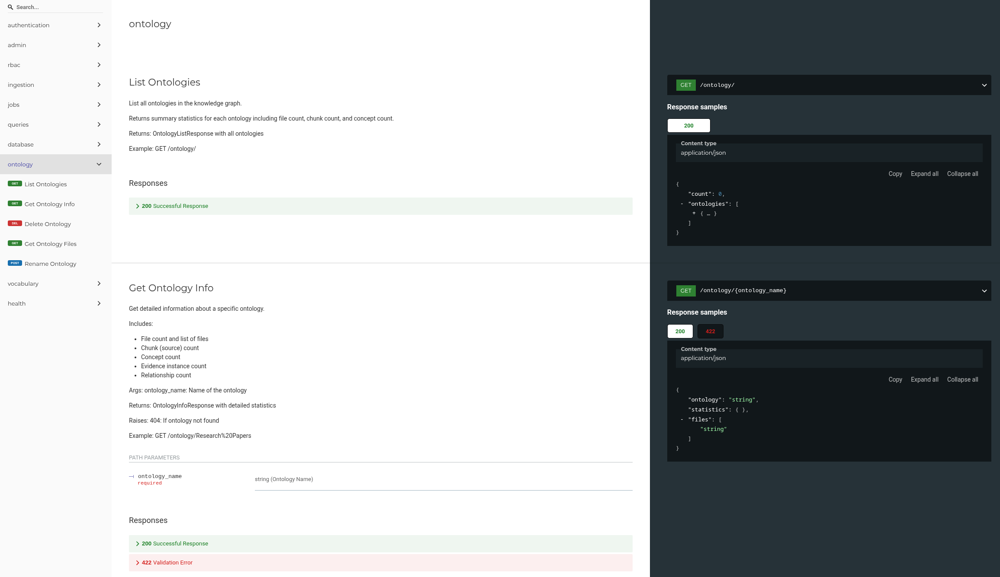

### MCP Server Integration

Connect to Claude Desktop or Claude Code for agent-driven graph operations.

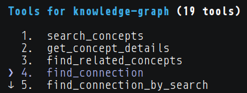

## How It Works

Documents flow through smart chunking that respects natural boundaries
  ↓
LLM extraction identifies concepts, relationships, and evidence quotes
  ↓
Graph construction in PostgreSQL with Apache AGE extension
  ↓
Vector embeddings enable semantic search across concepts
  ↓
Query interface reveals connections and provides provenance

**The iterative pattern:** Each chunk queries recent concepts before processing. The LLM sees what the graph already knows, enabling cross-chunk relationship detection. Early chunks populate the graph. Later chunks connect to existing concepts. Hit rates climb from 0% to 60%+ as the graph learns your domain.

**Multi-document synthesis:** Concepts automatically merge across files when semantically similar. A term mentioned in chapter 1 links to the same concept in chapter 10, even across different documents in the same ontology.

## Why This Matters

You've invested time (and API tokens) extracting knowledge from documents. Traditional systems rebuild that understanding on every query. This system *remembers*.

**Persistent concept extraction** → Ideas become first-class entities with labels, search terms, and relationships

**Relationship modeling** → Concepts ENABLE, SUPPORT, CONTRADICT, IMPLY each other with confidence scores

**Graph traversal** → Explore connections between ideas across document boundaries

**Evidence provenance** → Every concept links to source quotes with paragraph references

**Cross-ontology enrichment** → Ingest related documents into different ontologies; shared concepts bridge them naturally

**Time as emergent property** → Causal relationships (CAUSES, RESULTS_FROM, ENABLES) create observable time arrows without explicit timestamps

## Quick Start

**Prerequisites:** Docker, Python 3.11+, Node.js 18+

```bash
# 1. Setup infrastructure
./scripts/setup.sh

# 2. Configure AI provider
./scripts/setup/configure-ai.sh

# 3. Start API server
./scripts/services/start-api.sh
# API docs: http://localhost:8000/docs
# ReDoc API: http://localhost:8000/redoc

# 4. Install TypeScript CLI
cd client && npm install && npm run build && ./install.sh && cd ..

# 5. Start visualization explorer (optional)
./scripts/start-viz.sh
# Open browser to http://localhost:3000

# 6. Ingest documents
kg ingest file document.txt --ontology "My Research"

# 7. Query concepts
kg search query "recursive patterns"
kg ontology list
kg database stats
```

**Three ways to explore your graph:**
- **CLI:** Use `kg` commands for querying and management
- **Visualization Explorer:** Open http://localhost:3000 for interactive graph exploration
- **MCP Server:** Connect via Claude Desktop/Code - See [MCP Setup Guide](docs/guides/MCP_SETUP.md)

## Live Example

After ingesting project commit history and pull requests into separate ontologies:

```bash
# Search across both ontologies
kg search query "Apache AGE migration"

# Result: "Apache AGE Migration" concept
#   - 6 evidence instances
#   - Found in: "Knowledge Graph Project History" (commits)
#   - Found in: "Knowledge Graph Project Pull Requests" (PRs)
#   - Relationships:
#       ENABLES → RBAC Capabilities
#       PREVENTS → Dual Database Complexity
#       RESULTS_FROM → Unified Architecture
```

The system understood commits and PRs describe the same architectural change from different perspectives. It merged evidence, enriched relationships, and revealed the strategic narrative without explicit linking.

## When To Use This

### Core Use Cases

**🤖 Agent Memory System**
- Persistent memory for AI agents across sessions and conversations
- Store observations, decisions, and learned patterns as queryable concepts
- Retrieve context by semantic meaning or relationship traversal
- Build institutional knowledge that doesn't reset with each chat

**⚙️ CI/CD Intelligence**
- Add to GitHub Actions pipeline to analyze every commit and pull request
- Build rational concept understanding of architectural changes over time
- Discover what features enable what capabilities, what fixes prevent what bugs
- Create living documentation that evolves with your codebase

**📚 Research & Knowledge Work**
- Navigate philosophical texts by concept relationships, not linear reading
- Discover connections between documents you didn't know were related
- Build timelines from causal relationships (CAUSES, PRECEDES, EVOLVES_INTO)
- Synthesize insights across your entire corpus

**💼 Business & Analysis**
- Extract action items, decisions, and dependencies across meeting threads
- Track entities and relationships in financial records
- Map customer feedback to feature requests and product improvements
- Build knowledge bases that grow smarter with each document

The pattern generalizes: any text-based content can become a queryable knowledge graph with relationship-based understanding.

## Architecture Highlights

- **Apache AGE (PostgreSQL extension)** - Graph database with openCypher query support and production RBAC
- **Unified PostgreSQL architecture** - Graph data, job queue, and application state in one database
- **Job approval workflow** - Pre-ingestion cost estimates, manual or auto-approval, lifecycle management
- **Modular AI providers** - Swap between OpenAI, Anthropic, or implement custom extractors
- **Content deduplication** - SHA-256 hashing prevents reprocessing identical documents
- **Ontology management** - Group related documents; rename or delete with cascading job cleanup
- **Vector search + graph traversal** - Semantic similarity finds concepts, relationships explain connections
- **Evidence preservation** - Every concept links to source quotes with document and paragraph references
- **TypeScript client** - Unified CLI and future MCP server mode for multi-agent access
- **Dry-run capabilities** - Preview ingestion operations before committing API tokens

## What Makes This Different

Not a vector database. Not a new embedding model. A synthesis:

**LLM-powered extraction** → Understands concepts and relationships, not just word patterns

**Graph storage** → Models how ideas connect, not just where they appear

**Evidence-based retrieval** → Provides source quotes with provenance, not isolated chunks

**Persistent knowledge** → Builds understanding over time, not ephemeral query-time synthesis

**Multi-dimensional querying** → Semantic search finds concepts, graph traversal explains relationships

**Emergent temporal structure** → Causal relationships create observable time arrows without explicit ordering

## Technology Stack

- **PostgreSQL 16 + Apache AGE** - Graph database with openCypher support and production RBAC
- **FastAPI** - Async REST API server with job queue and lifecycle management
- **Python 3.11+** - Ingestion pipeline, LLM extraction, graph operations
- **TypeScript/Node.js 18+** - Unified client (CLI + MCP server mode)
- **React + Vite** - Interactive visualization explorer with force-directed graphs
- **React Flow** - Visual query builder with drag-and-drop blocks
- **D3.js / react-force-graph** - 2D/3D/VR graph visualizations
- **OpenAI / Anthropic** - Modular LLM provider abstraction
- **Docker Compose** - Infrastructure orchestration

## System Features

### Production-Ready Infrastructure

**Job Management** - Comprehensive ingestion lifecycle with cost controls and progress tracking

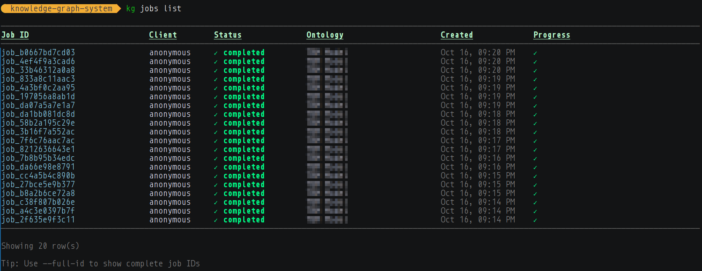

**RBAC & Administration** - Role-based access control, backup/restore, and scheduled operations

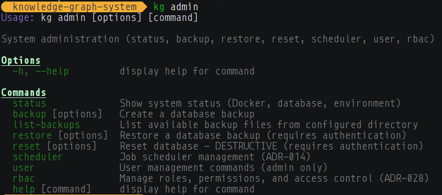

**Custom Vocabularies** - Define domain-specific relationship types and reduce catastrophic forgetting

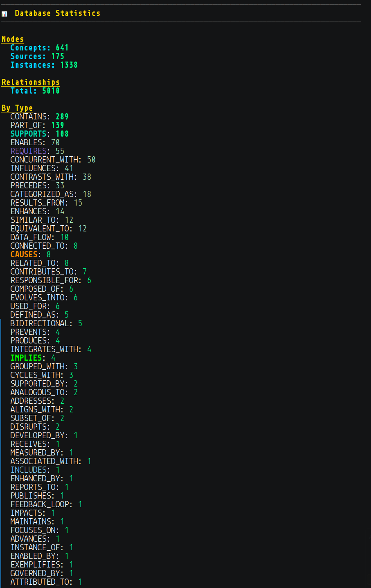

### Current Status

**✅ Completed (Phase 1 & 2):**
- Apache AGE graph database with vector search and openCypher queries
- FastAPI REST API with async job queue and lifecycle management
- TypeScript CLI (`kg` command) with full ingestion and query capabilities
- MCP server mode for Claude Desktop/Code integration
- React visualization explorer with multiple query modes
- Interactive graph visualization (force-directed, 2D/3D, VR)
- Visual query builder (drag-and-drop openCypher construction)
- Smart search with semantic similarity and path finding
- Background processing with progress tracking and cost estimates
- Content-based deduplication (SHA-256)
- Job approval workflow with auto-approve option
- Ontology management (create, rename, delete with cascade)
- Custom relationship vocabulary system
- Production RBAC with user/role management
- Backup, restore, and scheduled operations

**🚀 Future Explorations:**
- Advanced graph algorithms (PageRank, community detection)
- Real-time updates (WebSocket/SSE for live collaboration)
- Export to GraphML/JSON/CSV formats
- Incremental updates (avoid reprocessing identical content)
- Multi-language support for extraction
- API authentication & rate limiting for public deployment

## Learn More

Navigate the documentation by purpose:

**Getting Started:**
- [Quick Start Guide](docs/guides/QUICKSTART.md) - Get running in 5 minutes
- [MCP Setup Guide](docs/guides/MCP_SETUP.md) - Claude Desktop/Code integration
- [AI Provider Configuration](docs/guides/AI_PROVIDERS.md) - OpenAI, Anthropic, or custom

**Understanding the System:**
- [Architecture Overview](docs/architecture/ARCHITECTURE.md) - How components fit together
- [Concept Deep Dive](docs/reference/CONCEPT.md) - Why knowledge graphs vs RAG
- [Enrichment Journey](docs/reference/ENRICHMENT_JOURNEY.md) - How the graph learns from multiple perspectives
- [Concepts & Terminology](docs/reference/CONCEPTS_AND_TERMINOLOGY.md) - Ontologies, stitching, pruning, integrity

**Using the System:**
- [Examples & Demos](docs/guides/EXAMPLES.md) - Real queries with actual results
- [Backup & Restore](docs/guides/BACKUP_RESTORE.md) - Protecting your token investment
- [Documentation Index](docs/README.md) - Browse all documentation by category

**Technical Details:**
- [ADR-016: Apache AGE Migration](docs/architecture/ADR-016-apache-age-migration.md) - Why PostgreSQL + AGE
- [ADR-014: Job Approval Workflow](docs/architecture/ADR-014-job-approval-workflow.md) - Ingestion lifecycle
- [Development Guide](CLAUDE.md) - For contributors and developers

## Project Structure

```
knowledge-graph-system/
├── src/api/              # FastAPI REST server
│   ├── lib/              # Shared ingestion library
│   │   ├── ai_providers.py    # Modular LLM abstraction
│   │   ├── llm_extractor.py   # Concept extraction
│   │   ├── age_client.py      # Apache AGE operations
│   │   └── ingestion.py       # Chunk processing
│   ├── routes/           # REST API endpoints
│   ├── services/         # Job queue, scheduler, deduplication
│   └── workers/          # Background ingestion workers
│
├── client/               # TypeScript unified client
│   └── src/
│       ├── cli/          # CLI commands
│       ├── api/          # HTTP client
│       └── mcp/          # MCP server mode
│
├── viz-app/              # React visualization explorer
│   └── src/
│       ├── components/   # UI components
│       │   ├── blocks/   # Visual query builder
│       │   ├── layout/   # App layout and navigation
│       │   └── shared/   # Reusable components
│       ├── explorers/    # Visualization plugins (2D/3D/VR)
│       ├── hooks/        # React hooks for data fetching
│       ├── lib/          # Block compiler, utilities
│       └── store/        # Zustand state management
│
├── scripts/              # Management utilities
│   ├── setup.sh          # Infrastructure setup
│   ├── start-api.sh      # Start API server
│   └── configure-ai.sh   # AI provider config
│
├── schema/
│   └── init.sql          # Apache AGE schema
│
└── docs/                 # Documentation
    ├── architecture/     # ADRs and design
    ├── guides/          # User guides
    ├── reference/       # Concepts and terminology
    ├── media/           # Screenshots and diagrams
    └── development/     # Dev journals
```

## Contributing

This is an experimental exploration of knowledge graphs, LLM extraction, and semantic understanding. Feedback, issues, and contributions welcome.

## Acknowledgments

Built with:
- [Apache AGE](https://age.apache.org/) - PostgreSQL graph extension
- [Model Context Protocol](https://modelcontextprotocol.io/) - LLM integration standard
- [OpenAI](https://openai.com/) / [Anthropic](https://anthropic.com/) - LLM providers
- [FastAPI](https://fastapi.tiangolo.com/) - Modern Python API framework

---

*Not just retrieval. Understanding.*
