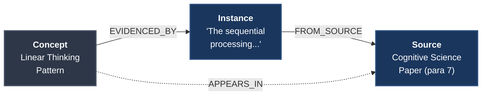
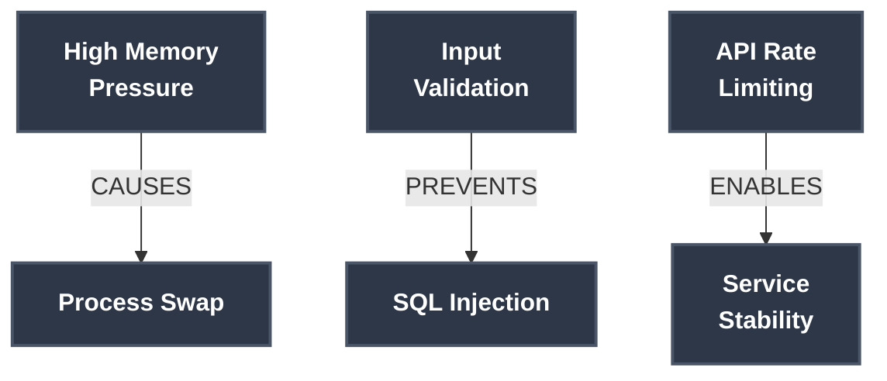

# 04 - Understanding Concepts and Relationships

**Part:** I - Foundations
**Reading Time:** ~15 minutes
**Prerequisites:** [Section 02 - System Overview](02-system-overview.md), [Section 03 - Quick Start](03-quick-start-your-first-knowledge-graph.md)

---

This section explains the graph data model: what nodes and relationships exist, how they connect, and what that structure enables.

## The Graph Structure

The system stores three types of nodes connected by two kinds of relationships.

### Node Types

**Concept** - An idea extracted from text

A concept represents a discrete idea the LLM identified while reading a document. Think "Linear Thinking," "Microservices Architecture," or "Requisite Variety."

```cypher
(:Concept {
  concept_id: "linear-thinking-pattern",
  label: "Linear Thinking Pattern",
  search_terms: ["linear thinking", "sequential processing", "ordered reasoning"],
  embedding: [0.023, -0.145, 0.891, ... 1536 dimensions total]
})
```

**Properties:**
- `concept_id` - Unique identifier (kebab-case derived from label)
- `label` - Human-readable name for the concept
- `search_terms` - List of synonyms and related phrases
- `embedding` - 1536-dimensional vector for semantic similarity (OpenAI text-embedding-3-small)

Concepts accumulate evidence across documents. When "Linear Thinking" appears in three different papers, they all link to the same concept node. The concept becomes more central to the knowledge base over time.

**Source** - A paragraph from a document

Each paragraph ingested creates a source node. This preserves the original context for verification.

```cypher
(:Source {
  source_id: "watts-lecture-01-para-03",
  document: "Alan Watts - Tao of Philosophy - 01",
  file_path: "ingest_source/watts_lecture_1.txt",
  paragraph_number: 3,
  full_text: "The complete paragraph text goes here..."
})
```

**Properties:**
- `source_id` - Unique identifier
- `document` - Document name (often the ontology)
- `file_path` - Original file location
- `paragraph_number` - Position in the document
- `full_text` - Complete paragraph text

Source nodes let you trace concepts back to their original paragraphs. When you ask "where did this come from?", source nodes provide the answer.

**Instance** - A quoted passage supporting a concept

An instance is a specific quote from a source that evidences a concept. One source paragraph might contain evidence for multiple concepts.

```cypher
(:Instance {
  instance_id: "uuid-generated-identifier",
  quote: "The exact verbatim quote from the source text"
})
```

**Properties:**
- `instance_id` - Unique identifier (UUID)
- `quote` - Exact text excerpt

Instances provide precise evidence. You're not just told "Concept A exists," you can read the exact quotes that support it.

### Structural Relationships

These relationships connect concepts to their evidence and sources. They form the backbone of traceability.

**APPEARS_IN** - Concept found in source

```cypher
(:Concept)-[:APPEARS_IN]->(:Source)
```

When a concept is extracted from a paragraph, this relationship records that connection. One concept can appear in many sources across different documents.

**EVIDENCED_BY** - Concept supported by quote

```cypher
(:Concept)-[:EVIDENCED_BY]->(:Instance)
```

Each concept links to its supporting evidence instances. The more instances, the more evidence for that concept in your knowledge base.

**FROM_SOURCE** - Instance originated from source

```cypher
(:Instance)-[:FROM_SOURCE]->(:Source)
```

Every instance traces back to the source paragraph it came from. This creates the evidence chain: Concept → Instance → Source.

**Complete Evidence Chain:**

```cypher
(:Concept {label: "Linear Thinking Pattern"})
  -[:EVIDENCED_BY]->
    (:Instance {quote: "The sequential processing of information..."})
      -[:FROM_SOURCE]->
        (:Source {
          document: "Cognitive Science Paper",
          paragraph_number: 7,
          full_text: "The sequential processing of information through linear stages..."
        })
```

You can traverse from concept to exact quote to full paragraph to source document. Nothing is lost.

**Visual representation:**



---

## Semantic Relationships

Semantic relationships connect concepts to other concepts. These represent how ideas relate, not just that they co-occur.

The system uses 30 distinct relationship types organized into 8 categories. This taxonomy captures nuanced connections that simpler systems miss.

### Category 1: Logical Truth

Relationships about logical inference and truth.

**IMPLIES** - Logical consequence

```cypher
(:Concept {label: "Requisite Variety"})-[:IMPLIES {confidence: 0.92}]->
  (:Concept {label: "Control System Complexity"})
```

Concept A logically leads to Concept B. If A is true, B follows.

**PRESUPPOSES** - Logical dependency

```cypher
(:Concept {label: "Higher-Order Functions"})-[:PRESUPPOSES {confidence: 0.88}]->
  (:Concept {label: "First-Class Functions"})
```

Understanding A requires understanding B first. B is a prerequisite for A.

**CONTRADICTS** - Logical conflict

```cypher
(:Concept {label: "Waterfall Development"})-[:CONTRADICTS {confidence: 0.85}]->
  (:Concept {label: "Iterative Refinement"})
```

Concept A conflicts with Concept B. Both can't be true simultaneously.

**REFUTES** - Disproof

```cypher
(:Concept {label: "Evidence Against Flat Earth"})-[:REFUTES {confidence: 0.95}]->
  (:Concept {label: "Flat Earth Theory"})
```

A provides evidence that B is false. Stronger than contradiction—this is active disproof.

### Category 2: Causal

Relationships about cause and effect.

**CAUSES** - Direct causation

```cypher
(:Concept {label: "High Memory Pressure"})-[:CAUSES {confidence: 0.87}]->
  (:Concept {label: "Process Swap"})
```

A directly produces B. Causal mechanism is clear.

**ENABLES** - Making possible

```cypher
(:Concept {label: "API Rate Limiting"})-[:ENABLES {confidence: 0.80}]->
  (:Concept {label: "Service Stability"})
```

A makes B possible but doesn't guarantee it. Enablement is weaker than causation.

**PREVENTS** - Inhibition

```cypher
(:Concept {label: "Input Validation"})-[:PREVENTS {confidence: 0.90}]->
  (:Concept {label: "SQL Injection"})
```

A stops B from occurring. Active prevention.

**INFLUENCES** - Indirect effect

```cypher
(:Concept {label: "Team Size"})-[:INFLUENCES {confidence: 0.72}]->
  (:Concept {label: "Communication Overhead"})
```

A affects B indirectly or partially. Softer than causation.

**PRODUCES** - Creation

```cypher
(:Concept {label: "LLM Extraction"})-[:PRODUCES {confidence: 0.93}]->
  (:Concept {label: "Structured Concepts"})
```

A generates B as output. Production relationship.

**RESULTS_FROM** - Outcome

```cypher
(:Concept {label: "High Availability"})-[:RESULTS_FROM {confidence: 0.85}]->
  (:Concept {label: "Redundant Systems"})
```

A is the outcome of B. Reverse of production.

**REGULATES** - Control

```cypher
(:Concept {label: "Backpressure Mechanism"})-[:REGULATES {confidence: 0.88}]->
  (:Concept {label: "Queue Depth"})
```

A controls or moderates B. Active regulation.

**Visual representation of causal relationships:**



### Category 3: Structural

Relationships about composition and organization.

**PART_OF** - Component relationship

```cypher
(:Concept {label: "HTTP Handler"})-[:PART_OF {confidence: 0.95}]->
  (:Concept {label: "Web Server"})
```

A is a component of B. Decomposition relationship.

**CONTAINS** - Composition

```cypher
(:Concept {label: "Knowledge Graph"})-[:CONTAINS {confidence: 0.93}]->
  (:Concept {label: "Concept Nodes"})
```

A includes B as a part. Reverse of PART_OF.

**COMPOSED_OF** - Assembly

```cypher
(:Concept {label: "REST API"})-[:COMPOSED_OF {confidence: 0.90}]->
  (:Concept {label: "Endpoint Handlers"})
```

A is assembled from multiple instances of B.

**SUBSET_OF** - Set relationship

```cypher
(:Concept {label: "Python Dictionaries"})-[:SUBSET_OF {confidence: 0.94}]->
  (:Concept {label: "Hash Tables"})
```

All instances of A are instances of B. Mathematical subset.

### Category 4: Evidential

Relationships about evidence and support.

**SUPPORTS** - Evidence for

```cypher
(:Concept {label: "Benchmark Results"})-[:SUPPORTS {confidence: 0.86}]->
  (:Concept {label: "Performance Claim"})
```

A provides evidence that B is true. Not logical implication—empirical support.

**EXEMPLIFIES** - Example of

```cypher
(:Concept {label: "PostgreSQL"})-[:EXEMPLIFIES {confidence: 0.92}]->
  (:Concept {label: "Relational Database"})
```

A is a specific instance or example of B.

**MEASURED_BY** - Quantification

```cypher
(:Concept {label: "System Performance"})-[:MEASURED_BY {confidence: 0.88}]->
  (:Concept {label: "Request Latency"})
```

A is quantified or assessed using B.

### Category 5: Similarity

Relationships about likeness and difference.

**ANALOGOUS_TO** - Analogy

```cypher
(:Concept {label: "Computer Memory"})-[:ANALOGOUS_TO {confidence: 0.75}]->
  (:Concept {label: "Human Short-Term Memory"})
```

A is like B in some important way. Metaphorical connection.

**SIMILAR_TO** - General similarity

```cypher
(:Concept {label: "Graph Traversal"})-[:SIMILAR_TO {confidence: 0.80}]->
  (:Concept {label: "Tree Walking"})
```

A resembles B. Weaker than analogy—just noting likeness.

**CONTRASTS_WITH** - Comparison by difference

```cypher
(:Concept {label: "Synchronous Processing"})-[:CONTRASTS_WITH {confidence: 0.87}]->
  (:Concept {label: "Asynchronous Processing"})
```

A differs from B in meaningful ways. Highlighting differences, not conflict.

**OPPOSITE_OF** - Antonym

```cypher
(:Concept {label: "Centralized Architecture"})-[:OPPOSITE_OF {confidence: 0.91}]->
  (:Concept {label: "Distributed Architecture"})
```

A is the direct opposite of B. Stronger than contrast.

**EQUIVALENT_TO** - Equality

```cypher
(:Concept {label: "Cypher"})-[:EQUIVALENT_TO {confidence: 0.70}]->
  (:Concept {label: "Graph Query Language"})
```

A and B are the same thing, just different terms.

### Category 6: Temporal

Relationships about time and sequence.

**PRECEDES** - Sequential order

```cypher
(:Concept {label: "Authentication"})-[:PRECEDES {confidence: 0.93}]->
  (:Concept {label: "Authorization"})
```

A happens before B in time or sequence.

**CONCURRENT_WITH** - Simultaneity

```cypher
(:Concept {label: "Request Handling"})-[:CONCURRENT_WITH {confidence: 0.82}]->
  (:Concept {label: "Logging"})
```

A and B occur at the same time.

**EVOLVES_INTO** - Development

```cypher
(:Concept {label: "Waterfall Process"})-[:EVOLVES_INTO {confidence: 0.76}]->
  (:Concept {label: "Agile Process"})
```

A transforms or develops into B over time.

### Category 7: Functional

Relationships about purpose and use.

**USED_FOR** - Purpose

```cypher
(:Concept {label: "Vector Embeddings"})-[:USED_FOR {confidence: 0.89}]->
  (:Concept {label: "Semantic Search"})
```

A serves the purpose of B. Functional relationship.

**REQUIRES** - Dependency

```cypher
(:Concept {label: "Docker Deployment"})-[:REQUIRES {confidence: 0.94}]->
  (:Concept {label: "Container Runtime"})
```

A needs B to function. Operational dependency.

### Category 8: Meta

Relationships about classification and definition.

**INSTANCE_OF** - Type membership

```cypher
(:Concept {label: "Apache AGE"})-[:INSTANCE_OF {confidence: 0.95}]->
  (:Concept {label: "Graph Database"})
```

A is a member of category B. Taxonomic relationship.

**CATEGORIZED_AS** - Classification

```cypher
(:Concept {label: "Authentication Bug"})-[:CATEGORIZED_AS {confidence: 0.88}]->
  (:Concept {label: "Security Issue"})
```

A belongs to class B. Similar to INSTANCE_OF but less formal.

**DEFINED_AS** - Definition

```cypher
(:Concept {label: "Ontology"})-[:DEFINED_AS {confidence: 0.92}]->
  (:Concept {label: "Thematic Knowledge Collection"})
```

A is defined as B. Definitional relationship.

---

## Relationship Properties

Every semantic relationship includes metadata.

**Confidence Score** (0.0 - 1.0)

```cypher
-[:IMPLIES {confidence: 0.87}]->
```

The LLM's confidence that this relationship is valid. Higher scores indicate stronger evidence or clearer connections in the source text.

Confidence scores help you filter:
```cypher
// Find high-confidence causal relationships
MATCH (a:Concept)-[r]->(b:Concept)
WHERE r.confidence > 0.85 AND type(r) IN ['CAUSES', 'ENABLES', 'PREVENTS']
RETURN a.label, type(r), b.label, r.confidence
```

**Category** (optional metadata)

Some relationships store their category for easier filtering:

```cypher
-[:CAUSES {confidence: 0.90, category: "causal"}]->
```

This enables category-level queries:
```cypher
// Find all causal relationships from a concept
MATCH (c:Concept {label: "High Memory Pressure"})-[r]->(related)
WHERE r.category = 'causal'
RETURN related.label, type(r)
```

---

## How Relationships Are Created

The LLM creates relationships during extraction. The system provides the LLM with all 30 relationship types as a flat list:

```
relationship_type: One of [ANALOGOUS_TO, CATEGORIZED_AS, CAUSES, COMPOSED_OF,
CONCURRENT_WITH, CONTAINS, CONTRADICTS, CONTRASTS_WITH, DEFINED_AS, ENABLES,
EQUIVALENT_TO, EVOLVES_INTO, EXEMPLIFIES, IMPLIES, INFLUENCES, INSTANCE_OF,
MEASURED_BY, OPPOSITE_OF, PART_OF, PRECEDES, PRESUPPOSES, PREVENTS, PRODUCES,
REFUTES, REGULATES, REQUIRES, RESULTS_FROM, SIMILAR_TO, SUBSET_OF, SUPPORTS,
USED_FOR]
```

The LLM reads text and outputs structured JSON:

```json
{
  "concepts": [
    {"id": "requisite-variety", "label": "Requisite Variety", ...},
    {"id": "control-system-design", "label": "Control System Design", ...}
  ],
  "relationships": [
    {
      "from": "requisite-variety",
      "to": "control-system-design",
      "type": "IMPLIES",
      "confidence": 0.92
    }
  ]
}
```

The system validates the relationship type and creates the edge in the graph.

### Fuzzy Matching

The LLM sometimes returns variations: "CONTRASTS" instead of "CONTRASTS_WITH", "CAUSING" instead of "CAUSES". The system handles this with fuzzy matching.

**Matching algorithm:**
1. **Exact match** - "IMPLIES" → "IMPLIES" (perfect)
2. **Prefix match** - "CONTRASTS" → "CONTRASTS_WITH" (high confidence)
3. **Porter stemming** - "CAUSING" → "CAUSES" (via stem "caus")
4. **Fuzzy similarity** - "CAUZES" → "CAUSES" (typo correction, 0.8 threshold)

If the match confidence is below 0.8, the relationship is rejected and logged. This prevents false matches like "CREATES" matching "REGULATES" (similarity 0.75).

**Examples:**
- `"CONTRASTS"` → `"CONTRASTS_WITH"` (prefix match, confidence 1.0)
- `"IMPLYING"` → `"IMPLIES"` (Porter stem "impli", confidence 0.667)
- `"CAUZES"` → `"CAUSES"` (fuzzy match, confidence 0.833)
- `"CREATES"` → rejected (below 0.8 threshold)

---

## Why 30 Types Instead of 5?

Earlier versions used just 5 relationship types: IMPLIES, SUPPORTS, CONTRADICTS, PART_OF, RELATES_TO. This was too coarse.

**The problem:** LLMs naturally express nuanced relationships. "Causes" is different from "Enables". "Analogous to" is different from "Similar to". Forcing everything into 5 buckets loses information.

**The solution:** 30 semantically sparse types that match how LLMs conceptualize relationships. The taxonomy captures distinctions the LLM is already making internally.

**Trade-off:** More types add ~50 tokens to each extraction prompt (~$0.000025 per extraction). This is negligible compared to the value of preserving semantic nuance. Additionally, maintaining a core set of 30 types prevents runaway overfitting that can result in catastrophic forgetting during concept simplification passes—the taxonomy provides enough granularity for nuanced relationships while maintaining coherence across the knowledge graph.

**Query benefit:** You can ask specific questions:

```cypher
// What does X cause?
MATCH (x:Concept {label: "High Memory Pressure"})-[:CAUSES]->(effects)
RETURN effects.label

// What enables X?
MATCH (enablers)-[:ENABLES]->(x:Concept {label: "Zero-Copy Operations"})
RETURN enablers.label

// What contradicts X?
MATCH (x:Concept {label: "Monolithic Architecture"})-[:CONTRADICTS]->(conflicts)
RETURN conflicts.label
```

With only 5 types, these queries would be impossible.

---

## Graph Traversal Examples

The real power comes from following relationships across multiple hops.

**Find supporting evidence chain:**

```cypher
MATCH path = (c:Concept {label: "Linear Thinking Pattern"})
             -[:IMPLIES|SUPPORTS*1..3]->
             (related:Concept)
RETURN path
```

This finds concepts 1-3 relationships away connected by logical or evidential relationships.

**Trace causal chains:**

```cypher
MATCH path = (cause:Concept {label: "High API Rate"})
             -[:CAUSES|ENABLES|PRODUCES*1..4]->
             (effect:Concept)
RETURN path
ORDER BY length(path)
```

Find what "High API Rate" causes directly and indirectly, up to 4 hops deep.

**Find contradictions:**

```cypher
MATCH (a:Concept {label: "Microservices"})-[:CONTRADICTS|REFUTES]-(b:Concept)
RETURN a.label, b.label
```

Show concepts that conflict with microservices architecture.

**Explore structural decomposition:**

```cypher
MATCH (whole:Concept {label: "REST API"})-[:CONTAINS|COMPOSED_OF*1..2]->(parts)
RETURN whole.label, collect(parts.label) AS components
```

Find what a REST API contains and what those parts contain.

---

## Concept Deduplication

The system prevents duplicate concepts using vector similarity.

When extracting "Linear Thinking" from a new document:

1. **Generate embedding** for the new concept
2. **Search existing concepts** for similar embeddings (cosine similarity > 0.85)
3. **If match found:** Add new evidence to existing concept
4. **If no match:** Create new concept node

This means "Linear Thinking," "Sequential Reasoning," and "Ordered Processing" might merge if the embeddings are similar enough. The concept accumulates search terms and evidence instances from all sources.

**Example:**

Document 1 extracts:
```cypher
(:Concept {
  concept_id: "linear-thinking",
  label: "Linear Thinking",
  search_terms: ["linear", "sequential"]
})
```

Document 2 extracts "Sequential Reasoning" (embedding similarity 0.91):
```cypher
// Merged into existing concept
(:Concept {
  concept_id: "linear-thinking",
  label: "Linear Thinking",
  search_terms: ["linear", "sequential", "sequential reasoning", "ordered processing"]
})
```

The concept gets richer, not duplicated.

---

## Querying Concept Details

When you query a concept, you get the complete structure:

```bash
kg search details linear-thinking
```

**Returns:**

```
Concept: Linear Thinking Pattern
ID: linear-thinking-pattern
Search Terms: linear thinking, sequential processing, ordered reasoning

Relationships:
  IMPLIES → Pattern Recognition (confidence: 0.89)
  CONTRADICTS → Parallel Processing (confidence: 0.82)
  PART_OF → Cognitive Frameworks (confidence: 0.87)

Evidence (3 instances):
  1. "The sequential processing of information through linear stages..."
     Source: Cognitive Science Paper, paragraph 7

  2. "Linear thinking follows a step-by-step progression..."
     Source: Systems Thinking Book, paragraph 12

  3. "Ordered reasoning from premises to conclusions..."
     Source: Logic Textbook, paragraph 3
```

You see:
- The concept label and search terms
- All relationships with types and confidence
- Every evidence quote with source references

Nothing is hidden. You can verify every claim by reading the source quotes.

---

## What This Enables

The node and relationship structure creates capabilities that flat document storage can't provide.

**Cross-document synthesis:** When three papers mention "authentication," they link to the same concept. Relationships from all three documents connect. The graph shows how "authentication" relates to "authorization," "security," and "user management" across your entire knowledge base.

**Evidence accumulation:** Concepts get stronger with more evidence. A concept with 10 evidence instances from 5 different documents is more central than one with 1 instance from 1 document.

**Relationship exploration:** You can trace how ideas connect. Start with "microservices architecture" and follow ENABLES relationships to find what it makes possible. Follow REQUIRES relationships to find dependencies. Follow CONTRADICTS relationships to find conflicts.

**Semantic paths:** Find how two concepts connect. The system can traverse the graph to find the shortest path between "linear thinking" and "systems thinking," showing the chain of relationships that links them.

**Precise verification:** Every relationship traces to evidence quotes. If the system says "A CAUSES B," you can read the exact quotes that support that claim. You're not trusting an LLM's synthesis—you're verifying against source text.

---

## Limitations

The extraction process isn't perfect. LLMs make mistakes.

**Granularity issues:** The LLM might extract "The Importance of Being Ernest" as three separate concepts: "Importance," "Being," and "Ernest". Or it might extract an entire paragraph as one concept when it contains multiple ideas.

**Relationship errors:** The LLM might identify a CAUSES relationship that's actually ENABLES, or miss a CONTRADICTS relationship that's implicit in the text.

**Deduplication failures:** Two concepts that should merge might not if their embeddings are below the 0.85 threshold. Or two distinct concepts might merge if their embeddings are too similar.

**Confidence calibration:** A 0.9 confidence score doesn't mean "90% certain" in any statistical sense. It's the LLM's self-assessment, which can be overconfident or underconfident.

These limitations are inherent to LLM-based extraction. The system mitigates them through:
- Structured prompting with clear schemas
- Fuzzy relationship matching with validation
- Vector similarity thresholds tuned through testing
- Evidence preservation for manual verification

But you should treat the graph as a tool for exploration, not ground truth. Verify important claims by reading the evidence quotes.

---

## Next Steps

Now that you understand the graph structure, you can:

- **[Section 05 - The Extraction Process](05-the-extraction-process.md)**: See how documents become graphs
- **[Section 06 - Querying Your Knowledge Graph](06-querying-your-knowledge-graph.md)**: Learn all query capabilities
- **[Section 13 - Managing Relationship Vocabulary](13-managing-relationship-vocabulary.md)**: Advanced relationship type management

Or explore related concepts:
- **[Section 11 - Embedding Models and Vector Search](11-embedding-models-and-vector-search.md)**: How semantic similarity works
- **[Section 33 - Concept Deduplication and Matching](33-concept-deduplication-and-matching.md)**: Deep dive into matching algorithm

---

← [Previous: Quick Start](03-quick-start-your-first-knowledge-graph.md) | [Documentation Index](README.md) | [Next: The Extraction Process →](05-the-extraction-process.md)
