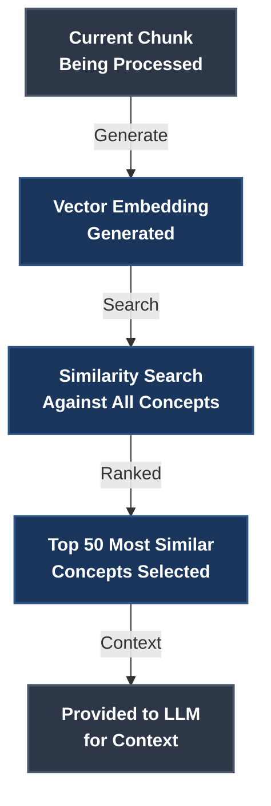

# 05 - The Extraction Process

**Part:** I - Foundations
**Reading Time:** ~12 minutes
**Prerequisites:** [Section 02 - System Overview](02-system-overview.md), [Section 04 - Understanding Concepts and Relationships](04-understanding-concepts-and-relationships.md)

---

This section explains how documents become graphs: what happens when you run `kg ingest file document.txt`, step by step.

## Overview

When you ingest a document, the system:

1. **Parses** the document into paragraphs
2. **Sends** each paragraph to an LLM
3. **Extracts** concepts, relationships, and quotes
4. **Matches** against existing concepts
5. **Upserts** to the graph database

The entire process is automatic. You submit a document and get back a graph of interconnected concepts with evidence tracing back to source paragraphs.

---

## Step 1: Document Parsing

The system starts by splitting your document into processable chunks.

**Text files** split on double newlines:

```
Paragraph 1 text goes here.

Paragraph 2 text goes here.

Paragraph 3 text goes here.
```

Each paragraph becomes a **Source** node in the graph with full text preserved.

**PDFs and DOCX files** use specialized parsers to extract text while attempting to preserve paragraph structure. The quality depends on the document format - clean PDFs work well, scanned images with OCR need pre-processing.

**Why paragraphs?** Paragraphs are small enough for focused extraction but large enough to contain complete thoughts. A paragraph typically expresses 1-3 related concepts with evidence.

---

## Step 2: LLM Extraction

For each paragraph, the system sends a structured prompt to the LLM (GPT-4, Claude, or local Ollama model).

**The prompt includes:**

1. **Context** - Recently extracted concepts (last 50) for matching
2. **The paragraph text** to analyze
3. **Output schema** - Structured JSON format
4. **Instructions** - What to extract and how

**Example prompt structure:**

```
You are a knowledge graph extraction system.

CONTEXT - EXISTING CONCEPTS (for matching):
[
  {"concept_id": "linear-thinking", "label": "Linear Thinking", "search_terms": [...]},
  {"concept_id": "pattern-recognition", "label": "Pattern Recognition", "search_terms": [...]}
]

NEW TEXT TO PROCESS:
Source: document-para-5
Text: """
The sequential processing of information through linear stages represents
a fundamental limitation of conscious attention. This contrasts with the
parallel, distributed nature of natural processes.
"""

TASK:
1. Extract key concepts (ideas, claims, arguments)
2. Provide search terms for semantic matching
3. Identify quotes supporting each concept
4. Map relationships between concepts

OUTPUT SCHEMA:
{
  "extracted_concepts": [...],
  "instances": [...],
  "relationships": [...]
}
```

**The LLM responds with structured JSON:**

```json
{
  "extracted_concepts": [
    {
      "concept_id": "sequential-information-processing",
      "label": "Sequential Information Processing",
      "confidence": 0.92,
      "search_terms": [
        "linear processing",
        "step-by-step information",
        "sequential stages"
      ]
    },
    {
      "concept_id": "conscious-attention-limitation",
      "label": "Conscious Attention Limitation",
      "confidence": 0.88,
      "search_terms": [
        "attention limits",
        "awareness constraints",
        "focus bottleneck"
      ]
    }
  ],
  "instances": [
    {
      "concept_id": "sequential-information-processing",
      "quote": "The sequential processing of information through linear stages"
    },
    {
      "concept_id": "conscious-attention-limitation",
      "quote": "represents a fundamental limitation of conscious attention"
    }
  ],
  "relationships": [
    {
      "from_concept_id": "sequential-information-processing",
      "to_concept_id": "conscious-attention-limitation",
      "relationship_type": "EXEMPLIFIES",
      "confidence": 0.85
    }
  ]
}
```

The LLM identified two concepts, provided evidence quotes, and found one relationship.

---

## Step 3: Concept Matching

Before creating new concepts, the system checks if they already exist. This prevents "Linear Thinking" and "Sequential Processing" from becoming separate nodes when they're really the same idea.

**Multi-stage matching algorithm:**

**Stage 1: Exact ID Match**

If the LLM predicted an existing `concept_id` (from the context it was shown), use it directly.

```python
if "linear-thinking" in existing_concepts:
    concept_id = "linear-thinking"
    action = "UPDATE"
```

This happens when the LLM recognizes a concept from the context provided.

**Stage 2: Vector Similarity**

Generate an embedding for the new concept and search for similar existing concepts.

```python
# Embed new concept
text = "Sequential Information Processing linear processing step-by-step information sequential stages"
embedding = embed(text)  # 1536-dimensional vector

# Search existing concepts
results = vector_search(embedding, threshold=0.85)

if results[0].similarity > 0.85:
    concept_id = results[0].concept_id
    action = "MERGE"
```

If similarity exceeds 0.85 (85% match), merge with the existing concept. The new evidence gets added to the existing concept node.

**Stage 3: Create New**

If no match found, create a new concept.

```python
concept_id = "sequential-information-processing"
action = "CREATE"
```

**Why 0.85 threshold?** Lower than 0.85 creates too many false matches (merging distinct concepts). Higher than 0.85 creates unnecessary duplicates. Testing showed 0.85 balances precision and recall well.

**Note:** This threshold is tunable in the database configuration. It may be exposed as a user-configurable option in the future, depending on model and embedding performance relationship analysis.

**Example matching decisions:**

| New Concept | Existing Concept | Similarity | Decision |
|------------|------------------|------------|----------|
| "Sequential Processing" | "Linear Thinking" | 0.91 | MERGE |
| "Authentication Logic" | "Authorization Logic" | 0.78 | CREATE (too different) |
| "REST API" | "RESTful API" | 0.97 | MERGE |
| "Machine Learning" | "Deep Learning" | 0.72 | CREATE (related but distinct) |

---

## Step 4: Graph Upsert

Once concepts are matched (or created), the system updates the graph database.

**For matched concepts (UPDATE):**

```cypher
// Concept already exists, add new source reference
MATCH (c:Concept {concept_id: 'linear-thinking'})
MATCH (s:Source {source_id: 'document-para-5'})
MERGE (c)-[:APPEARS_IN]->(s)

// Add new search terms (if not already present)
MATCH (c:Concept {concept_id: 'linear-thinking'})
SET c.search_terms = c.search_terms + ['sequential stages']
SET c.updated_at = timestamp()
```

The concept gains another source and potentially new search terms.

**For new concepts (CREATE):**

```cypher
// Create concept node
CREATE (c:Concept {
  concept_id: 'sequential-information-processing',
  label: 'Sequential Information Processing',
  embedding: [0.023, -0.145, 0.891, ... 1536 values],
  search_terms: ['linear processing', 'step-by-step information', 'sequential stages'],
  created_at: timestamp(),
  updated_at: timestamp()
})

// Link to source
MATCH (s:Source {source_id: 'document-para-5'})
CREATE (c)-[:APPEARS_IN]->(s)
```

**For evidence instances:**

```cypher
// Create instance node
CREATE (i:Instance {
  instance_id: gen_random_uuid(),
  quote: 'The sequential processing of information through linear stages'
})

// Link to concept and source
MATCH (c:Concept {concept_id: 'sequential-information-processing'})
MATCH (s:Source {source_id: 'document-para-5'})
CREATE (c)-[:EVIDENCED_BY]->(i)
CREATE (i)-[:FROM_SOURCE]->(s)
```

Each quote becomes an Instance node linked to both its concept and source.

**For relationships:**

```cypher
// Create or update relationship
MATCH (a:Concept {concept_id: 'sequential-information-processing'})
MATCH (b:Concept {concept_id: 'conscious-attention-limitation'})
MERGE (a)-[r:EXEMPLIFIES]->(b)
ON CREATE SET r.confidence = 0.85, r.created_at = timestamp()
ON MATCH SET r.confidence = (r.confidence + 0.85) / 2  // Average confidences
```

Relationships connect concepts with typed edges and confidence scores.

---

## Complete Flow Example

Let's trace a full example: ingesting a paragraph from an Alan Watts lecture.

**Input paragraph:**

```
Human intelligence has a serious limitation. That limitation is that it
is a scanning system of conscious attention which is linear. That is to
say, it examines the world in lines, rather as you would pass the beam
of a flashlight across a room.
```

**1. Create Source Node**

```cypher
CREATE (s:Source {
  source_id: 'watts-lecture-01-para-04',
  document: 'Alan Watts - Tao of Philosophy - 01',
  paragraph_number: 4,
  file_path: 'ingest_source/watts_lecture_1.txt',
  full_text: 'Human intelligence has a serious limitation...'
})
```

**2. LLM Extraction**

The LLM returns:

```json
{
  "extracted_concepts": [
    {
      "concept_id": "human-intelligence-limitation",
      "label": "Human Intelligence Limitation",
      "search_terms": ["intelligence limits", "cognitive constraints"]
    },
    {
      "concept_id": "linear-scanning-attention",
      "label": "Linear Scanning Attention",
      "search_terms": ["linear attention", "sequential focus", "scanning consciousness"]
    },
    {
      "concept_id": "flashlight-metaphor",
      "label": "Flashlight Metaphor for Attention",
      "search_terms": ["flashlight beam", "spotlight attention"]
    }
  ],
  "instances": [
    {
      "concept_id": "human-intelligence-limitation",
      "quote": "Human intelligence has a serious limitation"
    },
    {
      "concept_id": "linear-scanning-attention",
      "quote": "it is a scanning system of conscious attention which is linear"
    },
    {
      "concept_id": "flashlight-metaphor",
      "quote": "as you would pass the beam of a flashlight across a room"
    }
  ],
  "relationships": [
    {
      "from_concept_id": "linear-scanning-attention",
      "to_concept_id": "human-intelligence-limitation",
      "relationship_type": "EXEMPLIFIES",
      "confidence": 0.92
    },
    {
      "from_concept_id": "flashlight-metaphor",
      "to_concept_id": "linear-scanning-attention",
      "relationship_type": "ANALOGOUS_TO",
      "confidence": 0.88
    }
  ]
}
```

**3. Concept Matching**

The system checks each concept:

- **"human-intelligence-limitation"**: No match found (new concept)
- **"linear-scanning-attention"**: Matches existing "linear-thinking" (similarity 0.89) → MERGE
- **"flashlight-metaphor"**: No match found (new concept)

**4. Graph Update**

```cypher
// Create new concept 1
CREATE (c1:Concept {
  concept_id: 'human-intelligence-limitation',
  label: 'Human Intelligence Limitation',
  ...
})

// Merge with existing concept
MATCH (c2:Concept {concept_id: 'linear-thinking'})
SET c2.search_terms = c2.search_terms + ['linear attention', 'scanning consciousness']

// Create new concept 3
CREATE (c3:Concept {
  concept_id: 'flashlight-metaphor',
  label: 'Flashlight Metaphor for Attention',
  ...
})

// Create instances (3 total)
CREATE (i1:Instance {quote: 'Human intelligence has a serious limitation'})
CREATE (i2:Instance {quote: 'it is a scanning system...'})
CREATE (i3:Instance {quote: 'as you would pass the beam...'})

// Link instances to concepts and source
...

// Create relationships
MATCH (c2:Concept {concept_id: 'linear-thinking'})
MATCH (c1:Concept {concept_id: 'human-intelligence-limitation'})
CREATE (c2)-[:EXEMPLIFIES {confidence: 0.92}]->(c1)

MATCH (c3:Concept {concept_id: 'flashlight-metaphor'})
MATCH (c2:Concept {concept_id: 'linear-thinking'})
CREATE (c3)-[:ANALOGOUS_TO {confidence: 0.88}]->(c2)
```

**Result:**

- 2 new concepts created
- 1 existing concept updated with new search terms
- 3 evidence instances created
- 2 relationships created
- All linked to source paragraph

---

## Recursive Context Building

The system provides context to the LLM with recently extracted concepts. This enables better matching and relationship detection.

**How it works:**

```python
# Start with empty context
context = []

for paragraph in document:
    # Extract using current context
    extraction = llm.extract(paragraph, context)

    # Upsert to graph
    upsert_to_graph(extraction)

    # Update context with new concepts
    recent_concepts = get_recent_concepts(limit=50)
    context = recent_concepts
```

Each paragraph sees concepts from previous paragraphs. This helps the LLM:

- **Match concepts accurately**: "We discussed linear thinking earlier" → uses existing concept_id
- **Create better relationships**: Knows what concepts exist to link to
- **Maintain consistency**: Same terminology across paragraphs

**Why limit to 50 concepts?** Token limits. Showing all concepts would exceed context windows. The system doesn't just present the "most recent" 50 concepts chronologically—it presents the 50 most semantically relevant concepts via vector search, ordered by similarity to the current chunk being processed. This ensures the LLM sees the most contextually appropriate concepts for accurate matching and relationship creation.

**Visual representation of concept selection:**



---

## Progress Tracking

Ingestion jobs track progress in real-time.

**Job status response:**

```json
{
  "job_id": "job_abc123",
  "status": "processing",
  "progress": {
    "percent": 45,
    "paragraphs_processed": 9,
    "paragraphs_total": 20,
    "concepts_created": 47,
    "concepts_updated": 23,
    "instances_created": 89,
    "relationships_created": 67
  },
  "estimated_completion": "2025-10-23T15:42:00Z"
}
```

The `kg` CLI polls this endpoint every 2 seconds and displays a progress bar.

**When complete:**

```json
{
  "job_id": "job_abc123",
  "status": "completed",
  "result": {
    "concepts_created": 127,
    "concepts_updated": 58,
    "instances_created": 234,
    "relationships_created": 189,
    "duration_seconds": 187,
    "cost_estimate": "$0.45"
  }
}
```

---

## Error Handling

The extraction process can fail at multiple points. The system handles errors gracefully.

**LLM returns invalid JSON:**

```
Error: JSON parse failed
Response: "The text discusses linear thinking which..."
```

The system logs the error, retries once with a stricter prompt, and skips the paragraph if it still fails.

**LLM hallucinates concept IDs:**

```json
{
  "concept_id": "this-concept-does-not-exist-xyz",
  ...
}
```

The exact match fails, falls through to vector search, and likely creates a new concept (unless similarity match found).

**Relationship references non-existent concepts:**

```json
{
  "from_concept_id": "linear-thinking",
  "to_concept_id": "missing-concept-id",
  ...
}
```

The system validates both concepts exist before creating the relationship. If either is missing, the relationship is skipped and logged.

**Vector search returns no results:**

If vector search fails (database issue), the system falls back to keyword matching using search_terms. If that fails too, it creates a new concept.

---

## Cost and Performance

**Token usage per paragraph:**

- **Prompt**: ~1,000 tokens (context + paragraph + instructions)
- **Response**: ~500 tokens (JSON extraction)
- **Total**: ~1,500 tokens per paragraph

**Example costs (GPT-4o at $0.005/1k input, $0.015/1k output):**

- **10-page document** (~50 paragraphs): 75,000 tokens = ~$0.50
- **100-page document** (~500 paragraphs): 750,000 tokens = ~$5.00
- **Academic paper** (~20 pages, 100 paragraphs): 150,000 tokens = ~$1.00

**Processing time:**

- **LLM call**: 2-5 seconds per paragraph (varies by model/load)
- **Vector matching**: ~50ms per concept
- **Graph upsert**: ~100ms per paragraph
- **Total**: ~3-6 seconds per paragraph

**10-page document**: ~50 paragraphs × 4 seconds = ~3-4 minutes

Local Ollama models are slower (10-30 seconds per paragraph) but free. See [Section 12 - Local LLM Inference](12-local-llm-inference-with-ollama.md) for details.

---

## Quality Factors

The extraction quality depends on several factors:

**Model capability:** GPT-4o and Claude Sonnet 4 produce the best extractions. GPT-4o-mini is faster and cheaper but sometimes misses nuanced concepts. Local models (Mistral 7B) are adequate for simple documents but struggle with complex reasoning.

**Paragraph length:** Very short paragraphs (<50 words) may lack context for extraction. Very long paragraphs (>500 words) may contain too many concepts for focused extraction. 100-300 words per paragraph is ideal.

**Document structure:** Clean, well-written documents extract better than poorly formatted ones. Scanned PDFs with OCR errors produce noisy extractions.

**Concept granularity:** The LLM decides what constitutes a "concept." Sometimes it extracts "The Importance of Being Ernest" as three concepts ("Importance," "Being," "Ernest"). Sometimes it extracts an entire paragraph as one concept. Prompting helps but doesn't eliminate this variability.

**Relationship accuracy:** The LLM sometimes confuses CAUSES with ENABLES, or IMPLIES with SUPPORTS. Confidence scores help identify uncertain relationships, but manual review may be needed for critical applications.

**Highly structured data:** Source code and other highly structured formats are poorly represented by this extraction approach. Code is already HIGHLY optimized for deep semantic structure (it's executable!), and the requisite variety of the code often exceeds the semantic summarization (compression) that occurs during concept extraction and graph upsert. This relates to fundamental information-theoretic limits (variety, Gödel incompleteness, Shannon's law of information transfer), though a detailed explanation is beyond the scope of this guide. For code analysis, consider specialized tools designed for abstract syntax trees and control flow graphs.

---

## Improving Extraction Quality

**Provide better context:** The more concepts in the graph, the better the LLM matches. First documents create more concepts; later documents mostly match.

**Use higher-quality models:** GPT-4o extracts better than GPT-4o-mini. Claude Sonnet 4 is comparable. Local models work but with lower quality.

**Chunk documents appropriately:** If your document has very long sections, pre-split into smaller chunks (300-500 words each) before ingestion.

**Review and refine:** Use the graph visualization to spot extraction issues. If "Authentication" and "Authorization" were merged incorrectly (similarity 0.86), you can manually split them.

**Tune similarity threshold:** The default 0.85 works for most documents. For technical documents with precise terminology, raise it to 0.90. For diverse natural language, lower it to 0.80.

---

## What's Next

Now that you understand extraction, you can:

- **[Section 06 - Querying Your Knowledge Graph](06-querying-your-knowledge-graph.md)**: Learn how to query the extracted graph
- **[Section 08 - Choosing Your AI Provider](08-choosing-your-ai-provider.md)**: Compare LLM providers for extraction
- **[Section 10 - AI Extraction Configuration](10-ai-extraction-configuration.md)**: Configure extraction parameters

For technical deep dives:
- **[Section 32 - The Concept Extraction Pipeline](32-the-concept-extraction-pipeline.md)**: Detailed architecture
- **[Section 33 - Concept Deduplication and Matching](33-concept-deduplication-and-matching.md)**: Matching algorithm details

---

← [Previous: Understanding Concepts and Relationships](04-understanding-concepts-and-relationships.md) | [Documentation Index](README.md) | [Next: Querying Your Knowledge Graph →](06-querying-your-knowledge-graph.md)
