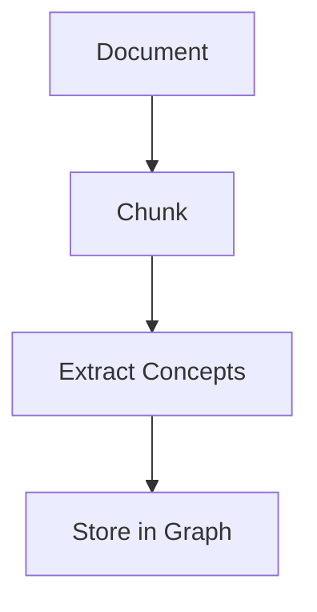

# ADR-023: Markdown Structured Content Preprocessing

**Status:** Proposed
**Date:** 2025-10-10
**Decision Makers:** System Architecture
**Consulted:** Ingestion Pipeline, LLM Integration

## Context

### The Problem: Parser-Breaking Syntax

During documentation ingestion testing (fuzzing with project documentation), we discovered that markdown code blocks and structured content cause parser errors in the Cypher query generation:

```
Error: invalid escape sequence at or near "\"
DETAIL: Valid escape sequences are \", \', \/, \\, \b, \f, \n, \r, \t
```

**Root cause:** Code blocks containing Cypher syntax, bash commands, or other special characters break when embedded as string literals in AGE Cypher queries, even with escaping:

```cypher
CREATE (s:Source {
    full_text: 'text containing
    MATCH (c:Concept)  ← Parser interprets as Cypher keyword!
    WHERE ...'
})
```

String sanitization can only go so far - multiline text with reserved keywords and complex escape sequences is fundamentally difficult to handle safely.

### The "Graph in a Graph" Problem

Markdown commonly embeds **structured language blocks** that represent their own conceptual models:

1. **Code blocks**: Cypher queries, TypeScript functions, shell scripts
2. **Mermaid diagrams**: Graph visualizations (literally graphs!)
3. **JSON/YAML**: Configuration structures
4. **SQL queries**: Relational database logic

When ingesting documentation about a graph database system, we encounter:
- Documentation (outer graph: knowledge concepts)
  - Containing Mermaid diagrams (middle graph: visual representation)
    - Describing Cypher queries (inner graph: data model)

This creates a **meta-conceptual problem**: Should we store the literal syntax, or extract the *meaning* behind the structure?

### Current Impact

During serial ingestion of project documentation:
- **~15% of chunks fail** due to code block parsing errors
- **Silent data loss** - failed chunks are skipped, concepts lost
- **Manual intervention required** - users must identify and fix problematic documents

**Coverage loss is worse than precision loss**: A 70% quality concept is better than 0% coverage from a failed chunk.

## Decision

**We will preprocess markdown documents to translate structured content blocks into prose before concept extraction.**

### Core Principles

1. **Markdown is the primary document format**
   - We assume "functionally valid" markdown as input
   - We do NOT attempt to parse raw code files (.ts, .cpp, .py)
   - Documents are human-readable technical content, not raw source

2. **The knowledge graph stores concepts, not code**
   - Original documents remain the **source of truth** for literal content
   - The graph is an **index to understanding**, not a repository
   - Source references point back to original files for retrieval

3. **Conceptual extraction over literal preservation**
   - A developer explaining code without seeing it gives the **conceptual model**
   - This is exactly what we want for the knowledge graph
   - Precision can be sacrificed for coverage and safety

### Implementation Strategy

#### Phase 1: Structured Block Detection

Use established markdown parsing libraries to identify structured content:

```python
# Leverage existing markdown parsers
import markdown
from markdown.extensions.fenced_code import FencedBlockPreprocessor

def extract_structured_blocks(content: str) -> List[StructuredBlock]:
    """
    Detect and extract structured content blocks:
    - Fenced code blocks (```language ... ```)
    - Mermaid diagrams (```mermaid ... ```)
    - Inline code spans (`code`)
    - Other embedded DSLs
    """
    # Use markdown library's proven parser
    # Returns: [(type, language, content, position)]
```

**Libraries to consider:**
- `markdown` (Python-Markdown with extensions)
- `mistune` (fast CommonMark parser)
- `marko` (AST-based parser)

These libraries already solve the hard problem of identifying structured blocks reliably.

#### Phase 2: AI Translation to Prose

For each structured block, dispatch to a language model for translation:

```python
def translate_code_to_prose(block: StructuredBlock) -> str:
    """
    Translate structured content to plain prose.

    Prompt: "Explain this {language} code in plain English without
    using code syntax. Use simple paragraphs and lists. Focus on
    WHAT it does and WHY."
    """
    # Use cheap, fast model: GPT-4o-mini ($0.15/1M tokens)
    # Cache translations to avoid re-processing identical blocks
```

**Model selection:**
- **Primary**: GPT-4o-mini (fast, cheap, good quality)
- **Alternative**: Claude Haiku (very fast, good for code understanding)
- **Configuration**: `CODE_TRANSLATION_MODEL` in .env

#### Phase 3: Document Object Model Transformation

**Critical implementation detail:** Code block replacement requires structured document parsing, not string manipulation.

**Why object-based processing:**
- Simple string replacement risks corrupting document structure
- Need to preserve heading hierarchy, list nesting, paragraph boundaries
- Line-offset based approaches fail with multi-line replacements
- Must maintain markdown validity after transformation

**Document transformation pipeline:**

```python
from typing import List, Union

class DocumentNode:
    """Base class for document structure nodes"""
    pass

class TextNode(DocumentNode):
    """Plain text paragraph or inline content"""
    def __init__(self, content: str):
        self.content = content

class CodeBlockNode(DocumentNode):
    """Code block that needs translation"""
    def __init__(self, language: str, code: str):
        self.language = language
        self.code = code
        self.translated = None  # Will be populated

class HeadingNode(DocumentNode):
    """Markdown heading"""
    def __init__(self, level: int, text: str):
        self.level = level
        self.text = text

# ... other node types (list, table, etc.)

def parse_document_to_ast(content: str) -> List[DocumentNode]:
    """
    Parse markdown into Abstract Syntax Tree of nodes.
    Uses markdown parser library (Python-Markdown, mistune, etc.)

    Returns list of typed nodes representing document structure.
    """
    # Leverage existing markdown parser
    parser = MarkdownParser()
    return parser.parse(content)

def transform_code_blocks(ast: List[DocumentNode]) -> List[DocumentNode]:
    """
    Walk AST, identify CodeBlockNodes, translate to prose.
    Replaces CodeBlockNode with TextNode containing translation.
    """
    transformed = []

    for node in ast:
        if isinstance(node, CodeBlockNode):
            # Translate code to prose (parallel per document)
            prose = translate_code_to_prose(node.code, node.language)
            # Replace code block with plain text node
            transformed.append(TextNode(prose))
        else:
            # Keep other nodes as-is
            transformed.append(node)

    return transformed

def serialize_ast_to_markdown(ast: List[DocumentNode]) -> str:
    """
    Serialize transformed AST back to markdown text stream.
    Maintains proper formatting, spacing, structure.
    """
    serializer = MarkdownSerializer()
    return serializer.serialize(ast)

def preprocess_markdown(content: str) -> str:
    """
    Complete preprocessing pipeline:
    1. Parse: markdown string → AST (objects)
    2. Transform: CodeBlockNode → TextNode (translation)
    3. Serialize: AST → markdown string
    4. Return: cleaned document for existing chunking pipeline
    """
    # Parse into structured objects
    ast = parse_document_to_ast(content)

    # Transform code blocks (this can be parallelized across docs)
    ast = transform_code_blocks(ast)

    # Serialize back to single text stream
    cleaned_markdown = serialize_ast_to_markdown(ast)

    # Feed to existing chunking/upsert workflow
    return cleaned_markdown
```

**Key advantages of object-based approach:**
1. **Structure preservation** - headings, lists, tables remain intact
2. **Safe replacement** - can't accidentally break markdown syntax
3. **Extensibility** - easy to add handling for other node types (mermaid, JSON, etc.)
4. **Testability** - can unit test each transformation independently
5. **Parallelization** - each document's AST can be transformed independently

**Library selection:**
- **Python-Markdown**: Full-featured, extensible, can access AST
- **mistune**: Fast, generates AST, good for our use case
- **marko**: Modern, pure Python, explicit AST manipulation

We prefer **mistune** for speed and simplicity - it's designed for AST-based transformations.

**Example transformation:**

```markdown
# Original markdown
This is a Cypher query example:

```cypher
MATCH (c:Concept {id: $id})
RETURN c.label
```

This query finds concepts.
```

**After AST transformation:**

```markdown
# Transformed markdown
This is a Cypher query example:

This Cypher query performs a pattern match to find a Concept node
with a specific ID and returns its label property. It uses a
parameterized query where the ID value is passed as a variable.

This query finds concepts.
```

**Document structure maintained:**
- Heading level preserved
- Paragraph boundaries intact
- Code block cleanly replaced with prose
- Ready for existing chunking pipeline

### Edge Case Handling

#### 1. Code Blocks (```language)

**Original:**
```cypher
MATCH (c:Concept {concept_id: $id})
RETURN c.label, c.search_terms
```

**Translated:**
```
This Cypher query finds a concept node with a specific ID and returns
its label and search terms. It performs a pattern match against the
Concept node type with a property filter.
```

**Concepts extracted:** "Cypher query", "concept node", "pattern match", "property filter"

#### 2. Mermaid Diagrams (```mermaid)

**Original:**


**Translated:**
```
This diagram shows the ingestion pipeline flow: Documents are split
into chunks, concepts are extracted from each chunk, and the extracted
concepts are stored in the graph database. This represents a sequential
processing pipeline with four stages.
```

**Concepts extracted:** "ingestion pipeline", "chunking", "concept extraction", "sequential processing"

**Note:** We avoid the "graph in a graph in a graph" problem by extracting the *meaning* of the diagram, not attempting to store the graph structure itself.

#### 3. Inline Code Spans

**Strategy:**
- Short inline code (`variable_name`) → Keep as-is (unlikely to cause issues)
- Long inline code with special chars → Translate or escape

**Heuristic:** If inline code > 50 chars or contains `{`, `[`, `\`, translate it.

#### 4. JSON/YAML Configuration

**Strategy:**
- **Small configs** (< 10 lines): Describe structure ("This JSON defines three API endpoints...")
- **Large configs**: Extract key-value concepts ("Configuration specifies database timeout of 30s, retry limit of 3...")

### Configuration Options

```python
# .env configuration
CODE_BLOCK_STRATEGY=translate  # Options: strip, translate, keep
CODE_TRANSLATION_MODEL=gpt-4o-mini
CODE_MIN_LINES_FOR_TRANSLATION=3  # Strip shorter blocks
MERMAID_HANDLING=translate  # Options: strip, translate, keep
INLINE_CODE_MAX_LENGTH=50  # Translate if longer
```

#### 5. No outlier text

**Strategy:**
- **No flagged objects in AST** If there are no flagged objects for LLM interpretation to concept, then we spend nearly zero time pre-processing - we don't have to explicitly create case handlers that detect and react on this state.
### Cost Analysis

**Documentation fuzzing test results:**
- ~50 structured blocks across project documentation
- Average block: 20 lines = ~500 tokens
- Translation: 50 blocks × 500 tokens × 2 (input + output) = **50K tokens**
- Cost with GPT-4o-mini: **~$0.01 per full ingestion**

**Scaling:**
- 100 documents with code examples: **~$0.20**
- 1000 documents: **~$2.00**

Negligible cost for massive quality improvement!

## Consequences

### Positive

1. **Eliminates parser errors** from code blocks
2. **Improves concept extraction** - prose descriptions more suitable for LLM analysis
3. **Maintains coverage** - no more silent data loss from failed chunks
4. **Philosophically aligned** - graph stores concepts, not code literals
5. **Retrieval still possible** - source references point to original files
6. **Handles edge cases** - mermaid, JSON, etc. all translated consistently
7. **Low cost** - ~$0.01 per document with code examples
8. **Configurable** - can disable, adjust strategy, or customize per use case

### Negative

1. **Preprocessing latency** - adds ~2-3s per document with code blocks
2. **Translation quality variance** - AI explanations may lose nuance
3. **Dependency on LLM** - adds another point of failure
4. **Cache complexity** - need to cache translations to avoid re-processing
5. **Configuration surface** - more options to tune

### Mitigations

1. **Latency**: Batch translations, use parallel processing
2. **Quality**: Test translations, provide feedback loops, allow manual overrides
3. **Dependency**: Graceful fallback to stripping if translation fails
4. **Cache**: Use content hash as key, store in SQLite or Redis
5. **Configuration**: Sensible defaults, clear documentation

## Alternatives Considered

### Alternative 1: Enhanced String Escaping

**Approach:** Add more sophisticated escaping logic to handle all edge cases.

**Rejected because:**
- Fundamentally difficult problem (escaping multiline code with keywords)
- Whack-a-mole approach - new edge cases will always appear
- Doesn't solve "graph in graph" conceptual problem
- Still stores literal code in graph (misaligned with purpose)

### Alternative 2: Strip All Code Blocks

**Approach:** Simple regex to remove ```...``` blocks entirely.

**Rejected because:**
- Total information loss - code examples contain valuable concepts
- Documentation about software loses critical context
- Silent data gaps - users don't know what's missing

### Alternative 3: Store Raw Code, Extract at Query Time

**Approach:** Store literal code blocks, translate on-demand when querying.

**Rejected because:**
- Still causes parser errors during ingestion
- Defers the problem, doesn't solve it
- Increases query latency
- Complicates retrieval logic

### Alternative 4: Parallel Track for Code Content

**Approach:** Store code blocks in separate storage system, reference in graph.

**Rejected because:**
- Adds architectural complexity (second storage system)
- Code blocks are already in source documents (no need to duplicate)
- Doesn't improve concept extraction quality
- More complex to maintain

## Parallelization Strategy

### Key Insight: No Time Arrow in the Graph

**The graph is temporally invariant.** Document ingestion order does not matter because:

1. **Each chunk upsert queries the entire graph** for best-fit concept matching via vector similarity
2. **Vector search is order-independent** - similarity scores are computed against all existing concepts
3. **Concept deduplication happens at upsert time** - whether Concept A was created in Document 1 or Document 10 is irrelevant
4. **Relationships are semantic, not temporal** - "IMPLIES", "SUPPORTS", "CONTRASTS_WITH" don't depend on insertion order

This means we can parallelize more aggressively than initially assumed!

### Parallelization Model

The preprocessing pipeline uses **bounded parallelism** with careful synchronization points.

#### Multi-Stage Pipeline (Per Document)

```
1. SERIAL: Objectify document → AST with order preserved
                    ↓
2. BOUNDED PARALLEL: Translate code blocks (2-3 worker threads max)
   - Each block processed in isolation (no cross-context)
   - Worker pool size limited for resource control
                    ↓
3. SYNCHRONIZATION: Wait for all translations to complete
                    ↓
4. SERIAL: Serialize AST → reconstructed markdown (order preserved)
                    ↓
5. EXISTING PIPELINE: Feed to recursive concept upsert
```

**Stage 1: Serial Objectification**
```python
def objectify_document(content: str) -> OrderedAST:
    """
    Parse markdown into AST, maintaining serial order.
    Each node tagged with position index for reconstruction.
    """
    ast = parse_markdown(content)

    # Tag nodes with order
    for i, node in enumerate(ast):
        node.position = i

    return ast
```

**Stage 2: Bounded Parallel Translation**
```python
from concurrent.futures import ThreadPoolExecutor, as_completed

MAX_WORKERS = 3  # Limit to 2-3 threads for resource control

def translate_code_blocks_parallel(ast: OrderedAST) -> OrderedAST:
    """
    Process code blocks with bounded parallelism.
    Each block translated in isolation (no context from other blocks).
    """
    code_blocks = [node for node in ast if isinstance(node, CodeBlockNode)]

    # Limited thread pool - no more than 2-3 concurrent translations
    with ThreadPoolExecutor(max_workers=MAX_WORKERS) as executor:
        # Submit all code blocks for translation
        future_to_node = {
            executor.submit(translate_isolated_block, node): node
            for node in code_blocks
        }

        # Wait for all to complete (synchronization point)
        for future in as_completed(future_to_node):
            node = future_to_node[future]
            node.translated = future.result()

    return ast

def translate_isolated_block(node: CodeBlockNode) -> str:
    """
    Translate single code block with NO context from other blocks.
    Worker receives only the code and language, nothing else.
    """
    prompt = f"""
    Explain this {node.language} code in plain English.
    No context provided - explain what you see in isolation.
    """
    return llm.generate(prompt, node.code)
```

**Stage 3: Synchronization Point**
- All workers must complete before proceeding
- `as_completed()` ensures we wait for all futures
- No partial serialization - document must be fully transformed

**Stage 4: Serial Serialization**
```python
def serialize_ordered_ast(ast: OrderedAST) -> str:
    """
    Reconstruct document in original order.
    CodeBlockNodes replaced with translated TextNodes.
    """
    # Sort by position to maintain order
    ordered_nodes = sorted(ast, key=lambda n: n.position)

    return serialize_to_markdown(ordered_nodes)
```

**Stage 5: Existing Pipeline**
```python
def submit_for_ingestion(document: str, file_path: str):
    """
    Feed preprocessed document to existing recursive upsert.
    Vector embeddings computed from prose-only content.
    File path preserved for source reference.
    """
    # Chunk and extract concepts (existing code)
    chunks = chunk_document(document)

    for chunk in chunks:
        # Vector embedding computed from PROSE ONLY
        embedding = generate_embedding(chunk.text)

        # Source reference points to ORIGINAL file
        source = Source(
            document=file_path,  # Points to original with code
            full_text=chunk.text  # Contains translated prose
        )

        upsert_concepts(chunk, embedding, source)
```

**Key properties:**
1. **Bounded parallelism** - Max 2-3 workers (configurable)
2. **Isolation** - Each code block translated without context from others
3. **Synchronization** - Wait for all translations before serialization
4. **Order preservation** - Document structure maintained throughout
5. **Resource control** - Limited threads prevent overwhelming LLM API/DB

**Ingestion parallelization:**
- Documents can actually be ingested **in parallel** because:
  - Vector similarity search queries the entire graph (atomic read)
  - Concept upsert handles concurrent writes via PostgreSQL ACID
  - No dependency on insertion order for correctness
- Serial mode remains useful for:
  - **Resource limiting** (avoid overwhelming database/LLM)
  - **Debugging** (easier to trace single document flow)
  - **Cost control** (throttle API usage)
  - **Predictable progress** (linear progression for UX)

### Serial vs Parallel Decision Matrix

| Phase | Can Parallelize? | Should Parallelize? | Reason |
|-------|------------------|---------------------|--------|
| **Code translation** (within doc) | ✅ Yes | ✅ Yes | Code blocks independent |
| **Doc preprocessing** (across docs) | ✅ Yes | ✅ Yes | Documents independent |
| **Chunk extraction** (within doc) | ❌ No | ❌ No | Sequential LLM calls |
| **Concept upsert** (across docs) | ✅ Yes | ⚠️ Maybe | Graph is order-independent, but serial useful for control |

**Default configuration:**
- **Preprocessing**: Parallel (translate all docs' code blocks concurrently)
- **Ingestion**: Serial (default, configurable to parallel)

This maintains the benefits of serial processing (resource control, debugging) while allowing parallel preprocessing to minimize latency.

### Implementation Implication

```python
# Preprocessing pipeline (new)
async def preprocess_documents_parallel(documents: List[Document]) -> List[Document]:
    """
    Translate code blocks across all documents in parallel.
    Each document processed independently.
    """
    tasks = [preprocess_single_document(doc) for doc in documents]
    return await asyncio.gather(*tasks)

# Ingestion remains configurable
async def ingest_documents(documents: List[Document], mode: str = "serial"):
    """
    mode: "serial" (default) or "parallel"
    Serial for resource control, parallel for speed when safe.
    """
    if mode == "parallel":
        # All documents can ingest simultaneously
        # Graph handles concurrent upserts correctly
        tasks = [ingest_document(doc) for doc in documents]
        await asyncio.gather(*tasks)
    else:
        # Process one at a time (resource limiting)
        for doc in documents:
            await ingest_document(doc)
```

**Key takeaway:** Preprocessing uses bounded parallelism (2-3 workers per document), while ingestion remains configurable for operational reasons, not correctness.

### Critical Architectural Insight: Vector Embeddings vs Source Truth

**The preprocessing pipeline creates a clean separation:**

```
Knowledge Graph (Concept Index)
├─ Vector embeddings → Computed from PROSE ONLY
├─ Concept relationships → Extracted from PROSE
├─ Source references → Point to ORIGINAL files on disk
│
Original Files (Source Truth)
├─ Code blocks → Preserved as-is in files
├─ Mermaid diagrams → Remain in markdown
├─ All literal content → Unchanged
```

**What this means:**

1. **Graph contains concepts, not code**
   - Vector search finds "concept of Cypher pattern matching"
   - NOT literal syntax `MATCH (c:Concept {id: $id})`

2. **Original files remain source of truth**
   - File path stored in Source node: `document: "docs/queries.md"`
   - Agent can retrieve original file to see actual code
   - No information loss - just different storage strategies

3. **Retrieval pattern for code inspection**

```python
# Agent workflow:
# 1. Search graph for concept
concept = search_graph("Cypher pattern matching")

# 2. Get source reference
source_file = concept.source.document  # "docs/queries.md"

# 3. Retrieve original file from disk
original_content = read_file(source_file)

# 4. Now agent has BOTH:
#    - Conceptual understanding (from graph)
#    - Literal code (from file)
```

**Example scenario:**

```
User: "Show me the Cypher query for finding concepts by ID"

Agent:
1. Searches graph: finds concept "Cypher ID lookup pattern"
2. Reads source: docs/queries.md (paragraph 5)
3. Returns both:
   - Concept: "This pattern finds concepts by matching ID properties"
   - Code: MATCH (c:Concept {id: $id}) RETURN c.label
```

**Why this architecture is superior:**

- **Graph optimized for discovery** (semantic search, relationships)
- **Files optimized for precision** (literal code, exact syntax)
- **No duplication** (code not stored in both places)
- **Separation of concerns** (concepts ≠ implementations)

This mirrors how developers actually work: understand concepts conceptually, reference documentation for exact syntax when needed.

## Implementation Plan

### Phase 1: Detection (Week 1)
- [ ] Integrate markdown parsing library
- [ ] Implement structured block detection
- [ ] Add unit tests for various block types
- [ ] Log detected blocks for analysis

### Phase 2: Translation (Week 2)
- [ ] Implement AI translation function (parallel per document)
- [ ] Add configuration options
- [ ] Create prompt templates for different languages
- [ ] Test translation quality on sample docs
- [ ] Benchmark parallel vs serial preprocessing

### Phase 3: Integration (Week 3)
- [ ] Add preprocessing step to ingestion pipeline
- [ ] Implement parallel preprocessing for document batches
- [ ] Implement caching layer for translations
- [ ] Add metrics/logging for preprocessing
- [ ] Test end-to-end ingestion with project docs

### Phase 4: Optimization (Week 4)
- [ ] Tune heuristics (when to translate vs strip)
- [ ] Optimize batch translation across documents
- [ ] Add configuration UI/CLI
- [ ] Document preprocessing behavior
- [ ] Test parallel ingestion mode with large document sets

## Success Metrics

- **Parser error rate**: < 1% (currently ~15%)
- **Coverage**: > 99% of chunks successfully ingested (currently ~85%)
- **Translation quality**: Human evaluation of sample translations
- **Performance**: Preprocessing adds < 5s per document
- **Cost**: < $0.05 per document on average

## References

- **ADR-014**: Job Approval Workflow (establishes preprocessing before ingestion)
- **ADR-016**: Apache AGE Migration (source of string escaping challenges)
- **ADR-022**: Semantic Relationship Taxonomy (concepts we're trying to extract)
- **Fuzzing Test Results**: Serial ingestion of project documentation (October 2025)

## Notes

### On the Developer Analogy

> "In the real world, asking a software developer about a piece of code without it in front of them will usually give a reasonably acceptable, but still fuzzy interpretation of the literal code."

This is a **false equivalence** in the literal sense, but **functionally similar** in outcome:
- Developers provide **conceptual models** when explaining code from memory
- The knowledge graph's purpose is to capture **conceptual relationships**, not literal code
- Both prioritize understanding over precision

This analogy helped clarify that we're building a **grounding truth index**, not a code repository. The original files remain the source of truth for literal retrieval.

### On "Graph in a Graph in a Graph"

The meta-problem of ingesting graph-structured content (Mermaid diagrams) into a knowledge graph that's documenting a graph database is philosophically interesting:

- **Layer 1**: Knowledge graph (concepts and relationships in documentation)
- **Layer 2**: Mermaid diagram (visual representation of a process)
- **Layer 3**: Cypher query (data model in the database)

By translating to prose, we collapse these layers into a single conceptual representation suitable for Layer 1. We don't attempt to preserve the graph structure of Layer 2 or the syntax of Layer 3.

### On Markdown as Primary Format

We explicitly **do not** attempt to ingest:
- Raw source code files (.ts, .py, .cpp)
- Binary formats (PDFs parsed to text are acceptable)
- Unstructured text (requires different preprocessing)

We assume:
- Markdown with standard CommonMark/GFM syntax
- Human-authored technical documentation
- Code blocks used for **examples**, not as primary content
- Mermaid/other DSLs used for **illustration**, not as data structures

This scoping prevents feature creep while addressing the common case.
