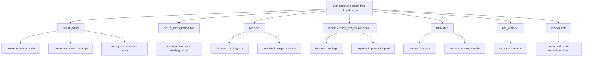
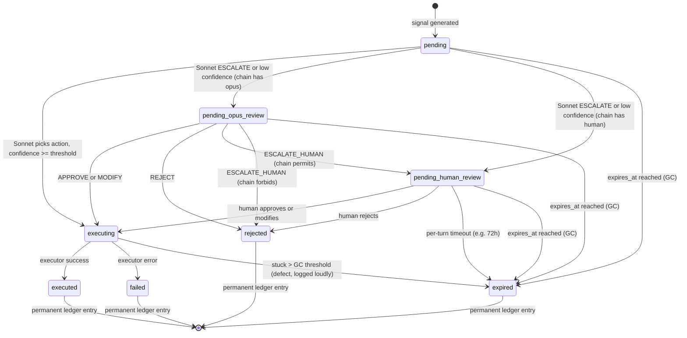

# ADR-206: Closed-Vocabulary Annealing Actions with Tiered Escalation and Epistemic Ledger

## Context

ADR-200 introduced annealing ontologies — `:Ontology` nodes that grow, merge,
and dissolve under the supervision of a background worker that scores the
graph and proposes structural changes. Phase 4 of ADR-200 added an executor
that can carry out proposals automatically. Phases 1–4 are deployed; the
mechanism works end-to-end on the happy path.

The mechanism does *not* work on cases that fall between the two action types
the schema actually offers. The `kg_api.annealing_proposals` table
(migration 046) encodes the entire decision space as
`proposal_type ∈ {promotion, demotion}`. Everything the system can decide must
be one of those two verbs. Everything the executor can do must be the
canonical implementation of one of those two verbs.

This is too narrow.

### Observed failure mode

Annealing proposals 35, 36, and 37 in `kg_api.annealing_proposals` show the
same pattern across three consecutive cycles, eight minutes apart:

- Same donor ontology: `atlassian-api-bitbucket-dc`.
- Same anchor concept (an authentication / connection sub-cluster).
- Same downstream error: `Ontology 'atlassian-api-bitbucket-cloud' already exists.`
- Same proposal_type: `promotion`.

The LLM's own reasoning, captured in the `reasoning` column, *correctly*
identified what should happen. It said, in effect, "the sub-cluster you found
inside `atlassian-api-bitbucket-dc` is not a new domain — it is the same
domain as the existing `atlassian-api-bitbucket-cloud` ontology, and these
sources should be reassigned there." The reasoning was right. The action
slot was wrong. There is no `SPLIT_INTO_EXISTING` verb, so the worker fell
back to `promotion` with a colliding name, and the executor refused because
the target already existed. Three identical failures in three cycles, because
nothing about the proposal queue or the cycle planner is failure-aware.

This single trace surfaces three layered defects, all in proposal vocabulary
and decision-making — none of them in the executor primitives themselves
(`create_ontology_node`, `rename_ontology`, `reassign_sources`,
`dissolve_ontology` all exist and work):

1. **Action vocabulary too narrow.** The LLM has an intent that has no
   schema slot. Promotion and demotion cannot encode "split a sub-cluster
   off donor X and merge it into existing target Y." Every intent that is
   not promotion or demotion silently degrades to the nearest one and fails
   at execution time.

2. **LLM does not see the existing ontology namespace.** The prompt does not
   include the inventory of existing ontologies, so the LLM cannot reason
   about "merge into existing target." It can only describe a *new* target,
   because that is the only target the prompt grammar permits.

3. **Only one reasoning tier exists, and it is not failure-aware.** A single
   LLM call decides the action with no escalation path and no memory of
   prior failed attempts on the same signal. The system retries the same
   bad decision until something else changes the underlying graph.

A separate Phase-0 race condition between ingestion and annealing has been
identified during this investigation. It is being filed as a GitHub issue
and is **out of scope for this ADR**.

### Why a closed vocabulary, not an open one

The natural temptation is to let the LLM emit free-form instructions and
have the executor interpret them. That collapses the boundary between
decision and execution and reintroduces the exact problem this system was
designed to avoid: the executor has to guess what the LLM meant, and any
ambiguity becomes a runtime failure. A closed menu of fully-parameterised
actions keeps the boundary sharp. The LLM picks one action and provides all
the parameters; the executor maps that action to a known sequence of graph
primitives with no interpretation. If the LLM cannot fit its intent into
any action, the only honest answer is `ESCALATE`.

### Why an escalation cascade, not a confidence dial

Sonnet, today, is the only reasoner. It either succeeds or it fails, and
when it fails there is no second opinion. This is a single point of failure
in the decision pipeline. The fix is not "make Sonnet more confident" — it
is to put a second reasoner above Sonnet that evaluates the *evaluation*,
and a human above that for cases where two reasoners cannot agree. Each
tier is invoked only when the tier below abstains. The chain is
configured, not derived, so operators choose how much autonomy the system
has.

### Why the proposal queue must become a ledger

ADR-200 framed proposals as an operational queue: items arrive, items are
decided, items are executed or expire. Once we add a second reasoning tier
that defends its decisions, and add control-tuning proposals where the
system regulates itself, the queue stops being operational and starts being
**evidence**. Past decisions are training data for future decisions.
Confidence calibration becomes a closed loop. The queue becomes a
permanent, mineable record of every structural decision the graph has ever
made, with the reasoning chain attached.

## Decision

We extend the annealing system along four phases. Each phase is intended to
land as a separate PR; together they replace the current Phase-4
decision surface from ADR-200.

### Phase 1 — Closed action vocabulary

Replace `proposal_type ∈ {promotion, demotion}` with a closed menu of seven
self-contained actions. Each action carries every parameter its execution
needs; the executor performs no interpretation.

| Action | Parameters | Executor mapping (existing primitives) |
|---|---|---|
| `SPLIT_NEW` | `donor_ontology`, `anchor_concept_id`, `new_name`, `new_description`, `cluster_selection ∈ {first_order, embedding_radius, named_concepts}`, `cluster_params` | `create_ontology_node` + `create_anchored_by_edge` + `reassign_sources` |
| `SPLIT_INTO_EXISTING` | `donor_ontology`, `anchor_concept_id`, `target_ontology` (must exist, `≠ donor_ontology`), `cluster_selection`, `cluster_params` | `reassign_sources` only |
| `MERGE` | `donor_ontologies` (≥2), `target_ontology` (survivor name OR new name), `new_description` (if new name) | `dissolve_ontology` × N → target |
| `DECOMPOSE_TO_PRIMORDIAL` | `ontology`, `rationale` (required) | `dissolve_ontology` → primordial pool |
| `RENAME` | `ontology`, `new_name`, `new_description` | `rename_ontology` + `rename_ontology_node` |
| `NO_ACTION` | `reasoning` | nothing |
| `ESCALATE` | `candidate_actions[]`, `what_i_know`, `what_i_dont_know`, `recommended_action`, `confidence` | pins to next tier in `escalation_chain` |

`SPLIT_NEW` and `SPLIT_INTO_EXISTING` are deliberately distinct so the
executor's validation can short-circuit obvious name collisions before any
graph mutation is attempted. `SPLIT_INTO_EXISTING` requires
`target_ontology` to already exist; `SPLIT_NEW` requires that it does not.
This is the schema slot whose absence caused the 35/36/37 failure trace.

**Cluster selection is part of the action, not the executor.** The LLM
picks the strategy and parameters that define the donated cluster:
- `first_order` — anchor concept plus its direct neighbours.
- `embedding_radius` — concepts within cosine distance `r` of the anchor.
- `named_concepts` — an explicit list of concept IDs.

The executor materialises the cluster deterministically from the strategy.
This keeps the "what to move" decision with the reasoner and the "how to
move it" mechanics with the executor.

**Backward compatibility.** Existing `promotion` and `demotion` rows
remain valid for already-executed history. The two strings become read-only
aliases (`promotion` ↔ `SPLIT_NEW`, `demotion` ↔ `DECOMPOSE_TO_PRIMORDIAL`)
when the history view loads them. New proposals always use the expanded
vocabulary.

**Prompt expansion.** The Sonnet prompt for action selection must include:
- The full ontology inventory: names, concept counts, lifecycle states.
  Without this, `SPLIT_INTO_EXISTING` and `MERGE` are unreachable.
- The signal kind that produced the candidate (e.g. `high_overlap_pair`,
  `low_coherence_low_affinity`).
- Local graph context around the anchor (first-order neighbourhood,
  cross-ontology edges).
- Recent failed proposals for the same signal, with their failure reasons.
  Without this, the system retries the same bad action indefinitely.

#### System invariant — the primordial pool is permanent

The primordial pool (ADR-200's "everything else") is upgraded from a
*starting posture* to a **load-bearing, undeletable system ontology**.
Dissolution never destroys concepts; it relocates them.

- `MERGE` deposits dissolved members in a named target ontology.
- `DECOMPOSE_TO_PRIMORDIAL` deposits dissolved members in the primordial
  pool, where future cycles can re-cluster them.

The primordial pool cannot be the target of dissolution itself, cannot be
renamed, and cannot be deleted. This is the system's guarantee against
catastrophic forgetting — every concept that has ever entered the graph
remains addressable somewhere.

#### Action menu, mapped to primitives



### Phase 2 — Tiered escalation cascade

A proposal does not have to be decided by Sonnet. A proposal has to be
decided by *whichever tier the configured `escalation_chain` requires*,
working from the bottom up. The chain is platform-level configuration
(same scope as model provider and API key — admin only).

Three tiers exist:

- **Sonnet — classifier (medium tier).** The default decision-maker.
  Receives the prompt described in Phase 1 and emits one closed action.
  If `golden_path_confidence` is exceeded and the action is non-`ESCALATE`,
  the proposal proceeds to execution. Otherwise it pins to the next tier.

- **Opus — arbitrator (high tier), "evaluate the evaluator".** Opus is
  invoked when Sonnet abstains, when Sonnet's confidence is below the
  golden-path threshold, or when the operator explicitly chains it.
  Opus's prompt frames Sonnet's instructions and Sonnet's response as
  **evidence quoted in XML tags** — `<sonnet_prompt>...</sonnet_prompt>`,
  `<sonnet_response>...</sonnet_response>`, `<similar_past_decisions>...</similar_past_decisions>`
  — never as Opus's own task. Opus picks one of:
  - `APPROVE` — Sonnet's action stands.
  - `MODIFY` — emit a different closed action (same vocabulary as Sonnet).
  - `REJECT` — refuse to act on this signal; `NO_ACTION` with reason.
  - `ESCALATE_HUMAN` — only valid if the chain permits.
  - `ADJUST_CONTROL` — propose a tuning change (see Phase 3).
  Opus's output must include a **defense** — a written justification of
  why this verdict was reached, intended to be read by future cycles and
  by humans. The central design intent is that Opus *defends* a decision,
  not just picks one. The defense is permanent record.

- **Human — final tier.** Multi-turn dialogue. The human can ask follow-up
  questions ("why didn't you pick `MERGE`?"), the agent responds with a
  new turn that may include a revised recommendation, then the human
  commits a final decision. The dialogue is recorded turn-by-turn.

The chain is an ordered list of tiers, configured per platform. Examples:

| `escalation_chain` | Behavior |
|---|---|
| `["opus"]` | Full autonomous: Sonnet → Opus → execute. No human involvement. |
| `["opus", "human"]` | Hybrid: Opus arbitrates; only Opus's `ESCALATE_HUMAN` reaches the operator. |
| `["human"]` | Skip Opus: every Sonnet abstention pins directly to the operator. |
| `[]` | Every Sonnet recommendation pins to human. Maximum oversight. |

Sonnet itself is always present — it is the bottom of the funnel. The
chain configures what happens *above* it.

#### Three-tier escalation cascade

```mermaid
flowchart TD
    SIG[signal generated] --> SON[Sonnet classifies]

    SON -->|action picked, confidence >= golden_path| EXE[execute]
    SON -->|ESCALATE or low confidence| ESC1{escalation_chain[0]}

    ESC1 -->|opus| OPUS[Opus arbitrates]
    ESC1 -->|human| HUM[Human dialogue]
    ESC1 -->|empty chain| HUM

    OPUS -->|APPROVE| EXE
    OPUS -->|MODIFY| EXE
    OPUS -->|REJECT| TERM_REJ[terminal: rejected]
    OPUS -->|ADJUST_CONTROL| CTRL[control-tuning proposal]
    OPUS -->|ESCALATE_HUMAN| ESC2{chain permits?}

    ESC2 -->|yes| HUM
    ESC2 -->|no| TERM_REJ

    HUM -->|approve| EXE
    HUM -->|modify| EXE
    HUM -->|reject| TERM_REJ

    EXE -->|success| TERM_EXE[terminal: executed]
    EXE -->|failure| TERM_FAIL[terminal: failed]

    CTRL --> CTRL_REV[Phase 3 control review]
```

#### Schema — reasoning chain as first-class data

A new table `kg_api.annealing_proposal_messages` holds the per-turn
reasoning chain:

- `id`, `proposal_id` (FK), `turn_no`
- `role ∈ {sonnet, opus, human, system}`
- `body` JSONB — prompt, response, parameters, defense, dialogue text
- `created_at`

The `annealing_proposals` row carries the **verdict** (which action ran,
or which terminal state was reached). The `annealing_proposal_messages`
table carries the **full reasoning chain** that produced the verdict.
Splitting them keeps the proposal row cheap to query and keeps the
reasoning chain unbounded.

#### GC invariant — every proposal reaches a terminal state

Non-terminal stalls are defects. The existing `expires_at` column becomes
load-bearing rather than advisory.

| State | Terminal? |
|---|---|
| `pending` | non-terminal |
| `pending_opus_review` | non-terminal |
| `pending_human_review` | non-terminal |
| `executing` | non-terminal |
| `executed` | terminal |
| `failed` | terminal |
| `rejected` | terminal |
| `expired` | terminal |

A `proposal_gc` worker scans non-terminal proposals on a heartbeat and
forces stale ones to `expired` with a synthetic `NO_ACTION` decision and
a `system`-role message explaining the GC. Per-turn timeouts apply to
human dialogues — e.g. 72h with no human response expires the proposal.
GC events log loudly so stalls are visible.

#### Proposal state machine



### Phase 3 — Control surface and self-regulation

Annealing behaviour is governed by a set of knobs in
`kg_api.annealing_options`. Phase 3 makes that surface explicit, audited,
and partially self-tuneable.

| Control | Who can change | Effect |
|---|---|---|
| `min_activity_for_cycle` | Admin + Opus | Cycle no-ops unless graph moved enough since last run. Current defaults are too eager; this raises the floor. |
| `min_ontology_age_epochs` | Admin + Opus | Fresh ontologies are exempt from evaluation for N epochs. |
| `golden_path_confidence` | Admin + Opus | Sonnet's threshold to execute without escalating. |
| `opus_confidence` | Admin only (safety rail) | Opus's threshold to escalate to human. |
| `failure_cooldown_epochs` | Admin + Opus | After a failure, the same `(anchor, action_type, target)` triple won't re-propose for N epochs. |
| `max_proposals_per_cycle` | Admin + Opus | Already exists in ADR-200. |
| `phone_a_friend_cost_budget` | Admin only | Cost ceiling on Opus invocations per cycle. |
| `automation_level` | Admin only (safety rail) | `autonomous` / `hitl`. |
| `escalation_chain` | Admin only (safety rail) | Ordered list of tiers above Sonnet. |

**Self-regulation invariant.** Opus may tune *operational* knobs (cadence,
cooldowns, eligibility thresholds) via the `ADJUST_CONTROL` action. Opus
may **not** tune *safety* knobs (`automation_level`, `escalation_chain`,
`opus_confidence`, `phone_a_friend_cost_budget`). Each Opus-driven
adjustment is itself a proposal in the queue, carrying a defense and
visible in the audit trail. The system can regulate its own cadence, but
cannot widen its own autonomy.

**Snapshot, not live-read.** Each annealing cycle reads the control set
once at cycle start and treats it as immutable for the duration of the
cycle. If an `ADJUST_CONTROL` proposal lands mid-cycle, it takes effect
at the next cycle. This avoids inconsistent half-applied policy mid-run.

### Phase 4 — Epistemic ledger

The proposal queue plus the reasoning-chain table together form a
**permanent, mineable decision log**. Past decisions are training data for
future decisions.

#### Retention model

Terminal proposals are kept forever. GC touches only non-terminal stalls.
Storage cost of one proposal row plus its reasoning chain is dominated by
the JSONB bodies and the embedding vector — bounded and acceptable at any
plausible scale.

#### Schema additions to `annealing_proposals`

- `signal_embedding` — vector for nearest-neighbour retrieval. Lets Opus
  RAG over its own past arbitrations.
- `signal_payload` — the full LLM input context, not a summary. The same
  decision can be re-evaluated later with a stronger model.
- `signal_kind` — enum identifying which scoring path produced the
  candidate (`high_overlap_pair`, `low_coherence_low_affinity`,
  `low_protection_score`, ...).
- `outcome_quality` — numeric, set asynchronously by a follow-up worker
  at 1/7/30 days post-decision, analysing post-execution graph metrics
  to score whether the decision improved or degraded the structure.
- `superseded_by` — proposal_id of a later proposal that reversed this one.
- `graph_delta_summary` — concrete structural changes recorded at execution.

#### Opus as RAG agent over its own past

Opus's arbitration prompt injects a `<similar_past_decisions>` block
retrieved by cosine similarity on `signal_embedding`. Each retrieved
record carries its action, its defense, and its eventual
`outcome_quality`. Opus sees not only "what was decided" but "how it
worked out." Arbitration becomes informed by precedent.

#### Calibration as a closed loop

The ledger turns confidence calibration from an observability concern into
an empirical one:

- **Confidence vs outcome** is directly mineable. Pair every proposal's
  recorded `confidence` against its eventual `outcome_quality`. A
  miscalibrated threshold is visible immediately.
- **Threshold auto-tuning** has empirical input. Opus reading past
  outcomes can recommend a `golden_path_confidence` that maximises
  success rate at the current cost ceiling.
- **Human-vs-Opus agreement** is scoreable for any proposal both tiers
  touched. Divergences are the highest-value review items.

#### Read-side surface

- `kg anneal history` — paginated decision log.
- `kg anneal similar <id>` — nearest decisions by signal embedding.
- `kg anneal calibrate` — confidence-vs-outcome calibration report.
- Web: a **Decision Log** panel, distinct from the existing
  **Proposal Queue** panel. Queue shows non-terminal items requiring
  attention; Log shows the permanent ledger.

## Consequences

### Positive

- The LLM's intent is no longer silently truncated to fit a binary
  vocabulary. `SPLIT_INTO_EXISTING` and `MERGE` are first-class.
- The 35/36/37 failure trace becomes impossible by construction: the
  prompt sees the ontology inventory, the action exists, the executor
  performs no name guessing.
- Escalation is configured, not derived. Operators choose how much
  autonomy the system has, on a single control surface.
- Opus *defending* decisions — rather than re-running them — gives the
  system a written record of reasoning that future cycles and future
  humans can read.
- The primordial pool guarantee turns dissolution into a safe,
  reversible operation. Nothing is lost; only relocated.
- The proposal queue stops growing without bound: GC forces every
  proposal to a terminal state.
- Past decisions become training data. Calibration becomes a closed loop
  rather than an observability dashboard.
- Each of the four phases is independently shippable; later phases assume
  earlier ones but earlier ones produce value on their own.

### Negative

- The schema gains a closed enum (the action vocabulary) and a new table
  (`annealing_proposal_messages`). Vocabulary changes will require schema
  migrations rather than configuration changes. This is the trade we are
  making in exchange for a sharp decision/execution boundary.
- Opus invocations cost more than Sonnet. The `phone_a_friend_cost_budget`
  control bounds this, but the cost is real and non-zero. Calibration
  determines whether the spend is worth it.
- HITL multi-turn dialogues need UI surface area (turn-ordered display,
  follow-up input, commit-decision button). Phase 2 cannot ship
  user-visible HITL without ADR-700 work.
- The closed vocabulary is, by definition, closed. Intents that fit none
  of the seven actions must `ESCALATE` and get a human; we will discover
  missing actions only by watching the escalation rate.
- Snapshotting controls at cycle start means an `ADJUST_CONTROL`
  proposal does not take effect until the *next* cycle. Operators must
  understand this delay.

### Neutral

- Existing executor primitives (`create_ontology_node`,
  `create_anchored_by_edge`, `reassign_sources`, `dissolve_ontology`,
  `rename_ontology`, `rename_ontology_node`) are reused unchanged. This
  ADR adds no new graph mutations; it adds decision and bookkeeping
  layers above them.
- `promotion` and `demotion` survive as read-only history aliases. No
  existing data is rewritten.
- Signal generation continues to reuse the existing scorer / affinity /
  degree machinery. The work added by this ADR is in prompting,
  arbitration, recording, and GC — additive only.
- The ledger's mineable-history view (Phase 4) overlaps in spirit with
  ADR-203's graph epoch event log, but operates at a higher semantic
  level (decisions about structure, not raw event facts).

## Alternatives Considered

### A. Open-ended action grammar

Let the LLM emit free-form structural instructions ("split this concept
into a new ontology and rename the donor") and have the executor parse
intent.

**Rejected because:** This is the failure mode we are trying to escape.
A free-form grammar moves the interpretation cost from prompt design to
runtime parsing. Every ambiguity becomes an execution failure. A closed
menu with parameters is verbose, but every action is verifiable before
graph mutation begins.

### B. Add a third `proposal_type ∈ {promotion, demotion, merge}` and stop there

Treat the 35/36/37 case as a missing third verb. Add `merge` and call it
done.

**Rejected because:** This is a point fix. It does not address the prompt
gap (LLM cannot see existing ontology names), the missing escalation tier,
the lack of failure-awareness across cycles, or the queue-vs-ledger
distinction. Three months later the same investigation will surface a
different intent (RENAME, SPLIT_INTO_EXISTING) with no schema slot, and
we will be back here. The closed vocabulary is the smallest change that
addresses the *class* of failure.

### C. Pure confidence-dial autonomy (no Opus tier)

Replace the escalation cascade with a single confidence threshold:
Sonnet decides, Sonnet executes if confident, Sonnet escalates to human
if not.

**Rejected because:** It leaves Sonnet as the single point of failure in
the decision pipeline. LLM calibration is unreliable; "high confidence"
on a structurally wrong decision is exactly the failure mode we observed.
The point of Opus is to be a second reasoner that evaluates Sonnet's
output as evidence, not a second decision-maker that re-runs the
classification.

### D. Proposal queue purges after N days

Treat the proposal table as operational ephemera: GC everything older
than 30 days regardless of terminal state.

**Rejected because:** This destroys the substrate Phase 4 depends on.
Confidence-vs-outcome calibration, RAG retrieval of similar past
decisions, human-vs-Opus agreement scoring — all of these require a
durable history. The ledger framing is not optional once the escalation
cascade exists; it is what gives the cascade something to learn from.

### E. Per-ontology control overrides via a separate `ontology_overrides` table

Allow operators to override platform-level controls on a per-ontology
basis through a dedicated relational table.

**Deferred, not rejected.** The data model question (JSONB column on
`:Ontology` node versus separate `ontology_overrides` table) is open
and surfaced below. A platform-wide control set is sufficient for the
first deployment; per-ontology override is a Phase 5 concern.

## Open Questions

- **Confidence contract.** Sonnet (and Opus) emit a numeric confidence,
  but LLMs are not reliable probability calibrators. A qualitative
  contract — "are there ≥2 plausible actions remaining?" — may be more
  robust than a numeric threshold. The current design uses numeric
  thresholds and lets Phase 4's calibration report expose the
  miscalibration; a qualitative emission path is a possible refinement.

- **Per-ontology control overrides.** Should an operator be able to
  pin `automation_level = hitl` for a single sensitive ontology while
  the rest of the platform runs autonomous? If yes, JSONB on the
  Ontology node or a separate `ontology_overrides` table? Deferred.

- **Per-proposal escalation overrides.** Can a human reviewer request
  "skip Opus on this one, I want raw Sonnet uncertainty"? More power,
  more UI surface, and a way for a single operator to bypass the
  platform-level safety rail. Deferred.

- **Mid-cycle control change behaviour.** Snapshotting at cycle start
  is the resolution in principle, but the operator-facing semantics
  ("you changed the threshold but it won't apply until cycle N+1")
  need explicit UI affordance.

- **Outcome quality scoring function.** Phase 4's `outcome_quality` is
  defined as "numeric, async-set, derived from post-execution graph
  metrics." The exact metrics (coherence drift, mass drift, cross-edge
  ratio change, ...) are unspecified and need calibration against the
  first weeks of ledger data.

## Related ADRs

- **ADR-200** — Annealing Ontologies. This ADR extends Phase 4 of ADR-200,
  redesigning its action vocabulary and decision flow.
- **ADR-203** — Graph Epoch Event Log. Operates at a lower level (raw
  events); this ADR's ledger sits above it semantically.
