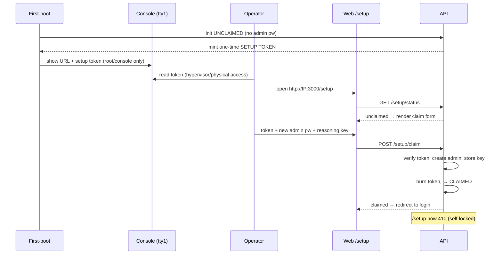

# ADR-104: Unified provisioning architecture: install-path convergence and first-run claim protocol

## Context

The platform now has **two** ways to stand itself up, and the appliance work
(ADR-103) is adding a **third**. They exist for genuinely different reasons, but
they have drifted into duplicating the parts that should be identical.

### The three install paths

| Path | Files | Images | Interactivity | Purpose |
|------|-------|--------|---------------|---------|
| `operator.sh init` | repo present | **build locally** (default) or pull GHCR | guided wizard / `--headless` | development, source-present hosts |
| `install.sh` | **curl** from GitHub | **pull GHCR** | wizard / flags | bare-metal production one-liner |
| appliance first-boot | **pre-baked** repo + Docker | pull GHCR on first boot | declarative (cloud-init) / none | VM / fleet (ADR-103) |

The irreducible differences are real and worth keeping: **how files arrive**
(repo / curl / baked), **where images come from** (build / pull), and **how much
the operator types** (wizard / flags / declarative). Those map cleanly onto the
three purposes — dev, bare-metal, appliance — and collapsing them would lose
something.

### What is *not* irreducible — the drift

Everything *between* "files are present" and "platform is configured" is the same
job, yet it is implemented more than once:

- **Infra secret generation.** `install.sh` has its own `generate_secrets()`
  (openssl-based, ~line 1811). `operator.sh init` uses
  `operator/lib/init-secrets.sh` (python stdlib). Two implementations of one
  concern — and they drift: the #502 weak-`POSTGRES_PASSWORD` fix landed in
  `init-secrets.sh` only, because that is the path the appliance exercised.
- **Orchestration.** `install.sh main()` and `operator/lib/headless-init.sh`
  are parallel orchestrators running the same ordered steps (files → secrets →
  start → configure).
- **Identity bootstrap.** Both paths generate/prompt an admin password and call
  the *same sink* — `docker exec kg-operator … configure.py admin`
  (`install.sh:2552`, `headless-init.sh:481`) — plus parallel AI-provider config.

So the paths already converge on the operator container as the configuration
sink (ADR-061); the duplication is the provisioning *around* it. `install.sh` is
~2800 lines partly because it re-implements provisioning the operator already
owns. Adding a third path naively triples this.

### The first-run problem the appliance forced

An appliance boots and someone must become admin and supply a reasoning key.
Today every path **pre-creates** an admin in `kg_auth.users` with a generated
password (`configure.py admin`); the appliance then has to surface that password
off the console. There is no "unclaimed" state.

The clean UX is the WordPress / pfSense first-run flow — *set your own admin on
first visit, then self-lock*. But WordPress's `install.php` has a notorious
flaw: it creates the admin for **whoever reaches it first, with no prior
secret**, so the deploy→setup gap is an account-takeover window on any
internet-reachable host. pfSense avoids this by sourcing the setup secret from
the **console**, off the network. The appliance needs that property, and so does
any bare-metal install.

This ADR treats the third path as the occasion to *reduce* footprint, not add
to it: factor the shared provisioning contract, and move identity bootstrap out
of the scripts and into the platform behind a secure first-run claim flow.

## Decision

Adopt a **single provisioning contract** shared by all three paths, and move
**identity bootstrap into the platform** via a **console-token-gated first-run
claim protocol**.

### Part A — One provisioning contract, three thin entry points

Define the shared contract every path implements, in order:

1. **Ensure infra secrets** — one generator (`init-secrets.sh`), never a second.
   `install.sh` fetches and sources it instead of re-implementing
   `generate_secrets()`. Infra secrets are machine-scoped (DB password, Fernet
   key, RPC/service tokens) — not identity.
2. **Bring up the stack** — `docker compose` with the path's chosen image
   source. Fail-closed on placeholder/weak secrets (#502, already in
   `start-infra.sh`).
3. **Surface the claim token** — print/display the first-run URL + setup token
   (see Part B). Do **not** create an admin or configure providers here.

Each path supplies only its irreducible differences:

```
                 ┌───────────────── shared provisioning contract ─────────────────┐
 files arrive →  │  ensure infra secrets → bring up stack → surface claim token    │  → first-run claim (platform)
                 └────────────────────────────────────────────────────────────────┘
   repo present  │  build images locally        operator.sh init   (dev)
   curl from GH  │  pull GHCR                    install.sh         (bare-metal)
   pre-baked     │  pull GHCR on first boot      kg-firstboot       (appliance)
```

Identity bootstrap (admin account, provider keys) is **removed** from
`install.sh`, `headless-init.sh`, and `kg-firstboot.sh` and handled once by the
platform.

### Part B — First-run claim protocol (console-token-gated, self-locking)

The platform gains an explicit bootstrap state machine:

```
  UNCLAIMED ──(valid setup token + new admin password)──▶ CLAIMED
     │                                                        │
     │  GET  /setup/status     → { claimed: false }           │  /setup/* → 410 Gone
     │  POST /setup/claim      → create admin, store provider │  (self-locked)
     │                            key, burn token, → CLAIMED  │
```

- **Init leaves the platform UNCLAIMED** — no admin password is pre-created.
  Instead a single-use **setup token** is minted and written where only the
  operator can see it: the appliance **console** (root/tty1, hypervisor- or
  physically-gated), `install.sh` stdout, and a root-only file for SSH.
- **`POST /setup/claim`** requires the token; it creates the admin with the
  operator's chosen password, optionally stores a reasoning provider key, then
  **burns the token and transitions to CLAIMED**. `/setup/*` returns `410 Gone`
  thereafter.
- **Threat model.** The token originates off the network, so an
  internet-reachable host has no takeover window: an attacker without console /
  installer-output access cannot claim it (closes the WordPress `install.php`
  gap; matches pfSense's console-sourced secret). Defense in depth: single-use
  (mandatory), optional TTL, optional bind `/setup` to localhost/LAN, rate-limit.
- **Declarative escape hatch.** cloud-init `provision.env` (ADR-103) supplying
  admin + key boots the platform **pre-CLAIMED**, skipping the interactive flow —
  the zero-touch fleet path.

### Sequence (interactive appliance path)



This sits in `infra` because it is foremost a provisioning-architecture
decision, but the claim protocol is a security control the auth baseline
(ADR-400) and enforcement baseline (ADR-401) must track; see cross-refs.

### Part C — Secret lifecycle: rotation is anticipated, not designed here

This ADR provisions secrets and bootstraps identity (their *birth*). It
deliberately does **not** design *rotation*. But rotation will reuse exactly the
model established here — the operator container as the single secret authority,
reached through the same surfaces (console / web / CLI / declarative cloud-init)
— so the seam is recorded rather than left implicit.

Rotation difficulty differs sharply by layer:

| Layer | Secrets | Rotatable today? |
|-------|---------|------------------|
| Identity | admin password, OAuth clients | yes — claim flow / admin API |
| Application | provider API keys (OpenAI/Anthropic/…) | **yes** — runtime, encrypted at rest (ADR-031) |
| Infra / master | `ENCRYPTION_KEY`, `OAUTH_SIGNING_KEY`, `POSTGRES_PASSWORD`, `GARAGE_RPC_SECRET`, `INTERNAL_KEY_SERVICE_SECRET` | **no safe path** |

Application-key rotation is already solved (ADR-031, runtime via API). The gap is
the **infra/master** layer, where each secret rotates differently and none has a
safe orchestration today:

- **`ENCRYPTION_KEY`** (Fernet master, ADR-031): regenerating it orphans every
  stored API key. Safe rotation needs MultiFernet re-encryption
  (decrypt-old / encrypt-new) — a *data migration*, not a config change.
  ⚠️ `init-secrets.sh --reset-key ENCRYPTION_KEY` regenerates **without**
  re-encrypting, and the script itself warns it "will break existing encrypted
  API keys." That footgun is the sharpest argument that infra-secret rotation
  needs real design, not the existing reset primitive.
- **`OAUTH_SIGNING_KEY`** (ADR-054): rotation invalidates all live tokens unless
  a `kid`/keyset overlap is introduced (no such mechanism today).
- **`POSTGRES_PASSWORD`**: `ALTER USER` + coordinated reconnect of dependents.
- **`GARAGE_RPC_SECRET`**: coordinated garage restart — and multi-node
  coordination in a federated future (ADR-088).
- **`INTERNAL_KEY_SERVICE_SECRET`**: coordinated service-token refresh + restart.

**Decision:** rotation is deferred to a dedicated `auth`-domain ADR. ADR-104
commits only to the *shape* rotation must fit — single authority (operator
container), shared surfaces, and the explicit recognition that
`init-secrets.sh --reset-key` is a **regeneration** primitive, **not** a rotation
mechanism, for the master keys. The provisioning contract (Part A) and claim
state machine (Part B) are designed so a future rotation surface slots in as
another operation on the same authority, not a new subsystem.

## Consequences

### Positive

- **Net code reduction.** Identity bootstrap (admin password generation/prompt,
  `configure.py admin` calls, AI-provider config) is deleted from all three
  scripts and centralized in one API endpoint. `install.sh`'s `generate_secrets`
  is deleted in favor of the single `init-secrets.sh`. The third path *shrinks*
  the codebase instead of growing it.
- **One place to fix.** A provisioning or secret bug is fixed once and all three
  paths inherit it — the #502 single-path drift cannot recur.
- **Closes the takeover window.** No internet-reachable host can be claimed
  without the console/installer-sourced token; the platform self-locks after
  first claim.
- **Convergence holds end to end** (ADR-103 principle): dev, bare-metal, and
  appliance differ only in file acquisition + image source + interactivity;
  everything else is shared, including the new claim flow.
- **Better UX.** The operator sets their *own* admin password on first visit
  rather than copying a generated one off the console.

### Negative

- **Platform must support an UNCLAIMED state** — new API surface
  (`/setup/status`, `/setup/claim`), web `/setup` page, and a token store with
  single-use + lockout semantics. Security-sensitive code that needs review.
- **Migration.** Existing deployments are already CLAIMED; the state machine
  must treat "an admin exists" as CLAIMED so upgrades are a no-op. A path to
  re-open setup (e.g. `configure.py reset-claim`) is needed for recovery.
- **Spans five surfaces** (API, web, init-secrets/headless-init, install.sh,
  kg-firstboot). Sequencing matters — see migration note below.

### Neutral

- The operator container remains the privileged config sink (ADR-061); the
  claim endpoint executes against it. The three-plane control model (host /
  operator / app from the appliance work) is unchanged.
- cloud-init `provision.env` becomes the declarative pre-claim channel — already
  the seam a fleet orchestrator (ADR-103 Stage 3 / ADR-088) would drive.
- `install.sh` still owns concerns the others don't (SSL/Let's Encrypt, macvlan,
  host shim); convergence targets provisioning, not those.

## Alternatives Considered

- **Keep three independent paths.** Rejected: the duplication already bit us
  (#502 drift), and a third copy compounds it. The differences that justify
  separate paths are narrow; the overlap is broad.
- **WordPress first-visit-wins (no token).** Rejected: account-takeover window
  on any internet-reachable host — the exact failure mode to avoid.
- **Pre-generate admin password, show on console (current-ish).** Workable but
  inferior: a long-lived generated credential the operator must copy, "claimed
  by default" rather than claimed deliberately, and still requires per-path
  surfacing code. The claim flow removes that code and improves the UX.
- **Time-limited setup window only (no token).** A fast attacker within the
  window still wins; the token makes the window irrelevant. Kept as an optional
  defense-in-depth knob, not the primary control.
- **Two separate ADRs (infra convergence + auth claim).** Rejected for now: the
  claim protocol is what *enables* the consolidation (by removing identity
  bootstrap from scripts); splitting them hides that dependency. If the claim
  protocol's threat model grows, it can spin out into an `auth` ADR that this one
  references.

## Migration Note (non-binding sketch)

Incremental, each step shippable:

1. Single generator: `install.sh` sources `init-secrets.sh`; delete
   `generate_secrets()`. (Pure consolidation, no behavior change.)
2. Add UNCLAIMED state + `/setup` endpoints; "admin exists" ⇒ CLAIMED (existing
   installs unaffected).
3. Flip init paths to leave UNCLAIMED + mint token; surface it (console,
   installer stdout, root file).
4. Remove admin/provider bootstrap from `install.sh` / `headless-init.sh` /
   `kg-firstboot.sh`.
5. Web `/setup` page; wire cloud-init `provision.env` as the pre-claim path.
