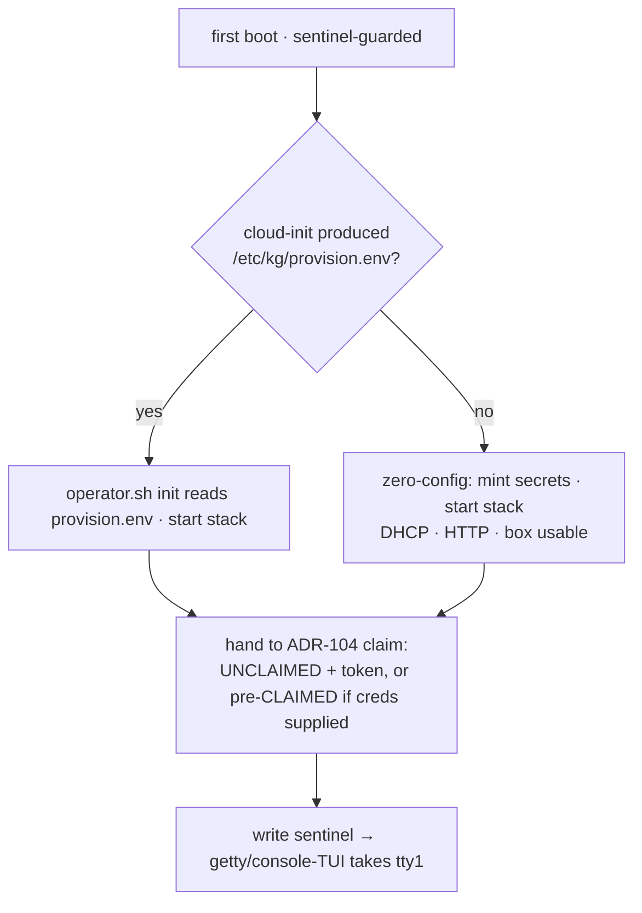

# ADR-119: appliance configuration delivery and first-boot orchestration

## Context

ADR-103 ships the platform as a thin appliance (OVA/qcow2). ADR-104 defines what
happens *once configuration is present* — the shared provisioning contract and the
console-token-gated first-run claim. This ADR fills the gap **before** that: how
configuration arrives, and how first boot behaves when it is — or isn't — there.

Dogfooding the OVA path surfaced the problem. ADR-104 line 32 recorded the
appliance's interactivity as *"declarative (cloud-init) / none"* — either you
hand-craft a cloud-init seed, or you get defaults. That splits the audience badly:

- **The seed, as we documented it, is a cloud/IaC idiom mis-applied to the
  desktop.** Our own runbook told a VirtualBox/qemu user to hand-build a `cidata`
  ISO with `xorriso` and attach it as a virtio disk — friction a "download the OVA
  and import it" user will not push through.
- **"none" is a dead-end, not a first-run.** Without a seed the box comes up on a
  DHCP IP with HTTP and no guided way to set the hostname, TLS, or a reasoning key
  — the operator has to discover the rest.

**Design value driving this ADR: minimize novelty.** Appliance provisioning is a
well-trodden, well-engineered space; our platform is not special, and the closer
its shape is to other appliance VMs the more *familiar* — and the less we have to
invent, document, and debug. So the decision below deliberately reaches for
established idioms (autoinstall/preseed, OVF properties, the pfSense/TrueNAS
console wizard) and rejects clever-but-novel machinery, even where the novel
version looked elegant.

## Decision

Adopt the conventional appliance shape: **a config artifact's *presence* decides
the path** (the autoinstall/kickstart convention), and **all richer configuration
happens after boot** through the console (DCUI) and operator — the always-reachable
out-of-band surface every appliance already uses.

### A — `provision.env` is the rendezvous; the carrier is a standard NoCloud seed

`/etc/kg/provision.env` (ADR-103's declarative control surface) stays the single
meeting point; one consumer — `operator.sh init` (ADR-104's contract) — reads it.
Configuration is delivered by **the standard cloud-init datasources**, no bespoke
reader:

| Producer | Context | Mechanism |
|----------|---------|-----------|
| **cloud-init NoCloud** | desktop / offline / orchestrator-attached volume | a vfat volume labeled `cidata`; cloud-init's `write_files` drops `provision.env` (today's mechanism) |
| **cloud-init network datasources** | EC2 / OpenStack / Proxmox cloud-drive | platform metadata, same `write_files` |
| **interactive console + operator** | human, **post-boot** | DCUI / `operator.sh set-*` write `provision.env` and apply |

The external carrier is a **vfat** volume, FS-label **`cidata`**, holding the
standard `user-data` + `meta-data` (cloud-init NoCloud recognizes `vfat` or
`iso9660` by that label — not ext4). vfat because it is **writable** (the box can
export/refresh the config on it) and **builds without root or ISO tooling**
(`mcopy`), which drops cleanly into Terraform/Packer. This is precisely the carrier
**Ubuntu autoinstall** uses — maximally familiar, zero custom discovery code.

Forward-compat needs only a `KG_PROVISION_SCHEMA=N` key inside `provision.env`
(unknown keys are already ignored) — **no separate volume signature file**. The
carrier holds **declarative inputs only** (hostname, TLS mode, DNS-01 creds,
optionally admin password / reasoning key); the per-instance infra secrets
(`ENCRYPTION_KEY`, `POSTGRES_PASSWORD`, signing keys) are **always minted fresh**
per install (ADR-104 Part A) and never ride the carrier. Reload = same inputs, new
secrets. The carrier is sensitive when it holds creds and is documented "treat like
a private key"; the builder (§D) offers an omit-secrets variant.

Because we build the OVA, the OVF **will pre-declare an empty virtio slot** at a
predictable address (`/dev/vdb`) so the user points an existing slot at their
`.img` rather than adding a controller. *(Follow-on, not yet shipped: the current
`ovf/kg-appliance.ovf.template` declares only the primary disk; until the empty
slot lands, the carrier is attached as an added virtio disk — the same friction
this is meant to remove. Tracked with the first-boot orchestration work below.)*

The bus the carrier hangs off is governed by the **kernel flavor**, which is now a
shipped distribution variant (see "Kernel variants" below). The default **cloud**
kernel has no AHCI, so its carrier is a virtio disk ("attach this `.img` as a
disk"). The **generic** variant brings AHCI/SATA, unlocking the one-click
"attach the config ISO to a CD drive" UX for the hypervisors that expect it.

### B — First boot is presence-driven, not interactive

`kg-firstboot` does **not** pause, prompt, or run a countdown. It branches on
whether configuration is present — the kickstart/autoinstall convention:



This keeps first boot a headless oneshot (no tty ownership, no race with the
console getty), exactly as today — the *only* change is that the no-config branch
now lands the operator in a **real first-run experience**, not a dead-end (§C).
cloud-init keeps its standard `datasource_list` (NoCloud **and** the network
sources); attached labeled volumes are NoCloud-format — the same format
Proxmox/OpenStack config-drives use — so one path covers hand-rolled vfat *and*
platform config-drives.

### C — All richer configuration is post-boot, via the DCUI + operator

The no-config box boots usable, then the operator configures it through the
**always-reachable console (DCUI)** and the operator container — the
pfSense/TrueNAS shape, and the surface ADR-104's claim flow already uses:

- **Web first-run / claim** (ADR-104): set admin password, paste a reasoning key.
- **Console DCUI + `operator.sh set-*`** (warm-reconfig, follow-on work): public
  hostname, TLS mode, DNS-01 credentials, Cockpit access — the knobs that today
  force a pre-boot seed. These are *idempotent* `operator.sh` commands (the
  `cockpit-access` verb is the template) and each encapsulates the full ripple of
  changing the external URL (Traefik router, the registered OAuth `redirect_uri`,
  web runtime config, Cockpit `Origins`, the ACME cert) so a hostname change can't
  silently half-apply.

Cold (carrier) and warm (DCUI/operator) paths share the **same `provision.env`
schema and the same apply logic**, so they cannot drift. The carrier is
**cold-provisioning/reload only**; editing it does not re-apply to a running box —
that is the warm path's job.

### D — One builder, three contexts (the operator container)

Generating a standard NoCloud seed from inputs is pure (inputs → vfat image; no DB,
no running platform), so it is a verb on the **operator container** — the config
authority that already lives baked in the appliance *and* pullable from GHCR:

```
docker run kg-operator config-volume --hostname kg.x --tls letsencrypt \
    --dns-provider porkbun ... > config.img   # standard cidata/NoCloud vfat
```

The same code runs in someone's Terraform, in the console's interactive flow, and
in the console's *export* flow ("pack and download the config out for re-use"). It
emits a stock NoCloud seed any cloud-init consumes — it is "a tool to generate
cloud-init user-data easily," not a custom format.

### E — Kernel variants: cloud (default) and generic (homelab)

The Debian *cloud* kernel ships no DRM/framebuffer or AHCI drivers — fine for a
headless cloud instance, but it locks the console to 80×25 VGA. That matters
because of *who looks at the console*: the homelab/desktop user runs the appliance
in a VirtualBox/VMware/Hyper-V window and reads the console **there** — it never
occurs to them to switch to tty1 or SSH. For them the cramped 80×25 *is* the
product. So the image ships as **two variants**, selected at build time
(`build-appliance.sh --kernel`):

| Variant | Kernel | Console | For |
|---------|--------|---------|-----|
| **cloud** (default) | `linux-image-cloud-amd64` | 80×25 VGA (nobody looks) | headless / real-cloud; least overhead. The "expected shape." |
| **generic** (`-generic` suffix) | `linux-image-amd64` + `GRUB_GFXMODE`/`gfxpayload=keep` | real hi-res framebuffer (legible in a hypervisor window) | homelab/desktop: the person who needs a hand and reads the console window. Also gains AHCI/SATA → the CD-drive carrier UX (§A). |

cloud stays the default because the appliance's headless/edge path is the common
one and cloud users have other access; generic is the opt-in for the
console-window user. `publish.sh appliance` ships **both** OVAs/qcow2s on the
release, and the install docs point VirtualBox/VMware users (the console-window
crowd) at the **generic** artifact.

## Consequences

### Positive

- **One artifact, both audiences, the familiar way.** A single OVA boots zero-touch
  when a NoCloud seed is attached and into a first-run wizard when it isn't —
  presence-driven, exactly like autoinstall/kickstart and vendor OVF appliances.
- **Almost nothing new is built.** cloud-init NoCloud is the reader; first boot
  stays the current headless oneshot; the DCUI already exists. The net additions
  are small: make "no config" a real first-run, add post-boot `set-*` knobs, and a
  seed-builder verb.
- **Removes the seed-ISO friction** for the download-and-import user (carrier is
  `mcopy`-buildable; the console path needs no carrier at all).
- **Cattle/pet separation.** The OVA is stateless and secret-free; the config seed
  is the portable, owner-held identity → deterministic wipe-and-reload and a clean
  Terraform/Packer seam.

### Negative

- **Richer first-time config moves to a second step** (post-boot DCUI/operator)
  rather than being injectable pre-boot for the desktop user — but that *is* the
  appliance convention, and the seed still serves the zero-touch case.
- **The config seed is a secrets-bearing artifact** when it carries DNS/provider
  creds; it cannot be encrypted-at-rest for cold boot (no key exists yet —
  chicken/egg), so it relies on operator handling + the omit-secrets variant.
- **The warm `set-*` commands must encapsulate the external-URL ripple** correctly
  (Traefik + OAuth redirect + web config + Cockpit + cert) or a hostname change
  half-applies — security-relevant, needs care.

### Neutral

- cloud-init is used as-is (standard datasources), neither demoted nor extended.
- The bus/kernel trade is resolved by shipping **two kernel variants** (§E): cloud
  (default, virtio-only) and generic (AHCI + hi-res console). Neither changes this
  config-delivery model; they differ only in drivers and console.
- The builder lands as an operator verb (ADR-211 sink), not a new tool.
- **Convergence contract (ADR-103).** The OVA is a thin *bootstrap seed*:
  downloaded once, run, then kept current by `operator.sh upgrade` pulling fresh
  GHCR images. The per-release artifacts are the *container images*, not the OVA —
  so the OVA is republished only occasionally to move the baseline (`publish.sh
  appliance`, decoupled from `release`). This ADR governs the *bootstrap*; ADR-103
  governs ongoing *currency*; the seam is the first boot that pulls images.

## Alternatives Considered

- **A countdown that flips between automated and interactive at boot.** Considered
  and rejected as **novel** — real appliances decide by config *presence*
  (kickstart `inst.ks=`, OVF property presence), not a timer. The clever version
  also dragged in a bespoke volume reader, a signature file, and first-boot tty1
  ownership; presence-driven removes all of it. Familiarity and a smaller surface
  beat the elegance.
- **A bespoke appliance-native config-volume reader + `/.kg-appliance` signature.**
  Rejected: cloud-init's NoCloud datasource already reads a labeled vfat volume —
  reimplementing it is novelty for its own sake. A `KG_PROVISION_SCHEMA` key covers
  forward-compat.
- **Keep ADR-104's "declarative (cloud-init) / none".** Rejected: "none" as a
  half-configured dead-end is the gap; a proper first-run (DCUI/web) closes it
  without inventing anything.
- **Two OVA flavors (cloud vs interactive).** Rejected: doubles the release surface
  for a difference that is purely whether a seed is attached.
- **iso9660 / ext4 carrier.** ext4 is not in cloud-init's NoCloud probe set;
  iso9660 is recognized but read-only (no export/refresh) and needs ISO tooling.
  vfat is the writable, tool-light intersection — and what Ubuntu autoinstall uses.

### Prior art

The result is an assembly of established, shipping idioms, not an invention — which
is the point:

- **Autoinstall / preseed / kickstart.** One image runs interactive by default and
  unattended when a config artifact is present — Ubuntu *autoinstall* uses the very
  same NoCloud `cidata` carrier; RHEL/Fedora *kickstart* (`inst.ks=`), Debian
  *preseed*, SUSE *AutoYaST* share the shape.
- **OVF vApp properties / ISO transport.** Vendor virtual appliances (F5, Palo
  Alto, Cisco, NetScaler) ship a single OVA that reads hypervisor-injected
  properties for zero-touch deploy, else drops to a console wizard — a polymorphic
  OVA, shipping for 15+ years.
- **First-run appliances.** pfSense/OPNsense/TrueNAS/Home Assistant OS boot to a
  usable default and configure via console (DCUI) / web afterward — the no-config
  branch and the post-boot warm path.
