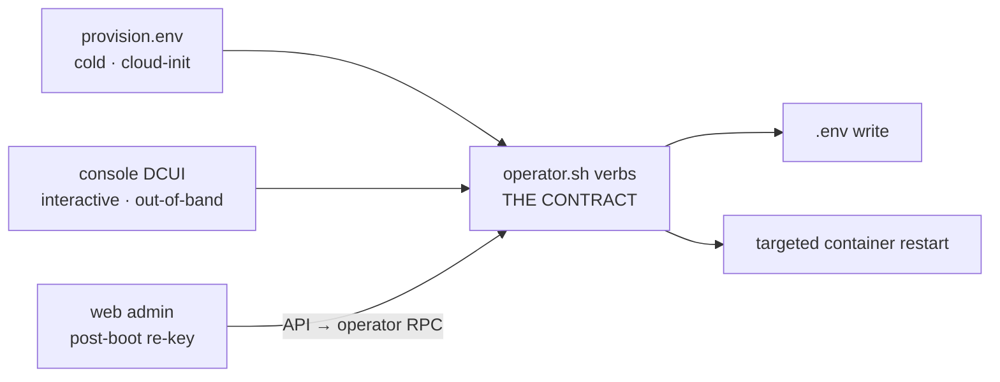

# ADR-120: Post-boot configuration surfaces and the config-plane ownership split

## Context

ADR-119 §C committed the appliance to configuring itself **after** boot, through
the console (DCUI) and the operator container, and named the work as follow-on:

> **Console DCUI + `operator.sh set-*`** (warm-reconfig, follow-on work): public
> hostname, TLS mode, DNS-01 credentials, Cockpit access — the knobs that today
> force a pre-boot seed.

That follow-on was never built. The intended experience — *download the OVA, turn
it on, follow prompts on the VM console, then work in the web console* — breaks at
"follow prompts," because there are none. `kg-console.sh` offers ten options, of
which exactly one (`c`, Cockpit CIDRs) changes configuration; the rest are status,
logs, lifecycle, and two shell escape hatches. Menu 4 (network info) prints the
interface table and tells the operator to *"Change network settings via Cockpit"*.

Meanwhile the surface that *can* configure everything is the one demanding the most
expertise: hand-author `provision.env`, wrap it in a `cidata`-labeled volume, and
attach it on the right bus — where getting the bus wrong fails **silently** (the
cloud kernel has no AHCI driver, so a SATA seed is invisible, `ds-identify` finds
no datasource, and the box comes up on defaults with the config ignored).

### The gap is a clean split, not a scattering

Surveying every configuration knob against every surface produces two tiers that
behave differently, and the tier predicts the coverage exactly.

**Tier 1 — host / `.env`, read at container start, authority is `kg-operator`**

| Knob | Web | Console | `operator.sh` | `provision.env` |
|---|---|---|---|---|
| `EXTERNAL_URL`, `TLS_DOMAIN` | ❌ | ❌ | partial (`recert`) | ✅ |
| `LE_EMAIL`, `KG_ACME_DNS_PROVIDER`, `PORKBUN_*` | ❌ | ❌ | partial | ✅ |
| `VITE_OAUTH_CLIENT_ID` / `_REDIRECT_URI` / `VITE_API_URL` | ❌ | ❌ | ❌ | derived |
| `KG_HTTP_PORT` / `KG_HTTPS_PORT` | ❌ | ❌ | ❌ | ❌ |
| `KG_COCKPIT_ALLOW_CIDRS` | ❌ | ✅ | ✅ | ✅ |
| Static IP / netmask / gateway / DNS / VLAN | ❌ | ❌ | ❌ | ❌ (DHCP only) |

**Tier 2 — database, live-read, authority is the API**

| Knob | Web | `configure.py` |
|---|---|---|
| AI providers + encrypted keys | ✅ save / test / enumerate / activate | ✅ `ai-provider`, `api-key`, `models` |
| Embedding profiles | ✅ | ✅ `embedding` |
| Search similarity threshold | ✅ (ADR-508) | — |
| Admin users / roles | ✅ | ✅ `admin` |
| Backup / restore / scheduler | ✅ | — |
| OAuth clients | ❌ | ✅ `oauth` |
| `platform_config` flags (ADR-211) | ❌ | ✅ `platform-config` |

The web UI is missing **all of Tier 1** and two Tier-2 stragglers. Tier 2 is
otherwise well covered, and the web version is materially better than the CLI — the
AI Providers card saves, tests connectivity, enumerates models, and gates
activation.

### Why Tier 1 is absent is structural, not neglect

The API container owns no `.env` and holds no Docker socket. That is the
three-layer control plane working as designed (ADR-103): host (Cockpit / console),
platform (`kg-operator`, Docker socket + config authority), application (web +
API). A TLS panel therefore *cannot* be implemented inside the web UI — it can only
be proxied. Any design that closes the Tier-1 gap must either respect that boundary
or knowingly collapse it.

### Two further pressures

**Network is the one knob that cannot be repaired from the surface it enables.**
Today the console defers network changes to Cockpit — which listens on `:9090` of
the very network being fixed. An appliance whose management surface can strand
itself has no recovery path short of a hypervisor console shell. Every mature
appliance solves this the same way and for the same reason: ESXi's DCUI, pfSense's
console, TrueNAS, Home Assistant OS, and UniFi all put network configuration on the
out-of-band console and nowhere else.

**Roughly a year of accumulation has produced three implementations of "make a
working platform"** — `install.sh` (2823 lines, carrying its own duplicate
`generate_secrets()`, the drift behind #502), `operator/lib/{headless,guided}-init.sh`
plus `init-secrets.sh` (1805 lines), and the appliance's `kg-firstboot.sh` (which at
least delegates). ADR-104 Part A already sentenced the duplicate generator; issue
#512 tracks it, unstarted. Adding surfaces without removing duplicates would make
the consistency problem worse, not better.

**One enabling primitive already exists.** `web/docker-entrypoint.sh` writes
`window.APP_CONFIG` (`apiUrl`, `oauth.clientId`, `oauth.redirectUri`) into
`config.js` at **container start**, and client code reads `window.APP_CONFIG?.…`
ahead of the build-time `import.meta.env.VITE_*` fallback. A hostname re-key is
therefore an `.env` rewrite plus a `kg-web` restart — no image rebuild. That
primitive landed with the PR #526 appliance OAuth fix and makes post-boot
reconfiguration feasible at all.

**Design value, inherited from ADR-119: minimize novelty.** The shape below is
ESXi/pfSense/TrueNAS, not an invention.

## Decision

### A — Tier ownership is the rule for which surface owns a knob

A configuration knob belongs to **Tier 1** if applying it requires writing `.env`
or restarting containers, and to **Tier 2** if it is a database row the API reads
live. Tier determines authority:

| | Tier 1 | Tier 2 |
|---|---|---|
| Authority | `kg-operator` | API |
| Applied by | `.env` write + targeted container restart | database write, read live |
| Reachable from web | only by proxy (§D) | directly |
| Reachable from console | yes, natively | via the operator shell (escape hatch) |

New knobs are classified on introduction. This is the test that decides where a
surface goes, replacing case-by-case judgment.

### B — `operator.sh` verbs are the single contract; three surfaces render it

Per ADR-119 §C, the warm-reconfig verbs are idempotent `operator.sh` commands, with
the existing `cockpit-access` verb as the template. There is exactly one
implementation; three surfaces call it.

Each verb encapsulates the **full ripple** of its change, so a hostname change
cannot silently half-apply. For external URL that ripple is: `EXTERNAL_URL` /
`TLS_DOMAIN` in `.env`, the Traefik router, the registered OAuth `redirect_uri`,
the web runtime config (`config.js` via the entrypoint) plus a `kg-web` restart,
Cockpit `Origins`, and the ACME certificate.

Every verb must be callable non-interactively. Programmatic configuration is a
first-class requirement, not a byproduct — the same verbs serve Terraform, a fleet
orchestrator, and a human at a console.

Cold and warm paths share the schema and the apply logic, so they cannot drift.
The carrier remains cold-provisioning/reload only (ADR-119 §A); editing it does not
re-apply to a running box.

### C — The console is a persistent DCUI, not a first-boot wizard

The console adopts the **ESXi DCUI shape**: a persistent banner showing current
address, hostname, and TLS state, plus an authenticated **Configure System** path
that is always available — not a one-shot wizard that runs once and disappears.
The re-key case (box comes up on DHCP, later earns a DNS name) is as common as
first boot and must not require a reinstall or a shell.

First boot remains presence-driven and non-interactive (ADR-119 §B): the DCUI does
not pause or prompt during provisioning, it simply *is there* afterward.

**Console scope is reachability and trust only** — the closed set that must be true
before the web console is reachable and trustworthy:

| In scope | Out of scope (web UI owns it) |
|---|---|
| Network: DHCP/static, IP, netmask, gateway, DNS, VLAN | Reasoning provider + API keys |
| Hostname / external URL | Embedding profiles, search thresholds |
| TLS mode, ACME challenge, DNS-01 credentials | Users, roles, ontologies, vocabulary |
| Cockpit access CIDRs | Backups, jobs, workers |
| Display of admin credentials + first-run URL | |

The line is not a matter of taste. It falls exactly where "can I reach and trust the
web console" falls. Duplicating the AI provider card into a TUI would be strictly
worse than the panel that already tests connectivity and enumerates models, and
would mean typing a secret at a VM console.

**Network configuration is console-authoritative.** The web UI and Cockpit may
*display* network state; neither may be the only way to change it, because both
depend on the network being changed.

### D — The web reaches Tier 1 by proxying to the operator

`kg-operator` exposes a small authenticated endpoint on a local Unix socket. The
API validates Tier-1 requests and forwards them; the operator applies them via the
§B verbs. **The API never writes `.env` and never touches the Docker socket** — the
ADR-103 privilege boundary stays intact, and the internet-facing container gains no
host authority.

The shared secret is minted per instance by `init-secrets.sh`, never baked. Routes
are admin-RBAC gated and live in a new module rather than growing `admin.py`
(already 1215 lines).

The web panel must handle the self-restart wrinkle: changing the hostname rewrites
the OAuth and API URLs that the entrypoint bakes into `config.js`, so `kg-web`
restarts underneath the operator. The UI warns, then reconnects at the new URL.

### E — Build the contract first; delete the duplicates once it proves out

Sequencing is deliberate. The new contract lands and is validated end-to-end on a
real VM (bare boot → DCUI configure → web re-key → `operator.sh upgrade`) **before**
anything is removed, so a working fallback exists while the new path is unproven.

Removal is then in scope and expected:

| Target | Why |
|---|---|
| `install.sh`'s duplicate `generate_secrets()` | ADR-104 Part A / #512; the #502 drift |
| `configure.py` `admin`, `ai-provider`, `embedding`, `api-key`, `models` | fully superseded by the web UI |
| `configure.py` `oauth`, `platform-config` | after their web surfaces land |
| Console menu 4's "use Cockpit for network" deferral | replaced by §C |

The operator shell, host login, and `status` remain as escape hatches.

## Consequences

### Positive

- **The intended experience becomes literally true.** Import, power on, configure
  reachability at the console, finish in the web UI.
- **One implementation of each knob.** A new Tier-1 setting is added once and
  appears in all three surfaces; cold and warm paths cannot diverge.
- **The re-key case stops requiring a shell.** DHCP-IP → real DNS name is a
  supported operation from two surfaces.
- **The privilege boundary is reinforced rather than eroded** — closing the Tier-1
  gap explicitly does *not* hand the API host authority.
- **Programmatic configuration is preserved and improved** — the verbs are the API
  that `provision.env`, Terraform, and a fleet orchestrator all target.
- **Nothing here is novel.** ESXi/pfSense/TrueNAS shape throughout, per ADR-119's
  stated value.

### Negative

- **A new internal service seam** (operator RPC) to build, authenticate, and
  maintain — the cost of not collapsing the privilege boundary.
- **Network configuration in a shell TUI is fiddly** to write and to test; netplan
  rendering plus VLANs is real work with real failure modes.
- **A hostname change restarts the web container out from under the operator**,
  which is an inherently awkward UX no matter how it is presented.
- The consolidation in §E touches the provisioning path, the highest-blast-radius
  code in the repo, and must not be attempted before §E's validation gate.

### Neutral

- ADR-119 §C's follow-on is discharged by §B/§C here; ADR-119 stays the authority on
  *delivery* (carrier, first-boot branching), this ADR on *post-boot surfaces*.
- Advances #512 (Part A consolidation) without depending on ADR-104 Part B; the
  claim protocol remains separately unbuilt and orthogonal to these surfaces.
- Applies platform-wide, not only to the appliance — a dev instance or a bare-metal
  `install.sh` deployment gains the same web Tier-1 panel.

## Alternatives Considered

- **Give the API a bind-mounted `.env` and Docker socket.** Simplest to build: the
  API writes config and restarts containers directly, no new seam. Rejected because
  it hands the internet-facing container host-level config authority, collapsing the
  three-layer control plane that ADR-103 established — a large security regression
  bought for a modest implementation saving.

- **Web admin read-only for Tier 1; console remains the sole authority.** Zero new
  privilege seam and honest about the boundary. Rejected because the post-boot
  re-key case is exactly the one to be fixed; requiring console access for a routine
  DNS-name change is the current pain, restated.

- **A one-shot first-boot wizard.** Prompt through configuration once at first
  power-on, then hand off to the menu. Rejected because re-key is as common as first
  boot; ESXi, pfSense, and TrueNAS all keep the configuration path permanently
  reachable rather than consuming it.

- **Put everything in the console TUI, including the reasoning key.** Makes the box
  fully functional without ever opening the web UI. Rejected as overbuild: it
  duplicates a superior web panel, degrades secret entry to a VM console, and blurs
  the reachability/trust boundary that makes the scope decidable in §C.

- **Extend ADR-119 rather than write a new ADR.** ADR-119 is still Draft, so
  amendment was open. Rejected because the scope here is platform-wide (the web
  panel applies to any deployment) whereas ADR-119 is appliance-delivery-specific,
  and because the config-plane ownership rule in §A is a general principle that
  would be buried inside an appliance ADR.
