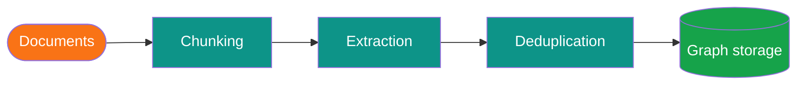
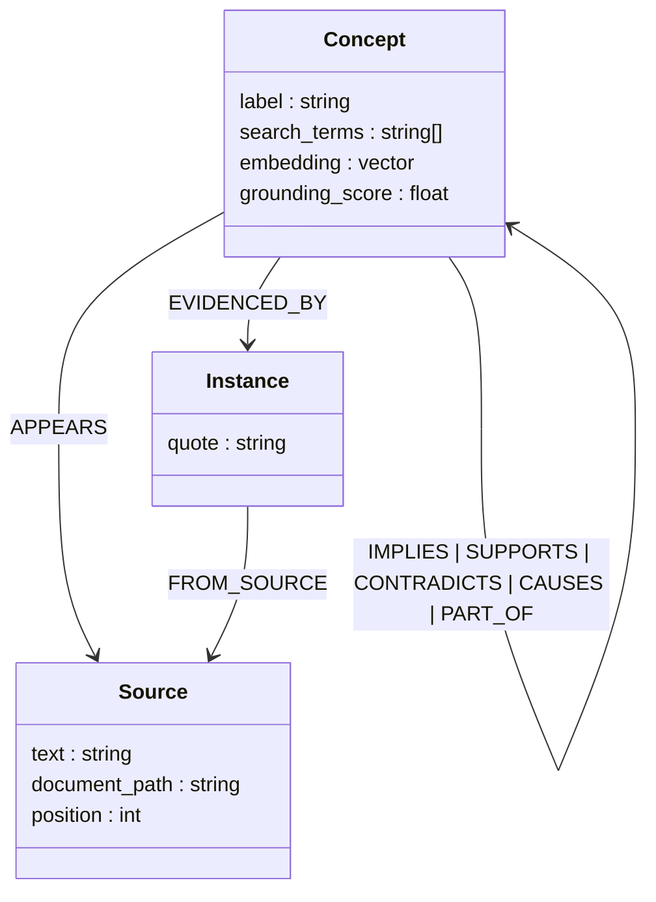

# How Kappa Graph Works

Kappa Graph extracts structured knowledge from documents, stores it as a typed concept graph, and lets humans and AI agents query that graph by meaning rather than keyword. Unlike a RAG system that retrieves raw text chunks by similarity, Kappa Graph stores knowledge as structured relationships that accumulate and persist across documents and queries.

---

## The processing pipeline

**Chunking.** Submitted documents are split into overlapping segments of roughly 1,000 words. Overlap preserves ideas that span a boundary; no concept is lost because it crossed a page break.

**Extraction.** Each chunk is sent to a configured LLM (GPT-4o, Claude Sonnet, or a local Ollama model). The LLM returns structured output: the concepts present in that chunk, the relationships between them, and verbatim evidence quotes that ground each concept in the source text.

**Deduplication.** Every extracted concept is embedded and compared against existing concepts using vector similarity. If the incoming concept is sufficiently similar to an existing one, they are merged — the grounding score updates, the evidence list grows, and the source count rises. If they conflict, both are kept and the contradiction is recorded. This is the recursive upsert: new documents do not replace old knowledge, they accumulate on top of it.

**Graph storage.** The result lives in Apache AGE 1.7.0, a graph extension for PostgreSQL 18. The data model is:

`Concept` nodes carry a label, search terms (synonyms), a vector embedding, and a grounding score. `Source` nodes carry the full paragraph text, document path, and position. `Instance` nodes carry the exact quote the LLM cited.

---

## What grounding measures

Grounding is a computed score in the range −1.0 to +1.0 that reflects how well-supported a concept is across all ingested sources.

- A concept mentioned in one document has low grounding.
- The same concept confirmed across many independent documents has high grounding.
- A concept that some sources support and others contradict has near-zero or negative grounding.

Grounding is not a claim about objective truth. It measures evidence in your corpus. A well-supported claim in a small corpus of biased documents still has high grounding — the epistemic status layer captures that distinction separately.

---

## The epistemic layer

Each concept carries three orthogonal metadata fields beyond its label:

| Field | What it records |
|---|---|
| **Grounding score** | How many sources support vs. contradict this concept |
| **Epistemic status** | Reliability classification: affirmative, contested, contradictory, insufficient data, historical |
| **Provenance chain** | Document → chunk → extraction → concept |

This combination lets an AI agent say "this claim appears in twelve sources and all agree" or "this claim has two sources that contradict each other" rather than presenting retrieved text as settled fact.

---

## Ontologies

An ontology in Kappa Graph is a named collection of concepts extracted from a related set of documents. It functions as a boundary in the graph: concepts are tagged to an ontology through their `APPEARS` relationship to a `Source` node. You specify the ontology when you submit a document for ingestion.

Ontologies can be queried in isolation or together. A relationship can cross ontology boundaries — the LLM may identify that a concept from one domain implies a concept from another. These cross-ontology relationships are tracked and can be preserved or pruned when moving backups between systems.

---

## How queries work

The system provides three query modes, and they compose:

1. **Semantic search** — find concepts by meaning using vector similarity. Searching "economic downturn" returns concepts about recessions, market crashes, and financial crises even if none of those exact words appear in the source.
2. **Graph traversal** — follow typed edges to explore relationships. "What does this concept support?" "What contradicts it?" "Show me concepts two hops away." These use openCypher queries against the AGE graph.
3. **Full-text search** — find exact quotes or terminology within source paragraphs.

Results always include the matching concepts, their grounding scores, the source paragraphs they came from, and the instance quotes that link concept to text. Every answer is traceable to a specific passage in a specific document.

---

## How contradictions are stored

When two sources disagree, both views are preserved. The system records a `CONTRADICTS` edge between the two concepts, each with its own evidence chain. Neither view is discarded. Queries that surface a contradiction return both sides and the sources behind each. This is different from a conventional database assumption that conflicting records indicate an error — here, disagreement is signal worth preserving.

---

## Key terms

**Concept** — A meaningful unit of thought extracted from a document: a claim, a definition, an event, an entity, or a principle. Not a keyword.

**Relationship** — A typed, directed edge between two concepts. Types include IMPLIES, SUPPORTS, CONTRADICTS, CAUSES, PART\_OF, INSTANCE\_OF, EXEMPLIFIES.

**Source** — A chunk of original text. The evidence anchor; what concepts are extracted from.

**Instance** — A specific occurrence of a concept in a source: the verbatim quote the LLM cited. If a concept appears in three documents, there are three instances but one concept node.

**Evidence** — The link between a concept and an instance. Multiple instances can provide evidence for the same concept; each one strengthens the grounding score.

**Provenance** — The full chain of origin: document → chunk → extraction → concept.

**Ontology** — A named grouping of related knowledge. Created implicitly when you specify an ontology name at ingest time.

**Grounding** — A score from −1.0 (strongly contradicted) to +1.0 (strongly supported) computed from all evidence for a concept.

**Epistemic status** — A reliability classification applied to a concept: affirmative, contested, contradictory, insufficient data, or historical.

**Ingestion** — The full pipeline: document submission, chunking, LLM extraction, deduplication, and graph write.

**Semantic search** — Finding concepts by vector similarity rather than keyword match.

**Chunk** — A segment of a document, roughly 1,000 words with overlap, used as the unit of LLM extraction.

**Diversity score** — A measure of how broadly connected a concept is. High diversity means the concept has edges into many different topic clusters; low diversity means it is narrowly focused. Useful for finding concepts that bridge domains.

**Stitching** — When restoring a partial backup into a database that already has related ontologies, stitching reconnects cross-ontology relationships to semantically similar concepts using vector similarity. Unmatched references are pruned to preserve graph integrity.

**Pruning** — Removing dangling relationships — references to concepts that do not exist in the current database. Happens automatically when restoring into an empty database, or when stitching finds no match above the similarity threshold.

**MCP (Model Context Protocol)** — A standard interface for AI assistants to use external tools. Kappa Graph exposes its search, traversal, and ingest operations as MCP tools so agents like Claude can query and extend the graph within a conversation.

---

## Further reading

- [Computed Evidence over Asserted Truth](computed-evidence.md) — why the system measures evidence rather than storing facts, and why it carries no "valid time"
- [Grounding and Epistemic Confidence](grounding.md) — how grounding scores are calculated and what they mean
- [Recursive Upsert](recursive-upsert.md) — how new documents accumulate on existing knowledge without overwriting it
- [Vocabulary Lifecycle](vocabulary-lifecycle.md) — how edge-type vocabularies evolve and are consolidated
