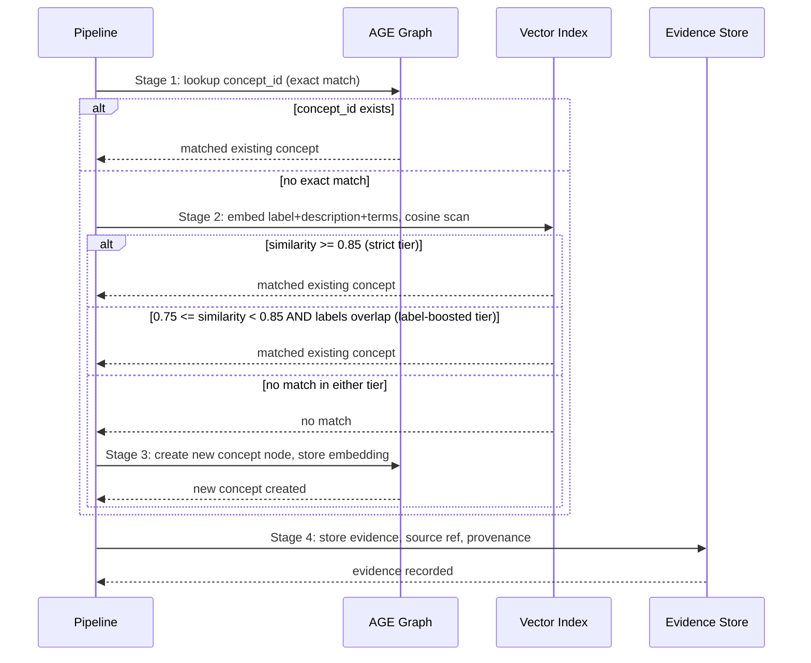

# Recursive Upsert

Recursive upsert is the mechanism by which Kappa Graph merges new knowledge into an existing graph rather than appending it as isolated fragments. It operates in two interlocked passes: concept deduplication during ingestion, and relationship-type categorization after the LLM discovers a new edge label.

---

## Why merging is the problem

Documents about the same subject use different words. "Linear scanning system," "sequential attention mechanism," and "step-by-step reasoning" may all express the same concept. If each phrase creates a distinct graph node, the graph accumulates duplicates without accumulating understanding.

Exact-string matching solves nothing here — phrases differ. Schema-fixed vocabularies help for structured data, but fail for open-ended concept extraction where the LLM surfaces terms the schema authors did not anticipate.

Recursive upsert resolves this by using vector similarity as the merge criterion and letting the graph itself grow into the matching surface. Each document's concepts are matched against the accumulating state from all previous documents, not against a fixed dictionary.

---

## Concept matching: a cascade of four stages

When the ingestion pipeline extracts a concept from a document chunk, it runs four stages in order (`api/app/lib/ingestion.py`).



### Stage 1: Exact ID match

If the LLM predicted a `concept_id` that already exists in the graph, the pipeline uses it directly. The LLM receives the top 30 existing concepts as context during extraction (configurable via `EXTRACTION_CANDIDATE_K`), so it can predict IDs it recognizes. When this match fires, no embedding computation is needed.

### Stage 2: Two-tier vector similarity search

If no exact ID match exists, the pipeline embeds the new concept (label + description + search terms) and runs a cosine similarity scan against all existing concept embeddings.

The decision uses two tiers:

| Condition | Action |
|---|---|
| similarity ≥ 0.85 | Match (strict tier) |
| 0.75 ≤ similarity < 0.85 AND labels are identical or one contains the other | Match (label-boosted tier) |
| otherwise | No match |

The label-boosted tier catches paraphrased descriptions of an identically-named concept that would fall just below the strict threshold. Without it, "Machine learning safety" and "Machine learning safety: alignment concerns" would create two nodes when one would be correct.

The current implementation uses a Python NumPy full scan over all stored embeddings. This is O(N) per concept — acceptable at the scales Kappa Graph currently runs (thousands of concepts), and replaceable with HNSW approximate-nearest-neighbor indexing when graphs grow larger (ADR-055).

### Stage 3: Create new concept

If no match is found in either tier, the pipeline creates a new concept node and stores its embedding. That node is immediately available as a match target for subsequent chunks and documents.

### Stage 4: Evidence accumulation (always)

Regardless of whether the concept was matched to an existing node or created as new, the pipeline stores the supporting evidence: the exact quote from the source, the source document reference, and provenance metadata. Merged concepts retain all evidence from all sources.

---

## How the graph learns

The "recursive" quality of the pattern is that each new document's concepts are matched against a graph that has already absorbed previous documents. This creates a compounding effect:

```
Document 1 → 10 concepts extracted → 10 created (graph empty)
Document 2 → 8 concepts extracted → 3 merged, 5 created → 15 in graph
Document 3 → 9 concepts extracted → 7 merged, 2 created → 17 in graph
```

Concepts that appear across many documents accumulate more evidence and higher grounding strength. Rare or peripheral concepts remain as distinct, lightly evidenced nodes. No threshold or schema decides in advance what is central and what is peripheral — the structure emerges from the corpus.

---

## Relationship-type categorization: the edge vocabulary

When the LLM discovers a relationship type not already in the vocabulary — say, "ENHANCES" — the system must decide what kind of relationship it is. This is handled by probabilistic vocabulary categorization (ADR-047).

### Discovery during ingestion

The pipeline calls `normalize_relationship_type()` to fuzzy-match the new type against the existing vocabulary. If no match is found, the type is accepted as new (ADR-032) and written with the temporary category `llm_generated`:

```python
age_client.add_edge_type(
    relationship_type=canonical_type,
    category="llm_generated",
    added_by="llm_extractor",
    is_builtin=False,
    auto_categorize=True   # triggers ADR-047 categorization
)
```

### Automatic categorization (ADR-047)

The `VocabularyCategorizer` (`api/app/lib/vocabulary_categorizer.py`) assigns the new type to one of 11 semantic categories by computing cosine similarity between the new type's embedding and a set of hand-validated seed types.

The 11 categories and their seeds:

| Category | Representative seeds |
|---|---|
| causation | CAUSES, ENABLES, PREVENTS, INFLUENCES, RESULTS_FROM |
| composition | PART_OF, CONTAINS, COMPOSED_OF, SUBSET_OF, COMPLEMENTS |
| logical | IMPLIES, CONTRADICTS, PRESUPPOSES, EQUIVALENT_TO |
| evidential | SUPPORTS, REFUTES, EXEMPLIFIES, MEASURED_BY |
| semantic | SIMILAR_TO, ANALOGOUS_TO, CONTRASTS_WITH, OPPOSITE_OF |
| temporal | PRECEDES, CONCURRENT_WITH, EVOLVES_INTO |
| dependency | DEPENDS_ON, REQUIRES, CONSUMES, PRODUCES |
| derivation | DERIVED_FROM, GENERATED_BY, BASED_ON |
| operation | ANALYZES, CALCULATES, PROCESSES, TRANSFORMS, EVALUATES |
| interaction | INTEGRATES_WITH, COMMUNICATES_WITH, CONNECTS_TO |
| modification | CONFIGURES, UPDATES, ENHANCES, OPTIMIZES, IMPROVES |

For each category, the score is the **maximum** similarity to any seed in that category (satisficing, not mean). The category with the highest score wins.

Using max rather than mean preserves signal: a type like PREVENTS is strongly similar to CAUSES (causal) and also similar to OPPOSITE_OF (semantic). Averaging would dilute both signals; taking the max correctly identifies causation as primary.

Ambiguity is flagged when the runner-up score also exceeds 0.70 — indicating the type genuinely spans two categories. This is stored rather than collapsed, because a type that is both logical and causal carries richer information than a forced single assignment.

### Confidence thresholds

| Confidence | Interpretation |
|---|---|
| ≥ 70% | Auto-categorize; no review needed |
| 50–69% | Auto-categorize; warning logged |
| < 50% | Auto-categorize; flagged for curator review |

If categorization fails (embedding generation error, seed embeddings missing), the type remains `llm_generated` and ingestion continues. The category can be recomputed later.

### What gets written

After categorization, four writes occur in sequence:

1. Insert into `kg_api.relationship_vocabulary` with category `llm_generated`.
2. Generate and store the type's embedding vector.
3. Compute category scores; update `category`, `category_confidence`, `category_scores`, `category_source='computed'` in the vocabulary table.
4. Create or update a `:VocabType` node in the Apache AGE graph with the computed category.

The graph metadata node (step 4) enables Cypher traversals to filter or group by relationship category without joining back to the relational table.

---

## Feedback loops

Three feedback loops improve match quality over time, without any explicit retraining step.

**LLM context awareness.** The LLM receives the top 30 existing concepts during extraction (configurable via `EXTRACTION_CANDIDATE_K`) and can predict their IDs directly. As the graph grows, this context becomes more useful: the LLM is less likely to invent a novel label for something the graph already tracks.

**Vocabulary growth.** Each new relationship type the LLM discovers — once categorized — becomes available for fuzzy matching in subsequent ingestion runs. The vocabulary grows with the corpus, reducing the rate of novel type discovery over time.

**Grounding feedback (ADR-028, ADR-044, ADR-058).** Concepts with high grounding strength (consistent evidence across sources, supported by connected concepts) are more semantically stable. Low grounding may indicate extraction noise. This signal can guide threshold tuning: if low-grounding concepts are proliferating, the merge threshold may be too permissive.

---

## Trade-offs

**Conservative merge by default.** The strict threshold (0.85) creates new concepts when similarity is ambiguous rather than merging. Duplicates can be merged later — via `kg vocab consolidate` or manually. False merges are harder to undo, so the system prefers the recoverable error.

**O(N) full scan.** At current graph sizes, the NumPy full scan adds 10–50ms per concept and is acceptable. ADR-055 documents the path to HNSW indexing when this becomes a bottleneck.

**LLM context window.** Showing 30 existing concepts to the LLM costs roughly 300 tokens per extraction chunk and does not scale past approximately 100 concepts in context. Future work (ADR-072) explores semantic retrieval to replace the fixed list with a targeted selection.

---

## Architectural layer

Recursive upsert sits at the intersection of three layers that Kappa Graph keeps distinct:

| Layer | Role |
|---|---|
| Property graph (Apache AGE) | Stores concepts, relationships, and vocabulary nodes; provides Cypher traversal |
| Vector operations | Cosine similarity for concept matching and vocabulary categorization |
| Query-time computation | Cypher traversals assemble node sets dynamically; no pre-materialized structures |

The system stores binary edges (exactly two endpoint nodes each). It is a vector-augmented property graph, not a hypergraph.

---

## Operational commands

```bash
# View vocabulary with computed categories
kg vocab list

# Inspect category scores for a specific type
kg vocab category-scores RELATIONSHIP_TYPE

# Retry categorization for all llm_generated types
kg vocab refresh-categories

# Retry for a specific type
kg vocab refresh-categories --type RELATIONSHIP_TYPE

# Manually override a category
kg vocab update RELATIONSHIP_TYPE --category causation --manual
```

---

## Related ADRs

- **ADR-028:** Grounding Strength Calculation
- **ADR-032:** Automatic Edge Vocabulary Expansion
- **ADR-044:** Probabilistic Truth Convergence
- **ADR-047:** Probabilistic Vocabulary Categorization
- **ADR-048:** GraphQueryFacade (namespace safety — ensures `:Concept` labels in all upsert queries)
- **ADR-055:** HNSW Vector Indexing (O(N) → O(log N) migration path)
- **ADR-058:** Polarity Axis Triangulation
- **ADR-065:** Epistemic Status Classification
- **ADR-072:** Configuration-Driven Matching
