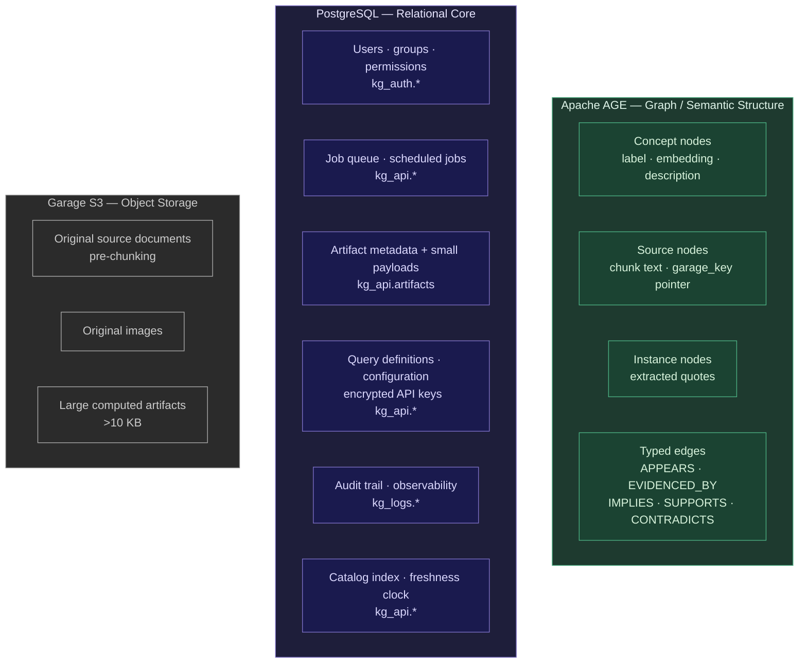
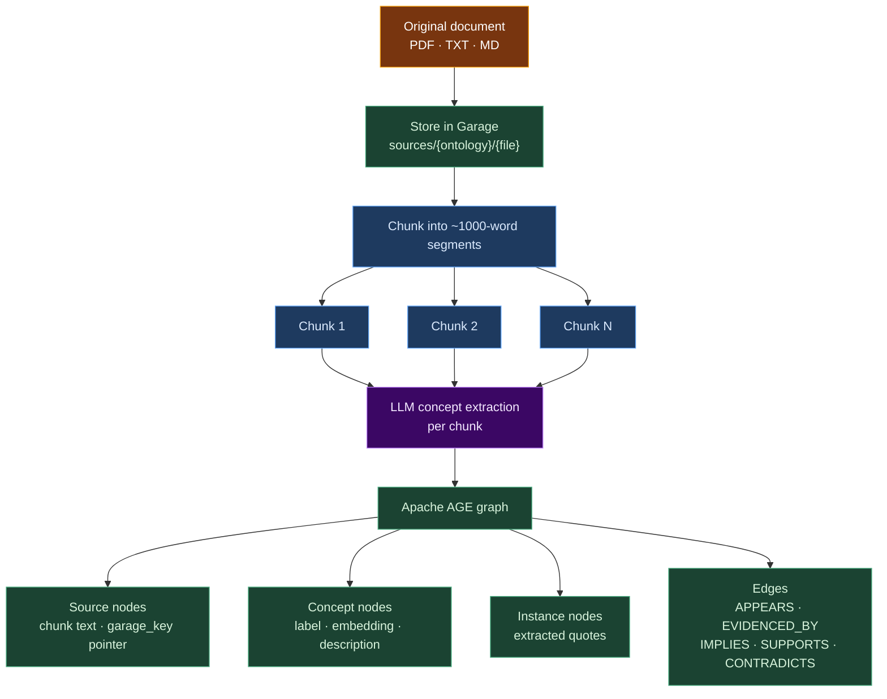
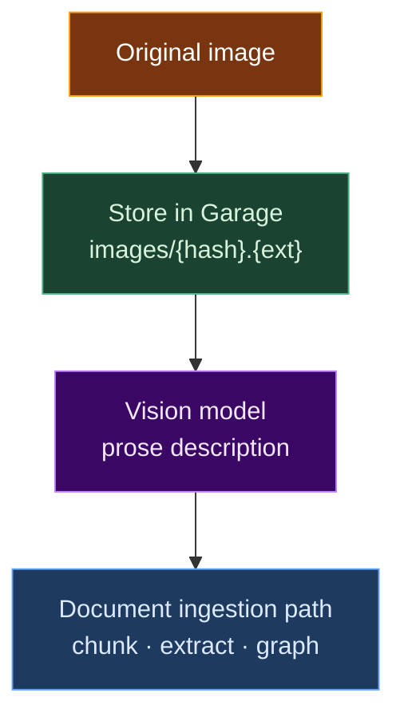
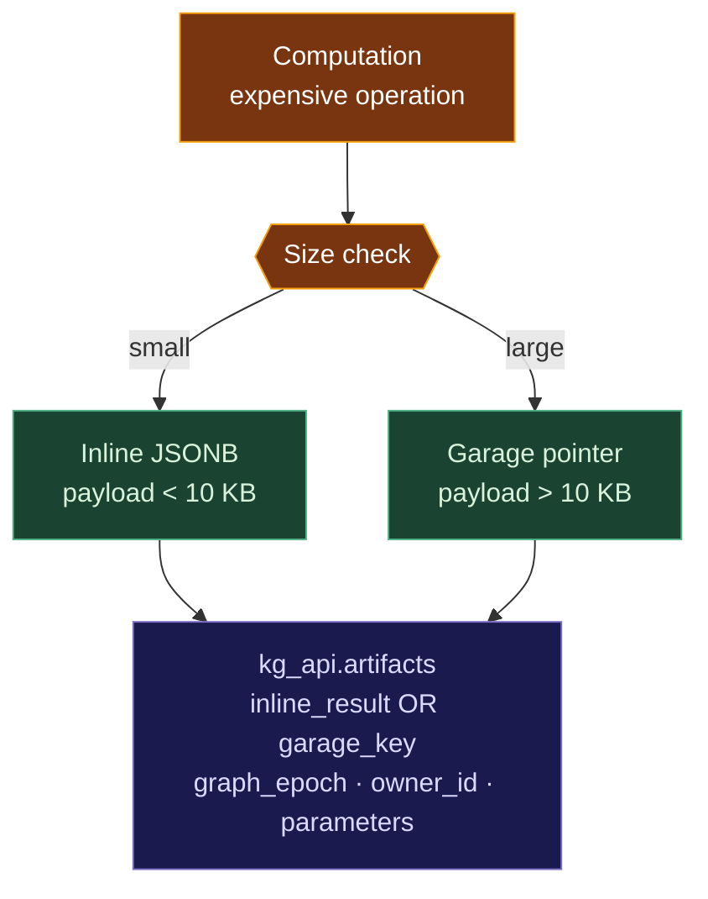

# Storage and Freshness

Kappa Graph stores data across three tiers — Apache AGE, PostgreSQL, and Garage S3 — and maintains a freshness contract that keeps derived caches consistent with the graph they were built from. This page explains the tier boundaries, the data flow through them, and how the freshness clock works.

## Storage tiers



The split reflects two constraints: Apache AGE stores semantic structure via openCypher; PostgreSQL owns structured metadata that needs transactions and relational joins; Garage holds binary blobs that would bloat the database.

### Garage namespaces

All objects land in a single Garage bucket (`kg-storage` by default, overridden by `GARAGE_BUCKET`), organized by prefix:

| Namespace | Purpose | Key pattern | ADR |
|---|---|---|---|
| `sources/` | Full original documents | `sources/{ontology}/{hash32}.{ext}` (first 32 hex chars of SHA-256) | ADR-081 |
| `images/` | Original image files | `images/{ontology}/{source_id}.{ext}` | ADR-057 |
| `artifacts/` | Computed results | `artifacts/{type}/{id}.json` | ADR-083 |
| `projections/` | Projection snapshots | `projections/{ontology}/{embedding_source}/latest.json` and `…/{timestamp}.json` | ADR-079 |

## Data flow: document ingestion



The chunk text lives in `:Source.full_text` for fast evidence retrieval. The `garage_key` on each `:Source` points back to the full original document stored in Garage.

## Data flow: image ingestion



## Data flow: artifact storage

Computed results (polarity analyses, projections, reports) route by size:



## Retrieval paths

### Source content

| What | Where | How to retrieve |
|---|---|---|
| Chunk text | Graph (`:Source.full_text`) | `GET /sources/{id}` or concept details |
| Evidence quote | Graph (`:Instance.quote`) | Concept details endpoint |
| Full original doc | Garage (`sources/`) | `GET /sources/{id}/document` |
| Original image | Garage (`images/`) | `GET /sources/{id}/image` |

### Computed artifacts

| What | Where | How to retrieve |
|---|---|---|
| Artifact metadata | PostgreSQL | `GET /artifacts/{id}` |
| Small payload | PostgreSQL (inline) | `GET /artifacts/{id}/payload` |
| Large payload | Garage (`artifacts/`) | `GET /artifacts/{id}/payload` (transparent) |

### Concepts and relationships

| What | Where | How to retrieve |
|---|---|---|
| Concept search | Graph | `POST /query/search` |
| Concept details | Graph | `GET /query/concept/{id}` |
| Relationships | Graph | `POST /query/connect` |
| Evidence | Graph (`:Instance`) | Included in concept details |

## Why derived data drifts

Several read surfaces are not primary state — they are caches computed from the graph:

| Derivation | What it is | Where it lives |
|---|---|---|
| Catalog index | ontology → document → concept browse tree | `kg_api.catalog_node` / `catalog_edge` |
| Grounding cache (per-concept) | each concept's grounding strength | in-memory, per API process |
| Grounding cache (polarity axis) | shared polarity axis | in-memory, per API process |
| Artifacts | saved analyses / projections / results | PostgreSQL inline + Garage S3 |

Each is correct only as long as the graph it was computed from has not changed. Historically each derivation answered "am I stale?" its own way, against different signals. ADR-207 unifies that under a single mechanism.

## The freshness clock

One monotonic counter covers all graph actions: the `kg_api.graph_epochs.event_id` sequence. One row per mutation event, `BIGSERIAL`, always increasing. Every derivation resolves freshness against it through `kg_api.get_committed_epoch()` (in Python, `api/app/lib/freshness.py:read_committed_epoch()`). A derivation is **fresh** when the tick it was built at equals the current tick (within its declared staleness budget).

### Why the tick lives in application code, not a trigger

Apache AGE's Cypher operations manipulate underlying label tables through internal C functions that bypass PostgreSQL's row-level trigger mechanism entirely (documented in migration 033). A trigger never fires for an AGE mutation.

This is also why the legacy `graph_change_counter` is not a reliable freshness signal. It is a recomputed composite `COUNT(*)` sum — the sum of all graph objects refreshed by calling `refresh_graph_metrics()`. Deleting one object and adding another leaves the sum unchanged, so two different graph states can share a counter value. A derivation can read *false-fresh*. Migration 076 formally demotes `graph_change_counter` to a one-directional dirty hint: `counter != stamp` reliably proves the graph changed, but `counter == stamp` does not prove freshness. Use `kg_api.get_committed_epoch()` for any staleness decision.

The tick is advanced where the platform can see every mutation: application code records an epoch event when it commits a graph mutation.

### Eventual consistency

Because the epoch event is recorded out-of-band from the AGE write — not inside a trigger — there is a brief window where the tick can lag the true graph state. The guarantee is convergence, not instantaneous consistency, and it is scoped precisely:

> Freshness converges for every mutation *kind* that records an epoch event. It is blind to kinds that record none.

Today only the ingestion path records events, so the clock is correct for ingestion and blind to edits and annealing. There is no `COUNT`-checksum backstop that covers the gap. The work tracked in issue #386 closes it by recording an epoch event for every mutation kind.

The concrete gap: the annealing path currently records nothing — it calls neither `record_epoch()` nor `graph_accel_invalidate()`, so after annealing re-scopes the graph, both the freshness clock and the in-memory accelerator are silently stale.

### Reading the tick safely

`get_committed_epoch()` returns the contiguous committed prefix, not raw `MAX(event_id)`. Epoch rows are inserted at a job's start so the `event_id` can tag the nodes it creates; the job commits at its end; jobs finish out of order. The watermark:

```text
get_committed_epoch() := MIN(event_id WHERE status='in_progress') - 1
                         if any job is in flight, else MAX(event_id)
```

An in-flight job at id N holds the clock at N–1. Both `completed` and `failed` events count — only `in_progress` blocks — because ingestion commits per chunk. A failed job may have committed partial changes; ignoring it would read false-fresh. A job must resolve its epoch event on every exit (success, cancel, or exception) or it freezes the clock behind a phantom in-flight entry.

### Sub-counters

Specialized invalidation scopes keep their own counters, subordinate to the universal tick. They are declared in `api/app/lib/freshness.py:SUBCOUNTERS`:

- **`graph_accel.generation`** — the `graph_accel` pgrx extension's own generation, advanced the same out-of-band way (`graph_accel_invalidate`). It is the one co-advancing mirror: `AGEClient.record_mutation` advances the tick *and* calls `graph.invalidate()` from one place, so the two move together by construction. A sub-counter, not a competing clock — it exists because the in-memory layer needs a `pg_notify`-backed signal the SQL watermark cannot push to API processes. Pinned by `tests/unit/lib/test_record_mutation_coadvance.py`.
- **`vocabulary_change_counter`** — vocabulary membership changes. An independent narrower clock; does not co-advance with the tick.
- **`vocabulary_embedding_generation_counter`** — vocabulary embedding regeneration. The polarity-axis cache keys on this; it changes far less often than the graph, so scoping it separately avoids needless axis recompute.

## The freshness contract

`api/app/lib/freshness.py` answers the four freshness questions — built at what version, current version, am I stale, what do I do about it — once instead of per surface. Derivations come in two shapes:

```text
FreshnessContract                      shared: current_version() + staleness budget
├── CollectionDerivation               one stamp for the whole derivation
│     version_stamp() / is_fresh() / reconcile()     rebuild or invalidate the lot
│     e.g. catalog index, each grounding cache tier
└── InstanceDerivation                 per-row: each item carries its own stamp
      version_stamp(id) / is_fresh(id) / reconcile(id)   regenerate one item
      e.g. artifacts
```

`current_version()` always delegates to `read_committed_epoch()` — one place, one SQL expression, no derivation can drift onto a different signal. `is_fresh()` is on-read: it re-reads the current tick every call and must never short-circuit on a cached value (that was the unbounded-staleness bug #422). `reconcile()` brings the derivation back to current and is a no-op when already fresh.

Derivations register themselves with `@register_derivation`. Registration backs a conformance test — a new derivation that skips the contract fails CI, not production — and a uniform operator surface to list derivations, show freshness, and trigger reconcile.

Staleness budgets are declared per derivation. The default is strict: the derivation must reflect the current tick. A derivation opts into tolerance explicitly (e.g. "may be up to N versions behind"), making "fresh enough" a declared property rather than emergent behavior.

## Adding a new materialized derivation

1. Subclass `CollectionDerivation` (whole-thing stamp) or `InstanceDerivation` (per-row stamp).
2. Implement `current_version()` via `read_committed_epoch()`, `version_stamp()`, and `reconcile()`. Inherit `is_fresh()`.
3. Declare a `name` and a `budget` (default strict).
4. Decorate with `@register_derivation`.
5. `tests/unit/lib/test_freshness_contract.py` enforces the contract.

The catalog facade (`api/app/lib/catalog_facade.py`) is the reference implementation — its deferred, on-read, serve-stale-under-lock rebuild is the pattern to follow.

## Related decisions

- **ADR-207** — canonical clock, contract shapes, and alternatives considered.
- **ADR-203** — the graph epoch event log (logical-time and lifetime analytics).
- **ADR-079 / migration 033** — `graph_change_counter` origin and the AGE-bypasses-triggers constraint.
- **ADR-057, ADR-081, ADR-083** — image, source document, and artifact storage in Garage.
- **ADR-082** — user scoping and artifact ownership.
