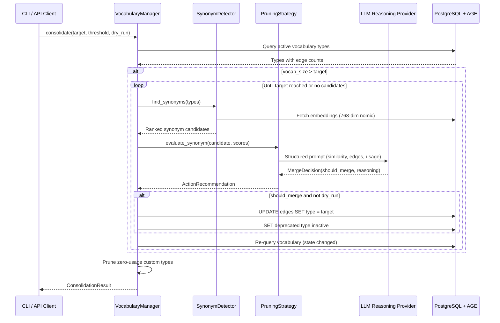
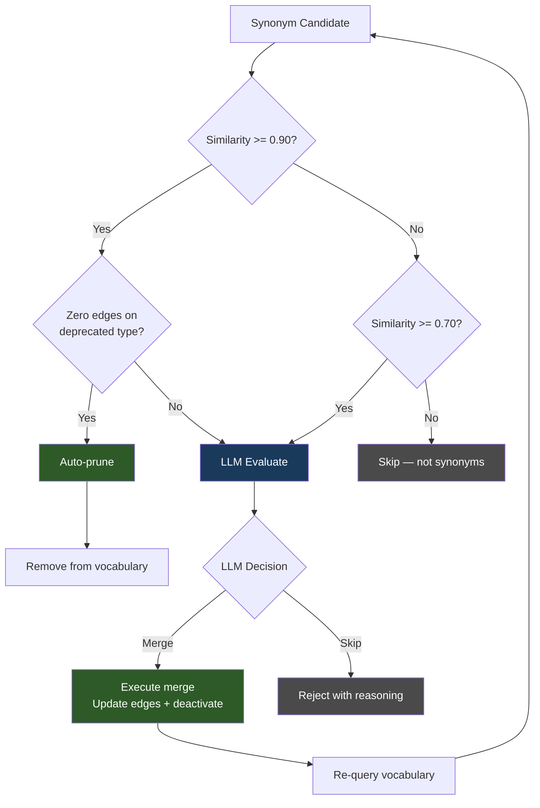
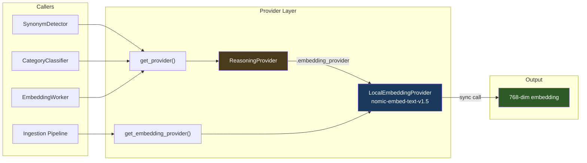

# Vocabulary Lifecycle

Relationship types in Kappa Graph accumulate from document ingestion and require active management to stay coherent. The consolidation pipeline scores, merges, and prunes edge types using a combination of embedding similarity and LLM judgment.

## How the vocabulary grows

When the LLM extracts concepts from a document, it also assigns typed edges between them: IMPLIES, SUPPORTS, HISTORICALLY_PRECEDED, and so on. Thirty built-in types cover the most common relationships. The LLM may invent additional custom types when none of the built-in types fit.

Over multiple ingestion runs across different document domains, the vocabulary sprawls. Near-duplicates appear — DEFINED_AS and DEFINED, INCREASES and ENHANCES. Some types accumulate zero edges after the documents that introduced them leave the graph. Others become structurally marginal: present but traversed rarely.

Left unmanaged, a bloated vocabulary degrades query quality. Traversals that should hit the same semantic territory split across multiple edge types. Similarity searches return noisier results.

## Why the LLM governs consolidation decisions

The system computes objective scores for every relationship type: embedding similarity to other types, edge count, traversal frequency, bridge importance, polarity positioning, epistemic status. These numbers describe the vocabulary's state precisely.

A threshold rule alone handles the easy cases but fails on semantic edge cases. Directional inverses such as HAS_PART and PART_OF occupy similar embedding space but are not synonyms — merging them corrupts traversal direction. CONTRASTS_WITH and EQUIVALENT_TO share embedding space while capturing opposite semantics.

An LLM given the same numerical context as a human reviewer computes the same function over those scores, and also catches the semantic distinctions that thresholds miss. The combination is more consistent than either threshold rules or human review alone.

The human's role in vocabulary governance is bringing external knowledge into the graph — submitting documents, expanding domains. Vocabulary hygiene decisions over measurable quantities are delegated to the pipeline.

## The consolidation pipeline

Consolidation follows a loop: score candidates, present them to the LLM, execute the decision, re-score with the updated vocabulary state, repeat.



Three behaviors govern the loop:

- **Target-gated.** Live mode only runs when vocabulary size exceeds the target. `--target 90` with 63 active types is a no-op. Set a target below current size to trigger merges, or use `--dry-run` to preview candidates regardless of target.
- **Re-query after each merge.** After a merge executes, edge counts shift and some types disappear. The pipeline re-fetches similarity before evaluating the next candidate. Dry-run evaluates all candidates against the initial state without re-querying.
- **Prune after merge loop.** Zero-usage custom types are removed after the merge loop completes. Built-in types are never pruned.

## Decision routing

Candidates are routed through three tiers based on similarity score and LLM judgment:



The LLM receives a structured prompt with embedding similarity, edge counts, and usage context. It returns a merge or skip decision with reasoning. The reasoning appears in the CLI output and is stored in the audit trail.

Cases the LLM handles that thresholds miss:

- **Directional inverses** — HAS_PART and PART_OF share embedding space but are opposites.
- **Semantic distinctions** — CONTRASTS_WITH and EQUIVALENT_TO are numerically close but semantically opposite.
- **Genuine redundancy** — DEFINED_AS and DEFINED, INCREASES and ENHANCES, where the distinction carries no analytical value.

## Embedding architecture

All vector similarity in the consolidation pipeline flows through a single embedding path. The reasoning provider (used for extraction and consolidation decisions) and the embedding provider (used for vector similarity) are separate:



Design constraints enforced by the implementation:

- `generate_embedding()` is synchronous across all providers — never awaited.
- `OpenAIProvider.generate_embedding()` delegates to `self.embedding_provider`. If none is configured, it raises `RuntimeError` — there is no silent fallback to a different embedding model, because a dimension mismatch between stored and query vectors would corrupt similarity results.
- `SynonymDetector._cosine_similarity()` includes dimension guards that catch mismatches at comparison time with a clear error rather than silently returning garbage similarity scores.
- `_get_edge_type_embedding()` detects stale cached embeddings (dimension mismatch) and regenerates them automatically.

## CLI commands

```
kg vocab status                        # Show vocabulary size, zone, aggressiveness
kg vocab list                          # Show all types with categories, edges, status
kg vocab consolidate                   # Execute merges + prune (live)
kg vocab consolidate --dry-run         # Preview candidates without executing
kg vocab consolidate --target N        # Target vocabulary size (default 90; range 30–200)
kg vocab consolidate --threshold 0.90  # Auto-execute threshold (default 0.90)
kg vocab merge TYPE_A TYPE_B           # Manual merge
```

Job management for consolidation runs:

```
kg job list -s pending                 # Status aliases: pending, running, done, failed
kg job cleanup -s done --confirm       # Delete completed jobs
```

Status aliases (`pending` → `awaiting_approval`, `running` → `processing`, `done` → `completed`) are resolved by a shared `resolveStatusFilter()` utility across all job subcommands.

## Known limitations

**Pending reviews are in-memory only.** `get_pending_reviews()` and `approve_action()` exist in the API but hold state in memory rather than persisting it. The primary workflow — fully automated consolidation — does not depend on these paths.
