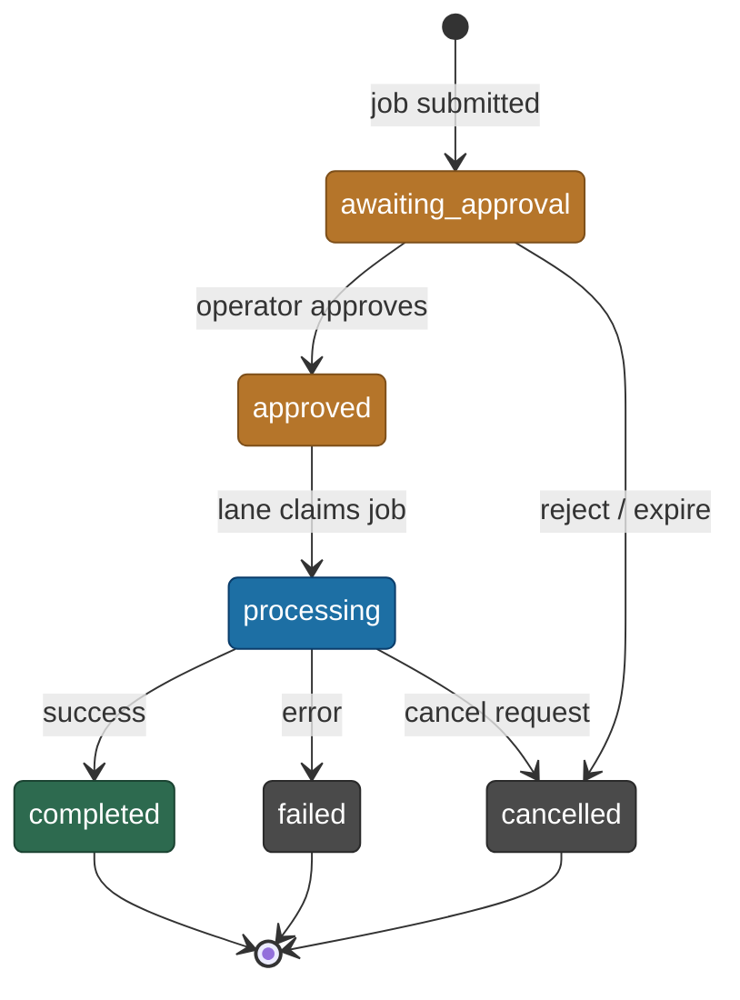

# Worker Lanes and Concurrency

Kappa Graph processes documents through a multi-stage pipeline — chunking, LLM extraction, concept
matching, and graph upsert. Each stage involves CPU-bound or I/O-bound work that must run
concurrently without starving the HTTP server or exhausting database connections. This page
explains how the worker-lane model achieves that.

---

## Why database-driven lanes

The original dispatch model held job state in-memory: a Python process maintained a thread pool
and a queue, and restarting the container lost all queued work.

ADR-100 replaced that with **database-driven worker lanes** — typed job queues coordinated
entirely through PostgreSQL. Job state survives container restarts. Multiple API processes can
poll the same queue without coordination logic in application code. Lane configuration changes
take effect without redeployment.

---

## How the dispatch leader is elected

The API runs as a single Uvicorn process (`--workers 1` in the Dockerfile). On startup it
attempts a PostgreSQL session-level advisory lock (`pg_try_advisory_lock(100_000_001)` in
`api/app/main.py`). If the lock is acquired, that process becomes the **dispatch leader** and
starts three services:

- **LaneManager** — the poll loops that claim and execute jobs
- **JobScheduler** — lifecycle cleanup: stale job recovery and expired job cancellation
- **ScheduledJobsManager** — cron-like maintenance job creation

If the lock is not acquired — for example, during a rolling restart where two processes briefly
overlap — the new process waits. When the leader process exits and releases the lock, the next
start wins it.

---

## Job lifecycle



---

## How a lane claims a job

Each lane runs an async polling loop in `api/app/services/lane_manager.py`. On every cycle:

1. Check whether the lane has available slots (`active_jobs < max_slots`).
2. Issue an atomic claim query against `kg_api.jobs`.
3. If a job is claimed, submit it to the shared `ThreadPoolExecutor`.
4. If no job is available, sleep for the lane's `poll_interval_ms`.

The claim query uses `FOR UPDATE SKIP LOCKED` so multiple lane loops can poll concurrently
without blocking each other:

```sql
UPDATE kg_api.jobs
SET status = 'running', claimed_by = :worker_id, claimed_at = NOW()
WHERE job_id = (
    SELECT job_id FROM kg_api.jobs
    WHERE status = 'approved' AND job_type = ANY(:claimable_types)
    ORDER BY priority DESC, created_at ASC
    LIMIT 1
    FOR UPDATE SKIP LOCKED
)
RETURNING *;
```

Lane configuration is read from `kg_api.worker_lanes` on every poll cycle. A change to
`max_slots` or `poll_interval_ms` takes effect on the next cycle without an API restart.

---

## Default lane configuration

Three lanes ship by default, seeded in `schema/00_baseline.sql`:

| Lane | Job types | Slots | Poll interval | Stale timeout |
|---|---|---|---|---|
| `interactive` | `ingestion`, `ingest_image`, `polarity` | 2 | 2 s | 30 min |
| `maintenance` | `projection`, `vocab_refresh`, `epistemic_remeasurement`, `ontology_annealing`, `proposal_execution` | 1 | 15 s | 60 min |
| `system` | `restore`, `vocab_consolidate`, `artifact_cleanup`, `source_embedding` | 1 | 30 s | 120 min |

Lane separation guarantees that a long-running projection in the `maintenance` lane cannot prevent
an ingestion job from claiming an `interactive` slot. The per-lane ceiling is 16 slots
(`MAX_LANE_SLOTS`). The shared thread pool is sized to `max(4, lane_count × 16)` so every lane
can independently reach its ceiling without starving its siblings.

---

## Thread pools

All heavy work — database queries, LLM calls, embeddings — runs in synchronous threads. The async
event loop dispatches via `loop.run_in_executor()`.

| Pool | Location | Workers | Purpose |
|---|---|---|---|
| Lane executor | `lane_manager.py` | `max(4, lanes × 16)` | Runs claimed jobs |
| Local embedding | `embedding_worker.py` | 1 (fixed) | Serializes GPU/CPU model access |
| Graph parallelizer | `graph_parallelizer.py` | 8 (global semaphore) | Multi-hop Cypher fan-out |

The embedding worker uses a single-thread `ThreadPoolExecutor` deliberately: local inference
models cannot safely run concurrent requests on the same device, so the pool serializes them.

The graph parallelizer semaphore is global (one instance per process), so concurrent queries
share the same 8-slot budget rather than each spawning unbounded threads.

---

## Connection pools

The platform uses `psycopg2.pool.ThreadedConnectionPool` (synchronous). There is no async
database driver.

| Pool | Location | Min / Max | Purpose |
|---|---|---|---|
| Job queue | `job_queue.py` | 1 / 10 | Job lifecycle and claim operations |
| Graph queries | `lib/age_client/base.py` | 1 / 20 | Cypher queries via Apache AGE |
| Auth | `dependencies/auth.py` | 1 / 5 | RBAC permission checks |

With the default lane configuration (4 total slots), worst-case concurrent connections are bounded
by the thread pool size times the pools that each thread may hold simultaneously.

---

## Concurrency controls summary

| Control | Mechanism | Default | Location |
|---|---|---|---|
| AI provider rate limiting | `threading.Semaphore` per provider | ollama=1, anthropic=4, openai=8 | `lib/rate_limiter.py` |
| Global graph workers | `threading.Semaphore` singleton | 8 | `lib/graph_parallelizer.py` |
| Lane slot enforcement | In-memory counter + `call_soon_threadsafe` | Per lane `max_slots` | `services/lane_manager.py` |
| Job claim atomicity | `FOR UPDATE SKIP LOCKED` | — | `services/lane_manager.py` |
| API backoff | Exponential retry with ±20% jitter | 60 s cap | `lib/rate_limiter.py` |
| Job cancellation | Poll `cancelled` column at chunk boundaries | — | `services/job_queue.py` |
| Global thread cap | `MAX_CONCURRENT_THREADS` env var | 32 | `lib/rate_limiter.py` |

---

## Tuning lane configuration

Lane config is live-editable via the API (`workers:manage` permission required). Changes take
effect on the next poll cycle — no restart needed.

**Increase `interactive` slots** when ingestion jobs queue behind each other and the host has
CPU/memory headroom:

```bash
curl -X PATCH http://localhost:8000/admin/workers/lanes/interactive \
  -H "Authorization: Bearer $TOKEN" \
  -d '{"max_slots": 3}'
```

**Reduce `poll_interval_ms`** if the 2-second interactive poll delay is noticeable. Lower values
increase database polling load slightly.

**Drain a lane** before database maintenance (migrations, schema changes) to stop new job claims
while running jobs finish:

```bash
curl -X PATCH http://localhost:8000/admin/workers/lanes/maintenance \
  -H "Authorization: Bearer $TOKEN" \
  -d '{"enabled": false}'
```

Re-enable with `{"enabled": true}` when done.

---

## Admin API endpoints

All endpoints require authentication. `workers:view` grants read access; `workers:manage` grants
write access.

| Method | Path | Permission | Purpose |
|---|---|---|---|
| GET | `/admin/workers/status` | `workers:view` | Slot utilization, running jobs, queue depth |
| GET | `/admin/workers/lanes` | `workers:view` | Per-lane config with utilization |
| PATCH | `/admin/workers/lanes/{name}` | `workers:manage` | Update lane config at runtime |
| POST | `/admin/workers/jobs/{id}/cancel` | `workers:manage` | Cancel a running job |
| PATCH | `/admin/workers/jobs/{id}/priority` | `workers:manage` | Reprioritize a queued job |

### CLI and MCP

```bash
kg admin workers          # Slot overview, lane summary, active jobs
kg admin workers lanes    # Per-lane config with utilization
```

The `workers/status` MCP resource combines status and lane data in a single read.

---

## RBAC

| Permission | Scope | Grants |
|---|---|---|
| `workers:view` | Platform | Read lane config, slot utilization, queue depth |
| `workers:manage` | Platform | Cancel jobs, reprioritize, modify lane config, drain/resume lanes |

Both permissions are granted to the `platform_admin` role by the ADR-100 migration. Custom roles
can receive either permission independently via the RBAC system.
