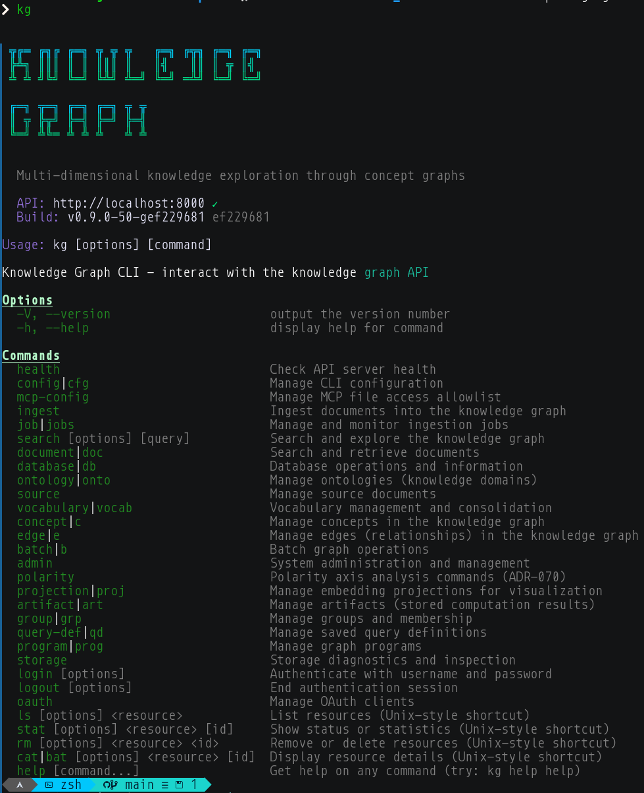

# CLI Tool

Command-line interface for scripting, automation, and power users. The `kg` command provides access to all knowledge graph operations.



## Installation

```bash
cd cli
npm run build
./install.sh
```

Verify with `kg health`.

---

## Knowledge Operations

### Search


Find concepts by meaning, not keywords.

```bash
# Semantic search
kg search query "causes of inflation"

# Get full concept details with evidence
kg search show c_abc123

# Find related concepts (2 hops)
kg search related c_abc123 --depth 2

# Find path between concepts
kg search connect "supply chain" "consumer prices"
```

**What you can do:** Discover concepts without knowing exact terms, trace relationships, find unexpected connections.

---

### Ingest

Add documents to your knowledge graph.

```bash
# Single file
kg ingest file research-paper.pdf --ontology economics

# Directory (recursive — requires --depth)
kg ingest directory ./papers --ontology economics --recurse --depth all

# Raw text
kg ingest text "The Federal Reserve controls interest rates..." --ontology economics

# Image with vision AI
kg ingest image diagram.png --ontology economics
```

**What you can do:** Build knowledge graphs from document collections, process images with vision AI, organize by ontology.

---

### Document & Source

Browse ingested content.

```bash
# List documents in an ontology
kg document list --ontology economics

# Get document details
kg document show doc_abc123

# Access original source text
kg source get src_abc123
```

---

### Ontology

Manage knowledge domains.

```bash
# List all ontologies
kg ontology list

# Get statistics
kg ontology info economics

# List source files
kg ontology files economics

# Delete (with confirmation)
kg ontology delete test-data --force
```

---

## Analysis

### Polarity

Analyze semantic dimensions.

```bash
# Project concepts onto an axis
kg polarity analyze --positive "modern" --negative "traditional"
```

Saved analyses are accessible via `kg artifact list` (polarity results are persisted as artifacts).

**What you can do:** Discover where concepts fall on semantic spectrums, find concepts that balance opposing viewpoints.

---

### Vocabulary

Manage relationship types.

```bash
# Check vocabulary health
kg vocabulary status

# List all relationship types
kg vocabulary list
```

---

### Artifact

Access saved computation results.

```bash
# List saved artifacts
kg artifact list

# Show artifact details
kg artifact show art_abc123
```

---

## System

### Job Management

Control the extraction pipeline.

```bash
# List jobs by status
kg job list --status pending

# Watch job progress
kg job status job_abc123 --watch

# Approve a pending job
kg job approve job job_abc123

# Cancel running job
kg job cancel job_abc123

# Clean up old jobs (preview by default; add --confirm to delete)
kg job cleanup --older-than 7d --status completed --confirm
```

**What you can do:** Control when extraction happens, monitor costs, clean up completed work.

---

### Admin

System administration.

```bash
# Check system health
kg admin status

# Create backup (full system or per-ontology)
kg admin backup --type full

# Restore from backup archive
kg admin restore --file backup.tar.gz --confirm
```

---

### Authentication

Manage credentials.

```bash
# Login
kg login

# Logout
kg logout

# Create MCP credentials (alias for: kg oauth create --for mcp)
kg oauth create-mcp

# List OAuth clients
kg oauth clients
```

---

## Unix Shortcuts

Familiar commands for quick access.

```bash
# List resources
kg ls ontologies
kg ls concepts --ontology economics

# Show details
kg cat concept c_abc123
kg stat ontology economics

# Delete
kg rm job job_abc123
```

---

## Scripting Examples

### Batch Ingest

```bash
# Ingest all PDFs (auto-approve is the default)
for f in papers/*.pdf; do
  kg ingest file "$f" --ontology research
done
```

### Export Search Results

```bash
# Search and pipe to jq
kg search query "machine learning" --json | jq '.concepts[].label'
```

### CI/CD Integration

```bash
# Validate graph health in CI (exits non-zero on failure)
kg health
kg database stats
```

---

## Configuration

```bash
# View current config
kg config get

# Set auto-approval
kg config set auto_approve true

# Set API URL
kg config set api_url http://localhost:8000
```

Config stored in `~/.config/kg/config.json`.
