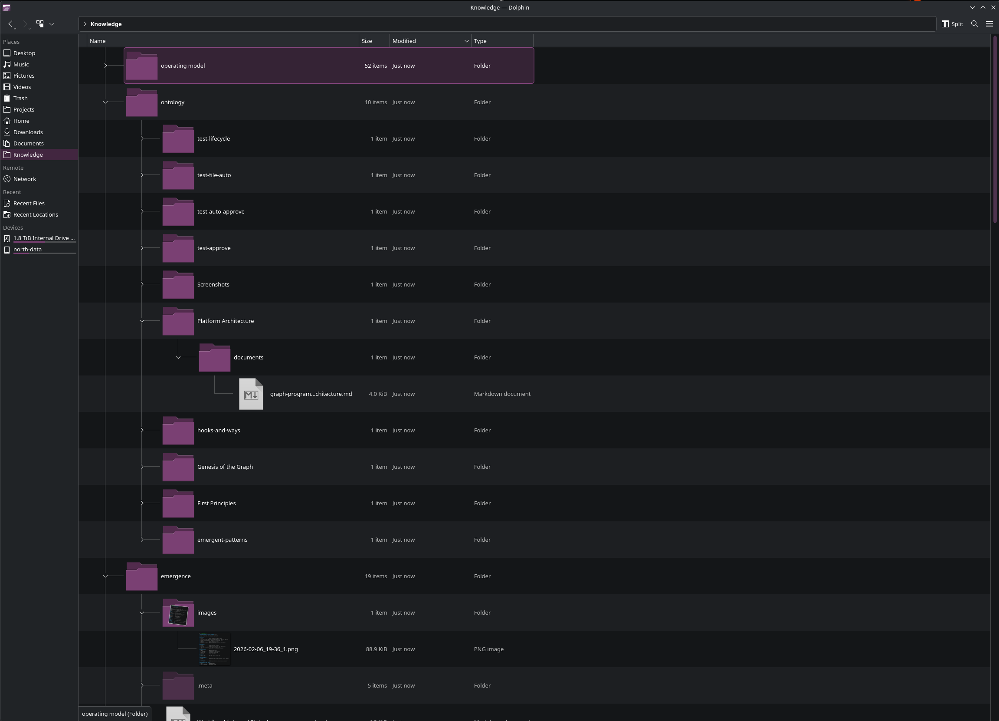
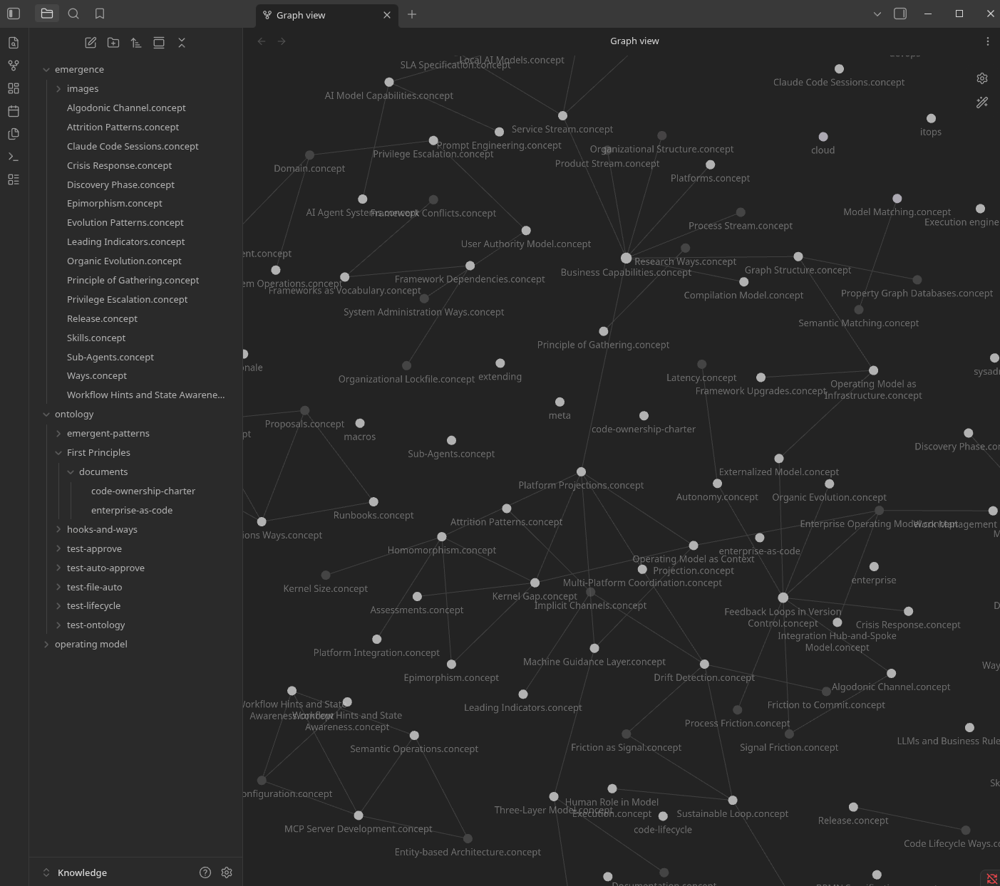

# FUSE Driver

A semantic filesystem that lets you browse your knowledge graph using standard Unix commands. Create directories to define queries, list them to see results, read files to get concept details.


*Knowledge graph mounted as a filesystem — ontologies are folders, queries are directories you create, and concepts appear as files. Integrates with Dolphin and GNOME Files (directory refresh signals, thumbnails). Use `grep`, `tree`, `cp -r`, or any Unix tool on your semantic data.*

## Installation

```bash
pipx install kg-fuse
```

## Quick Start

```bash
# Create OAuth credentials
kg oauth create --for fuse

# Mount the filesystem
kg-fuse /mnt/knowledge

# Explore
ls /mnt/knowledge/ontology/
cd /mnt/knowledge/ontology/economics/
mkdir "causes of inflation"
ls "causes of inflation"/
cat "causes of inflation"/Monetary-Policy.concept.md

# Unmount
fusermount -u /mnt/knowledge
```

---

## How It Works

The filesystem maps knowledge graph operations to Unix semantics:

| Unix Operation | Knowledge Graph Operation |
|----------------|---------------------------|
| `ls ontology/` | List all ontologies |
| `mkdir economics/leadership` | Create semantic query for "leadership" in economics ontology |
| `ls economics/leadership/` | Execute query, show matching concepts |
| `cat Concept.concept.md` | Read concept with evidence and relationships |
| `cp paper.pdf ontology/economics/` | Ingest document into economics ontology |
| `rm economics/leadership/` | Delete query (not the concepts) |

---

## Filesystem Structure

```
/mnt/knowledge/
├── ontology/                           # All knowledge domains
│   ├── economics/                      # An ontology
│   │   ├── documents/                  # Source files (read-only)
│   │   │   └── research-paper.pdf
│   │   ├── inflation/                  # Your query
│   │   │   ├── .meta/                  # Query controls
│   │   │   │   ├── limit               # Max results (default: 50)
│   │   │   │   ├── threshold           # Min similarity (default: 0.7)
│   │   │   │   ├── exclude             # Terms to filter out
│   │   │   │   └── query.toml          # Debug view
│   │   │   ├── Monetary-Policy.concept.md
│   │   │   └── Supply-Chain.concept.md
│   │   └── market-dynamics/            # Another query
│   └── architecture/                   # Another ontology
│
└── global-search/                      # Query across ALL ontologies
    └── ...
```

---

## Query Control

Every query directory has a `.meta/` folder for tuning results.

### Adjust Precision

```bash
# Fewer, more relevant results
echo 0.85 > .meta/threshold

# More results, broader matching
echo 0.5 > .meta/threshold
```

### Limit Results

```bash
echo 20 > .meta/limit
```

### Exclude Terms

```bash
# Filter out concepts containing "deprecated"
echo "deprecated" >> .meta/exclude
echo "legacy" >> .meta/exclude
```

### Broaden Search

```bash
# Add OR terms
echo "monetary" >> .meta/union
echo "fiscal" >> .meta/union
```

### View Query State

```bash
cat .meta/query.toml
```

---

## Document Ingestion

Copy files to ingest them:

```bash
# Ingest a PDF
cp research-paper.pdf /mnt/knowledge/ontology/economics/

# The file "disappears" into the processing pipeline
# After extraction, it appears in documents/
ls /mnt/knowledge/ontology/economics/documents/
```

---

## Concept Files

Each concept appears as a markdown file with:

- **Label and description**
- **Evidence quotes** with source attribution
- **Relationships** to other concepts
- **Grounding strength** score

```bash
cat Monetary-Policy.concept.md
```

```markdown
# Monetary Policy

Central bank actions to control money supply and interest rates.

## Evidence

> "The Federal Reserve uses open market operations..."
> — research-paper.pdf (chunk 3)

> "Interest rate adjustments affect borrowing costs..."
> — economics-textbook.pdf (chunk 12)

## Relationships

- INFLUENCES → Inflation (0.92)
- CONTROLLED_BY → Central Bank (0.88)
- AFFECTS → Employment (0.75)

## Grounding

Strength: 0.85 (well-supported)
Sources: 3 documents
```

---

## Use Cases

### Grep Through Knowledge

```bash
# Find all concepts mentioning "distributed"
grep -r "distributed" /mnt/knowledge/ontology/architecture/
```

### Editor Integration

```bash
# Open concept in your editor
vim /mnt/knowledge/ontology/economics/inflation/Monetary-Policy.concept.md
```

### Shell Scripting

```bash
# List all concepts in an ontology
for f in /mnt/knowledge/ontology/economics/*/; do
  basename "$f"
done
```

### Obsidian as a Graph Viewer

The FUSE filesystem presents concepts as markdown files with wikilink-style relationships. Point Obsidian at the mount point and its graph view renders your knowledge graph natively — no plugin required.


*Obsidian's built-in graph view rendering concept relationships from the FUSE mount*


*A concept file showing properties, evidence, and knowledge metadata in Obsidian*

### Quick Lookups

```bash
# What does the knowledge graph say about X?
mkdir /mnt/knowledge/ontology/economics/stagflation
cat /mnt/knowledge/ontology/economics/stagflation/*.md
```

---

## Configuration

Config stored in `~/.config/kg-fuse/config.toml`:

```toml
[auth]
client_id = "kg-fuse-..."
client_secret = "secret..."

[api]
url = "http://localhost:8000"
```

Generate credentials with `kg oauth create --for fuse`.

---

## Notes

- **Non-POSIX by design** — Like Google Drive, the filesystem intentionally violates some POSIX expectations. Concepts can appear in multiple places, results change as the graph evolves.
- **Read-heavy** — Optimized for exploration. Write operations (ingestion) are async.
- **OAuth required** — Uses the same authentication as CLI and MCP.
