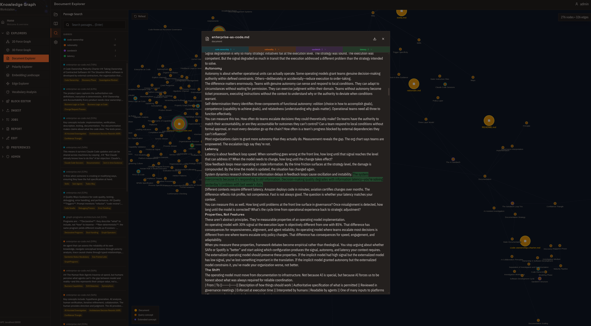
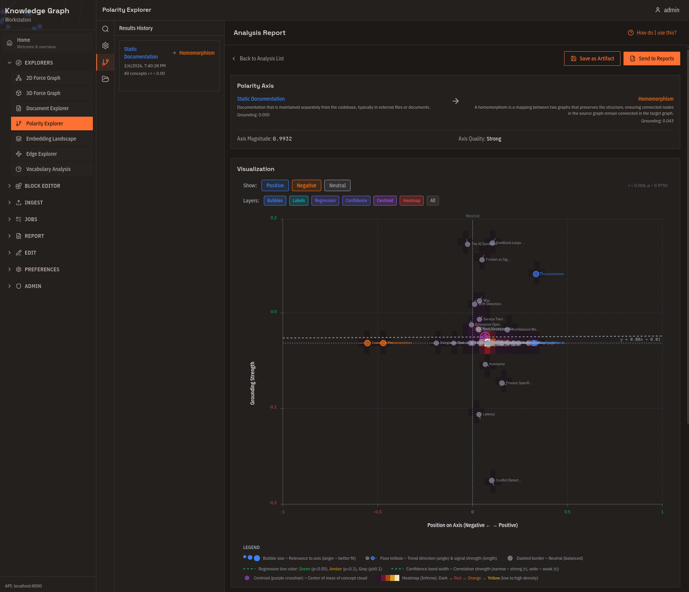
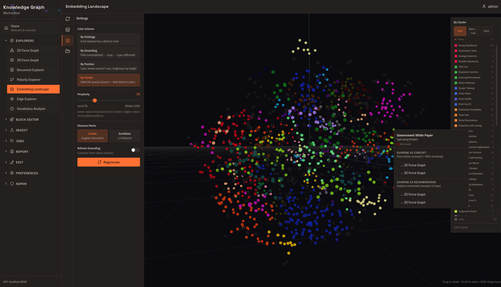
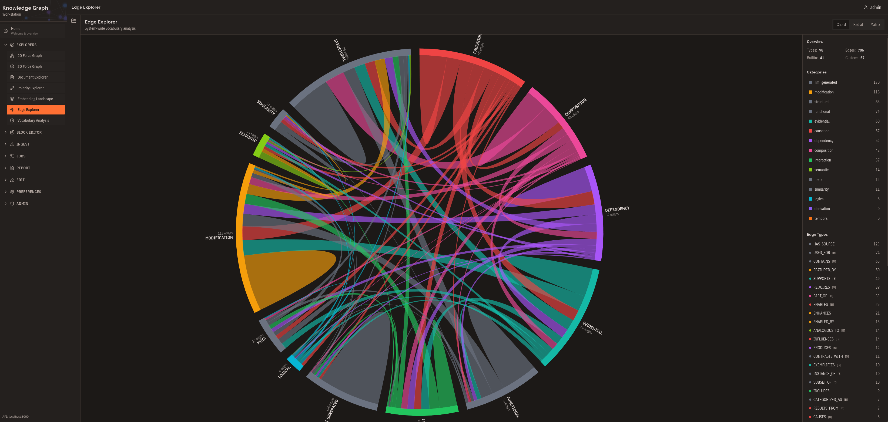
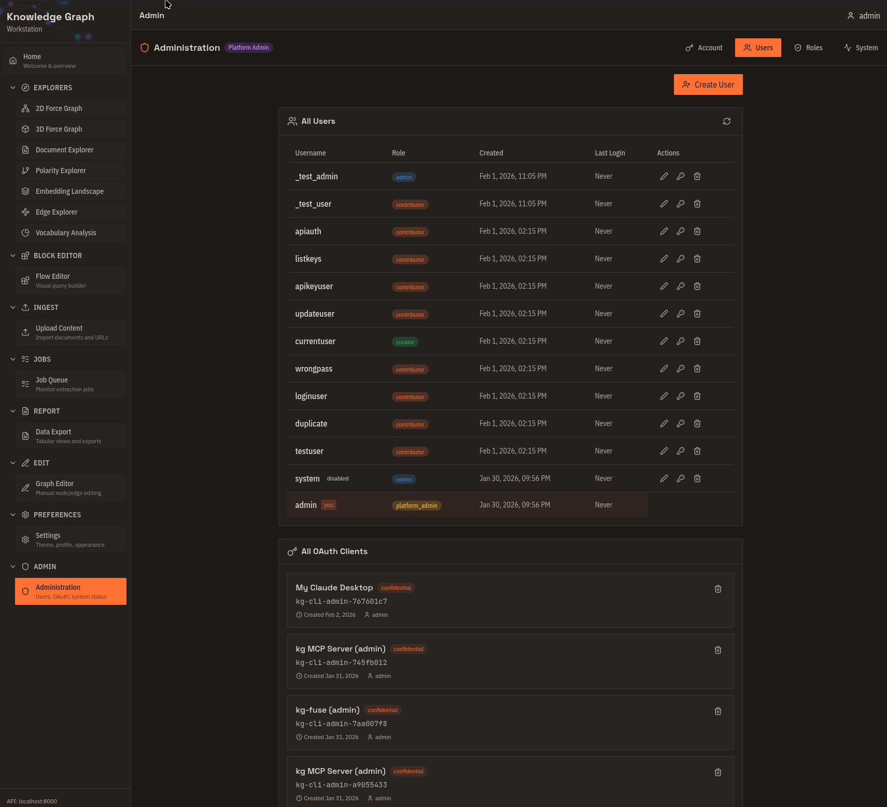
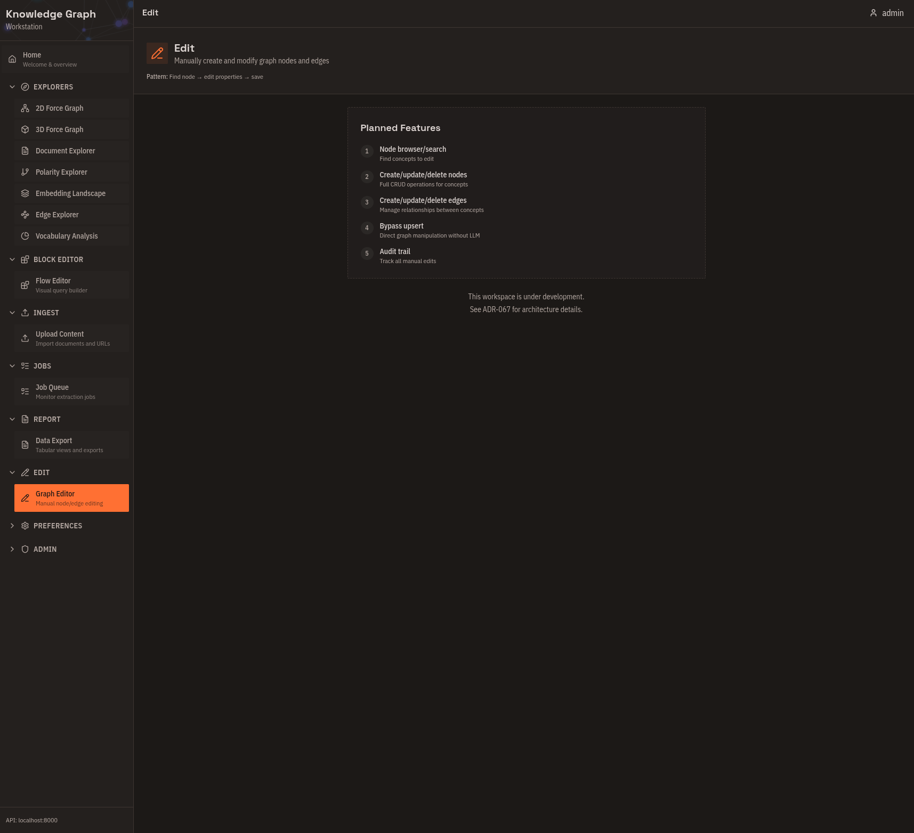
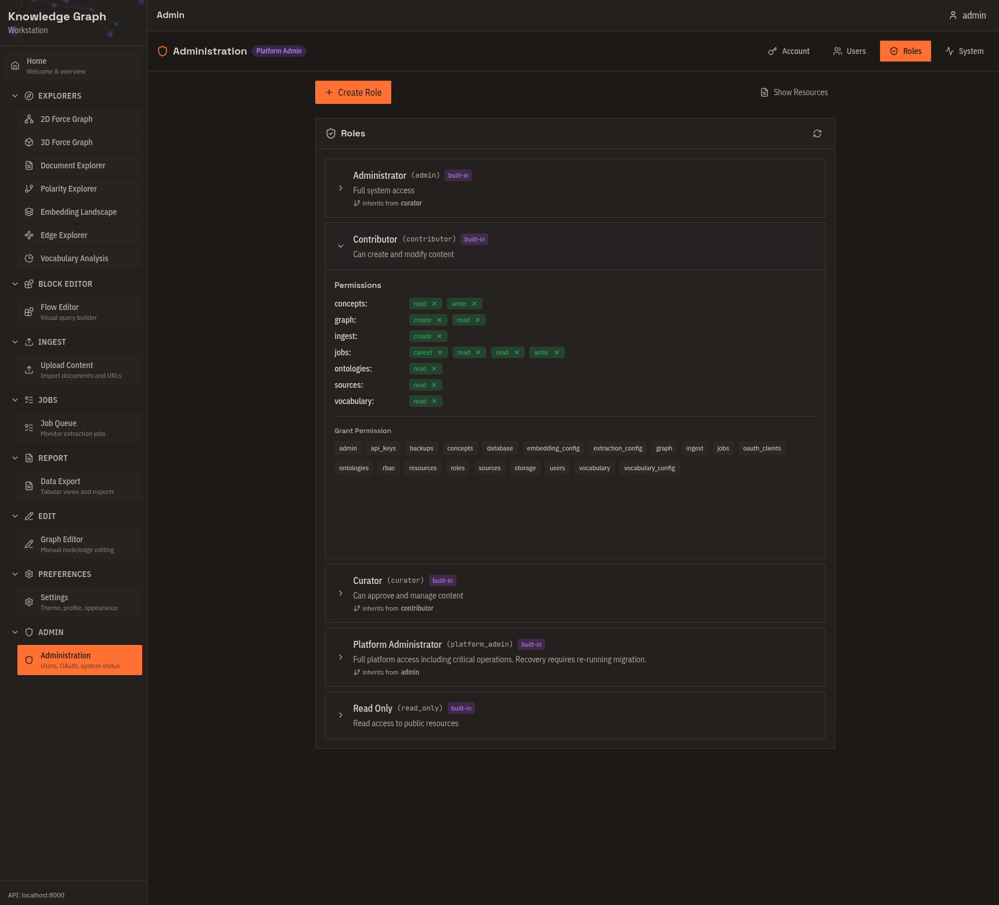

# Web Workstation

Visual interface for exploring, analyzing, and managing your knowledge graph. Access at `http://localhost:3000` after deployment.

---

## Explorers

Interactive visualizations for discovering patterns and relationships.

### 2D Force Graph

Force-directed layout showing concepts as nodes and relationships as edges.

**What you can do:**
- See which concepts naturally cluster together
- Identify hub concepts with many connections
- Drag nodes to rearrange the layout
- Click a concept to focus on its neighborhood
- Filter by relationship type or ontology
- Color-code by grounding strength

**Best for:** Initial exploration, discovering unexpected connections, understanding relationship density.

---

### 3D Force Graph

Immersive three-dimensional version with spatial depth.

**What you can do:**
- Rotate, pan, and zoom through your knowledge space
- See clusters that overlap in 2D but separate in 3D
- Present impressive visualizations to stakeholders

**Best for:** Large graphs (1000+ concepts), presentations, finding higher-order structures.

---

### Document Explorer

Radial tree centered on a source document.

**What you can do:**
- See exactly what concepts were extracted from a document
- Trace how extracted knowledge connects to other concepts
- Validate extraction quality
- Follow citation trails back to sources

**Best for:** Source verification, understanding extraction results, audit trails.

---

### Polarity Explorer

Project concepts onto a semantic spectrum between two poles.

**What you can do:**
- Define opposing poles (e.g., "Modern" ↔ "Traditional")
- See where each concept falls on the spectrum
- Discover which concepts balance opposing viewpoints
- Check if position correlates with grounding strength

**Best for:** Understanding conceptual dimensions, classification without predefined categories, finding outliers.

---

### Embedding Landscape

3D visualization of all concept embeddings using t-SNE or UMAP.

**What you can do:**
- See the overall shape of your semantic space
- Identify natural clusters before diving into details
- Click two concepts to preview a polarity axis
- Plan analysis based on what you see

**Best for:** Discovering semantic dimensions, validating embeddings, global overview before detailed exploration.

---

### Edge Explorer

System-wide analysis of relationship types.

**What you can do:**
- See which relationship types are heavily used
- Find dormant vocabulary (defined but rarely used)
- Monitor vocabulary health as you ingest documents
- Identify consolidation opportunities

**Best for:** System health monitoring, vocabulary maintenance, understanding relationship patterns.

---

### Vocabulary Analysis

Query-specific breakdown of relationships.

**What you can do:**
- Analyze relationship types within a specific neighborhood
- Compare subgraph vocabulary to system-wide distribution
- Understand why certain concepts cluster together

**Best for:** Deep-diving into specific areas, validating relationship classification.

---

## Tools

Functional workspaces for specific tasks.

### Flow Editor

Visual query builder for complex graph traversals.

**What you can do:**
- Build queries by dragging and connecting blocks
- See compiled Cypher alongside your visual design
- Save and reuse query templates
- Preview results as you build

**Best for:** Complex queries without writing code, learning openCypher, building reusable analysis templates.

---

### Upload Content

Drag-and-drop document ingestion.

**What you can do:**
- Drop files onto ontology zones
- See cost estimates before processing
- Create new ontologies on the fly
- Batch submit multiple documents

**Supported formats:** Text, Markdown, PDF, DOCX, PNG, JPG, WEBP

**Best for:** Building knowledge graphs from document sets, controlled ingestion with cost visibility.

---

### Job Queue

Monitor and manage extraction jobs.

**What you can do:**
- See job status (pending, processing, completed, failed)
- Approve or cancel jobs before processing
- View cost estimates and actual costs
- Clean up old jobs in bulk

**Best for:** Workflow control, cost management, debugging failed extractions.

---

### Data Export

Tabular views and export functionality.

**What you can do:**
- View explorer results as sortable tables
- Export to CSV or JSON
- Track changes between analyses (delta indicators)
- Copy data to clipboard

**Best for:** Analysis reports, data science workflows, sharing with non-technical stakeholders.

---

### Graph Editor

Manual creation and editing of concepts and edges.

**What you can do:**
- Create concepts without running extraction
- Add relationships between existing concepts
- Fix extraction errors
- Remove duplicates

**Best for:** Expert curation, correcting LLM mistakes, adding domain knowledge.

---

### Administration

User and system management.

**What you can do:**
- Manage users and roles (admin only)
- Create and revoke OAuth clients
- Monitor system health
- View job queue statistics

**Best for:** Multi-user deployments, API key management, system monitoring.

---

## Common Workflows

### Explore an Unfamiliar Ontology
1. Start at **Embedding Landscape** — see overall structure
2. Switch to **2D Force Graph** — drill into neighborhoods
3. Use **Polarity Explorer** — find semantic dimensions
4. Export to **Data Export** — document findings

### Validate Extracted Knowledge
1. Check **Job Queue** — verify extraction completed
2. Open **Document Explorer** — see what was extracted
3. Review in **2D Force Graph** — spot-check relationships
4. Fix errors in **Graph Editor**
