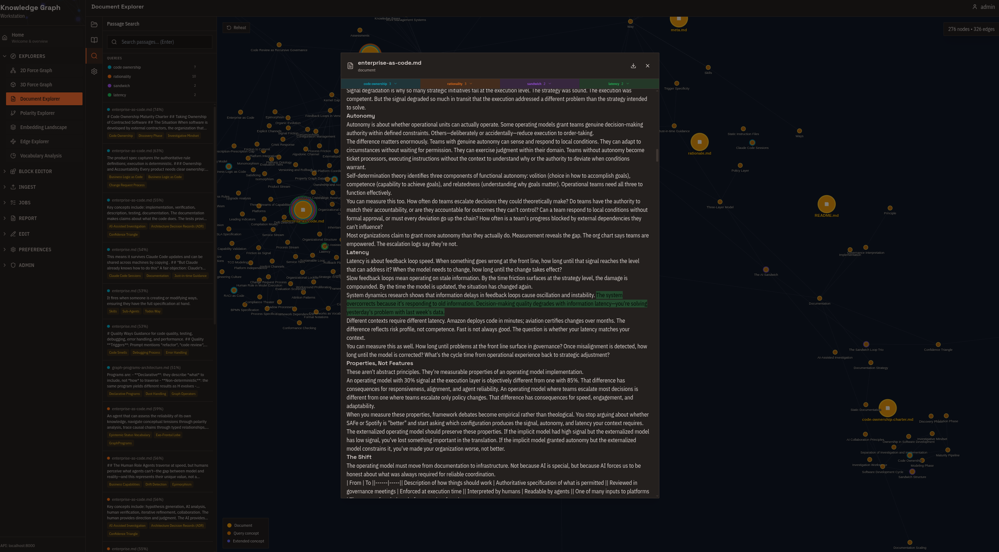
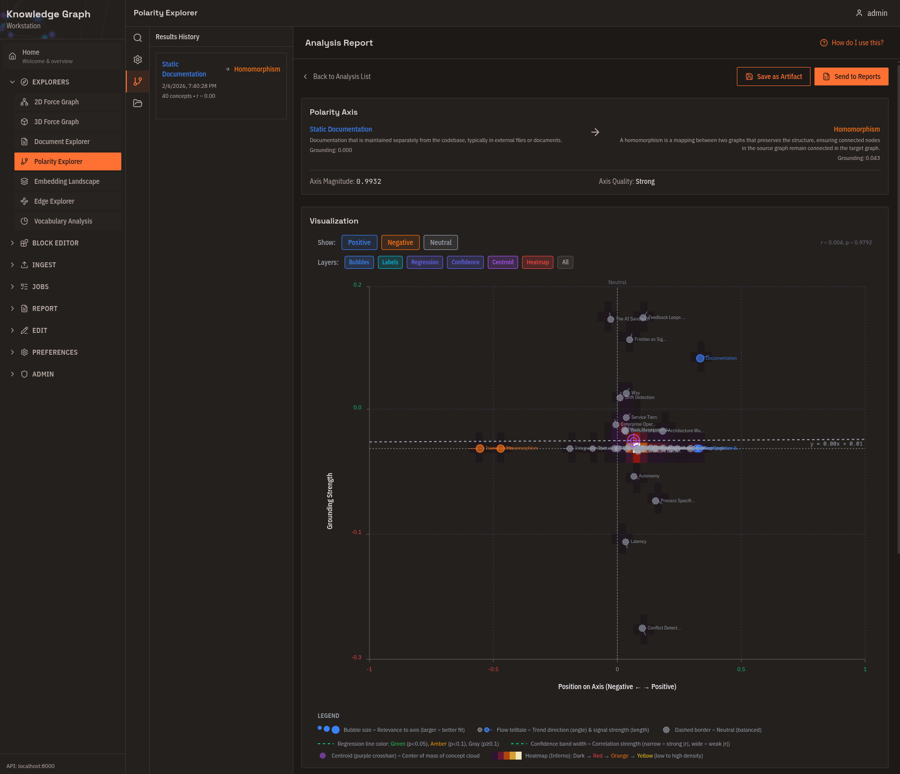
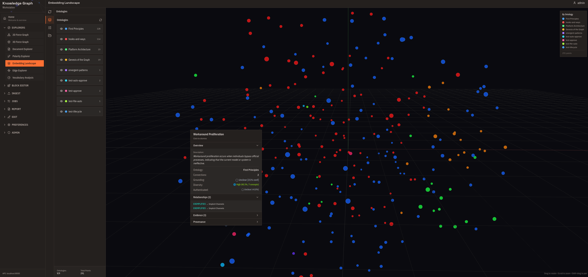
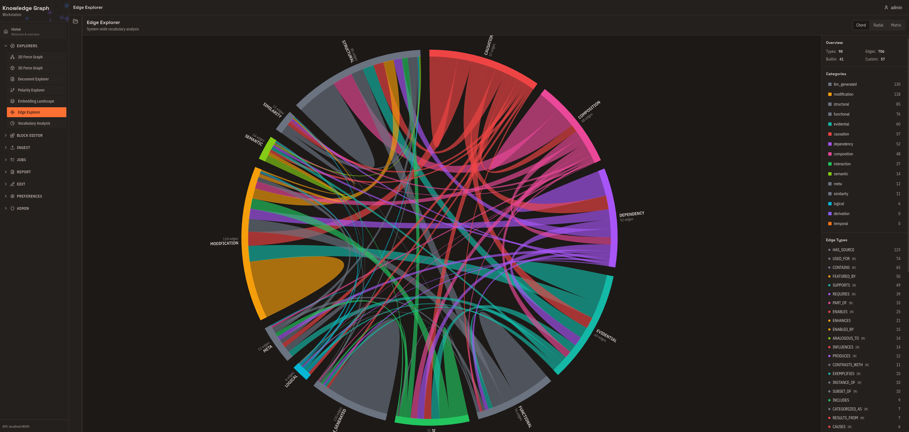
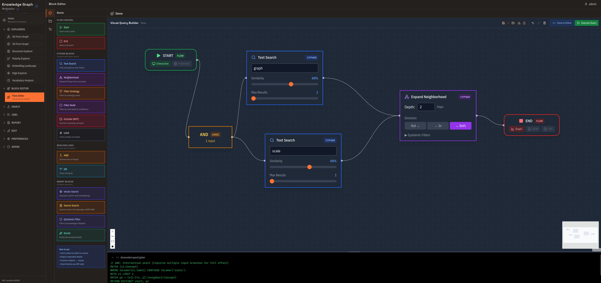
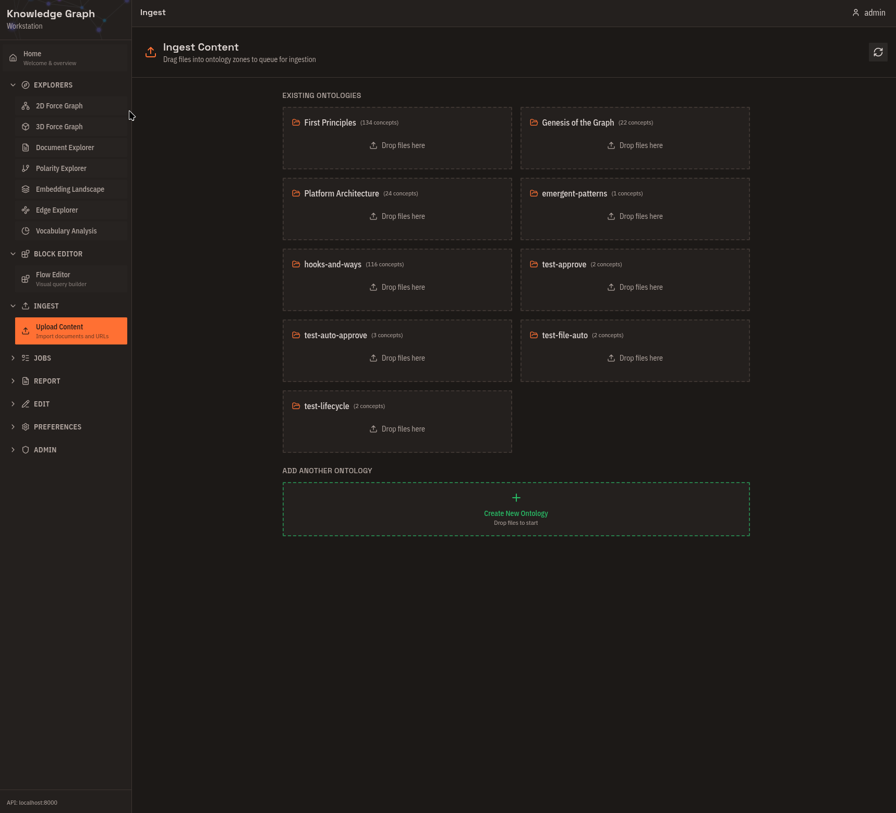
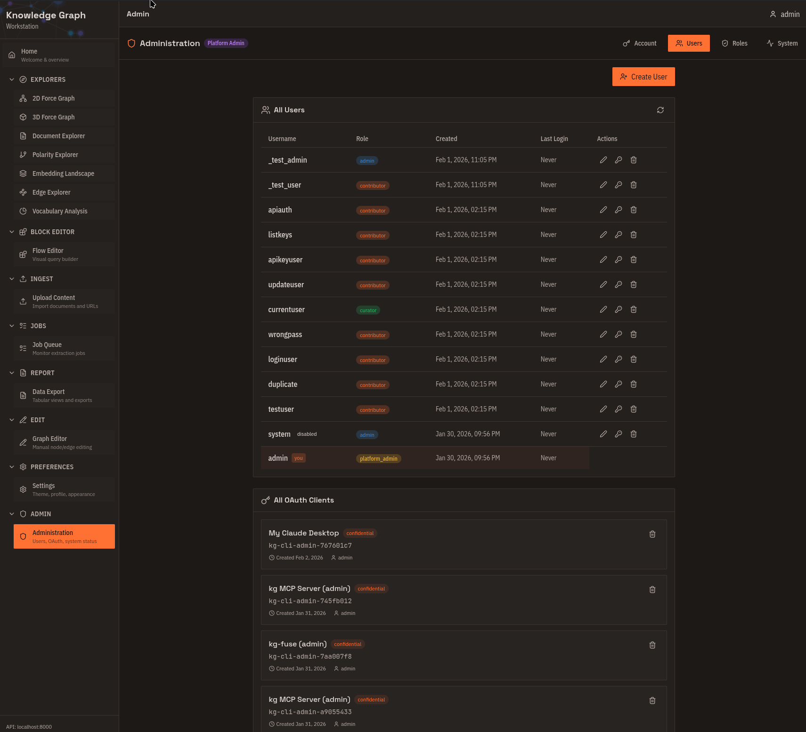
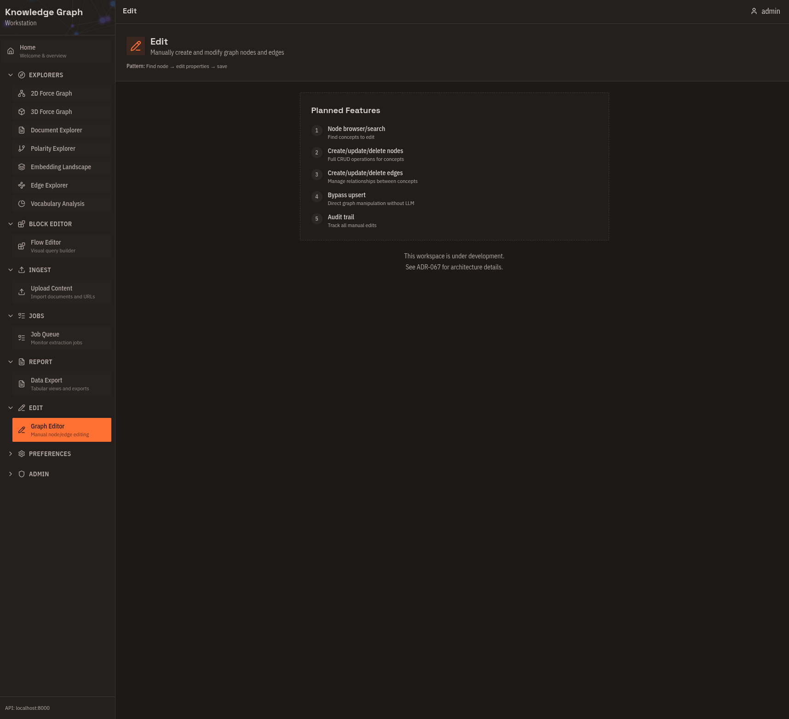
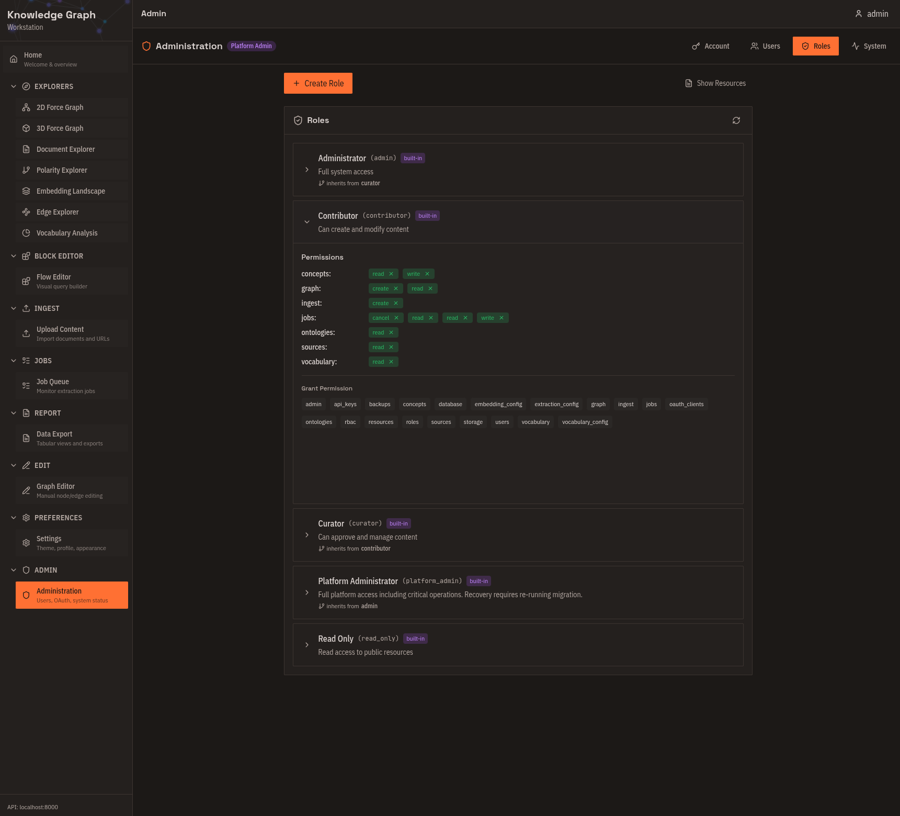

# What is Kappa Graph?

Kappa Graph transforms documents into a queryable graph of concepts and the typed relationships between them. You feed it documents; it extracts concepts, maps edges like IMPLIES, CONTRADICTS, and ENABLES between them, and stores those connections with provenance back to the source text.

---

## How it stores knowledge

Each document goes through a pipeline:

1. Chunk into ~1000-word segments
2. Embed each chunk (1536-dimensional vector)
3. Search existing concepts for semantic matches (default threshold: 0.75 cosine similarity)
4. Extract new concepts and relationships via LLM — with the matched concepts as context
5. Upsert: merge evidence into existing concepts, or create new ones, then store relationships in the graph

Step 4 is why results compound over time. The LLM sees what the graph already knows before it extracts from the next chunk, so it can connect new material to existing concepts rather than creating duplicates. As more documents arrive, concept hit rates climb — a new domain starts near 0%; a mature corpus typically runs 60%+ hit rate.

The graph layer is Apache AGE 1.7.0 on PostgreSQL 18, using openCypher. Every concept and relationship carries a grounding strength score derived from evidence count and source diversity.

---

## What you can do with it

- **Semantic search** — find concepts by meaning, not keywords. "What causes price increases" returns concepts about inflation, supply chains, and monetary policy even without exact word matches.
- **Relationship traversal** — trace how one concept connects to another across multiple hops, with each hop backed by evidence and a confidence score.
- **Polarity analysis** — project concepts onto a spectrum between two poles (e.g., "Modern" ↔ "Traditional") to see where your domain vocabulary falls.
- **Cross-document synthesis** — concepts that appear in different document sets merge automatically when they are semantically equivalent, giving a unified view across sources.
- **Expert curation** — create, edit, or delete concepts and relationships directly to correct extraction errors or add domain knowledge the LLM missed.

---

## Who uses it

**AI agent developers** give agents persistent conceptual memory. A graph of concepts with typed edges and evidence provenance lets an agent query "what architectural decisions enabled RBAC?" and receive structured facts it can reason over — not reconstructed from scratch on every query.

**Development teams** ingest commit history, pull requests, and ADRs into queryable knowledge. The graph shows why architectural decisions enabled or prevented later features, with evidence from the actual source documents.

**Research and knowledge work** benefits when navigating bodies of text — philosophy, science, corporate strategy — by concept relationships rather than by keyword. Connections across papers or documents that share concepts surface automatically.

**Organizations with knowledge silos** connect meeting notes, reports, and strategy documents through shared concepts. Implicit dependencies and contradictions across teams become visible.

---

## The positioning in one place

Kappa Graph sits in the GraphRAG space — combining vector similarity for fuzzy matching with an explicit typed graph for relationship traversal. Vector databases find text similar to a query but do not store how concepts relate to each other. Pure knowledge graphs preserve relationships but require exact entity matches and manual schema definition. Kappa Graph uses vector similarity to identify and merge concepts, then stores the relationships as typed edges in a graph database accessible via openCypher.

---

## Five interfaces, one graph

The same graph is accessible through five interfaces. Choose based on your workflow:

| To… | Use |
|-----|-----|
| Explore visually — clusters, relationships, force layouts | Web Workstation |
| Script batch operations, integrate with CI/CD | CLI (`kg`) |
| Give AI assistants access to your knowledge | MCP Server |
| Browse knowledge like a filesystem with `ls` and `grep` | FUSE Driver |
| Build custom applications | REST API |

---

## Web Workstation tour

The web interface runs at `http://localhost:3000` after deployment. It has two areas: Explorers for visualization and analysis, and Tools for ingestion and curation.

### Explorers

**2D Force Graph**

Force-directed layout with concepts as nodes and relationships as edges. Click a concept to focus on its neighborhood. Filter by relationship type or ontology. Color-code by grounding strength. Use this for initial exploration and understanding relationship density.

**3D Force Graph**

The same graph in three dimensions. Rotate, pan, and zoom through your knowledge space. Clusters that overlap in 2D can separate in 3D. Use this for large graphs (1000+ concepts) and presentations.

**Document Explorer**

Radial tree centered on a source document. See exactly which concepts were extracted, trace how those concepts connect to the rest of the graph, and follow citation trails back to source text. Use this for validating extraction results and audit trails.

**Polarity Explorer**

Define two opposing poles and see where each concept falls on the spectrum between them. Useful for classification without predefined categories and for finding outliers.

**Embedding Landscape**

3D projection of all concept embeddings using t-SNE or UMAP, with automatic DBSCAN cluster detection and TF-IDF-derived cluster names. Right-click any concept for details or to open it in the force graph. Use this for a global overview before detailed exploration.

**Edge Explorer**

System-wide analysis of relationship types: which are heavily used, which are defined but rarely applied. Use this for vocabulary health monitoring and identifying consolidation opportunities.

**Vocabulary Analysis**

Query-specific breakdown of relationship types within a neighborhood. Compare subgraph vocabulary against the system-wide distribution to understand why concepts cluster together.

### Tools

**Flow Editor**

Visual query builder for complex graph traversals. Drag and connect blocks, see the compiled Cypher alongside your design, and save reusable query templates. Use this for complex queries without writing Cypher directly.

**Upload Content**

Drag-and-drop document ingestion. Drop files onto ontology zones, see cost estimates before processing, and batch-submit multiple documents. Supported formats: Text, Markdown, PDF, DOCX, PNG, JPG, WEBP.

**Job Queue**

Monitor extraction jobs and approve or cancel them before processing begins. View cost estimates and actual costs. Use this for workflow control and debugging failed extractions.

**Data Export**

Tabular views and export to CSV or JSON. Track changes between analyses with delta indicators. Use this for analysis reports and sharing results.

**Graph Editor**

Create concepts and relationships directly, fix extraction errors, and remove duplicates. Use this for expert curation and correcting LLM mistakes.

**Administration**

Manage users and roles (admin only), create and revoke OAuth clients, and monitor system health. Use this for multi-user deployments and API key management.

---

## Common workflows

**Explore an unfamiliar ontology**

1. Open **Embedding Landscape** — see the overall shape of the semantic space.
2. Switch to **2D Force Graph** — drill into neighborhoods.
3. Use **Polarity Explorer** — find semantic dimensions.
4. Export from **Data Export** — record findings.

**Validate extracted knowledge**

1. Check **Job Queue** — confirm extraction completed.
2. Open **Document Explorer** — see what was extracted from each document.
3. Review in **2D Force Graph** — spot-check relationships.
4. Fix errors in **Graph Editor**.

---

## Next steps

- Set up the platform: [Self-Host Quick Start](../self-host/quick-start.md)
- Ingest your first documents: [Your First Graph](first-graph.md)
- Connect an AI assistant: [Connect via MCP](mcp-quickstart.md)
