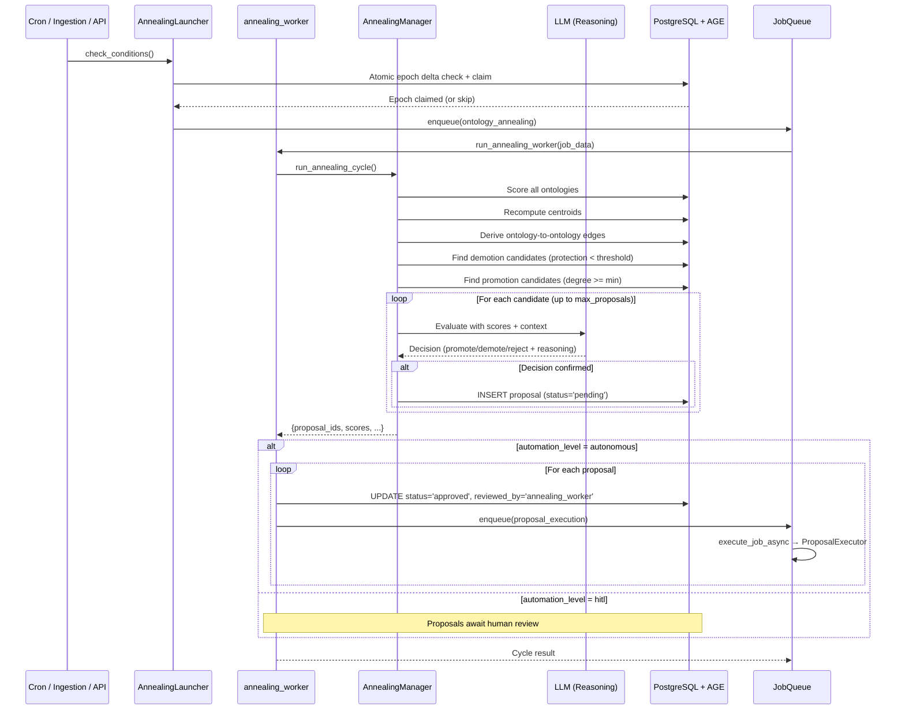

# Scheduled Jobs

The knowledge graph system runs automated maintenance tasks in the background to keep your vocabulary organized and epistemic status measurements up-to-date.

## Overview

Scheduled jobs are background tasks that run on timers to perform system maintenance:

- **Check frequently** (every hour or few hours)
- **Run conditionally** (only when work is needed)
- **Self-regulate** (won't over-execute if nothing to do)

Think of them as smart maintenance workers that check if there's work to do, and only do it when needed.

## Active Scheduled Jobs

### 1. Category Refresh (Every 6 Hours)

**Schedule:** `0 */6 * * *` (Every 6 hours at minute 0)
**Worker:** `vocab_refresh_worker`
**Launcher:** `CategoryRefreshLauncher`

**What it does:**
Re-integrates LLM-generated vocabulary categories back into the main vocabulary system.

**When it runs:**
Only when there are categories with `llm_generated` relationship types that need integration.

**Why you need it:**
When the LLM discovers new relationship types during ingestion, they're initially marked as `llm_generated`. This job periodically checks for these entries and integrates them into the permanent vocabulary, ensuring your graph vocabulary stays current with the concepts being extracted.

**Typical behavior:**
- Checks 4 times per day (every 6 hours)
- Usually runs only when new documents have been ingested
- Might skip 10-20 checks before finding work

---

### 2. Vocabulary Consolidation (Every 12 Hours)

**Schedule:** `0 */12 * * *` (Every 12 hours at minute 0)
**Worker:** `vocab_consolidate_worker`
**Launcher:** `VocabConsolidationLauncher`

**What it does:**
Automatically consolidates vocabulary types that have become inactive or redundant.

**When it runs:**
Only when the ratio of inactive types exceeds a threshold (typically >20% of active types).

**Why you need it:**
As your graph evolves, some vocabulary types naturally become inactive (no longer used in new extractions). When too many inactive types accumulate, they create clutter. This job consolidates them to maintain a clean, efficient vocabulary.

**Hysteresis thresholds:**
- **Consolidate when:** inactive_types > 20% of active_types
- **Don't consolidate when:** inactive_types < 10% of active_types
- **Purpose:** Prevents thrashing (repeated consolidate/expand cycles)

**Typical behavior:**
- Checks twice per day (every 12 hours)
- Usually runs once every week or two
- Self-regulating based on actual vocabulary spread

---

### 3. Epistemic Re-measurement (Every Hour)

**Schedule:** `0 * * * *` (Every hour at minute 0)
**Worker:** `epistemic_remeasurement_worker`
**Launcher:** `EpistemicRemeasurementLauncher`

**What it does:**
Re-measures epistemic status (grounding statistics) for all vocabulary relationship types when significant vocabulary changes have accumulated.

**When it runs:**
Only when the vocabulary change counter delta exceeds the threshold (default: 10 changes).

**Why you need it:**
Epistemic status measurements (WELL_GROUNDED, MIXED_GROUNDING, etc.) are based on sampling relationship edges. As your graph evolves, these measurements become stale. This job automatically refreshes them when enough vocabulary changes have occurred.

**How it works:**
1. Every hour, check the `vocabulary_change_counter` delta
2. If delta >= 10 changes, trigger measurement job
3. Measure all vocabulary types (sample 100 edges per type)
4. Store results to VocabType nodes
5. Reset vocabulary_change_counter delta to 0

**Typical behavior:**
- Checks 24 times per day (every hour)
- Usually runs after vocabulary refresh or consolidation jobs
- Skips most hours when no vocabulary changes have occurred

**Counter-based staleness:**
Instead of using timestamps, this job uses a change counter that increments whenever vocabulary is modified. This ensures measurements stay fresh relative to actual graph changes, not just elapsed time.

---

### 4. Ontology Annealing (Every 6 Hours / Post-Ingestion)

**Schedule:** `0 */6 * * *` (Every 6 hours at minute 0) + post-ingestion trigger
**Worker:** `annealing_worker`
**Launcher:** `AnnealingLauncher`

**What it does:**
Self-organizes the ontology structure by promoting high-degree concepts to ontologies and demoting low-value ontologies back into their neighbors.

**When it runs:**
Only when the epoch delta since the last annealing cycle exceeds the interval threshold (default: 5 epochs). Also triggered after each ingestion job completes.

**Why you need it:**
As documents are ingested, the graph's natural structure diverges from human-imposed ontology boundaries. Some ontologies become weak (few concepts, low coherence), while individual concepts accumulate enough connections to merit their own ontology. Annealing automatically reorganizes this structure.

**Automation modes:**
- **autonomous** (default): Proposals are auto-approved and executed within the same job cycle. Like vocabulary consolidation, math grounds the LLM and the system operates without human intervention.
- **hitl** (diagnostic): Proposals stay at `pending` status for human review via API/CLI. Use this mode to observe what the system would do before trusting it.

Configure via: `UPDATE kg_api.annealing_options SET value = 'hitl' WHERE key = 'automation_level';`

**Annealing cycle flow:**



**Decision criteria:**

| Candidate Type | Threshold | LLM Evaluates |
|---------------|-----------|---------------|
| Demotion | `protection_score < 0.15` | Mass, coherence, protection, concept count, affinity targets |
| Promotion | `concept degree >= 10` | Degree, top neighbors, ontology size, affinity targets |

The LLM can reject candidates that pass numeric thresholds (e.g., directional concepts that shouldn't become ontologies, or small ontologies that serve a distinct purpose despite low scores).

**Typical behavior:**
- Checks every 6 hours AND after each ingestion
- Epoch delta prevents duplicate runs regardless of trigger source
- Usually generates 0-5 proposals per cycle
- In autonomous mode, execution happens within seconds of proposal creation

---

## How Scheduled Jobs Work

### Pattern: Polling with Rare Execution

All scheduled jobs follow this pattern:

```
Schedule fires → Check conditions → Work needed?
                                    ├─ YES → Enqueue job
                                    └─ NO  → Skip (not an error)
```

**Example: Epistemic Re-measurement**
```
Hour 00:00 → Check delta (5)  → Skip (< 10)
Hour 01:00 → Check delta (5)  → Skip (< 10)
Hour 02:00 → Check delta (7)  → Skip (< 10)
Hour 03:00 → Check delta (12) → RUN! (>= 10)
Hour 04:00 → Check delta (0)  → Skip (< 10, just reset)
... many more skips ...
```

**Why this design:**
- ✅ **Responsive:** Don't wait hours when work becomes ready
- ✅ **Efficient:** Condition checks are cheap (~1ms SQL query)
- ✅ **Self-regulating:** Jobs only run when actually needed
- ✅ **No guessing:** Don't need to predict optimal timing

### Schedule as Rate Limit

The schedule interval is really a **minimum spacing** / **cooldown period**, not precise execution time:

- **Schedule:** "Every hour" means "Don't run more often than every hour"
- **Condition:** Determines if work is actually needed
- **Result:** Job runs when needed, but never too frequently

This prevents over-execution while staying responsive to actual system state.

---

## Managing Scheduled Jobs

### Viewing Status

**Database query:**
```sql
SELECT name, schedule_cron, enabled, last_run, last_success, next_run
FROM kg_api.scheduled_jobs
ORDER BY name;
```

**Expected output:**
```
name                    | schedule_cron | enabled | last_run            | last_success        | next_run
------------------------+---------------+---------+---------------------+---------------------+---------------------
category_refresh        | 0 */6 * * *   | t       | 2025-11-17 18:00:00 | 2025-11-17 12:00:00 | 2025-11-18 00:00:00
epistemic_remeasurement | 0 * * * *     | t       | 2025-11-17 19:00:00 | 2025-11-17 15:00:00 | 2025-11-17 20:00:00
vocab_consolidation     | 0 */12 * * *  | t       | 2025-11-17 12:00:00 | 2025-11-16 00:00:00 | 2025-11-18 00:00:00
```

### Viewing Job History

**Check recent jobs created by scheduled tasks:**
```sql
SELECT job_id, job_type, status, created_at, completed_at
FROM kg_api.jobs
WHERE is_system_job = true
  AND job_source = 'scheduled_task'
ORDER BY created_at DESC
LIMIT 10;
```

### Manual Triggering (Testing)

**Force a schedule to run immediately:**
```sql
-- Set next_run to now to trigger on next scheduler check
UPDATE kg_api.scheduled_jobs
SET next_run = NOW()
WHERE name = 'epistemic_remeasurement';
```

**Note:** The job will still check conditions! If conditions aren't met, it will skip.

### Disabling/Enabling Jobs

**Disable a scheduled job:**
```sql
UPDATE kg_api.scheduled_jobs
SET enabled = false
WHERE name = 'epistemic_remeasurement';
```

**Enable a scheduled job:**
```sql
UPDATE kg_api.scheduled_jobs
SET enabled = true, retry_count = 0
WHERE name = 'epistemic_remeasurement';
```

---

## Monitoring

### Understanding Log Messages

**Normal operation:**
```
INFO: ⏰ Schedule 'epistemic_remeasurement' is due, triggering launcher
INFO: ✓ EpistemicRemeasurementLauncher: Vocabulary change delta (12) >= threshold (10)
INFO: ✅ EpistemicRemeasurementLauncher: Enqueued job job_abc123
```

**Healthy skip (no work needed):**
```
INFO: ⏰ Schedule 'epistemic_remeasurement' is due, triggering launcher
INFO: ⏭️  EpistemicRemeasurementLauncher: Delta (5) below threshold (10)
INFO: ⏭️  Schedule 'epistemic_remeasurement' skipped (conditions not met)
```

**Failure with retry:**
```
ERROR: ❌ Schedule 'category_refresh' launcher failed: Database connection timeout
WARNING: ⚠️  Schedule 'category_refresh' failed (retry 1/5), retrying in 2min
```

**Max retries exceeded (schedule disabled):**
```
ERROR: ❌ Schedule 'category_refresh' max retries exceeded, disabling
```

### Key Metrics to Watch

1. **Success Rate:** `last_success` should advance regularly (when work is available)
2. **Skip Rate:** High skip rate is normal and healthy for polling pattern
3. **Retry Count:** Should be 0 most of the time
4. **Enabled Status:** All jobs should be enabled unless manually disabled

### Common Issues

**Schedule disabled after max retries:**
- **Cause:** Job failed 5 times in a row (launcher exception, not skips)
- **Fix:** Investigate error logs, fix root cause, re-enable schedule
- **Prevention:** Monitor `retry_count` and investigate failures early

**Jobs not running even when needed:**
- **Check:** Is schedule enabled? (`enabled = true`)
- **Check:** Is `next_run` in the past? (should be)
- **Check:** Are conditions actually met? (check launcher condition logic)
- **Check:** Is scheduler running? (look for scheduler loop logs every ~60s)

**Multiple jobs created for one schedule:**
- **Cause:** Multi-worker deployment without advisory lock
- **Fix:** Verify PostgreSQL advisory lock is working (see ADR-050)
- **Check:** Logs should show only one worker acquiring scheduler lock per minute

---

## Performance Impact

All scheduled jobs are designed to have minimal performance impact:

**Condition Checks:**
- **Frequency:** Every schedule interval (hourly, every 6h, every 12h)
- **Cost:** ~1ms SQL query
- **Impact:** Negligible

**Job Execution:**
- **Frequency:** Only when conditions met (rarely compared to checks)
- **Cost:** Depends on job (epistemic measurement ~10-30s, consolidation ~5-60s)
- **Impact:** Runs asynchronously, doesn't block user operations

**Database Load:**
- Scheduled jobs use the same job queue as manual operations
- No additional database connections or tables needed
- Advisory locks prevent duplicate execution in multi-worker setups

---

## Customizing Thresholds

### Epistemic Re-measurement Threshold

**Default:** Delta >= 10 changes

**To change:**
The threshold is currently hardcoded in `EpistemicRemeasurementLauncher.__init__()`. To adjust:

1. Edit `api/api/launchers/epistemic_remeasurement.py`
2. Change `threshold` parameter in `__init__()` (default: 10)
3. Restart API server

**Considerations:**
- **Lower threshold (5):** More frequent measurements, fresher epistemic status
- **Higher threshold (20):** Less frequent measurements, reduced overhead
- **Recommended range:** 5-20 changes

### Vocabulary Consolidation Thresholds

**Default:**
- Consolidate when inactive > 20% of active
- Don't consolidate when inactive < 10% of active

**To change:**
Edit `VocabConsolidationLauncher.check_conditions()` in `api/api/launchers/vocab_consolidation.py`.

---

## Related Documentation

- **[ADR-050: Scheduled Jobs System](../architecture/ADR-050-scheduled-jobs-system.md)** - Technical architecture and design decisions
- **[ADR-065: Vocabulary-Based Provenance](../architecture/ADR-065-vocabulary-based-provenance-relationships.md)** - Epistemic status measurement design
- **[ADR-200: Annealing Ontologies](../architecture/database-schema/ADR-200-annealing-ontologies-self-organizing-knowledge-graph-structure.md)** - Self-organizing graph structure design
- **[Vocabulary Lifecycle Guide](./VOCABULARY_LIFECYCLE.md)** - Vocabulary consolidation flow and grounded LLM decisions
- **[Epistemic Status Filtering Guide](./EPISTEMIC-STATUS-FILTERING.md)** - Using epistemic status in queries

---

**Last Updated:** 2026-02-08
