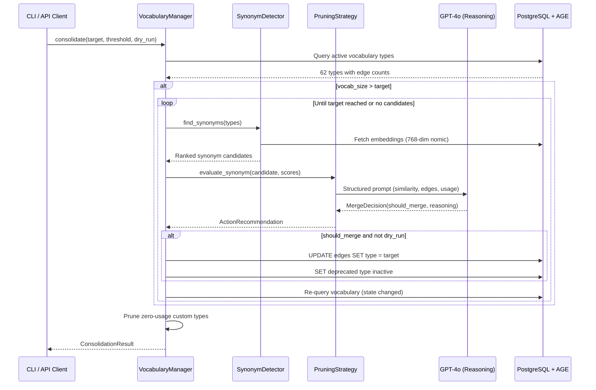
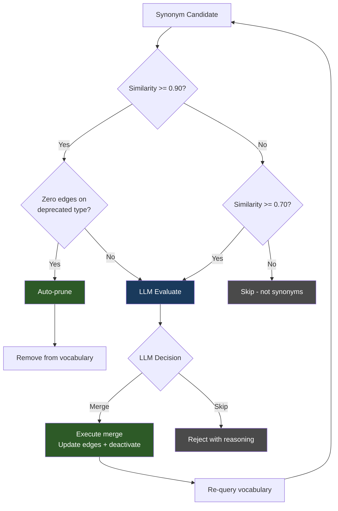
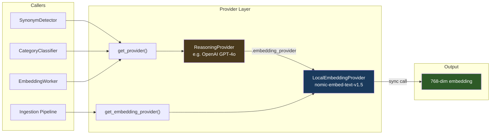

# Understanding: Vocabulary Lifecycle & Grounded LLM Decisions

Working reference for why the vocabulary management system works the way it does.
Written collaboratively (human + Claude) on 2026-02-08 during product readiness work.
Updated 2026-02-08 after wiring LLM decisions end-to-end and validating with real content.

## The Problem

As documents are ingested, the LLM invents relationship types organically —
IMPLIES, SUPPORTS, HISTORICALLY_PRECEDED, etc. Over time the vocabulary sprawls:
near-duplicates appear, some types accumulate zero edges, others become
structurally irrelevant. Something needs to govern this lifecycle.

## The Key Insight

The system already computes objective mathematical scores for every relationship
type: grounding strength, similarity to other types, edge counts, traversal
frequency, bridge importance, polarity positioning, epistemic status. These
numbers describe reality.

A human reviewing vocabulary decisions would look at these same numbers and
compute a function: "low value, no bridges, similar to another type → merge."
If the human ignored the numbers and went with gut feeling, they'd be
inconsistent, biased, and worse than the math.

An LLM, given the same numbers as context, computes the same function — but
also brings reasoning that a pure threshold cannot: "these types look
numerically similar but capture different semantic intent." This is the same
external reasoning a human would bring, and a capable LLM does it at
comparable quality.

**Therefore: math grounds the LLM, the LLM reasons over the math, and the
combination is more consistent than a human in the loop.**

The human's role is bringing external information *into* the graph (new
documents, new knowledge domains), not reviewing vocabulary hygiene decisions
that the system can make objectively.

## The Design: Math → LLM → Execute

1. **Score**: Mathematical evaluation of each relationship type (value score,
   edge count, bridge count, similarity to other types, traversal patterns)
2. **Present**: Format the scores as structured context in a prompt that asks
   the LLM to reason about the decision (merge? deprecate? prune? skip?)
3. **Decide**: The LLM reads real numbers and applies judgment. The grounding
   prevents drift — the LLM can't hallucinate that a zero-edge type is
   important when the math says otherwise
4. **Execute**: Carry out the decision against the database

The three-tier review model (automatic / AI / human) still exists but the
tiers mean:
- **Automatic**: Pure math, no ambiguity (zero-edge type → prune)
- **AI (LLM-grounded)**: Math + reasoning for moderate cases
- **Human**: Optional audit/override, not the primary path

## Current State (Post-Wiring)

The full pipeline is now operational:

- **LLM calls are live.** `llm_evaluate_merge()` in `pruning_strategies.py`
  calls GPT-4o with structured prompts containing embedding similarity, edge
  counts, and usage data. The LLM returns merge/skip decisions with reasoning.
- **Execute path works.** Merges update edges in the graph and deactivate the
  deprecated type. Pruning removes zero-usage types entirely.
- **Live consolidation loop** in `vocabulary_manager.py` processes candidates
  one-at-a-time with re-query (re-fetches similarity after each merge since
  the vocabulary state changes). Dry-run evaluates all candidates without
  re-query.
- **Target-gated**: Live mode skips work when vocab size is already at or
  below target. This means `--target 90` with 63 types does nothing. Use a
  target below current size to trigger merges, or `--dry-run` to preview.

### Embedding Architecture

All embedding generation flows through a single consistent path:

- `get_provider()` returns the reasoning provider with `embedding_provider`
  injected (the local nomic model).
- `generate_embedding()` is **sync** across all providers — never awaited.
- `OpenAIProvider.generate_embedding()` delegates to `self.embedding_provider`
  and raises `RuntimeError` if none is configured (no silent fallback).
- All embeddings are 768-dim from `nomic-ai/nomic-embed-text-v1.5`.
- Dimension guards in `SynonymDetector._cosine_similarity()` catch mismatches.
- Stale embedding detection in `_get_edge_type_embedding()` auto-regenerates
  when dimensions don't match the expected size.

### CLI UX

- `kg vocab consolidate` — executes live (merge + prune)
- `kg vocab consolidate --dry-run` — preview only
- `kg vocab consolidate --target N` — set target size (default 90)
- `kg job cleanup -s pending` — resolves to `awaiting_approval` via shared
  `resolveStatusFilter()` utility. All job subcommands use friendly names.

## Validated Behavior

Tested with 8 real documents (essays + enterprise-as-code), 243 concepts,
597 source embeddings, 62 vocabulary types:

- Consolidation correctly merges semantically equivalent types
  (DEFINED_AS→DEFINED, EQUIVALENT_TO→EQUIVALENT, INCREASES→ENHANCES)
- Correctly rejects directional inverses (HAS_PART/PART_OF)
- Correctly rejects semantic distinctions (CONTRASTS_WITH/EQUIVALENT_TO)
- Self-referencing merges (same→same) filtered from display
- Pruning removes zero-usage custom types after consolidation

## Remaining Considerations

- The grounded-LLM-decision pattern generalizes — ontology annealing already
  uses similar logic. Could warrant an ADR if we formalize the pattern.
- `get_pending_reviews()` and `approve_action()` exist but lack persistence.
  Low priority since the primary path is automated.
