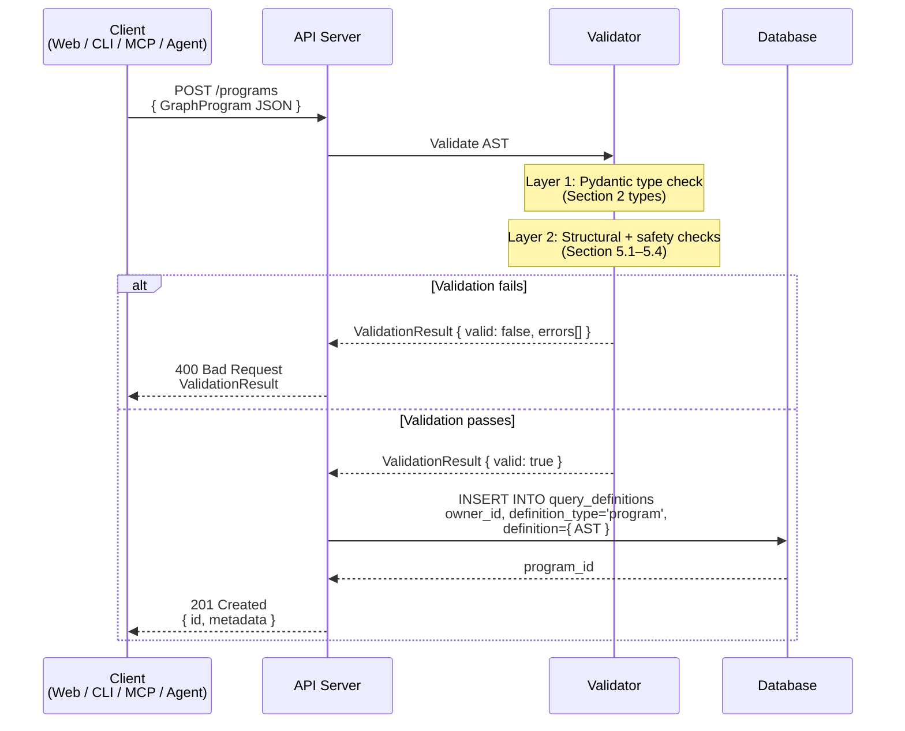
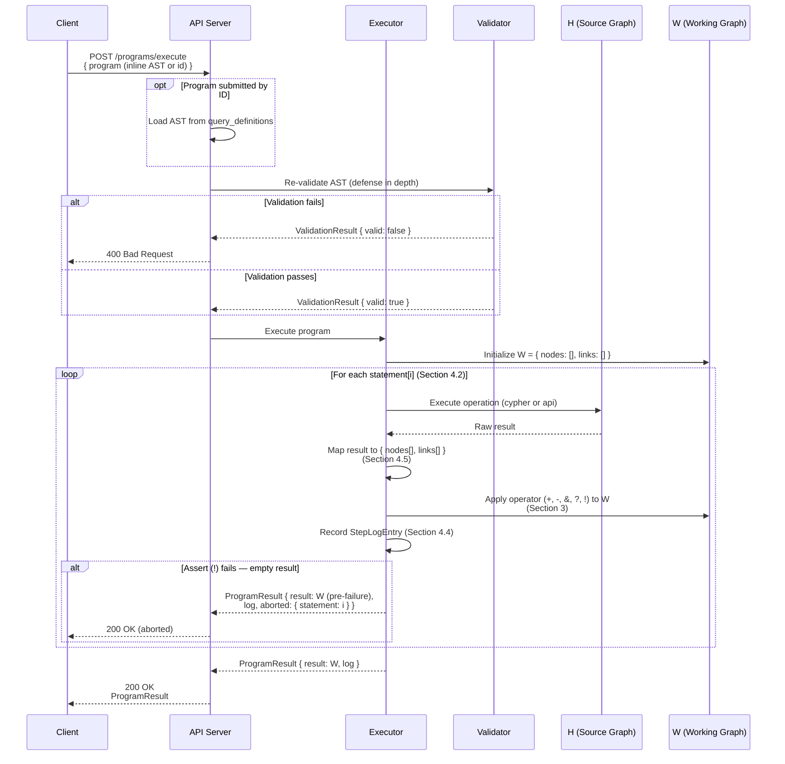
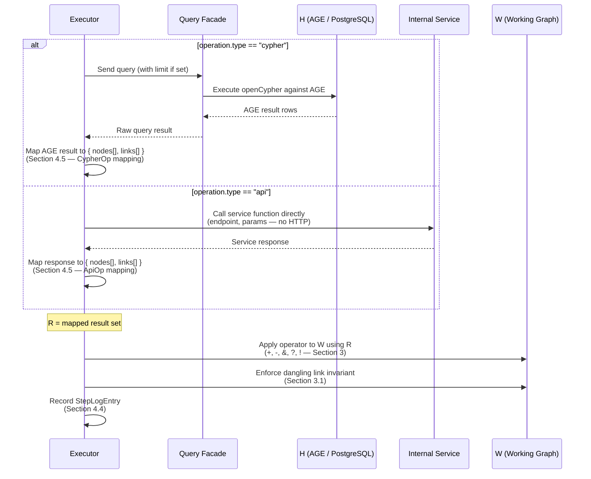

# GraphProgram DSL -- Language Specification

**Version:** 1.0-draft
**Date:** 2026-02-05
**Status:** Draft
**Canonical ADR:** [ADR-500](../architecture/query-search/ADR-500-graph-program-dsl-and-ast-architecture.md)

---

## 1. Overview

GraphProgram is a domain-specific query composition language for the knowledge
graph system. It orchestrates openCypher queries and REST API calls through a
fixed set of operators that apply set algebra to a mutable working graph.

GraphProgram is **not** a general-purpose programming language. It has no
iteration, no user-defined abstractions, no mutable variables, and no recursion.
Every program has a statically-determinable maximum operation count.

The canonical representation is a JSON AST. A human-readable text DSL exists as
a serialization format. Both representations compile to the same execution
semantics defined in this document.

### 1.1 Terminology

| Term | Definition |
|------|-----------|
| **H** (Source Graph) | The persistent knowledge graph stored in Apache AGE. Immutable during program execution. |
| **W** (Working Graph) | The ephemeral subgraph constructed by program execution. Mutable. Starts empty. |
| **Statement** | A single step in a program: an operator applied to the result of an operation. |
| **Operator** | One of `+`, `-`, `&`, `?`, `!`. Defines how an operation's result modifies W. |
| **Operation** | The query or API call that produces a result set. Types: `cypher`, `api`, `conditional`. |
| **Result Set** | The `{ nodes[], links[] }` value produced by executing an operation against H (or evaluating a condition against W). |
| **WorkingGraph** | The type alias for W's in-memory representation. See [Section 3.1](#31-working-graph-shape). |

---

## 2. Type Definitions

All types are expressed in TypeScript notation. The JSON AST uses identical
field names and structure.

### 2.1 GraphProgram (Root)

```typescript
interface GraphProgram {
  version: 1;
  metadata?: ProgramMetadata;
  params?: ParamDeclaration[];    // Phase 2
  statements: Statement[];        // non-empty; min 1
}
```

| Field | Type | Required | Description |
|-------|------|----------|-------------|
| `version` | `1` (literal) | yes | Schema version. Must be the integer `1`. |
| `metadata` | `ProgramMetadata` | no | Descriptive metadata. Enriched by the server at storage time if omitted. |
| `params` | `ParamDeclaration[]` | no | Parameter declarations for substitution (Phase 2). |
| `statements` | `Statement[]` | yes | Ordered list of statements. Must contain at least one element. |

### 2.2 ProgramMetadata

```typescript
interface ProgramMetadata {
  name?: string;
  description?: string;
  author?: 'human' | 'agent' | 'system';
  created?: string;                // ISO 8601 timestamp
}
```

All fields are optional. `author` indicates the origin of the program for
auditing and UI display. `created` is set by the system on first save if not
provided.

### 2.3 Statement

```typescript
interface Statement {
  op: Operator;
  operation: CypherOp | ApiOp | ConditionalOp;
  label?: string;
  block?: BlockAnnotation;        // Phase 3
}
```

| Field | Type | Required | Description |
|-------|------|----------|-------------|
| `op` | `Operator` | yes | The set-algebra operator to apply. |
| `operation` | `CypherOp \| ApiOp \| ConditionalOp` | yes | The operation to execute. Dispatched on `operation.type`. |
| `label` | `string` | no | Human-readable description of this step. |
| `block` | `BlockAnnotation` | no | Source block annotation for decompilation (Phase 3). |

### 2.4 Operator

```typescript
type Operator = '+' | '-' | '&' | '?' | '!';
```

| Operator | Name | Summary |
|----------|------|---------|
| `+` | Union (Add) | Merge result set into W. |
| `-` | Difference (Subtract) | Remove result set from W. |
| `&` | Intersect | Keep only the overlap between W and result set. |
| `?` | Optional | Same as `+`, but empty result is a silent no-op. |
| `!` | Assert | Same as `+`, but empty result aborts the program. |

Full operator semantics are defined in [Section 3](#3-operator-semantics).

### 2.5 CypherOp

```typescript
interface CypherOp {
  type: 'cypher';
  query: string;
  limit?: number;
}
```

| Field | Type | Required | Description |
|-------|------|----------|-------------|
| `type` | `'cypher'` (literal) | yes | Discriminator. |
| `query` | `string` | yes | An openCypher `MATCH...RETURN` statement. Must be a read-only query. |
| `limit` | `number` | no | Maximum number of result rows. Applied as `LIMIT` if not already present in `query`. Must be a positive integer if provided. |

**Constraints on `query`:**
- Must be a read-only statement. `CREATE`, `SET`, `DELETE`, `MERGE`, `REMOVE`,
  and `DETACH DELETE` are prohibited.
- Must not contain procedural calls that modify state.
- Subject to the query safety rules defined in [Section 5.3](#53-cypher-safety).

### 2.6 ApiOp

```typescript
interface ApiOp {
  type: 'api';
  endpoint: string;
  params: Record<string, unknown>;
}
```

| Field | Type | Required | Description |
|-------|------|----------|-------------|
| `type` | `'api'` (literal) | yes | Discriminator. |
| `endpoint` | `string` | yes | Internal API endpoint path. Must be in the allowed endpoint set (see [Section 5.4](#54-api-endpoint-allowlist)). |
| `params` | `Record<string, unknown>` | yes | Parameters passed to the endpoint. Schema depends on the endpoint. |

**Execution:** `ApiOp` statements are dispatched as internal function calls
within the API worker. They do **not** generate HTTP requests. The executor
invokes the underlying service function directly (vector search, source search,
epistemic status, etc.).

### 2.7 ConditionalOp (Phase 2)

> **Status:** Phase 2. Defined here for forward compatibility. Implementations
> SHOULD reject `ConditionalOp` until Phase 2 is active.

```typescript
interface ConditionalOp {
  type: 'conditional';
  condition: Condition;
  then: Statement[];
  else?: Statement[];
}
```

| Field | Type | Required | Description |
|-------|------|----------|-------------|
| `type` | `'conditional'` (literal) | yes | Discriminator. |
| `condition` | `Condition` | yes | Predicate evaluated against current W state. |
| `then` | `Statement[]` | yes | Statements to execute if condition is true. |
| `else` | `Statement[]` | no | Statements to execute if condition is false. |

Nested conditionals are permitted up to a maximum depth (default: 3).

### 2.8 Condition (Phase 2)

> **Status:** Phase 2.

```typescript
type Condition =
  | { test: 'has_results' }
  | { test: 'empty' }
  | { test: 'count_gte'; value: number }
  | { test: 'count_lte'; value: number }
  | { test: 'has_ontology'; ontology: string }
  | { test: 'has_relationship'; type: string }
  ;
```

| Test | Evaluates to `true` when... |
|------|-----------------------------|
| `has_results` | W contains at least one node. |
| `empty` | W contains zero nodes. |
| `count_gte` | W node count >= `value`. |
| `count_lte` | W node count <= `value`. |
| `has_ontology` | At least one node in W has `ontology === ontology`. |
| `has_relationship` | At least one link in W has `relationship_type === type`. |

Conditions are pure predicates. They read W but never modify it.

### 2.9 ParamDeclaration (Phase 2)

> **Status:** Phase 2.

```typescript
interface ParamDeclaration {
  name: string;
  type: 'string' | 'number';
  default?: string | number;
}
```

Parameters declared here can be referenced as `$name` in `CypherOp.query`
strings and `ApiOp.params` values. They are resolved once at execution time
before any statement runs.

### 2.10 BlockAnnotation (Phase 3)

> **Status:** Phase 3.

```typescript
interface BlockAnnotation {
  blockType: BlockType;
  params: Record<string, unknown>;
}
```

`BlockType` is one of: `search`, `selectConcept`, `neighborhood`, `pathTo`,
`filterOntology`, `filterEdge`, `filterNode`, `and`, `or`, `not`, `limit`,
`vectorSearch`, `sourceSearch`, `epistemicFilter`, `enrich`.

Block annotations enable round-trip between text DSL and visual block editor.
They are metadata only and do not affect execution semantics.

---

## 3. Operator Semantics

All operators follow the same execution pattern:

1. Execute the operation to produce a **result set** R = `{ nodes: RawNode[], links: RawLink[] }`.
2. Apply the operator to modify W using R.

The sections below define step 2 for each operator.

### 3.1 Working Graph Shape

W conforms to the `WorkingGraph` interface:

```typescript
interface WorkingGraph {
  nodes: RawNode[];
  links: RawLink[];
}
```

> **Implementation note:** `WorkingGraph` corresponds to `RawGraphData` in the
> current web codebase (`cypherResultMapper.ts`). `RawNode` corresponds to
> `RawGraphNode` and `RawLink` to `RawGraphLink`. The spec names are the
> canonical names for cross-document reference; implementations may alias them.

**Node identity** is determined by `concept_id` (string). Two nodes are
considered the same node if and only if they share the same `concept_id`.

```typescript
interface RawNode {
  concept_id: string;       // primary identity key
  label: string;
  ontology?: string;
  description?: string;
  search_terms?: string[];
  grounding_strength?: number;
  diversity_score?: number;
  evidence_count?: number;
}
```

**Link identity** is determined by the compound key
`(from_id, relationship_type, to_id)`. Two links are considered the same link
if and only if all three components match.

```typescript
interface RawLink {
  from_id: string;          // concept_id of source node
  to_id: string;            // concept_id of target node
  relationship_type: string; // e.g. "IMPLIES", "SUPPORTS", "CONTRADICTS"
  category?: string;
  confidence?: number;
  grounding_strength?: number;
}
```

**Invariant:** W.links MUST only reference nodes present in W.nodes. After
every operator application, any link whose `from_id` or `to_id` does not
correspond to a `concept_id` in W.nodes MUST be removed. This is the
**dangling link invariant**.

**Initial state:** W starts as `{ nodes: [], links: [] }` before the first
statement executes.

### 3.2 `+` (Union / Add)

**Semantics:** Merge the result set R into W. Nodes and links already present
in W are deduplicated; new nodes and links are appended.

**Algorithm:**

```
W.nodes := W.nodes + { n in R.nodes | n.concept_id not in W.node_ids }
W.links := W.links + { l in R.links | (l.from_id, l.relationship_type, l.to_id) not in W.link_keys }
```

**Deduplication rule:** When a node in R has the same `concept_id` as an
existing node in W, the existing node is kept unchanged. R's copy is discarded.
The same applies to links with matching compound keys.

**Edge cases:**

| Condition | Behavior |
|-----------|----------|
| W is empty | W becomes R (all nodes and links from R are added). |
| R is empty | W is unchanged. |
| R contains nodes already in W | Duplicates are silently discarded. |
| R contains links whose endpoints are not in R.nodes but ARE in W.nodes | Links are added (endpoints are satisfied by existing W nodes). |
| R contains links whose endpoints are in neither R.nodes nor W.nodes | Links are discarded (dangling link invariant). |

### 3.3 `-` (Difference / Subtract)

**Semantics:** Remove from W all nodes that appear in R. Then remove all links
in W that reference any removed node (cascade removal of dangling links).

**Algorithm:**

```
remove_ids  := { n.concept_id | n in R.nodes }
W.nodes     := { n in W.nodes | n.concept_id not in remove_ids }
remaining   := { n.concept_id | n in W.nodes }       -- after removal
W.links     := { l in W.links | l.from_id in remaining AND l.to_id in remaining }
```

**Key behavior:** The subtract operator targets **nodes**. Links are removed
only as a consequence of their endpoint nodes being removed (dangling link
invariant enforcement). R.links is ignored for the purpose of removal --
link removal is driven entirely by node removal.

**Edge cases:**

| Condition | Behavior |
|-----------|----------|
| W is empty | No-op. W remains empty. |
| R is empty | W is unchanged. |
| R contains nodes not in W | Those nodes are silently ignored. |
| Removing a node causes links to dangle | Dangling links are removed. |
| R contains only links (no nodes) | W is unchanged. Node removal drives link removal. |

### 3.4 `&` (Intersect)

**Semantics:** Keep only W nodes whose `concept_id` appears in R.nodes. Remove
all other nodes from W. Then enforce the dangling link invariant.

**Algorithm:**

```
keep_ids  := { n.concept_id | n in R.nodes }
W.nodes   := { n in W.nodes | n.concept_id in keep_ids }
remaining := { n.concept_id | n in W.nodes }
W.links   := { l in W.links | l.from_id in remaining AND l.to_id in remaining }
```

**Key behavior:** Intersection retains W's node objects (with their original
properties), not R's copies. R acts as a filter -- it determines which
concept_ids survive, but the surviving node data comes from W.

**Edge cases:**

| Condition | Behavior |
|-----------|----------|
| W is empty | No-op. W remains empty (intersection of empty set with anything is empty). |
| R is empty | W is cleared to empty (intersection with empty set is empty). |
| R and W share no nodes | W is cleared to empty. |
| All W nodes appear in R | W is unchanged (link set may shrink if R-only endpoints existed). |

### 3.5 `?` (Optional)

**Semantics:** Execute the operation. If R is non-empty, apply `+` (union)
semantics. If R is empty, do nothing. Never produces an error due to empty
results.

**Algorithm:**

```
IF R.nodes is non-empty OR R.links is non-empty:
  apply + (union) semantics with R
ELSE:
  no-op
```

**Use case:** Exploratory steps where the absence of results is acceptable and
should not interrupt program execution.

### 3.6 `!` (Assert)

**Semantics:** Execute the operation. If R is non-empty, apply `+` (union)
semantics. If R is empty, **abort the entire program** with an error.

**Algorithm:**

```
IF R.nodes is non-empty OR R.links is non-empty:
  apply + (union) semantics with R
ELSE:
  abort program with error { statement: <index>, reason: "assertion failed: empty result" }
```

**Abort behavior:** When an assert fails:
- Program execution stops immediately. No further statements are processed.
- W retains the state it had **before** the failing statement.
- The response includes an `aborted` field (see [Section 4.3](#43-program-result)).

**Use case:** Guard steps that must succeed for downstream statements to be
meaningful. For example, asserting that a root concept exists before expanding
its neighborhood.

---

## 4. Execution Model

### 4.1 Execution Environment

Programs are submitted to the API as JSON ASTs via `POST /programs/execute`.
The executor runs entirely server-side. Clients are consumers of results, not
executors.

**Two-graph model:**
- **H** (Source Graph): The persistent Apache AGE knowledge graph. Read-only
  during program execution. All `CypherOp` queries run against H.
- **W** (Working Graph): In-memory mutable graph built during execution.
  Initialized to `{ nodes: [], links: [] }`.

### 4.2 Statement Processing

Statements execute **sequentially** in array order. There is no parallel
execution, no jumps, and no back-references.

For each statement at index `i`:

1. **Resolve parameters** -- substitute `$name` references in `CypherOp.query`
   and `ApiOp.params` with provided or default values (Phase 2).
2. **Evaluate condition** -- if `operation.type === 'conditional'`, evaluate
   the condition against current W and select the `then` or `else` branch
   (Phase 2).
3. **Execute operation** -- dispatch on `operation.type`:
   - `cypher`: Execute `query` against H via the query facade. Apply `limit`
     if specified.
   - `api`: Call the internal service function for `endpoint` with `params`.
   - `conditional`: Execute the selected branch's statements recursively.
4. **Map result** -- convert the raw query/API response to `WorkingGraph`
   format (`{ nodes: RawNode[], links: RawLink[] }`).
5. **Apply operator** -- modify W according to the operator semantics
   ([Section 3](#3-operator-semantics)).
6. **Record step log** -- capture the step metadata for the response.

### 4.3 Program Result

```typescript
interface ProgramResult {
  result: WorkingGraph;
  log: StepLogEntry[];
  aborted?: {
    statement: number;
    reason: string;
  };
}
```

| Field | Type | Description |
|-------|------|-------------|
| `result` | `WorkingGraph` | The final state of W after all statements (or after abort). |
| `log` | `StepLogEntry[]` | Per-statement execution record, in execution order. |
| `aborted` | `object` | Present only if an `!` (assert) operator failed. Contains the statement index and reason. |

### 4.4 Step Log Entry

```typescript
interface StepLogEntry {
  statement: number;
  op: Operator;
  operation_type: 'cypher' | 'api' | 'conditional';
  branch_taken?: 'then' | 'else';
  nodes_affected: number;
  links_affected: number;
  w_size: { nodes: number; links: number };
  duration_ms: number;
}
```

| Field | Type | Description |
|-------|------|-------------|
| `statement` | `number` | Zero-based index into `program.statements`. |
| `op` | `Operator` | The operator that was applied. |
| `operation_type` | `string` | Discriminator of the executed operation. |
| `branch_taken` | `string` | For conditionals: which branch was selected. |
| `nodes_affected` | `number` | Number of nodes added, removed, or retained by this step. |
| `links_affected` | `number` | Number of links added, removed, or retained by this step. |
| `w_size` | `object` | Node and link count in W **after** this step. |
| `duration_ms` | `number` | Wall-clock execution time for this step in milliseconds. |

### 4.5 Result Set Mapping

Both `CypherOp` and `ApiOp` produce a result set that must be mapped to
`WorkingGraph` before operator application.

**CypherOp mapping** follows the `mapCypherResultToRawGraph` logic:

1. Build an internal AGE ID to `concept_id` map from returned nodes.
2. Map nodes: `concept_id` = `properties.concept_id` or fallback to AGE `id`.
3. Map links: translate AGE internal `from_id`/`to_id` to `concept_id` values.
   Discard links whose endpoints are not in the returned node set.
4. Map `type` (AGE relationship label) to `relationship_type` (RawLink field).

**ApiOp mapping** depends on the endpoint. Each allowed endpoint returns data
that the executor maps to `WorkingGraph`. The mapping is endpoint-specific but
the output shape is always `{ nodes: RawNode[], links: RawLink[] }`.

### 4.6 Sequence Diagrams

The following diagrams illustrate the three key GraphProgram flows: how programs
are validated and stored (notarization), how stored or inline programs execute
end-to-end, and what happens inside a single statement dispatch. Cross-references
to the relevant spec sections are noted in each diagram. For operator semantics
see [Section 3](#3-operator-semantics); for validation rules see
[Section 5](#5-validation-rules).

#### Diagram 1: Program Notarization



#### Diagram 2: Program Execution



#### Diagram 3: Statement Dispatch Detail



---

## 5. Validation Rules

Programs MUST be validated before execution. The API provides a
`POST /programs/validate` endpoint that returns structured errors.

The authoritative validation rule catalog, including rule IDs (V001, V002, ...),
error messages, and severity levels, is defined in
[validation.md](validation.md). This section describes the categories and
semantics of validation; refer to the catalog for the exhaustive rule list.

### 5.1 Structural Validation

Structural rules verify that the AST is well-formed before any semantic checks:

- `version` must equal `1`.
- `metadata`, if present, must be a valid `ProgramMetadata` object. Defaults to empty if omitted.
- `statements` must be a non-empty array.
- Each Statement must have a valid `op` (one of `+`, `-`, `&`, `?`, `!`).
- Each Statement must have an `operation` with a known `type` discriminator.
- `CypherOp.query` must be a non-empty string.
- `CypherOp.limit`, if present, must be a positive integer.
- `ApiOp.endpoint` must be a non-empty string.
- `ApiOp.params` must be an object.
- `ConditionalOp.then` must be a non-empty array of Statement.

### 5.2 Boundedness Validation

Boundedness rules ensure every program has a statically-determinable cost:

- Total operation count must be computable from the AST alone.
- Total operation count must not exceed the configured limit (default: 100).
- Conditional nesting depth must not exceed the configured limit (default: 3).

**Operation count computation:** Each `CypherOp` and `ApiOp` contributes 1 to
the count. For `ConditionalOp`, the count is `max(count(then), count(else))`.
The total is the sum across all top-level statements.

### 5.3 Cypher Safety

Cypher queries are validated through the query safety facade (ADR-048):

- No write clauses (`CREATE`, `SET`, `DELETE`, `MERGE`, `REMOVE`, `DETACH DELETE`, `DROP`).
- Variable-length path traversals (`[*N..M]`) must have an upper bound within `MAX_VARIABLE_PATH_LENGTH` (default: 6).

### 5.4 API Endpoint Allowlist

`ApiOp.endpoint` values must be in the permitted set. The initial allowlist:

| Endpoint | Description | Required Params | Optional Params |
|----------|-------------|-----------------|-----------------|
| `/search/concepts` | Vector similarity search | `query` (str) | `min_similarity` (number), `limit` (int), `ontology` (str), `offset` (int) |
| `/search/sources` | Source passage search | `query` (str) | `min_similarity` (number), `limit` (int), `ontology` (str), `offset` (int) |
| `/vocabulary/status` | Epistemic status lookup | *(none)* | `relationship_type` (str), `status_filter` (str) |
| `/concepts/batch` | Batch concept enrichment | `concept_ids` (list) | `include_details` (bool) |
| `/concepts/details` | Concept detail retrieval | `concept_id` (str) | `include_diversity` (bool), `include_grounding` (bool) |
| `/concepts/related` | Neighborhood exploration | `concept_id` (str) | `max_depth` (int), `relationship_types` (list) |

Any `endpoint` value not in this set produces a validation error. Parameter
types are enforced at validation time.

### 5.5 Parameter Validation (Phase 2)

- All `$name` references in queries must resolve to a declared param or a provided value.
- Param `type` must be `'string'` or `'number'`.
- Provided values must match their declared type.

### 5.6 Validation Response

```typescript
interface ValidationResult {
  valid: boolean;
  errors: ValidationIssue[];
  warnings: ValidationIssue[];
}

interface ValidationIssue {
  rule_id: string;            // catalog rule ID, e.g. "V010"
  severity: 'error' | 'warning';
  statement?: number;         // zero-based index, absent for program-level errors
  field?: string;             // dotted path, e.g. "operation.query"
  message: string;
}
```

---

## 6. Program Structure Constraints

These constraints are inherent properties of the language, not configurable
limits.

### 6.1 Sequential Execution

Statements execute in array order. There are no parallel execution primitives,
no `GOTO`, and no back-references. Statement `i+1` always sees the W produced
by statement `i`.

### 6.2 Deterministic Operation Count

The maximum number of operations a program will execute is computable from the
AST alone, without executing any statement. This is guaranteed by the absence
of iteration and the static structure of conditional branches (both branches
are present in the AST, so the longer one bounds the count).

### 6.3 No Iteration

There is no loop, repeat, or `WHILE` construct. Every program is a finite
sequence. If a use case requires iterative graph expansion, it should be
implemented as a system-provided smart block (`ApiOp`) with internal resource
controls, not as a language primitive.

### 6.4 No User-Defined Abstractions

There is no `DEFINE BLOCK`, no macros, no function definitions. The operation
vocabulary is fixed by the system: `cypher`, `api`, and `conditional`.

### 6.5 No Mutable Variables

Parameters are substituted once before execution begins (Phase 2). There are no
assignment statements and no way to capture intermediate results into named
bindings. Internal compilation variables (`c0`, `neighbor1`) are artifacts of
block compilation, not user-facing.

### 6.6 No Recursion

Programs are linear sequences (or DAGs when conditional branches are present).
A statement cannot reference itself or create cycles in the execution flow.

---

## 7. Text DSL

The text DSL is a human-readable serialization of the JSON AST. It is the
authoring format for the Cypher editor. The JSON AST is always the canonical
form.

### 7.1 Grammar

```
program       := header? statement+
header        := metadata_line+ blank_line
metadata_line := '--' SP key ':' SP value NL
statement     := comment* operator SP body ';' NL
comment       := '--' text NL
operator      := '+' | '-' | '&' | '?' | '!'
body          := cypher_body | api_body | conditional_body
cypher_body   := <openCypher MATCH...RETURN statement>
api_body      := '@api' SP endpoint SP json_params
conditional_body := 'IF' SP condition SP 'THEN' SP '{' NL statement+ '}' (SP 'ELSE' SP '{' NL statement+ '}')?
condition     := 'has_results' | 'empty'
               | 'count_gte' SP number | 'count_lte' SP number
               | 'has_ontology' SP string | 'has_relationship' SP string

param_decl    := '@param' SP name ':' SP type ('=' SP default)?
block_annot   := '--' SP '@block' SP block_type (SP key '=' value)*
```

`SP` = one or more spaces. `NL` = newline. `blank_line` = a line containing
only whitespace.

### 7.2 Syntax Elements

| Element | Syntax | Example |
|---------|--------|---------|
| Operator prefix | `+`, `-`, `&`, `?`, `!` at start of statement | `+ MATCH ...` |
| Cypher statement | Standard openCypher, terminated by `;` | `+ MATCH (c:Concept)-[r]-(n) RETURN c, r, n;` |
| API call | `@api <endpoint> <json>;` | `+ @api /search/concepts {"query": "org", "limit": 10};` |
| Parameter declaration | `@param <name>: <type> = <default>` | `@param concept_name: string = "default"` |
| Conditional | `IF <test> THEN { ... } ELSE { ... };` | `? IF has_results THEN { + MATCH ...; };` |
| Block annotation | `-- @block <type> <k>=<v>...` | `-- @block search query="test"` |
| Metadata | `-- Key: value` in header | `-- Exploration: My Query` |
| Comment | `--` without `@` prefix | `-- This is a comment` |
| Default operator | Bare statement (no prefix) treated as `+` | `MATCH (c) RETURN c;` |

### 7.3 Parsing Rules

1. Lines beginning with `--` that do not contain `@param` or `@block` are
   comments and are discarded during parsing.
2. Blank lines between statements act as statement separators.
3. A statement begins when a line starts with an operator character (`+`, `-`,
   `&`, `?`, `!`) followed by a space, or with a non-comment, non-blank token
   (default `+`).
4. A statement ends at the `;` terminator.
5. Multi-line statements are supported: continuation lines (lines that do not
   start with an operator or `--`) are appended to the current statement.

### 7.4 Round-Trip Fidelity

Text DSL -> JSON AST -> Text DSL round-trip preserves:
- Operator and operation semantics (exact)
- Block annotations (if present)
- Parameter declarations (if present)
- Statement labels (mapped to/from comments)

Round-trip does **not** preserve:
- Arbitrary comments (non-annotation `--` lines)
- Whitespace formatting
- Statement ordering beyond semantic equivalence

---

## 8. Storage

Programs are stored as `query_definition` records with
`definition_type: 'program'`:

```json
{
  "definition_type": "program",
  "definition": {
    "version": 1,
    "metadata": { "name": "Example Program", "author": "human" },
    "statements": [
      {
        "op": "+",
        "operation": { "type": "cypher", "query": "MATCH (c:Concept)-[r]-(n:Concept) WHERE c.label CONTAINS 'test' RETURN c, r, n" }
      }
    ]
  }
}
```

### 8.1 Migration from Existing Formats

The `exploration` definition type (`{ statements: [{ op, cypher }] }`) is the
predecessor format. Migration wraps each statement:

```
Before: { op: '+', cypher: 'MATCH ...' }
After:  { op: '+', operation: { type: 'cypher', query: 'MATCH ...' } }
```

And adds the `version: 1` field to the root.

---

## 9. API Endpoints

### 9.1 Validate

```
POST /programs/validate

Request:  GraphProgram (JSON body)
Response: ValidationResult
```

Validates the program AST without executing it. Returns structured errors.

### 9.2 Execute

```
POST /programs/execute

Request: {
  program: GraphProgram,
  params?: Record<string, string | number>   // Phase 2
}

Response: ProgramResult
```

Validates and executes the program. Returns the final W and step log.

If validation fails, returns the `ValidationResult` with HTTP 400.
If an assert (`!`) fails during execution, returns HTTP 200 with the `aborted`
field populated and W in its state prior to the failing statement.

---

## 10. Block Type Mapping

Every existing block type maps to the AST. This table defines the canonical
mapping used by the block compiler (Phase 3).

| Block Type | Operator | Operation Type | Notes |
|------------|----------|---------------|-------|
| `search` | `+` | `cypher` | `MATCH...WHERE label CONTAINS...` |
| `selectConcept` | `+` | `cypher` | `MATCH...WHERE concept_id = ...` |
| `neighborhood` | `+` | `cypher` | `MATCH (c)-[r*1..depth]-(n)` |
| `pathTo` | `+` | `cypher` | `MATCH path = (a)-[*..maxHops]-(b)` |
| `filterOntology` | `&` | `cypher` | `MATCH...WHERE ontology IN [...]` |
| `filterEdge` | `&` | `cypher` | `MATCH...-[r:TYPE]-...` |
| `filterNode` | `&` | `cypher` | `MATCH...WHERE confidence >= ...` |
| `and` | `&` | -- | Intersection of preceding branches |
| `or` | `+` | -- | Union of preceding branches |
| `not` | `-` | `cypher` | `MATCH...WHERE pattern...` |
| `limit` | -- | -- | Sets `limit` field on preceding operation |
| `vectorSearch` | `+` | `api` | Endpoint: `/search/concepts` |
| `sourceSearch` | `+` | `api` | Endpoint: `/search/sources` |
| `epistemicFilter` | `&` | `api` | Endpoint: `/vocabulary/status` |
| `enrich` | `+` | `api` | Endpoint: `/concepts/batch` |

---

## Appendix A: Complete Example Program

### A.1 JSON AST

```json
{
  "version": 1,
  "metadata": {
    "name": "Organizational Patterns",
    "description": "Explore organizational concepts with semantic expansion and pruning",
    "author": "human"
  },
  "statements": [
    {
      "op": "+",
      "operation": {
        "type": "cypher",
        "query": "MATCH (c:Concept)-[r]-(n:Concept) WHERE c.label CONTAINS 'organizational' RETURN c, r, n",
        "limit": 50
      },
      "label": "Find organizational concepts"
    },
    {
      "op": "+",
      "operation": {
        "type": "api",
        "endpoint": "/search/concepts",
        "params": {
          "query": "organizational",
          "min_similarity": 0.7,
          "limit": 10
        }
      },
      "label": "Add semantically similar concepts"
    },
    {
      "op": "-",
      "operation": {
        "type": "cypher",
        "query": "MATCH (n:Concept) WHERE n.grounding_strength < 0.2 RETURN n"
      },
      "label": "Remove weakly grounded concepts"
    },
    {
      "op": "&",
      "operation": {
        "type": "cypher",
        "query": "MATCH (c:Concept)-[:SUPPORTS]->(target:Concept) RETURN c, target"
      },
      "label": "Keep only concepts with SUPPORTS relationships"
    }
  ]
}
```

### A.2 Equivalent Text DSL

```
-- Exploration: Organizational Patterns
-- Description: Explore organizational concepts with semantic expansion and pruning
-- Author: human

-- Step 1: Find organizational concepts
+ MATCH (c:Concept)-[r]-(n:Concept)
  WHERE c.label CONTAINS 'organizational'
  RETURN c, r, n
  LIMIT 50;

-- Step 2: Add semantically similar concepts
+ @api /search/concepts {"query": "organizational", "min_similarity": 0.7, "limit": 10};

-- Step 3: Remove weakly grounded concepts
- MATCH (n:Concept) WHERE n.grounding_strength < 0.2 RETURN n;

-- Step 4: Keep only concepts with SUPPORTS relationships
& MATCH (c:Concept)-[:SUPPORTS]->(target:Concept) RETURN c, target;
```

### A.3 Execution Trace

| Step | Op | W Before | R | W After |
|------|----|----------|---|---------|
| 0 | `+` | 0 nodes, 0 links | 12 nodes, 18 links | 12 nodes, 18 links |
| 1 | `+` | 12 nodes, 18 links | 8 nodes, 0 links | 17 nodes, 18 links (3 deduped) |
| 2 | `-` | 17 nodes, 18 links | 4 nodes, 0 links | 13 nodes, 14 links (4 links cascaded) |
| 3 | `&` | 13 nodes, 14 links | 9 nodes, 8 links | 9 nodes, 11 links |

---

## Appendix B: JSON Schema

The following JSON Schema can be used for programmatic validation of
`GraphProgram` documents.

```json
{
  "$schema": "https://json-schema.org/draft/2020-12/schema",
  "$id": "https://knowledge-graph-system/schemas/graph-program/v1",
  "title": "GraphProgram",
  "type": "object",
  "required": ["version", "statements"],
  "properties": {
    "version": {
      "const": 1
    },
    "metadata": {
      "$ref": "#/$defs/ProgramMetadata"
    },
    "params": {
      "type": "array",
      "items": { "$ref": "#/$defs/ParamDeclaration" }
    },
    "statements": {
      "type": "array",
      "minItems": 1,
      "items": { "$ref": "#/$defs/Statement" }
    }
  },
  "$defs": {
    "ProgramMetadata": {
      "type": "object",
      "properties": {
        "name": { "type": "string" },
        "description": { "type": "string" },
        "author": { "enum": ["human", "agent", "system"] },
        "created": { "type": "string", "format": "date-time" }
      }
    },
    "ParamDeclaration": {
      "type": "object",
      "required": ["name", "type"],
      "properties": {
        "name": { "type": "string" },
        "type": { "enum": ["string", "number"] },
        "default": {}
      }
    },
    "Operator": {
      "enum": ["+", "-", "&", "?", "!"]
    },
    "Statement": {
      "type": "object",
      "required": ["op", "operation"],
      "properties": {
        "op": { "$ref": "#/$defs/Operator" },
        "operation": {
          "oneOf": [
            { "$ref": "#/$defs/CypherOp" },
            { "$ref": "#/$defs/ApiOp" },
            { "$ref": "#/$defs/ConditionalOp" }
          ]
        },
        "label": { "type": "string" },
        "block": { "$ref": "#/$defs/BlockAnnotation" }
      }
    },
    "CypherOp": {
      "type": "object",
      "required": ["type", "query"],
      "properties": {
        "type": { "const": "cypher" },
        "query": { "type": "string", "minLength": 1 },
        "limit": { "type": "integer", "minimum": 1 }
      }
    },
    "ApiOp": {
      "type": "object",
      "required": ["type", "endpoint", "params"],
      "properties": {
        "type": { "const": "api" },
        "endpoint": { "type": "string", "minLength": 1 },
        "params": { "type": "object" }
      }
    },
    "ConditionalOp": {
      "type": "object",
      "required": ["type", "condition", "then"],
      "properties": {
        "type": { "const": "conditional" },
        "condition": { "$ref": "#/$defs/Condition" },
        "then": {
          "type": "array",
          "minItems": 1,
          "items": { "$ref": "#/$defs/Statement" }
        },
        "else": {
          "type": "array",
          "items": { "$ref": "#/$defs/Statement" }
        }
      }
    },
    "Condition": {
      "type": "object",
      "required": ["test"],
      "properties": {
        "test": {
          "enum": ["has_results", "empty", "count_gte", "count_lte", "has_ontology", "has_relationship"]
        },
        "value": { "type": "number" },
        "ontology": { "type": "string" },
        "type": { "type": "string" }
      }
    },
    "BlockAnnotation": {
      "type": "object",
      "required": ["blockType", "params"],
      "properties": {
        "blockType": {
          "enum": [
            "search", "selectConcept", "neighborhood", "pathTo",
            "filterOntology", "filterEdge", "filterNode",
            "and", "or", "not", "limit",
            "vectorSearch", "sourceSearch", "epistemicFilter", "enrich"
          ]
        },
        "params": { "type": "object" }
      }
    }
  }
}
```
