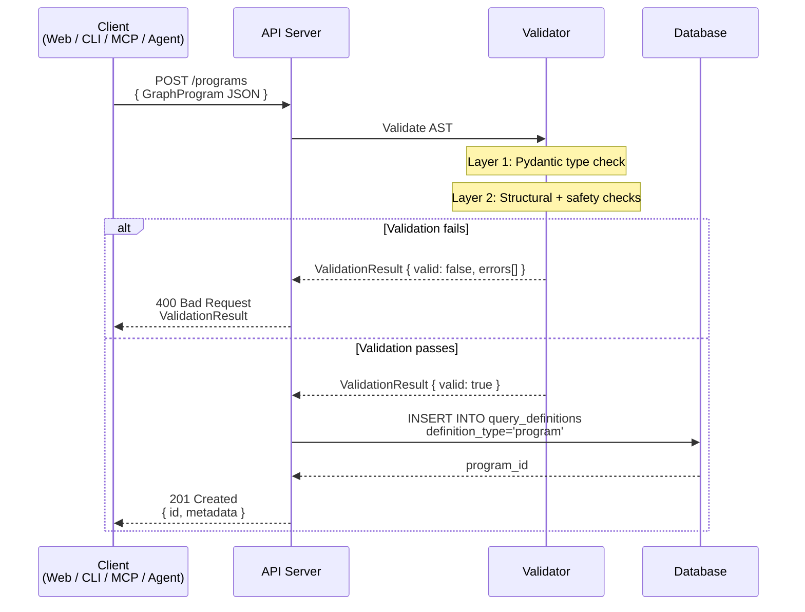
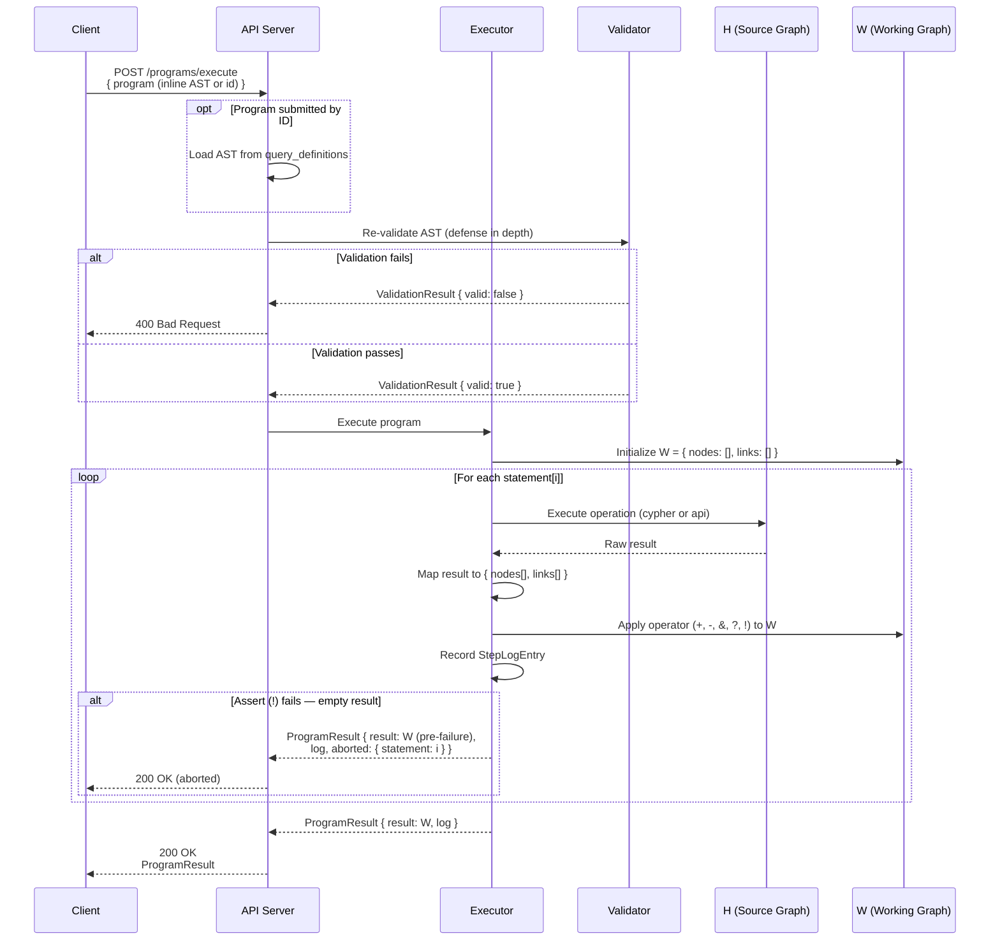
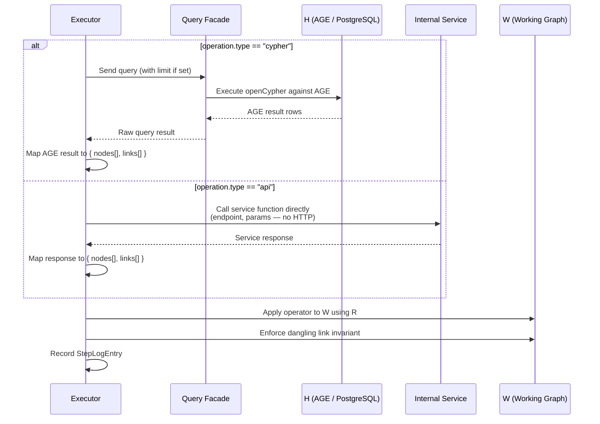

# GraphProgram Specification

**Version:** 1.0-draft  
**Canonical ADR:** [ADR-500 — Graph Program DSL and AST Architecture](../architecture/query-search/ADR-500-graph-program-dsl-and-ast-architecture.md)

GraphProgram is a domain-specific query composition language for Kappa Graph. It orchestrates openCypher queries and REST API calls through a fixed set of set-algebraic operators applied to a mutable working graph. The canonical representation is a JSON AST; a human-readable text DSL exists as a serialization format.

**Related pages:** [Validation rule catalog](graph-program-validation.md) · [Security and trust model](graph-program-security.md)

---

## Language properties

GraphProgram is not a general-purpose programming language. It has no iteration, no user-defined abstractions, no mutable variables, and no recursion. Every program has a statically-determinable maximum operation count. These constraints are invariants of the language, not configurable limits.

### Two-graph model

| Graph | Symbol | Description |
|-------|--------|-------------|
| Source Graph | **H** | The persistent knowledge graph stored in Apache AGE. Read-only during program execution. All `CypherOp` queries run against H. |
| Working Graph | **W** | The ephemeral subgraph constructed by program execution. Mutable. Starts empty at `{ nodes: [], links: [] }`. |

### Operators

Each statement pairs one operator with one operation. The operator determines how the operation's result modifies W.

| Operator | Name | Effect on W |
|----------|------|-------------|
| `+` | Union | Merge result into W. Deduplicate on identity. |
| `-` | Difference | Remove result nodes from W. Cascade-remove dangling links. |
| `&` | Intersect | Keep only W nodes whose `concept_id` appears in result. Enforce dangling link invariant. |
| `?` | Optional | Same as `+`; empty result is a silent no-op. |
| `!` | Assert | Same as `+`; empty result aborts the program. |

### Quick example

```json
{
  "version": 1,
  "statements": [
    {
      "op": "+",
      "operation": {
        "type": "cypher",
        "query": "MATCH (c:Concept)-[r]->(n:Concept) WHERE c.label = 'Machine Learning' RETURN c, r, n"
      },
      "label": "Seed: machine learning neighborhood"
    },
    {
      "op": "+",
      "operation": {
        "type": "api",
        "endpoint": "/search/concepts",
        "params": { "query": "neural networks", "limit": 20 }
      },
      "label": "Add semantically related concepts"
    },
    {
      "op": "-",
      "operation": {
        "type": "cypher",
        "query": "MATCH (c:Concept) WHERE c.grounding_strength < 0.2 RETURN c"
      },
      "label": "Remove weakly grounded concepts"
    }
  ]
}
```

---

## Type definitions

All types are expressed in TypeScript notation. The JSON AST uses identical field names and structure.

### GraphProgram (root)

```typescript
interface GraphProgram {
  version: 1;
  metadata?: ProgramMetadata;
  params?: ParamDeclaration[];    // Phase 2
  statements: Statement[];        // non-empty; min 1
}
```

| Field | Type | Required | Description |
|-------|------|----------|-------------|
| `version` | `1` (literal) | yes | Schema version. Must be the integer `1`. |
| `metadata` | `ProgramMetadata` | no | Descriptive metadata. Enriched by the server at storage time if omitted. |
| `params` | `ParamDeclaration[]` | no | Parameter declarations for substitution (Phase 2). |
| `statements` | `Statement[]` | yes | Ordered list of statements. Must contain at least one element. |

### ProgramMetadata

```typescript
interface ProgramMetadata {
  name?: string;
  description?: string;
  author?: 'human' | 'agent' | 'system';
  created?: string;                // ISO 8601 timestamp
}
```

All fields are optional. `author` indicates the origin of the program for auditing and UI display. `created` is set by the system on first save if not provided.

### Statement

```typescript
interface Statement {
  op: Operator;
  operation: CypherOp | ApiOp | ConditionalOp;
  label?: string;
  block?: BlockAnnotation;        // Phase 3
}
```

| Field | Type | Required | Description |
|-------|------|----------|-------------|
| `op` | `Operator` | yes | The set-algebra operator to apply. |
| `operation` | `CypherOp \| ApiOp \| ConditionalOp` | yes | The operation to execute. Dispatched on `operation.type`. |
| `label` | `string` | no | Human-readable description of this step. |
| `block` | `BlockAnnotation` | no | Source block annotation for decompilation (Phase 3). |

### Operator

```typescript
type Operator = '+' | '-' | '&' | '?' | '!';
```

### CypherOp

```typescript
interface CypherOp {
  type: 'cypher';
  query: string;
  limit?: number;
}
```

| Field | Type | Required | Description |
|-------|------|----------|-------------|
| `type` | `'cypher'` (literal) | yes | Discriminator. |
| `query` | `string` | yes | A read-only openCypher `MATCH...RETURN` statement. |
| `limit` | `number` | no | Maximum result rows. Applied as `LIMIT` if not already present. Must be a positive integer. |

`query` constraints: `CREATE`, `SET`, `DELETE`, `MERGE`, `REMOVE`, `DETACH DELETE`, and `DROP` are prohibited. Must not contain procedural calls that modify state. Subject to Cypher safety rules (see [Validation](graph-program-validation.md)).

### ApiOp

```typescript
interface ApiOp {
  type: 'api';
  endpoint: string;
  params: Record<string, unknown>;
}
```

| Field | Type | Required | Description |
|-------|------|----------|-------------|
| `type` | `'api'` (literal) | yes | Discriminator. |
| `endpoint` | `string` | yes | Internal API endpoint path. Must be in the allowed endpoint set. |
| `params` | `Record<string, unknown>` | yes | Parameters passed to the endpoint. Schema depends on the endpoint. |

`ApiOp` statements are dispatched as internal function calls within the API worker. They do not generate HTTP requests.

### ConditionalOp

> **Status:** Implemented. The Pydantic model, validator (V005, V007), and executor (all six condition tests in `_evaluate_condition`) are live in `api/app/{models,services}/program*.py`.

```typescript
interface ConditionalOp {
  type: 'conditional';
  condition: Condition;
  then: Statement[];
  else?: Statement[];
}
```

| Field | Type | Required | Description |
|-------|------|----------|-------------|
| `type` | `'conditional'` (literal) | yes | Discriminator. |
| `condition` | `Condition` | yes | Predicate evaluated against current W state. |
| `then` | `Statement[]` | yes | Statements to execute if condition is true. |
| `else` | `Statement[]` | no | Statements to execute if condition is false. |

Nested conditionals are permitted up to a maximum depth (default: 3).

### Condition

> **Status:** Implemented. All six tests are evaluated by `_evaluate_condition` in `api/app/services/program_executor.py`.

```typescript
type Condition =
  | { test: 'has_results' }
  | { test: 'empty' }
  | { test: 'count_gte'; value: number }
  | { test: 'count_lte'; value: number }
  | { test: 'has_ontology'; ontology: string }
  | { test: 'has_relationship'; type: string }
  ;
```

| Test | True when... |
|------|-------------|
| `has_results` | W contains at least one node. |
| `empty` | W contains zero nodes. |
| `count_gte` | W node count >= `value`. |
| `count_lte` | W node count <= `value`. |
| `has_ontology` | At least one node in W has `ontology === ontology`. |
| `has_relationship` | At least one link in W has `relationship_type === type`. |

Conditions are pure predicates. They read W but never modify it.

### ParamDeclaration (Phase 2)

> **Status:** Partially implemented. The Pydantic model accepts `params` declarations and `POST /programs/execute` accepts a `params` payload, but the executor does not yet substitute `$name` references into queries. Only the implicit `$W_IDS` binding is wired through `program_dispatch.dispatch_cypher`. V004 (duplicate parameter names) is enforced.

```typescript
interface ParamDeclaration {
  name: string;
  type: 'string' | 'number';
  default?: string | number;
}
```

Parameters declared here are intended to be referenced as `$name` in `CypherOp.query` strings and `ApiOp.params` values, resolved once at execution time before any statement runs.

### BlockAnnotation (Phase 3)

> **Status:** Phase 3.

```typescript
interface BlockAnnotation {
  blockType: BlockType;
  params: Record<string, unknown>;
}
```

`BlockType` is one of: `search`, `selectConcept`, `neighborhood`, `pathTo`, `filterOntology`, `filterEdge`, `filterNode`, `and`, `or`, `not`, `limit`, `vectorSearch`, `sourceSearch`, `epistemicFilter`, `enrich`.

Block annotations enable round-trip between the text DSL and the visual block editor. They are metadata only and do not affect execution semantics.

---

## Working graph shape

W conforms to the `WorkingGraph` interface:

```typescript
interface WorkingGraph {
  nodes: RawNode[];
  links: RawLink[];
}
```

> **Implementation note:** `WorkingGraph` corresponds to `RawGraphData` in the web codebase (`cypherResultMapper.ts`). The server-side Pydantic models live in `api/app/models/program.py` and collapse concept-specific fields into a generic `properties: Dict[str, Any]` bag; the web's `RawGraphNode` / `RawGraphLink` interfaces enumerate the well-known properties for display.

**Node identity** is determined by `concept_id`. Two nodes are the same node if and only if they share the same `concept_id`.

```typescript
interface RawNode {
  concept_id: string;       // primary identity key
  label: string;
  ontology?: string;
  description?: string;
  // Web-side conveniences extracted from `properties` by the result mapper:
  search_terms?: string[];
  grounding_strength?: number;
  diversity_score?: number;
  evidence_count?: number;
  // Server-side model carries all extra fields here:
  properties?: Record<string, unknown>;
}
```

**Link identity** is determined by the compound key `(from_id, relationship_type, to_id)`. Two links are the same link if and only if all three components match.

```typescript
interface RawLink {
  from_id: string;           // concept_id of source node
  to_id: string;             // concept_id of target node
  relationship_type: string; // e.g. "IMPLIES", "SUPPORTS", "CONTRADICTS"
  category?: string;
  confidence?: number;
  grounding_strength?: number;
  properties?: Record<string, unknown>;
}
```

**Dangling link invariant:** `W.links` must only reference nodes present in `W.nodes`. After every operator application, any link whose `from_id` or `to_id` does not correspond to a `concept_id` in `W.nodes` must be removed.

---

## Operator semantics

All operators follow the same execution pattern:

1. Execute the operation to produce a result set R = `{ nodes: RawNode[], links: RawLink[] }`.
2. Apply the operator to modify W using R.

### `+` (Union)

Merge R into W. Nodes and links already present in W are deduplicated; new nodes and links are appended.

```
W.nodes := W.nodes + { n in R.nodes | n.concept_id not in W.node_ids }
W.links := W.links + { l in R.links | (l.from_id, l.relationship_type, l.to_id) not in W.link_keys }
```

When a node in R has the same `concept_id` as an existing W node, the existing W node is kept unchanged.

| Condition | Behavior |
|-----------|----------|
| W is empty | W becomes R. |
| R is empty | W is unchanged. |
| R contains nodes already in W | Duplicates are silently discarded. |
| R contains links whose endpoints are in W.nodes but not R.nodes | Links are added. |
| R contains links whose endpoints are in neither R.nodes nor W.nodes | Links are discarded (dangling link invariant). |

### `-` (Difference)

Remove from W all nodes that appear in R. Then remove all links in W that reference any removed node.

```
remove_ids  := { n.concept_id | n in R.nodes }
W.nodes     := { n in W.nodes | n.concept_id not in remove_ids }
remaining   := { n.concept_id | n in W.nodes }
W.links     := { l in W.links | l.from_id in remaining AND l.to_id in remaining }
```

The subtract operator targets nodes. R.links is ignored for the purpose of removal — link removal is driven entirely by node removal.

| Condition | Behavior |
|-----------|----------|
| W is empty | No-op. |
| R is empty | W is unchanged. |
| R contains nodes not in W | Those nodes are silently ignored. |
| Removing a node causes links to dangle | Dangling links are removed. |
| R contains only links (no nodes) | W is unchanged. |

### `&` (Intersect)

Keep only W nodes whose `concept_id` appears in R.nodes. Remove all other nodes from W. Enforce the dangling link invariant.

```
keep_ids  := { n.concept_id | n in R.nodes }
W.nodes   := { n in W.nodes | n.concept_id in keep_ids }
remaining := { n.concept_id | n in W.nodes }
W.links   := { l in W.links | l.from_id in remaining AND l.to_id in remaining }
```

Intersection retains W's node objects with their original properties. R acts as a filter — it determines which `concept_id` values survive, but the surviving node data comes from W.

| Condition | Behavior |
|-----------|----------|
| W is empty | No-op. |
| R is empty | W is cleared to empty. |
| R and W share no nodes | W is cleared to empty. |
| All W nodes appear in R | W is unchanged (link set may shrink). |

### `?` (Optional)

Execute the operation. If R is non-empty, apply `+` semantics. If R is empty, do nothing.

```
IF R.nodes is non-empty OR R.links is non-empty:
  apply + (union) semantics with R
ELSE:
  no-op
```

Use for exploratory steps where the absence of results should not interrupt program execution.

### `!` (Assert)

Execute the operation. If R is non-empty, apply `+` semantics. If R is empty, abort the entire program.

```
IF R.nodes is non-empty OR R.links is non-empty:
  apply + (union) semantics with R
ELSE:
  abort program with error { statement: <index>, reason: "assertion failed: empty result" }
```

When an assert fails: execution stops immediately, no further statements are processed, W retains the state it had before the failing statement, and the response includes an `aborted` field.

Use to guard steps that must succeed for downstream statements to be meaningful.

---

## Execution model

### Statement processing

Programs are submitted to the API as JSON ASTs via `POST /programs/execute`. The executor runs entirely server-side. Clients are consumers of results, not executors.

Statements execute sequentially in array order. There is no parallel execution, no jumps, and no back-references.

For each statement at index `i`:

1. **Resolve parameters** — substitute `$name` references in `CypherOp.query` and `ApiOp.params` with provided or default values (Phase 2; not yet implemented — the executor currently only binds the implicit `$W_IDS`).
2. **Evaluate condition** — if `operation.type === 'conditional'`, evaluate the condition against current W and select the `then` or `else` branch.
3. **Execute operation** — dispatch on `operation.type`:
   - `cypher`: Execute `query` against H via `AGEClient._execute_cypher`. Apply `limit` if specified.
   - `api`: Call the internal service function for `endpoint` with `params`.
   - `conditional`: Execute the selected branch's statements recursively.
4. **Map result** — convert the raw query/API response to `WorkingGraph` format.
5. **Apply operator** — modify W according to the operator semantics.
6. **Record step log** — capture the step metadata for the response.

### Program result

```typescript
interface ProgramResult {
  result: WorkingGraph;
  log: StepLogEntry[];
  aborted?: {
    statement: number;
    reason: string;
  };
}
```

| Field | Description |
|-------|-------------|
| `result` | Final state of W after all statements (or after abort). |
| `log` | Per-statement execution record, in execution order. |
| `aborted` | Present only if an `!` (assert) operator failed. Contains the statement index and reason. |

### Step log entry

```typescript
interface StepLogEntry {
  statement: number;
  op: Operator;
  operation_type: 'cypher' | 'api' | 'conditional';
  branch_taken?: 'then' | 'else';
  nodes_affected: number;
  links_affected: number;
  w_size: { nodes: number; links: number };
  duration_ms: number;
}
```

| Field | Description |
|-------|-------------|
| `statement` | Zero-based index into `program.statements`. |
| `op` | The operator that was applied. |
| `operation_type` | Discriminator of the executed operation. |
| `branch_taken` | For conditionals: which branch was selected. |
| `nodes_affected` | Number of nodes added, removed, or retained by this step. |
| `links_affected` | Number of links added, removed, or retained by this step. |
| `w_size` | Node and link count in W after this step. |
| `duration_ms` | Wall-clock execution time for this step in milliseconds. |

### Result set mapping

**CypherOp mapping** follows the `mapCypherResultToRawGraph` logic:

1. Build an internal AGE ID to `concept_id` map from returned nodes.
2. Map nodes: `concept_id` = `properties.concept_id` or fallback to AGE `id`.
3. Map links: translate AGE internal `from_id`/`to_id` to `concept_id` values. Discard links whose endpoints are not in the returned node set.
4. Map `type` (AGE relationship label) to `relationship_type` (RawLink field).

**ApiOp mapping** depends on the endpoint. Each allowed endpoint returns data that the executor maps to `WorkingGraph`. The output shape is always `{ nodes: RawNode[], links: RawLink[] }`.

---

## Sequence diagrams

### Program notarization



### Program execution



### Statement dispatch detail



---

## Validation

Programs must be validated before execution. The API provides `POST /programs/validate` which returns structured errors without executing the program.

The authoritative validation rule catalog — rule IDs (V001, V002, ...), error messages, and severity levels — is in [graph-program-validation.md](graph-program-validation.md). The categories are:

- **Structural** — AST is well-formed: `version` equals `1`, `statements` is non-empty, each `Statement` has a valid `op` and a known `operation.type`, `CypherOp.query` is non-empty, `ConditionalOp.then` is non-empty.
- **Boundedness** — total operation count must be computable from the AST alone and must not exceed the configured limit (default: 100); conditional nesting depth must not exceed the configured limit (default: 3). Operation count for a `ConditionalOp` is `max(count(then), count(else))`.
- **Cypher safety** — no write clauses; variable-length path traversals must have an upper bound within `MAX_VARIABLE_PATH_LENGTH` (default: 6).
- **Endpoint allowlist** — `ApiOp.endpoint` must be in the permitted set.
- **Parameter validation (Phase 2)** — all `$name` references must resolve; declared types must match provided values.

### API endpoint allowlist

| Endpoint | Description | Required params | Optional params |
|----------|-------------|-----------------|-----------------|
| `/search/concepts` | Vector similarity search | `query` (str) | `min_similarity` (number), `limit` (int), `ontology` (str), `offset` (int) |
| `/search/sources` | Source passage search | `query` (str) | `min_similarity` (number), `limit` (int), `ontology` (str), `offset` (int) |
| `/vocabulary/status` | Epistemic status lookup | *(none)* | `relationship_type` (str), `status_filter` (str) |
| `/concepts/batch` | Batch concept enrichment | `concept_ids` (list) | `include_details` (bool) |
| `/concepts/details` | Concept detail retrieval | `concept_id` (str) | `include_diversity` (bool), `include_grounding` (bool) |
| `/concepts/related` | Neighborhood exploration | `concept_id` (str) | `max_depth` (int), `relationship_types` (list) |

Any `endpoint` value not in this set produces a validation error.

### Validation response

```typescript
interface ValidationResult {
  valid: boolean;
  errors: ValidationIssue[];
  warnings: ValidationIssue[];
}

interface ValidationIssue {
  rule_id: string;            // e.g. "V010"
  severity: 'error' | 'warning';
  statement?: number;         // zero-based index; absent for program-level errors
  field?: string;             // dotted path, e.g. "operation.query"
  message: string;
}
```

---

## Language constraints

These constraints are inherent properties of the language, not configurable limits.

**Sequential execution.** Statements execute in array order. There are no parallel execution primitives, no `GOTO`, and no back-references. Statement `i+1` always sees the W produced by statement `i`.

**Deterministic operation count.** The maximum number of operations a program will execute is computable from the AST alone, without executing any statement. This is guaranteed by the absence of iteration and the static structure of conditional branches.

**No iteration.** There is no loop, repeat, or `WHILE` construct. If a use case requires iterative graph expansion, implement it as a system-provided `ApiOp` with internal resource controls.

**No user-defined abstractions.** There is no `DEFINE BLOCK`, no macros, no function definitions. The operation vocabulary is fixed: `cypher`, `api`, and `conditional`.

**No mutable variables.** Parameters are substituted once before execution begins (Phase 2). There are no assignment statements and no way to capture intermediate results into named bindings.

**No recursion.** Programs are linear sequences (or DAGs when conditional branches are present). A statement cannot reference itself or create cycles in the execution flow.

---

## API endpoints

Program endpoints are mounted under `/programs` (see `api/app/routes/programs.py`).

### POST /programs/validate

Validates the program AST without executing it. Always returns HTTP 200; inspect `valid`, `errors`, and `warnings` on the response.

```
Request:  ProgramSubmission { name?: string, program: GraphProgram }
Response: ValidationResult
```

### POST /programs

Validates and stores the program. On validation failure returns HTTP 400 with `{ detail: { error, validation: ValidationResult } }`.

```
Request:  ProgramSubmission { name?: string, program: GraphProgram }
Response: 201 ProgramCreateResponse { id, name, program, valid, created_at, updated_at }
```

### GET /programs

Returns lightweight summaries for programs visible to the caller (own + system-owned; admins see all).

```
GET /programs?search=<text>&limit=<n>

Response: ProgramListItem[]   (id, name, description, statement_count, created_at)
limit: 1–100, default 20
```

### GET /programs/{id}

Returns the full notarized program. Requires ownership or admin role. System-owned programs (`owner_id IS NULL`) are visible to all authenticated users.

```
Response: ProgramReadResponse { id, name, program, owner_id, created_at, updated_at }
```

### POST /programs/execute

Executes a program. Re-validates the program(s) before execution (defense in depth). Accepts inline AST, program by ID, or a deck (chain of programs).

```
Request modes:
  Inline:   { program: GraphProgram, params?: Record<string, string | number> }
  By ID:    { program_id: int, params?: Record<string, string | number> }
  Deck:     { deck: DeckEntry[] }   // 1–10 entries; each entry has program_id or program

Response: ProgramResult (single) or BatchProgramResult (deck)
```

If an assert (`!`) fails during execution, the response is HTTP 200 with the `aborted` field populated and W in its state prior to the failing statement.

Execution is bounded by `PROGRAM_TIMEOUT_SECONDS` (default 60 s, see `api/app/services/program_executor.py`). A timeout produces the same `aborted` shape with reason `"Program execution timed out"`.

In deck mode, programs run sequentially with W threaded forward. If any program aborts, the chain stops and the partial `BatchProgramResult` is returned.

---

## Code-signing model

Programs follow a code-signing pattern: author anywhere, notarize server-side, execute notarized programs.

```
Client → POST /programs/validate  → Validation result (dry-run)
Client → POST /programs           → Validate + store (notarize)
Client → GET  /programs/{id}      → Retrieve notarized program
Client → POST /programs/execute   → Server-side execution (inline AST or by program_id)
```

See [graph-program-security.md](graph-program-security.md) for the full trust model and defense-in-depth layers.

---

## Storage format

Programs are stored as `query_definition` records with `definition_type: 'program'`:

```json
{
  "definition_type": "program",
  "definition": {
    "version": 1,
    "metadata": { "name": "Example Program", "author": "human" },
    "statements": [
      {
        "op": "+",
        "operation": {
          "type": "cypher",
          "query": "MATCH (c:Concept)-[r]-(n:Concept) WHERE c.label CONTAINS 'test' RETURN c, r, n"
        }
      }
    ]
  }
}
```

### Migration from the exploration format

The `exploration` definition type (`{ statements: [{ op, cypher }] }`) is the predecessor format. Migration wraps each statement:

```
Before: { op: '+', cypher: 'MATCH ...' }
After:  { op: '+', operation: { type: 'cypher', query: 'MATCH ...' } }
```

And adds `version: 1` to the root.

---

## Text DSL

The text DSL is a human-readable serialization of the JSON AST. The JSON AST is the canonical form; the text DSL is the authoring format for the Cypher editor.

### Grammar

```
program       := header? statement+
header        := metadata_line+ blank_line
metadata_line := '--' SP key ':' SP value NL
statement     := comment* operator SP body ';' NL
comment       := '--' text NL
operator      := '+' | '-' | '&' | '?' | '!'
body          := cypher_body | api_body | conditional_body
cypher_body   := <openCypher MATCH...RETURN statement>
api_body      := '@api' SP endpoint SP json_params
conditional_body := 'IF' SP condition SP 'THEN' SP '{' NL statement+ '}' (SP 'ELSE' SP '{' NL statement+ '}')?
condition     := 'has_results' | 'empty'
               | 'count_gte' SP number | 'count_lte' SP number
               | 'has_ontology' SP string | 'has_relationship' SP string

param_decl    := '@param' SP name ':' SP type ('=' SP default)?
block_annot   := '--' SP '@block' SP block_type (SP key '=' value)*
```

`SP` = one or more spaces. `NL` = newline.

### Syntax elements

| Element | Syntax | Example |
|---------|--------|---------|
| Operator prefix | `+`, `-`, `&`, `?`, `!` at start of statement | `+ MATCH ...` |
| Cypher statement | Standard openCypher, terminated by `;` | `+ MATCH (c:Concept)-[r]-(n) RETURN c, r, n;` |
| API call | `@api <endpoint> <json>;` | `+ @api /search/concepts {"query": "org", "limit": 10};` |
| Parameter declaration | `@param <name>: <type> = <default>` | `@param concept_name: string = "default"` |
| Conditional | `IF <test> THEN { ... } ELSE { ... };` | `? IF has_results THEN { + MATCH ...; };` |
| Block annotation | `-- @block <type> <k>=<v>...` | `-- @block search query="test"` |
| Metadata | `-- Key: value` in header | `-- Exploration: My Query` |
| Comment | `--` without `@` prefix | `-- This is a comment` |
| Default operator | Bare statement (no prefix) | `MATCH (c) RETURN c;` (treated as `+`) |

### Parsing rules

1. Lines beginning with `--` that do not contain `@param` or `@block` are comments and are discarded during parsing.
2. Blank lines between statements act as statement separators.
3. A statement begins when a line starts with an operator character followed by a space, or with a non-comment, non-blank token (default `+`).
4. A statement ends at the `;` terminator.
5. Multi-line statements are supported: continuation lines are appended to the current statement.

### Round-trip fidelity

Text DSL → JSON AST → Text DSL round-trip preserves: operator and operation semantics (exact), block annotations, parameter declarations, and statement labels (mapped to/from comments).

Round-trip does not preserve: arbitrary comments (non-annotation `--` lines), whitespace formatting.

---

## Block type mapping

Every block type maps to the AST. This table defines the canonical mapping used by the block compiler (Phase 3).

| Block type | Operator | Operation type | Notes |
|------------|----------|----------------|-------|
| `search` | `+` | `cypher` | `MATCH...WHERE label CONTAINS...` |
| `selectConcept` | `+` | `cypher` | `MATCH...WHERE concept_id = ...` |
| `neighborhood` | `+` | `cypher` | `MATCH (c)-[r*1..depth]-(n)` |
| `pathTo` | `+` | `cypher` | `MATCH path = (a)-[*..maxHops]-(b)` |
| `filterOntology` | `&` | `cypher` | `MATCH...WHERE ontology IN [...]` |
| `filterEdge` | `&` | `cypher` | `MATCH...-[r:TYPE]-...` |
| `filterNode` | `&` | `cypher` | `MATCH...WHERE confidence >= ...` |
| `and` | `&` | — | Intersection of preceding branches |
| `or` | `+` | — | Union of preceding branches |
| `not` | `-` | `cypher` | `MATCH...WHERE pattern...` |
| `limit` | — | — | Sets `limit` field on preceding operation |
| `vectorSearch` | `+` | `api` | Endpoint: `/search/concepts` |
| `sourceSearch` | `+` | `api` | Endpoint: `/search/sources` |
| `epistemicFilter` | `&` | `api` | Endpoint: `/vocabulary/status` |
| `enrich` | `+` | `api` | Endpoint: `/concepts/batch` |

---

## Executable specification

The validation rules have a pure-Python executable spec that runs without Docker or the full platform:

```bash
# Models: api/app/models/program.py
# Validator: api/app/services/program_validator.py
# Tests (109 cases): tests/unit/test_program_validation.py

# Run in container
docker exec kg-api-dev pytest tests/unit/test_program_validation.py -v

# Or with bare pytest (only needs pydantic)
pip install pydantic pytest
pytest tests/unit/test_program_validation.py -v
```

---

## Complete example

### JSON AST

```json
{
  "version": 1,
  "metadata": {
    "name": "Organizational Patterns",
    "description": "Explore organizational concepts with semantic expansion and pruning",
    "author": "human"
  },
  "statements": [
    {
      "op": "+",
      "operation": {
        "type": "cypher",
        "query": "MATCH (c:Concept)-[r]-(n:Concept) WHERE c.label CONTAINS 'organizational' RETURN c, r, n",
        "limit": 50
      },
      "label": "Find organizational concepts"
    },
    {
      "op": "+",
      "operation": {
        "type": "api",
        "endpoint": "/search/concepts",
        "params": {
          "query": "organizational",
          "min_similarity": 0.7,
          "limit": 10
        }
      },
      "label": "Add semantically similar concepts"
    },
    {
      "op": "-",
      "operation": {
        "type": "cypher",
        "query": "MATCH (n:Concept) WHERE n.grounding_strength < 0.2 RETURN n"
      },
      "label": "Remove weakly grounded concepts"
    },
    {
      "op": "&",
      "operation": {
        "type": "cypher",
        "query": "MATCH (c:Concept)-[:SUPPORTS]->(target:Concept) RETURN c, target"
      },
      "label": "Keep only concepts with SUPPORTS relationships"
    }
  ]
}
```

### Equivalent text DSL

```
-- Exploration: Organizational Patterns
-- Description: Explore organizational concepts with semantic expansion and pruning
-- Author: human

-- Step 1: Find organizational concepts
+ MATCH (c:Concept)-[r]-(n:Concept)
  WHERE c.label CONTAINS 'organizational'
  RETURN c, r, n
  LIMIT 50;

-- Step 2: Add semantically similar concepts
+ @api /search/concepts {"query": "organizational", "min_similarity": 0.7, "limit": 10};

-- Step 3: Remove weakly grounded concepts
- MATCH (n:Concept) WHERE n.grounding_strength < 0.2 RETURN n;

-- Step 4: Keep only concepts with SUPPORTS relationships
& MATCH (c:Concept)-[:SUPPORTS]->(target:Concept) RETURN c, target;
```

### Execution trace

| Step | Op | W before | R | W after |
|------|----|----------|---|---------|
| 0 | `+` | 0 nodes, 0 links | 12 nodes, 18 links | 12 nodes, 18 links |
| 1 | `+` | 12 nodes, 18 links | 8 nodes, 0 links | 17 nodes, 18 links (3 deduped) |
| 2 | `-` | 17 nodes, 18 links | 4 nodes, 0 links | 13 nodes, 14 links (4 links cascaded) |
| 3 | `&` | 13 nodes, 14 links | 9 nodes, 8 links | 9 nodes, 11 links |

---

## JSON Schema

```json
{
  "$schema": "https://json-schema.org/draft/2020-12/schema",
  "$id": "https://knowledge-graph-system/schemas/graph-program/v1",
  "title": "GraphProgram",
  "type": "object",
  "required": ["version", "statements"],
  "properties": {
    "version": { "const": 1 },
    "metadata": { "$ref": "#/$defs/ProgramMetadata" },
    "params": {
      "type": "array",
      "items": { "$ref": "#/$defs/ParamDeclaration" }
    },
    "statements": {
      "type": "array",
      "minItems": 1,
      "items": { "$ref": "#/$defs/Statement" }
    }
  },
  "$defs": {
    "ProgramMetadata": {
      "type": "object",
      "properties": {
        "name": { "type": "string" },
        "description": { "type": "string" },
        "author": { "enum": ["human", "agent", "system"] },
        "created": { "type": "string", "format": "date-time" }
      }
    },
    "ParamDeclaration": {
      "type": "object",
      "required": ["name", "type"],
      "properties": {
        "name": { "type": "string" },
        "type": { "enum": ["string", "number"] },
        "default": {}
      }
    },
    "Operator": {
      "enum": ["+", "-", "&", "?", "!"]
    },
    "Statement": {
      "type": "object",
      "required": ["op", "operation"],
      "properties": {
        "op": { "$ref": "#/$defs/Operator" },
        "operation": {
          "oneOf": [
            { "$ref": "#/$defs/CypherOp" },
            { "$ref": "#/$defs/ApiOp" },
            { "$ref": "#/$defs/ConditionalOp" }
          ]
        },
        "label": { "type": "string" },
        "block": { "$ref": "#/$defs/BlockAnnotation" }
      }
    },
    "CypherOp": {
      "type": "object",
      "required": ["type", "query"],
      "properties": {
        "type": { "const": "cypher" },
        "query": { "type": "string", "minLength": 1 },
        "limit": { "type": "integer", "minimum": 1 }
      }
    },
    "ApiOp": {
      "type": "object",
      "required": ["type", "endpoint", "params"],
      "properties": {
        "type": { "const": "api" },
        "endpoint": { "type": "string", "minLength": 1 },
        "params": { "type": "object" }
      }
    },
    "ConditionalOp": {
      "type": "object",
      "required": ["type", "condition", "then"],
      "properties": {
        "type": { "const": "conditional" },
        "condition": { "$ref": "#/$defs/Condition" },
        "then": {
          "type": "array",
          "minItems": 1,
          "items": { "$ref": "#/$defs/Statement" }
        },
        "else": {
          "type": "array",
          "items": { "$ref": "#/$defs/Statement" }
        }
      }
    },
    "Condition": {
      "type": "object",
      "required": ["test"],
      "properties": {
        "test": {
          "enum": ["has_results", "empty", "count_gte", "count_lte", "has_ontology", "has_relationship"]
        },
        "value": { "type": "number" },
        "ontology": { "type": "string" },
        "type": { "type": "string" }
      }
    },
    "BlockAnnotation": {
      "type": "object",
      "required": ["blockType", "params"],
      "properties": {
        "blockType": {
          "enum": [
            "search", "selectConcept", "neighborhood", "pathTo",
            "filterOntology", "filterEdge", "filterNode",
            "and", "or", "not", "limit",
            "vectorSearch", "sourceSearch", "epistemicFilter", "enrich"
          ]
        },
        "params": { "type": "object" }
      }
    }
  }
}
```
