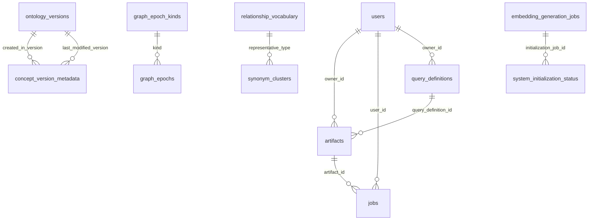
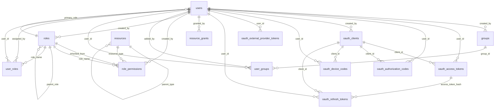

# Database Schema

Relational schema for the Kappa Graph control plane. The knowledge graph itself (concepts, sources, instances, and their typed edges) lives in the Apache AGE `knowledge_graph` graph; the tables below hold operational state, authorization, and observability around it.

Backed by PostgreSQL 18 with Apache AGE 1.7.0. This page is generated from `schema/00_baseline.sql` and `schema/migrations/*.sql`; do not edit it by hand.

<!-- GENERATED FILE — edit the SQL DDL, then run `make docs-schema`. -->
<!-- Generated: 2026-07-01 -->

## Schemas

| Schema | Purpose | Tables |
|---|---|---|
| `public` | Cross-schema bookkeeping (migration tracking). | 2 |
| `kg_api` | API operational state: jobs, sessions, vocabulary, ontology. | 40 |
| `kg_auth` | Authentication and authorization (dynamic RBAC). | 14 |
| `kg_logs` | Observability: audit trails, metrics, health. | 4 |

## `public`

Cross-schema bookkeeping (migration tracking).

### `graph_metrics`

Change counters for triggering periodic epistemic status measurement

| Column | Type | Constraints | Description |
|---|---|---|---|
| `metric_name` | `character varying(255)` | PK; NOT NULL | Unique metric identifier (e.g., vocabulary_change_counter, concept_count) |
| `counter` | `bigint` | NOT NULL; DEFAULT 0 | Increments on every change (create/delete/consolidate) - never decrements |
| `last_measured_counter` | `bigint` | NOT NULL; DEFAULT 0 | Counter value when epistemic status was last measured |
| `last_measured_at` | `timestamp without time zone` |  | Timestamp when epistemic status was last measured |
| `updated_at` | `timestamp without time zone` | DEFAULT CURRENT_TIMESTAMP | Timestamp of last counter increment |
| `notes` | `text` |  |  |

### `schema_migrations`

Tracks applied schema migrations for safe schema evolution - ADR-040

| Column | Type | Constraints | Description |
|---|---|---|---|
| `version` | `integer` | PK; NOT NULL | Sequential migration number (001, 002, 003, ...) |
| `name` | `text` | NOT NULL | Descriptive migration name (e.g., baseline, add_embedding_config) |
| `applied_at` | `timestamp without time zone` | NOT NULL; DEFAULT now() | Timestamp when migration was applied |

## `kg_api`

API operational state: jobs, sessions, vocabulary, ontology.

#### Relationships

### `aggressiveness_profiles`

| Column | Type | Constraints | Description |
|---|---|---|---|
| `profile_name` | `character varying(50)` | PK; NOT NULL |  |
| `control_x1` | `double precision` | NOT NULL |  |
| `control_y1` | `double precision` | NOT NULL |  |
| `control_x2` | `double precision` | NOT NULL |  |
| `control_y2` | `double precision` | NOT NULL |  |
| `description` | `text` |  |  |
| `is_builtin` | `boolean` | DEFAULT false |  |
| `created_at` | `timestamp without time zone` | DEFAULT now() |  |
| `updated_at` | `timestamp without time zone` | DEFAULT now() |  |

**Table constraints:**

- `CONSTRAINT aggressiveness_profiles_control_x1_check CHECK (((control_x1 >= (0.0)::double precision) AND (control_x1 <= (1.0)::double precision)))`
- `CONSTRAINT aggressiveness_profiles_control_x2_check CHECK (((control_x2 >= (0.0)::double precision) AND (control_x2 <= (1.0)::double precision)))`

### `ai_extraction_config`

AI extraction provider configuration for runtime-switchable models - ADR-041

| Column | Type | Constraints | Description |
|---|---|---|---|
| `id` | `integer` | PK; NOT NULL |  |
| `provider` | `character varying(50)` | NOT NULL; UNIQUE | AI provider: openai, anthropic, ollama, or vllm |
| `model_name` | `character varying(200)` | NOT NULL | Model identifier (e.g., gpt-4o, claude-sonnet-4-20250514) |
| `supports_vision` | `boolean` | DEFAULT false | Whether the model supports vision/image inputs |
| `supports_json_mode` | `boolean` | DEFAULT true | Whether the model supports JSON mode for structured outputs |
| `max_tokens` | `integer` |  | Maximum token limit for the model |
| `created_at` | `timestamp with time zone` | DEFAULT CURRENT_TIMESTAMP |  |
| `updated_at` | `timestamp with time zone` | DEFAULT CURRENT_TIMESTAMP |  |
| `updated_by` | `character varying(100)` |  |  |
| `active` | `boolean` | DEFAULT true | Only one config can be active at a time (enforced by unique index) |
| `base_url` | `character varying(255)` |  | Base URL for local providers (e.g., http://localhost:11434 for Ollama) |
| `temperature` | `double precision` | DEFAULT 0.1 | Sampling temperature (0.0-1.0, lower = more consistent). Used by local providers. |
| `top_p` | `double precision` | DEFAULT 0.9 | Nucleus sampling threshold (0.0-1.0). Used by local providers. |
| `gpu_layers` | `integer` | DEFAULT '-1'::integer | GPU layers for inference: -1 = auto, 0 = CPU only, >0 = specific layer count (llama.cpp) |
| `num_threads` | `integer` | DEFAULT 4 | CPU threads for inference (used by local CPU-based providers) |
| `thinking_mode` | `character varying(20)` | DEFAULT 'off'::character varying | Thinking mode for reasoning models (Ollama 0.12.x+): off, low, medium, high. GPT-OSS: off=low, others pass through. Standard models: off=disabled, low/medium/high=enabled. |
| `max_concurrent_requests` | `integer` | DEFAULT 4 | Maximum number of concurrent API requests allowed for this provider. Limits parallelism to prevent rate limit errors and resource thrashing. Recommended: OpenAI=8, Anthropic=4, Ollama=1 |
| `max_retries` | `integer` | DEFAULT 8 | Maximum number of retry attempts for rate-limited requests (429 errors). Uses exponential backoff with jitter: 1s, 2s, 4s, 8s, 16s, 32s, 64s, ... Higher values provide more resilience with multiple workers. Recommended: 8 for cloud providers, 3 for local |

**Table constraints:**

- `CONSTRAINT ai_extraction_config_max_concurrent_requests_check CHECK (((max_concurrent_requests >= 1) AND (max_concurrent_requests <= 100)))`
- `CONSTRAINT ai_extraction_config_max_retries_check CHECK (((max_retries >= 0) AND (max_retries <= 20)))`
- `CONSTRAINT ai_extraction_config_provider_check CHECK (((provider)::text = ANY ((ARRAY['openai'::character varying, 'anthropic'::character varying, 'ollama'::character varying, 'openrouter'::character varying, 'llamacpp'::character varying])::text[])))`
- `CONSTRAINT ai_extraction_config_temperature_check CHECK (((temperature >= (0.0)::double precision) AND (temperature <= (1.0)::double precision)))`
- `CONSTRAINT ai_extraction_config_thinking_mode_check CHECK (((thinking_mode)::text = ANY ((ARRAY['off'::character varying, 'low'::character varying, 'medium'::character varying, 'high'::character varying])::text[])))`
- `CONSTRAINT ai_extraction_config_top_p_check CHECK (((top_p >= (0.0)::double precision) AND (top_p <= (1.0)::double precision)))`

### `ai_vision_config`

Active vision (image->prose) provider selection — ADR-802 / #378. Selection-only; connectivity reused from per-provider config.

| Column | Type | Constraints | Description |
|---|---|---|---|
| `id` | `integer` | PK; NOT NULL |  |
| `provider` | `character varying(50)` | NOT NULL; UNIQUE | Provider performing image->prose description |
| `model_name` | `character varying(200)` | NOT NULL; DEFAULT ''::character varying | Vision model id; '' resolves from the catalog supports_vision rows |
| `max_tokens` | `integer` |  |  |
| `temperature` | `double precision` |  |  |
| `created_at` | `timestamp with time zone` | DEFAULT CURRENT_TIMESTAMP |  |
| `updated_at` | `timestamp with time zone` | DEFAULT CURRENT_TIMESTAMP |  |
| `updated_by` | `character varying(100)` |  |  |
| `active` | `boolean` | DEFAULT true | Only one vision config active at a time (enforced by partial unique index) |

**Table constraints:**

- `CONSTRAINT ai_vision_config_provider_check CHECK (((provider)::text = ANY ((ARRAY['openai'::character varying, 'anthropic'::character varying, 'ollama'::character varying, 'openrouter'::character varying, 'llamacpp'::character varying])::text[])))`
- `CONSTRAINT ai_vision_config_temperature_check CHECK (((temperature IS NULL) OR ((temperature >= (0.0)::double precision) AND (temperature <= (1.0)::double precision))))`

### `annealing_options`

Tunable parameters for ontology annealing cycles (ADR-200 Phase 3b). Code defaults apply when a key is absent; database values override.

| Column | Type | Constraints | Description |
|---|---|---|---|
| `key` | `character varying(100)` | PK; NOT NULL |  |
| `value` | `text` | NOT NULL |  |
| `description` | `text` |  |  |
| `updated_at` | `timestamp with time zone` | DEFAULT now() |  |

### `annealing_pressure_history`

One row per annealing cycle: ecological snapshot + Bezier pressure read-out (#249, ADR-206 §Phase 3). Drives the web admin "pressure" panel and the future trend chart.

| Column | Type | Constraints | Description |
|---|---|---|---|
| `id` | `integer` | PK; NOT NULL |  |
| `epoch` | `integer` | NOT NULL |  |
| `total_ontologies` | `integer` | NOT NULL |  |
| `total_concepts` | `integer` | NOT NULL |  |
| `avg_concepts_per_ontology` | `double precision` | NOT NULL |  |
| `pressure_score` | `double precision` | NOT NULL |  |
| `pressure_zone` | `character varying(20)` | NOT NULL |  |
| `pressure_recommendation` | `jsonb` | NOT NULL; DEFAULT '{}'::jsonb |  |
| `recorded_at` | `timestamp with time zone` | NOT NULL; DEFAULT now() |  |

**Table constraints:**

- `CONSTRAINT annealing_pressure_history_pressure_score_check CHECK (((pressure_score >= (0.0)::double precision) AND (pressure_score <= (1.0)::double precision)))`

### `annealing_proposals`

| Column | Type | Constraints | Description |
|---|---|---|---|
| `id` | `integer` | PK; NOT NULL |  |
| `proposal_type` | `character varying(20)` | NOT NULL |  |
| `ontology_name` | `character varying(200)` | NOT NULL |  |
| `anchor_concept_id` | `character varying(100)` |  |  |
| `target_ontology` | `character varying(200)` |  |  |
| `reasoning` | `text` | NOT NULL |  |
| `mass_score` | `numeric(10,4)` |  |  |
| `coherence_score` | `numeric(10,4)` |  |  |
| `protection_score` | `numeric(10,4)` |  |  |
| `status` | `character varying(20)` | NOT NULL; DEFAULT 'pending'::character varying |  |
| `created_at` | `timestamp with time zone` | NOT NULL; DEFAULT now() |  |
| `created_at_epoch` | `integer` | NOT NULL; DEFAULT 0 |  |
| `reviewed_at` | `timestamp with time zone` |  |  |
| `reviewed_by` | `character varying(100)` |  |  |
| `reviewer_notes` | `text` |  |  |
| `expires_at` | `timestamp with time zone` | DEFAULT (now() + '7 days'::interval) |  |
| `executed_at` | `timestamp with time zone` |  |  |
| `execution_result` | `jsonb` |  |  |
| `suggested_name` | `character varying(200)` |  |  |
| `suggested_description` | `text` |  |  |
| `proposal_kind` | `character varying(20)` | NOT NULL; DEFAULT 'ontology'::character varying |  |
| `params` | `jsonb` |  |  |

**Table constraints:**

- `CONSTRAINT annealing_proposals_proposal_kind_check CHECK (((proposal_kind)::text = ANY ((ARRAY['ontology'::character varying, 'control'::character varying])::text[])))`
- `CONSTRAINT annealing_proposals_proposal_type_check CHECK (((proposal_type)::text = ANY ((ARRAY['CLEAVE'::character varying, 'DISSOLVE'::character varying, 'MERGE'::character varying, 'RENAME'::character varying, 'NO_ACTION'::character varying, 'ESCALATE'::character varying, 'ADJUST_CONTROL'::character varying, 'promotion'::character varying, 'demotion'::character varying])::text[])))`
- `CONSTRAINT annealing_proposals_status_check CHECK (((status)::text = ANY ((ARRAY['pending'::character varying, 'approved'::character varying, 'rejected'::character varying, 'expired'::character varying, 'executing'::character varying, 'executed'::character varying, 'failed'::character varying])::text[])))`

### `artifacts`

Computed artifact metadata with Garage blob pointers (ADR-083)

| Column | Type | Constraints | Description |
|---|---|---|---|
| `id` | `integer` | PK; NOT NULL |  |
| `artifact_type` | `character varying(50)` | NOT NULL | Type of computation: polarity_analysis, projection, etc. |
| `representation` | `character varying(50)` | NOT NULL | Source UI/tool: polarity_explorer, cli, mcp_server, etc. |
| `name` | `character varying(200)` |  |  |
| `owner_id` | `integer` | FK → kg_auth.users(id) |  |
| `graph_epoch` | `bigint` | NOT NULL | graph_change_counter at creation for freshness validation |
| `created_at` | `timestamp with time zone` | NOT NULL; DEFAULT now() |  |
| `expires_at` | `timestamp with time zone` |  |  |
| `parameters` | `jsonb` | NOT NULL |  |
| `metadata` | `jsonb` |  |  |
| `inline_result` | `jsonb` |  | Small results (<10KB) stored inline |
| `garage_key` | `character varying(200)` |  | Pointer to Garage blob for large results |
| `query_definition_id` | `integer` | FK → kg_api.query_definitions(id) |  |
| `ontology` | `character varying(200)` |  |  |
| `concept_ids` | `text[]` |  | Concept IDs involved in this artifact |

**Table constraints:**

- `CONSTRAINT has_content CHECK (((inline_result IS NOT NULL) OR (garage_key IS NOT NULL)))`
- `CONSTRAINT valid_artifact_type CHECK (((artifact_type)::text = ANY ((ARRAY['polarity_analysis'::character varying, 'projection'::character varying, 'query_result'::character varying, 'graph_subgraph'::character varying, 'vocabulary_analysis'::character varying, 'epistemic_measurement'::character varying, 'consolidation_result'::character varying, 'search_result'::character varying, 'connection_path'::character varying, 'report'::character varying, 'stats_snapshot'::character varying])::text[])))`
- `CONSTRAINT valid_representation CHECK (((representation)::text = ANY ((ARRAY['polarity_explorer'::character varying, 'embedding_landscape'::character varying, 'block_builder'::character varying, 'edge_explorer'::character varying, 'vocabulary_chord'::character varying, 'force_graph_2d'::character varying, 'force_graph_3d'::character varying, 'report_workspace'::character varying, 'cli'::character varying, 'mcp_server'::character varying, 'api_direct'::character varying])::text[])))`

### `catalog_edge`

ADR-501: parent->child membership edges projecting canonical :SCOPED_BY (ontology<-document) and :HAS_SOURCE/:APPEARS (document<-concept). A concept may have many parent documents (DAG).

| Column | Type | Constraints | Description |
|---|---|---|---|
| `parent_kind` | `character varying(16)` | PK; NOT NULL |  |
| `parent_id` | `text` | PK; NOT NULL |  |
| `child_kind` | `character varying(16)` | PK; NOT NULL |  |
| `child_id` | `text` | PK; NOT NULL |  |
| `graph_epoch` | `bigint` | NOT NULL |  |

### `catalog_node`

ADR-501: materialized identity/metadata for catalog nodes (ontology/document/concept). Source of truth is the AGE graph; rebuilt on graph epoch advance.

| Column | Type | Constraints | Description |
|---|---|---|---|
| `kind` | `character varying(16)` | PK; NOT NULL |  |
| `node_id` | `text` | PK; NOT NULL |  |
| `name` | `text` | NOT NULL |  |
| `name_lower` | `text` | NOT NULL |  |
| `child_count` | `integer` | NOT NULL; DEFAULT 0 | Number of direct children (documents-in-ontology, concepts-in-document); 0 for leaf concepts. |
| `content_type` | `character varying(32)` |  |  |
| `properties` | `jsonb` | NOT NULL; DEFAULT '{}'::jsonb |  |
| `graph_epoch` | `bigint` | NOT NULL | graph_change_counter at build time; compared to kg_api.get_graph_epoch() for staleness. |
| `indexed_at` | `timestamp with time zone` | NOT NULL; DEFAULT now() |  |

### `concept_access_stats`

Node-level access patterns for caching - ADR-025

| Column | Type | Constraints | Description |
|---|---|---|---|
| `concept_id` | `character varying(100)` | PK; NOT NULL |  |
| `access_count` | `integer` | DEFAULT 0 |  |
| `last_accessed` | `timestamp with time zone` |  |  |
| `avg_query_time_ms` | `numeric(10,2)` |  |  |
| `queries_as_start` | `integer` | DEFAULT 0 |  |
| `queries_as_result` | `integer` | DEFAULT 0 |  |

### `concept_version_metadata`

| Column | Type | Constraints | Description |
|---|---|---|---|
| `concept_id` | `character varying(100)` | PK; NOT NULL |  |
| `created_in_version` | `integer` | FK → kg_api.ontology_versions(version_id) |  |
| `last_modified_version` | `integer` | FK → kg_api.ontology_versions(version_id) |  |

### `edge_usage_stats`

Performance tracking for graph traversals - ADR-025

| Column | Type | Constraints | Description |
|---|---|---|---|
| `from_concept_id` | `character varying(100)` | PK; NOT NULL |  |
| `to_concept_id` | `character varying(100)` | PK; NOT NULL |  |
| `relationship_type` | `character varying(100)` | PK; NOT NULL |  |
| `traversal_count` | `integer` | DEFAULT 0 |  |
| `last_traversed` | `timestamp with time zone` |  |  |
| `avg_query_time_ms` | `numeric(10,2)` |  |  |

### `embedding_config_legacy`

Resource-aware embedding configuration for local and remote models - ADR-039. Includes preset for nomic-embed-text-v1.5.

| Column | Type | Constraints | Description |
|---|---|---|---|
| `id` | `integer` | PK; NOT NULL |  |
| `provider` | `character varying(50)` | NOT NULL | Embedding provider: local (sentence-transformers) or openai |
| `model_name` | `character varying(200)` | NOT NULL | Model identifier (HuggingFace ID for local, OpenAI model name for remote) |
| `embedding_dimensions` | `integer` | NOT NULL |  |
| `precision` | `character varying(20)` | NOT NULL |  |
| `max_memory_mb` | `integer` |  | Maximum RAM allocation for local model (local provider only) |
| `num_threads` | `integer` |  | CPU threads for inference (local provider only) |
| `device` | `character varying(20)` |  | Compute device: cpu, cuda, or mps (local provider only) |
| `batch_size` | `integer` | DEFAULT 8 | Batch size for embedding generation |
| `max_seq_length` | `integer` |  |  |
| `normalize_embeddings` | `boolean` | DEFAULT true |  |
| `created_at` | `timestamp with time zone` | DEFAULT CURRENT_TIMESTAMP |  |
| `updated_at` | `timestamp with time zone` | DEFAULT CURRENT_TIMESTAMP |  |
| `updated_by` | `character varying(100)` |  |  |
| `active` | `boolean` | DEFAULT true | Only one config can be active at a time (enforced by unique constraint) |
| `delete_protected` | `boolean` | DEFAULT false | Prevents deletion without first removing protection (default configs) |
| `change_protected` | `boolean` | DEFAULT false | Prevents changing provider/dimensions without explicit unlock (safety) |

**Table constraints:**

- `CONSTRAINT embedding_config_device_check CHECK (((device)::text = ANY ((ARRAY['cpu'::character varying, 'cuda'::character varying, 'mps'::character varying])::text[])))`
- `CONSTRAINT embedding_config_precision_check CHECK ((("precision")::text = ANY ((ARRAY['float16'::character varying, 'float32'::character varying])::text[])))`
- `CONSTRAINT embedding_config_provider_check CHECK (((provider)::text = ANY ((ARRAY['local'::character varying, 'openai'::character varying])::text[])))`

### `embedding_generation_jobs`

ADR-045: Tracks embedding generation jobs for audit trail and progress monitoring

| Column | Type | Constraints | Description |
|---|---|---|---|
| `job_id` | `uuid` | PK; NOT NULL; DEFAULT gen_random_uuid() |  |
| `job_type` | `character varying(50)` | NOT NULL |  |
| `target_types` | `character varying(100)[]` |  |  |
| `target_count` | `integer` |  |  |
| `status` | `character varying(20)` | NOT NULL; DEFAULT 'pending'::character varying |  |
| `processed_count` | `integer` | DEFAULT 0 |  |
| `failed_count` | `integer` | DEFAULT 0 |  |
| `embedding_model` | `character varying(100)` |  |  |
| `embedding_provider` | `character varying(50)` |  |  |
| `created_at` | `timestamp with time zone` | DEFAULT CURRENT_TIMESTAMP |  |
| `started_at` | `timestamp with time zone` |  |  |
| `completed_at` | `timestamp with time zone` |  |  |
| `duration_ms` | `integer` |  |  |
| `result_summary` | `jsonb` |  |  |
| `error_message` | `text` |  |  |

**Table constraints:**

- `CONSTRAINT embedding_generation_jobs_job_type_check CHECK (((job_type)::text = ANY ((ARRAY['cold_start'::character varying, 'vocabulary_update'::character varying, 'model_migration'::character varying, 'batch_regeneration'::character varying])::text[])))`
- `CONSTRAINT embedding_generation_jobs_status_check CHECK (((status)::text = ANY ((ARRAY['pending'::character varying, 'running'::character varying, 'completed'::character varying, 'failed'::character varying, 'cancelled'::character varying])::text[])))`

### `embedding_profile`

Unified embedding profile with text + image model slots. Replaces embedding_config.

| Column | Type | Constraints | Description |
|---|---|---|---|
| `id` | `integer` | PK; NOT NULL |  |
| `name` | `character varying(200)` | NOT NULL |  |
| `vector_space` | `character varying(100)` | NOT NULL | Compatibility key for the universal TEXT/prose space (concepts, edges, docs, image-prose). Profiles with the same text vector_space produce comparable text embeddings. Image embeddings are independent — see image_vector_space (ADR-803). |
| `multimodal` | `boolean` | DEFAULT false | When true, the text model also handles image embeddings (e.g. SigLIP 2) |
| `text_provider` | `character varying(50)` | NOT NULL |  |
| `text_model_name` | `character varying(200)` | NOT NULL |  |
| `text_loader` | `character varying(50)` | NOT NULL | How to load text model: sentence-transformers, transformers (AutoModel), or api |
| `text_revision` | `character varying(200)` |  |  |
| `text_dimensions` | `integer` | NOT NULL |  |
| `text_precision` | `character varying(20)` | DEFAULT 'float16'::character varying |  |
| `text_trust_remote_code` | `boolean` | DEFAULT false |  |
| `image_provider` | `character varying(50)` |  |  |
| `image_model_name` | `character varying(200)` |  |  |
| `image_loader` | `character varying(50)` |  | How to load image model: sentence-transformers, transformers (AutoModel), or api |
| `image_revision` | `character varying(200)` |  |  |
| `image_dimensions` | `integer` |  |  |
| `image_precision` | `character varying(20)` | DEFAULT 'float16'::character varying |  |
| `image_trust_remote_code` | `boolean` | DEFAULT false |  |
| `device` | `character varying(20)` | DEFAULT 'cpu'::character varying |  |
| `max_memory_mb` | `integer` |  |  |
| `num_threads` | `integer` |  |  |
| `batch_size` | `integer` | DEFAULT 8 |  |
| `max_seq_length` | `integer` |  |  |
| `normalize_embeddings` | `boolean` | DEFAULT true |  |
| `active` | `boolean` | DEFAULT false |  |
| `delete_protected` | `boolean` | DEFAULT false |  |
| `change_protected` | `boolean` | DEFAULT false |  |
| `created_at` | `timestamp with time zone` | DEFAULT CURRENT_TIMESTAMP |  |
| `updated_at` | `timestamp with time zone` | DEFAULT CURRENT_TIMESTAMP |  |
| `updated_by` | `character varying(100)` |  |  |
| `text_query_prefix` | `character varying(200)` |  | Prefix prepended for search queries (e.g. search_query: ) |
| `text_document_prefix` | `character varying(200)` |  | Prefix prepended for stored documents (e.g. search_document: ) |
| `image_vector_space` | `character varying(100)` |  | Independent vector_space of the image (modality) embedding index (ADR-803). NULL for text-only / multimodal profiles. Never compared to text vector_space. |

**Table constraints:**

- `CONSTRAINT chk_image_loader CHECK ((((image_loader)::text = ANY ((ARRAY['sentence-transformers'::character varying, 'transformers'::character varying, 'api'::character varying])::text[])) OR (image_loader IS NULL)))`
- `CONSTRAINT chk_multimodal_no_image CHECK (((NOT multimodal) OR ((image_provider IS NULL) AND (image_model_name IS NULL) AND (image_loader IS NULL) AND (image_dimensions IS NULL))))`
- `CONSTRAINT chk_text_loader CHECK (((text_loader)::text = ANY ((ARRAY['sentence-transformers'::character varying, 'transformers'::character varying, 'api'::character varying])::text[])))`

### `graph_epoch_kinds`

ADR-203: Discriminator for graph_epochs.kind. semantic_wallclock distinguishes events whose occurred_at is semantically primary (ingestion, edit) from those where it is forensic-only (reasoning, annealing).

| Column | Type | Constraints | Description |
|---|---|---|---|
| `kind` | `text` | PK; NOT NULL |  |
| `semantic_wallclock` | `boolean` | NOT NULL | When TRUE, occurred_at is the meaningful timestamp for downstream consumers. When FALSE, occurred_at is recorded for audit/forensics but should not drive time-based queries on the resulting graph state. |
| `description` | `text` |  |  |

### `graph_epochs`

ADR-203: Monotonic event log of graph mutations. Distinct from graph_change_counter (ADR-079) which is a composite cache-invalidation checksum.

| Column | Type | Constraints | Description |
|---|---|---|---|
| `event_id` | `bigint` | PK; NOT NULL | Monotonic logical-time id. Foreign-keyed by Instance.created_at_event_id. |
| `occurred_at` | `timestamp with time zone` | NOT NULL; DEFAULT now() |  |
| `kind` | `text` | NOT NULL; FK → kg_api.graph_epoch_kinds(kind) | ingestion \| reasoning \| annealing \| edit. Determines whether occurred_at is semantically meaningful for the rows attributable to this event. |
| `actor` | `text` |  |  |
| `counter_after` | `bigint` |  |  |
| `metadata` | `jsonb` | NOT NULL; DEFAULT '{}'::jsonb |  |
| `status` | `text` | NOT NULL; DEFAULT 'in_progress'::text | ADR-207/#384: in_progress (set at record_graph_epoch) \| completed \| failed. Only in_progress blocks the committed watermark — both completed and failed count toward it (per-chunk commits mean a failed job may have mutated the graph). The completed/failed split is for analytics (drop zero-instance jobs from hot/stale signals), not for freshness. |

**Table constraints:**

- `CONSTRAINT graph_epochs_status_check CHECK ((status = ANY (ARRAY['in_progress'::text, 'completed'::text, 'failed'::text])))`

### `jobs`

Unified job queue for all background tasks (ingestion, backup, vocab, scheduled)

| Column | Type | Constraints | Description |
|---|---|---|---|
| `job_id` | `text` | PK; NOT NULL | Unique job identifier (UUID) |
| `job_type` | `text` | NOT NULL | Type of job: ingestion, restore, backup, vocab_refresh, vocab_consolidate |
| `content_hash` | `text` |  | SHA256 hash for deduplication (used with ontology to detect duplicates) |
| `ontology` | `text` |  | Target ontology for the job |
| `status` | `text` | NOT NULL | Job status: pending_approval, approved, running, completed, failed, cancelled |
| `progress` | `text` |  | Progress message for UI display |
| `result` | `text` |  | Final result data (JSON) |
| `error` | `text` |  | Error message if failed |
| `created_at` | `timestamp without time zone` | NOT NULL; DEFAULT now() |  |
| `started_at` | `timestamp without time zone` |  |  |
| `completed_at` | `timestamp without time zone` |  |  |
| `job_data` | `jsonb` | NOT NULL | Job-specific parameters (JSON) |
| `analysis` | `text` |  | Pre-approval analysis (cost/time estimates) |
| `approved_at` | `timestamp without time zone` |  | When job was approved by user |
| `approved_by` | `text` |  | Who approved the job |
| `expires_at` | `timestamp without time zone` |  | When pending approval expires |
| `processing_mode` | `text` | DEFAULT 'serial'::text | Execution mode: serial or parallel |
| `job_source` | `character varying(50)` | DEFAULT 'user_cli'::character varying | Source of job creation: user_cli, user_api, scheduled_task, system |
| `created_by` | `character varying(100)` | DEFAULT 'unknown'::character varying | User or system identifier that created the job |
| `is_system_job` | `boolean` | DEFAULT false | True for system-scheduled jobs (cannot be deleted by users) |
| `user_id` | `integer` | NOT NULL; FK → kg_auth.users(id) | User who submitted the job (FK to kg_auth.users.id) |
| `source_filename` | `text` |  | Display name for source: filename, "stdin", or MCP session ID (best-effort metadata) |
| `source_type` | `text` |  | Ingestion method: file (CLI file), stdin (pipe), mcp (Claude), api (direct) - enables source-aware queries |
| `source_path` | `text` |  | Full filesystem path for file ingestion (null for stdin/mcp/api) - helps identify exact source file |
| `source_hostname` | `text` |  | Hostname where ingestion initiated (CLI only, null for MCP/API) - useful for distributed deployments |
| `artifact_id` | `integer` | FK → kg_api.artifacts(id) | Artifact created by this job (ADR-083). NULL for jobs that do not produce artifacts. |
| `priority` | `integer` | NOT NULL; DEFAULT 0 |  |
| `claimed_by` | `text` |  |  |
| `claimed_at` | `timestamp with time zone` |  |  |
| `cancelled` | `boolean` | NOT NULL; DEFAULT false |  |
| `retries` | `integer` | NOT NULL; DEFAULT 0 |  |
| `max_retries` | `integer` | NOT NULL; DEFAULT 3 |  |

**Table constraints:**

- `CONSTRAINT chk_source_type CHECK (((source_type IS NULL) OR (source_type = ANY (ARRAY['file'::text, 'stdin'::text, 'mcp'::text, 'api'::text]))))`

### `ontology_tombstones`

Positive operator-intent signal that an ontology was deliberately removed and must not be silently recreated by a subsequent ingest (#402 Defect B2). Operator-initiated delete writes a row; annealing dissolution does not.

| Column | Type | Constraints | Description |
|---|---|---|---|
| `name` | `character varying(200)` | PK; NOT NULL |  |
| `removed_at` | `timestamp with time zone` | NOT NULL; DEFAULT now() |  |
| `removed_by` | `character varying(100)` |  |  |
| `reason` | `text` |  |  |

### `ontology_versions`

Formal ontology versioning with immutable snapshots - ADR-026

| Column | Type | Constraints | Description |
|---|---|---|---|
| `version_id` | `integer` | PK; NOT NULL |  |
| `version_number` | `character varying(20)` | NOT NULL; UNIQUE |  |
| `created_at` | `timestamp with time zone` | NOT NULL; DEFAULT now() |  |
| `created_by` | `character varying(100)` |  |  |
| `change_summary` | `text` |  |  |
| `is_active` | `boolean` | DEFAULT true |  |
| `vocabulary_snapshot` | `jsonb` | NOT NULL |  |
| `types_added` | `text[]` |  |  |
| `types_aliased` | `jsonb` |  |  |
| `types_deprecated` | `text[]` |  |  |
| `backward_compatible` | `boolean` | DEFAULT true |  |
| `migration_required` | `boolean` | DEFAULT false |  |

### `platform_config`

Platform lifecycle configuration for operator control plane (ADR-061)

| Column | Type | Constraints | Description |
|---|---|---|---|
| `key` | `character varying(100)` | PK; NOT NULL |  |
| `value` | `text` | NOT NULL |  |
| `description` | `text` |  |  |
| `updated_at` | `timestamp with time zone` | DEFAULT now() |  |
| `updated_by` | `character varying(100)` | DEFAULT 'system'::character varying |  |

### `provider_model_catalog`

Cached model catalog per AI provider with curation and pricing (ADR-800)

| Column | Type | Constraints | Description |
|---|---|---|---|
| `id` | `integer` | PK; NOT NULL |  |
| `provider` | `character varying(50)` | NOT NULL |  |
| `model_id` | `character varying(300)` | NOT NULL |  |
| `display_name` | `character varying(300)` |  |  |
| `category` | `character varying(50)` | NOT NULL |  |
| `context_length` | `integer` |  |  |
| `max_completion_tokens` | `integer` |  |  |
| `supports_vision` | `boolean` | DEFAULT false |  |
| `supports_json_mode` | `boolean` | DEFAULT false |  |
| `supports_tool_use` | `boolean` | DEFAULT false |  |
| `supports_streaming` | `boolean` | DEFAULT true |  |
| `price_prompt_per_m` | `numeric` |  |  |
| `price_completion_per_m` | `numeric` |  |  |
| `price_cache_read_per_m` | `numeric` |  |  |
| `enabled` | `boolean` | DEFAULT false |  |
| `is_default` | `boolean` | DEFAULT false |  |
| `sort_order` | `integer` | DEFAULT 0 |  |
| `upstream_provider` | `character varying(100)` |  |  |
| `raw_metadata` | `jsonb` |  |  |
| `fetched_at` | `timestamp with time zone` |  |  |
| `created_at` | `timestamp with time zone` | DEFAULT now() |  |
| `updated_at` | `timestamp with time zone` | DEFAULT now() |  |

**Table constraints:**

- `UNIQUE (provider, model_id, category)`

### `pruning_recommendations`

Pending vocabulary management actions - ADR-032

| Column | Type | Constraints | Description |
|---|---|---|---|
| `id` | `integer` | PK; NOT NULL |  |
| `relationship_type` | `character varying(100)` | NOT NULL |  |
| `target_type` | `character varying(100)` |  |  |
| `action_type` | `character varying(50)` | NOT NULL |  |
| `review_level` | `character varying(20)` | NOT NULL |  |
| `reasoning` | `text` | NOT NULL |  |
| `similarity` | `numeric(4,3)` |  |  |
| `value_score` | `numeric(10,2)` |  |  |
| `metadata` | `jsonb` |  |  |
| `status` | `character varying(50)` | NOT NULL; DEFAULT 'pending'::character varying |  |
| `created_at` | `timestamp with time zone` | NOT NULL; DEFAULT now() |  |
| `reviewed_at` | `timestamp with time zone` |  |  |
| `reviewed_by` | `character varying(100)` |  |  |
| `reviewer_notes` | `text` |  |  |
| `executed_at` | `timestamp with time zone` |  |  |
| `expires_at` | `timestamp with time zone` |  |  |

**Table constraints:**

- `CONSTRAINT pruning_recommendations_action_type_check CHECK (((action_type)::text = ANY ((ARRAY['merge'::character varying, 'prune'::character varying, 'deprecate'::character varying, 'skip'::character varying])::text[])))`
- `CONSTRAINT pruning_recommendations_review_level_check CHECK (((review_level)::text = ANY ((ARRAY['none'::character varying, 'ai'::character varying, 'human'::character varying])::text[])))`
- `CONSTRAINT pruning_recommendations_status_check CHECK (((status)::text = ANY ((ARRAY['pending'::character varying, 'approved'::character varying, 'rejected'::character varying, 'executed'::character varying, 'expired'::character varying])::text[])))`

### `query_definitions`

Saved query recipes that can be re-executed (ADR-083)

| Column | Type | Constraints | Description |
|---|---|---|---|
| `id` | `integer` | PK; NOT NULL |  |
| `name` | `character varying(200)` | NOT NULL |  |
| `definition_type` | `character varying(50)` | NOT NULL | Type of query: block_diagram, cypher, search, polarity, connection, exploration, program |
| `definition` | `jsonb` | NOT NULL | Query parameters/structure as JSON |
| `owner_id` | `integer` | FK → kg_auth.users(id) |  |
| `created_at` | `timestamp with time zone` | NOT NULL; DEFAULT now() |  |
| `updated_at` | `timestamp with time zone` | NOT NULL; DEFAULT now() |  |
| `metadata` | `jsonb` | DEFAULT '{}'::jsonb | Optional metadata (nodeCount, edgeCount, description, etc.) |

**Table constraints:**

- `CONSTRAINT valid_definition_type CHECK (((definition_type)::text = ANY ((ARRAY['block_diagram'::character varying, 'cypher'::character varying, 'search'::character varying, 'polarity'::character varying, 'connection'::character varying, 'exploration'::character varying, 'program'::character varying])::text[])))`

### `rate_limits`

| Column | Type | Constraints | Description |
|---|---|---|---|
| `client_id` | `character varying(100)` | PK; NOT NULL |  |
| `endpoint` | `character varying(200)` | PK; NOT NULL |  |
| `window_start` | `timestamp with time zone` | PK; NOT NULL |  |
| `request_count` | `integer` | NOT NULL; DEFAULT 0 |  |

### `relationship_vocabulary`

Canonical relationship types with embeddings - ADR-025, ADR-032

| Column | Type | Constraints | Description |
|---|---|---|---|
| `relationship_type` | `character varying(100)` | PK; NOT NULL |  |
| `description` | `text` |  |  |
| `category` | `character varying(50)` |  |  |
| `added_by` | `character varying(100)` |  |  |
| `added_at` | `timestamp with time zone` | NOT NULL; DEFAULT now() |  |
| `usage_count` | `integer` | DEFAULT 0 |  |
| `is_active` | `boolean` | DEFAULT true |  |
| `is_builtin` | `boolean` | DEFAULT false |  |
| `synonyms` | `character varying(100)[]` |  |  |
| `deprecation_reason` | `text` |  |  |
| `embedding` | `jsonb` |  | Cached embedding vector (JSONB array) for synonym detection (ADR-032) |
| `embedding_model` | `character varying(100)` |  |  |
| `embedding_generated_at` | `timestamp with time zone` |  |  |
| `grounding_contribution` | `double precision` |  | ADR-046: Measures impact on concept grounding strength (0.0-1.0). Higher values indicate this edge type significantly affects truth convergence. |
| `last_grounding_calculated` | `timestamp with time zone` |  | ADR-046: Timestamp when grounding metrics were last recalculated. Enables staleness detection. |
| `avg_confidence` | `double precision` |  | ADR-046: Average confidence score across all edges of this type. Helps identify low-quality edge types. |
| `semantic_diversity` | `double precision` |  | ADR-046: Semantic diversity score (0.0-1.0). High diversity may indicate overly broad type; low diversity may indicate well-defined type. |
| `embedding_quality_score` | `double precision` |  | ADR-045: Quality score for embedding (based on validation checks like magnitude, dimensionality) |
| `embedding_validation_status` | `character varying(20)` |  | ADR-045: Validation status - stale indicates model changed since generation |
| `category_source` | `character varying(20)` | DEFAULT 'builtin'::character varying | Source of category assignment: builtin (hand-assigned) or computed (ADR-047) |
| `category_confidence` | `double precision` |  | Confidence score (0.0-1.0) for computed categories based on max similarity to seed types |
| `category_scores` | `jsonb` |  | Full category similarity breakdown as JSON: {"causation": 0.85, "composition": 0.45, ...} |
| `category_ambiguous` | `boolean` | DEFAULT false | True if runner-up category score > 0.70 (potential multi-category type) |
| `direction_semantics` | `character varying(20)` | DEFAULT NULL::character varying | LLM-determined direction: outward (from→to), inward (from←to), bidirectional (symmetric). NULL = not yet determined by LLM. |

**Table constraints:**

- `CONSTRAINT relationship_vocabulary_avg_confidence_check CHECK (((avg_confidence >= (0.0)::double precision) AND (avg_confidence <= (1.0)::double precision)))`
- `CONSTRAINT relationship_vocabulary_embedding_quality_score_check CHECK (((embedding_quality_score >= (0.0)::double precision) AND (embedding_quality_score <= (1.0)::double precision)))`
- `CONSTRAINT relationship_vocabulary_embedding_validation_status_check CHECK (((embedding_validation_status)::text = ANY ((ARRAY['pending'::character varying, 'valid'::character varying, 'invalid'::character varying, 'stale'::character varying])::text[])))`
- `CONSTRAINT relationship_vocabulary_grounding_contribution_check CHECK (((grounding_contribution >= (0.0)::double precision) AND (grounding_contribution <= (1.0)::double precision)))`
- `CONSTRAINT relationship_vocabulary_semantic_diversity_check CHECK (((semantic_diversity >= (0.0)::double precision) AND (semantic_diversity <= (1.0)::double precision)))`

### `scheduled_jobs`

Scheduled background jobs: - category_refresh: Re-integrate LLM-generated vocabulary categories (every 6 hours) - vocab_consolidation: Auto-consolidate vocabulary based on hysteresis thresholds (every 12 hours)

| Column | Type | Constraints | Description |
|---|---|---|---|
| `id` | `integer` | PK; NOT NULL |  |
| `name` | `character varying(100)` | NOT NULL; UNIQUE | Unique identifier for the scheduled job |
| `launcher_class` | `character varying(255)` | NOT NULL | Python class name in launcher registry (e.g., CategoryRefreshLauncher) |
| `schedule_cron` | `character varying(100)` | NOT NULL | Cron expression for schedule (e.g., "0 */6 * * *" = every 6 hours) |
| `enabled` | `boolean` | DEFAULT true | Whether this schedule is active (can be disabled on failure) |
| `max_retries` | `integer` | DEFAULT 5 | Max consecutive failures before auto-disabling schedule |
| `retry_count` | `integer` | DEFAULT 0 | Current consecutive failure count (reset on success or skip) |
| `last_run` | `timestamp without time zone` |  | Last time the schedule was checked (success, skip, or failure) |
| `last_success` | `timestamp without time zone` |  | Last time a job was successfully enqueued |
| `last_failure` | `timestamp without time zone` |  | Last time the launcher failed with an exception |
| `next_run` | `timestamp without time zone` |  | Calculated next run time (from cron expression or backoff) |
| `created_at` | `timestamp without time zone` | DEFAULT now() |  |
| `updated_at` | `timestamp without time zone` | DEFAULT now() |  |

### `schema_migrations`

Tracks applied database migrations for backup/restore compatibility. Schema version is included in backups to ensure restore compatibility when database schema evolves. See ADR-015 for details.

| Column | Type | Constraints | Description |
|---|---|---|---|
| `version` | `integer` | PK; NOT NULL | Migration number matching schema/migrations/NNN_*.sql files |
| `description` | `text` | NOT NULL | Human-readable description of what this migration does |
| `applied_at` | `timestamp without time zone` | NOT NULL; DEFAULT now() | When this migration was applied to the database |

### `sessions`

| Column | Type | Constraints | Description |
|---|---|---|---|
| `session_id` | `character varying(100)` | PK; NOT NULL |  |
| `user_id` | `integer` |  |  |
| `created_at` | `timestamp with time zone` | NOT NULL; DEFAULT now() |  |
| `expires_at` | `timestamp with time zone` | NOT NULL |  |
| `last_activity` | `timestamp with time zone` | NOT NULL; DEFAULT now() |  |
| `metadata` | `jsonb` |  |  |

### `skipped_relationships`

Capture layer for unmatched relationship types - ADR-025

| Column | Type | Constraints | Description |
|---|---|---|---|
| `id` | `integer` | PK; NOT NULL |  |
| `relationship_type` | `character varying(100)` | NOT NULL |  |
| `from_concept_label` | `character varying(500)` |  |  |
| `to_concept_label` | `character varying(500)` |  |  |
| `job_id` | `character varying(50)` |  |  |
| `ontology` | `character varying(200)` |  |  |
| `first_seen` | `timestamp with time zone` | NOT NULL; DEFAULT now() |  |
| `last_seen` | `timestamp with time zone` | NOT NULL; DEFAULT now() |  |
| `occurrence_count` | `integer` | DEFAULT 1 |  |
| `sample_context` | `jsonb` |  |  |

**Table constraints:**

- `UNIQUE (relationship_type, from_concept_label, to_concept_label)`

### `source_embeddings`

ADR-068: Embeddings for source text chunks with offset tracking and hash verification

| Column | Type | Constraints | Description |
|---|---|---|---|
| `embedding_id` | `integer` | PK; NOT NULL |  |
| `source_id` | `text` | NOT NULL | Reference to Source node in Apache AGE graph |
| `chunk_index` | `integer` | NOT NULL | 0-based chunk number within source (e.g., 0, 1, 2...) |
| `chunk_strategy` | `text` | NOT NULL | Chunking strategy used: sentence, paragraph, semantic, or count |
| `start_offset` | `integer` | NOT NULL | Character offset in Source.full_text where chunk starts (0-based) |
| `end_offset` | `integer` | NOT NULL | Character offset in Source.full_text where chunk ends (exclusive) |
| `chunk_text` | `text` | NOT NULL | Actual chunk content stored for verification (should match Source.full_text[start_offset:end_offset]) |
| `chunk_hash` | `text` | NOT NULL | SHA256 hash of chunk_text - verifies chunk integrity |
| `source_hash` | `text` | NOT NULL | SHA256 hash of Source.full_text - detects when source text changes (stale embedding indicator) |
| `embedding` | `bytea` | NOT NULL | Vector embedding bytes (float16 or float32 array, packed as bytea) |
| `embedding_model` | `text` | NOT NULL | Embedding model name (e.g., "nomic-ai/nomic-embed-text-v1.5", "text-embedding-3-small") |
| `embedding_dimension` | `integer` | NOT NULL | Embedding vector dimension (must match system embedding_config for cosine similarity) |
| `embedding_provider` | `text` |  |  |
| `created_at` | `timestamp with time zone` | DEFAULT CURRENT_TIMESTAMP |  |
| `updated_at` | `timestamp with time zone` | DEFAULT CURRENT_TIMESTAMP |  |

**Table constraints:**

- `CONSTRAINT source_embeddings_check CHECK ((end_offset > start_offset))`
- `CONSTRAINT source_embeddings_chunk_index_check CHECK ((chunk_index >= 0))`
- `CONSTRAINT source_embeddings_chunk_strategy_check CHECK ((chunk_strategy = ANY (ARRAY['sentence'::text, 'paragraph'::text, 'semantic'::text, 'count'::text])))`
- `CONSTRAINT source_embeddings_embedding_dimension_check CHECK ((embedding_dimension > 0))`
- `CONSTRAINT source_embeddings_start_offset_check CHECK ((start_offset >= 0))`
- `UNIQUE (source_id, chunk_index, chunk_strategy)`

### `synonym_clusters`

ADR-046: Tracks groups of synonymous edge types discovered through embedding-based semantic similarity (threshold > 0.85)

| Column | Type | Constraints | Description |
|---|---|---|---|
| `cluster_id` | `uuid` | PK; NOT NULL; DEFAULT gen_random_uuid() |  |
| `representative_type` | `character varying(100)` | FK → kg_api.relationship_vocabulary(relationship_type) | The canonical type to use when merging cluster members. Usually has highest usage_count or is builtin. |
| `member_types` | `character varying(100)[]` |  |  |
| `avg_similarity` | `double precision` |  | Average cosine similarity between all pairs of member embeddings. Higher values indicate stronger synonym relationship. |
| `cluster_size` | `integer` |  |  |
| `total_usage_count` | `integer` |  |  |
| `detected_at` | `timestamp with time zone` | DEFAULT CURRENT_TIMESTAMP |  |
| `detection_method` | `character varying(50)` | DEFAULT 'embedding_similarity'::character varying |  |
| `is_active` | `boolean` | DEFAULT true |  |
| `merge_recommended` | `boolean` | DEFAULT false |  |
| `merge_completed_at` | `timestamp with time zone` |  |  |

**Table constraints:**

- `CONSTRAINT synonym_clusters_avg_similarity_check CHECK (((avg_similarity >= (0.0)::double precision) AND (avg_similarity <= (1.0)::double precision)))`

### `system_api_keys`

Encrypted system API keys for LLM providers (ADR-031, ADR-041)

| Column | Type | Constraints | Description |
|---|---|---|---|
| `provider` | `character varying(50)` | PK; NOT NULL | Provider name: openai, anthropic |
| `encrypted_key` | `bytea` | NOT NULL | Fernet-encrypted API key (AES-128-CBC + HMAC-SHA256) |
| `updated_at` | `timestamp with time zone` | DEFAULT now() | Last time key was updated |
| `validation_status` | `character varying(20)` | DEFAULT 'untested'::character varying | API key validation state: valid, invalid, or untested |
| `last_validated_at` | `timestamp with time zone` |  | Timestamp of last validation check (typically at API startup) |
| `validation_error` | `text` |  | Error message from last failed validation attempt |

**Table constraints:**

- `CONSTRAINT system_api_keys_validation_status_check CHECK (((validation_status)::text = ANY ((ARRAY['valid'::character varying, 'invalid'::character varying, 'untested'::character varying])::text[])))`

### `system_initialization_status`

ADR-045: Tracks completion of system initialization tasks like cold start embedding generation

| Column | Type | Constraints | Description |
|---|---|---|---|
| `component` | `character varying(50)` | PK; NOT NULL |  |
| `initialized` | `boolean` | DEFAULT false |  |
| `initialized_at` | `timestamp with time zone` |  |  |
| `initialization_job_id` | `uuid` | FK → kg_api.embedding_generation_jobs(job_id) |  |
| `version` | `character varying(20)` |  |  |
| `metadata` | `jsonb` |  |  |
| `last_processed_vocab_change_counter` | `bigint` | NOT NULL; DEFAULT 0 CONSTRAINT system_initialization_statu_last_processed_vocab_chang_not_null | Snapshot of vocabulary_change_counter at the time this initialization component last completed embedding work. The cold-start and VocabEmbeddingLauncher paths compare current counter vs. this value to detect new work since the last successful run. Replaces the binary `initialized` flag for embedding components (the flag stays for non-counter-driven components). Default 0 means "no work has completed yet" — correct initial state. |

### `vocabulary_audit`

| Column | Type | Constraints | Description |
|---|---|---|---|
| `id` | `integer` | PK; NOT NULL |  |
| `relationship_type` | `character varying(100)` |  |  |
| `action` | `character varying(50)` | NOT NULL |  |
| `performed_by` | `character varying(100)` |  |  |
| `performed_at` | `timestamp with time zone` | NOT NULL; DEFAULT now() |  |
| `details` | `jsonb` |  |  |

### `vocabulary_config`

System configuration for automatic vocabulary management (ADR-032)

| Column | Type | Constraints | Description |
|---|---|---|---|
| `key` | `character varying(100)` | PK; NOT NULL |  |
| `value` | `text` | NOT NULL |  |
| `description` | `text` |  |  |
| `updated_at` | `timestamp with time zone` | NOT NULL; DEFAULT now() |  |
| `updated_by` | `character varying(100)` |  |  |

### `vocabulary_history`

Detailed vocabulary change tracking with context (ADR-032)

| Column | Type | Constraints | Description |
|---|---|---|---|
| `id` | `integer` | PK; NOT NULL |  |
| `relationship_type` | `character varying(100)` | NOT NULL |  |
| `action` | `character varying(50)` | NOT NULL |  |
| `performed_by` | `character varying(100)` | NOT NULL |  |
| `performed_at` | `timestamp with time zone` | NOT NULL; DEFAULT now() |  |
| `target_type` | `character varying(100)` |  |  |
| `reason` | `text` |  |  |
| `metadata` | `jsonb` |  |  |
| `aggressiveness` | `numeric(4,3)` |  |  |
| `zone` | `character varying(20)` |  |  |
| `vocab_size_before` | `integer` |  |  |
| `vocab_size_after` | `integer` |  |  |

**Table constraints:**

- `CONSTRAINT vocabulary_history_action_check CHECK (((action)::text = ANY ((ARRAY['added'::character varying, 'merged'::character varying, 'pruned'::character varying, 'deprecated'::character varying, 'reactivated'::character varying])::text[])))`

### `vocabulary_suggestions`

LLM-assisted vocabulary curation suggestions - ADR-026

| Column | Type | Constraints | Description |
|---|---|---|---|
| `id` | `integer` | PK; NOT NULL |  |
| `relationship_type` | `character varying(100)` | NOT NULL |  |
| `suggestion_type` | `character varying(50)` | NOT NULL |  |
| `confidence` | `numeric(3,2)` | NOT NULL |  |
| `suggested_canonical_type` | `character varying(100)` |  |  |
| `suggested_category` | `character varying(50)` |  |  |
| `suggested_description` | `text` |  |  |
| `similar_types` | `jsonb` |  |  |
| `reasoning` | `text` |  |  |
| `created_at` | `timestamp with time zone` | NOT NULL; DEFAULT now() |  |
| `reviewed` | `boolean` | DEFAULT false |  |
| `curator_decision` | `character varying(50)` |  |  |
| `curator_notes` | `text` |  |  |

**Table constraints:**

- `CONSTRAINT vocabulary_suggestions_confidence_check CHECK (((confidence >= (0)::numeric) AND (confidence <= (1)::numeric)))`
- `CONSTRAINT vocabulary_suggestions_suggestion_type_check CHECK (((suggestion_type)::text = ANY ((ARRAY['alias'::character varying, 'new_type'::character varying])::text[])))`

### `worker_lanes`

Worker lane configuration for database-driven job dispatch (ADR-100)

| Column | Type | Constraints | Description |
|---|---|---|---|
| `name` | `text` | PK; NOT NULL |  |
| `job_types` | `text[]` | NOT NULL |  |
| `max_slots` | `integer` | NOT NULL; DEFAULT 1 |  |
| `poll_interval_ms` | `integer` | NOT NULL; DEFAULT 5000 |  |
| `stale_timeout_minutes` | `integer` | NOT NULL; DEFAULT 30 |  |
| `enabled` | `boolean` | NOT NULL; DEFAULT true |  |
| `updated_at` | `timestamp with time zone` | NOT NULL; DEFAULT now() |  |

### `worker_status`

| Column | Type | Constraints | Description |
|---|---|---|---|
| `worker_id` | `character varying(100)` | PK; NOT NULL |  |
| `last_heartbeat` | `timestamp with time zone` | NOT NULL; DEFAULT now() |  |
| `current_job_id` | `character varying(50)` |  |  |
| `status` | `character varying(50)` | NOT NULL |  |
| `metadata` | `jsonb` |  |  |

**Table constraints:**

- `CONSTRAINT worker_status_status_check CHECK (((status)::text = ANY ((ARRAY['idle'::character varying, 'running'::character varying, 'error'::character varying, 'stopped'::character varying])::text[])))`

## `kg_auth`

Authentication and authorization (dynamic RBAC).

#### Relationships

### `groups`

Group definitions for collaborative access control (ADR-082)

| Column | Type | Constraints | Description |
|---|---|---|---|
| `id` | `integer` | PK; NOT NULL; DEFAULT nextval('kg_auth.groups_id_seq'::regclass) |  |
| `group_name` | `character varying(100)` | NOT NULL; UNIQUE |  |
| `display_name` | `character varying(200)` |  |  |
| `description` | `text` |  |  |
| `is_system` | `boolean` | DEFAULT false | System groups (public, admins) cannot be deleted |
| `created_at` | `timestamp with time zone` | NOT NULL; DEFAULT now() |  |
| `created_by` | `integer` | FK → kg_auth.users(id) |  |

### `oauth_access_tokens`

OAuth access tokens issued to clients

| Column | Type | Constraints | Description |
|---|---|---|---|
| `token_hash` | `character varying(255)` | PK; NOT NULL | SHA256 hash of the actual token (tokens are not stored in plaintext) |
| `client_id` | `character varying(255)` | NOT NULL; FK → kg_auth.oauth_clients(client_id) |  |
| `user_id` | `integer` | FK → kg_auth.users(id) | NULL for client_credentials grant (machine-to-machine), set for user-delegated grants |
| `scopes` | `text[]` |  |  |
| `expires_at` | `timestamp with time zone` | NOT NULL | Access tokens expire in 1 hour |
| `revoked` | `boolean` | DEFAULT false |  |
| `created_at` | `timestamp with time zone` | DEFAULT now() |  |

### `oauth_authorization_codes`

Temporary authorization codes for OAuth Authorization Code flow (web apps)

| Column | Type | Constraints | Description |
|---|---|---|---|
| `code` | `character varying(255)` | PK; NOT NULL |  |
| `client_id` | `character varying(255)` | NOT NULL; FK → kg_auth.oauth_clients(client_id) |  |
| `user_id` | `integer` | NOT NULL; FK → kg_auth.users(id) |  |
| `redirect_uri` | `text` | NOT NULL |  |
| `scopes` | `text[]` |  |  |
| `code_challenge` | `character varying(255)` |  | PKCE code challenge (hash of code verifier) |
| `code_challenge_method` | `character varying(10)` |  |  |
| `expires_at` | `timestamp with time zone` | NOT NULL | Authorization codes expire in 10 minutes |
| `used` | `boolean` | DEFAULT false |  |
| `created_at` | `timestamp with time zone` | DEFAULT now() |  |

**Table constraints:**

- `CONSTRAINT oauth_authorization_codes_code_challenge_method_check CHECK (((code_challenge_method)::text = ANY ((ARRAY['S256'::character varying, 'plain'::character varying])::text[])))`

### `oauth_clients`

OAuth 2.0 client applications registered to use the API

| Column | Type | Constraints | Description |
|---|---|---|---|
| `client_id` | `character varying(255)` | PK; NOT NULL |  |
| `client_secret_hash` | `character varying(255)` |  |  |
| `client_name` | `character varying(255)` | NOT NULL |  |
| `client_type` | `character varying(50)` | NOT NULL | public = no client secret (CLI, web apps), confidential = has client secret (MCP server) |
| `grant_types` | `text[]` | NOT NULL | Allowed OAuth grant types: authorization_code, urn:ietf:params:oauth:grant-type:device_code, client_credentials, refresh_token |
| `redirect_uris` | `text[]` |  |  |
| `scopes` | `text[]` |  |  |
| `is_active` | `boolean` | DEFAULT true |  |
| `created_by` | `integer` | FK → kg_auth.users(id) |  |
| `created_at` | `timestamp with time zone` | DEFAULT now() |  |
| `metadata` | `jsonb` | DEFAULT '{}'::jsonb |  |

**Table constraints:**

- `CONSTRAINT oauth_clients_client_type_check CHECK (((client_type)::text = ANY ((ARRAY['public'::character varying, 'confidential'::character varying])::text[])))`

### `oauth_device_codes`

Device authorization codes for OAuth Device Authorization Grant flow (CLI tools)

| Column | Type | Constraints | Description |
|---|---|---|---|
| `device_code` | `character varying(255)` | PK; NOT NULL | Long code used by device for polling |
| `user_code` | `character varying(50)` | NOT NULL; UNIQUE | Human-friendly code displayed to user (e.g., ABCD-1234) |
| `client_id` | `character varying(255)` | NOT NULL; FK → kg_auth.oauth_clients(client_id) |  |
| `user_id` | `integer` | FK → kg_auth.users(id) |  |
| `scopes` | `text[]` |  |  |
| `status` | `character varying(50)` | DEFAULT 'pending'::character varying |  |
| `expires_at` | `timestamp with time zone` | NOT NULL | Device codes expire in 10 minutes |
| `created_at` | `timestamp with time zone` | DEFAULT now() |  |

**Table constraints:**

- `CONSTRAINT oauth_device_codes_status_check CHECK (((status)::text = ANY ((ARRAY['pending'::character varying, 'authorized'::character varying, 'denied'::character varying, 'expired'::character varying])::text[])))`

### `oauth_external_provider_tokens`

OAuth tokens FROM external providers (Google, GitHub, etc.) - not tokens issued by our system

| Column | Type | Constraints | Description |
|---|---|---|---|
| `token_hash` | `character varying(255)` | PK; NOT NULL |  |
| `user_id` | `integer` | FK → kg_auth.users(id) |  |
| `provider` | `character varying(50)` |  |  |
| `scopes` | `text[]` |  |  |
| `expires_at` | `timestamp with time zone` | NOT NULL |  |

### `oauth_refresh_tokens`

OAuth refresh tokens for long-lived sessions

| Column | Type | Constraints | Description |
|---|---|---|---|
| `token_hash` | `character varying(255)` | PK; NOT NULL |  |
| `client_id` | `character varying(255)` | NOT NULL; FK → kg_auth.oauth_clients(client_id) |  |
| `user_id` | `integer` | NOT NULL; FK → kg_auth.users(id) |  |
| `scopes` | `text[]` |  |  |
| `access_token_hash` | `character varying(255)` | FK → kg_auth.oauth_access_tokens(token_hash) |  |
| `expires_at` | `timestamp with time zone` | NOT NULL | Refresh tokens expire in 7 days (CLI) or 30 days (web) |
| `revoked` | `boolean` | DEFAULT false |  |
| `created_at` | `timestamp with time zone` | DEFAULT now() |  |
| `last_used` | `timestamp with time zone` |  | Updated when refresh token is used to obtain new access token |

### `resource_grants`

Instance-level access grants for owned resources (ADR-082)

| Column | Type | Constraints | Description |
|---|---|---|---|
| `id` | `integer` | PK; NOT NULL |  |
| `resource_type` | `character varying(50)` | NOT NULL | Type: ontology, artifact, report, etc. |
| `resource_id` | `character varying(200)` | NOT NULL | Specific resource identifier |
| `principal_type` | `character varying(20)` | NOT NULL | Grant to user or group |
| `principal_id` | `integer` | NOT NULL |  |
| `permission` | `character varying(20)` | NOT NULL | read, write, or admin access |
| `granted_at` | `timestamp with time zone` | NOT NULL; DEFAULT now() |  |
| `granted_by` | `integer` | FK → kg_auth.users(id) |  |

**Table constraints:**

- `CONSTRAINT resource_grants_permission_check CHECK (((permission)::text = ANY ((ARRAY['read'::character varying, 'write'::character varying, 'admin'::character varying])::text[])))`
- `CONSTRAINT resource_grants_principal_type_check CHECK (((principal_type)::text = ANY ((ARRAY['user'::character varying, 'group'::character varying])::text[])))`
- `UNIQUE (resource_type, resource_id, principal_type, principal_id, permission)`

### `resources`

Dynamic resource type registry (ADR-028)

| Column | Type | Constraints | Description |
|---|---|---|---|
| `resource_type` | `character varying(100)` | PK; NOT NULL |  |
| `description` | `text` |  |  |
| `parent_type` | `character varying(100)` | FK → kg_auth.resources(resource_type) |  |
| `available_actions` | `character varying(50)[]` | NOT NULL |  |
| `supports_scoping` | `boolean` | DEFAULT false |  |
| `metadata` | `jsonb` | DEFAULT '{}'::jsonb |  |
| `registered_at` | `timestamp with time zone` | NOT NULL; DEFAULT now() |  |
| `registered_by` | `character varying(100)` |  |  |

### `role_permissions`

Dynamic role permissions with scoping (ADR-028)

| Column | Type | Constraints | Description |
|---|---|---|---|
| `id` | `integer` | PK; NOT NULL |  |
| `role_name` | `character varying(50)` | NOT NULL; FK → kg_auth.roles(role_name) |  |
| `resource_type` | `character varying(100)` | NOT NULL; FK → kg_auth.resources(resource_type) |  |
| `action` | `character varying(50)` | NOT NULL |  |
| `scope_type` | `character varying(50)` |  |  |
| `scope_id` | `character varying(200)` |  |  |
| `scope_filter` | `jsonb` |  |  |
| `granted` | `boolean` | NOT NULL; DEFAULT true |  |
| `inherited_from` | `character varying(50)` | FK → kg_auth.roles(role_name) |  |
| `created_at` | `timestamp with time zone` | NOT NULL; DEFAULT now() |  |
| `created_by` | `integer` | FK → kg_auth.users(id) |  |

### `roles`

Dynamic role definitions with inheritance (ADR-028)

| Column | Type | Constraints | Description |
|---|---|---|---|
| `role_name` | `character varying(50)` | PK; NOT NULL |  |
| `display_name` | `character varying(100)` | NOT NULL |  |
| `description` | `text` |  |  |
| `is_builtin` | `boolean` | DEFAULT false |  |
| `is_active` | `boolean` | DEFAULT true |  |
| `parent_role` | `character varying(50)` | FK → kg_auth.roles(role_name) |  |
| `created_at` | `timestamp with time zone` | NOT NULL; DEFAULT now() |  |
| `created_by` | `integer` | FK → kg_auth.users(id) |  |
| `metadata` | `jsonb` | DEFAULT '{}'::jsonb |  |

### `user_groups`

Group membership assignments (ADR-082)

| Column | Type | Constraints | Description |
|---|---|---|---|
| `user_id` | `integer` | PK; NOT NULL; FK → kg_auth.users(id) |  |
| `group_id` | `integer` | PK; NOT NULL; FK → kg_auth.groups(id) |  |
| `added_at` | `timestamp with time zone` | NOT NULL; DEFAULT now() |  |
| `added_by` | `integer` | FK → kg_auth.users(id) |  |

### `user_roles`

User role assignments with optional scoping (ADR-028)

| Column | Type | Constraints | Description |
|---|---|---|---|
| `id` | `integer` | PK; NOT NULL |  |
| `user_id` | `integer` | NOT NULL; FK → kg_auth.users(id) |  |
| `role_name` | `character varying(50)` | NOT NULL; FK → kg_auth.roles(role_name) |  |
| `scope_type` | `character varying(50)` |  |  |
| `scope_id` | `character varying(200)` |  |  |
| `assigned_at` | `timestamp with time zone` | NOT NULL; DEFAULT now() |  |
| `assigned_by` | `integer` | FK → kg_auth.users(id) |  |
| `expires_at` | `timestamp with time zone` |  |  |

**Table constraints:**

- `UNIQUE (user_id, role_name, scope_type, scope_id)`

### `users`

| Column | Type | Constraints | Description |
|---|---|---|---|
| `id` | `integer` | PK; NOT NULL |  |
| `username` | `character varying(100)` | NOT NULL; UNIQUE |  |
| `password_hash` | `character varying(255)` | NOT NULL |  |
| `primary_role` | `character varying(50)` | NOT NULL; FK → kg_auth.roles(role_name) | Primary role (backwards compatibility) - user can have additional roles in user_roles table |
| `created_at` | `timestamp with time zone` | NOT NULL; DEFAULT now() |  |
| `last_login` | `timestamp with time zone` |  |  |
| `disabled` | `boolean` | DEFAULT false |  |

## `kg_logs`

Observability: audit trails, metrics, health.

### `api_metrics`

| Column | Type | Constraints | Description |
|---|---|---|---|
| `id` | `integer` | PK; NOT NULL |  |
| `timestamp` | `timestamp with time zone` | NOT NULL; DEFAULT now() |  |
| `endpoint` | `character varying(200)` | NOT NULL |  |
| `method` | `character varying(10)` | NOT NULL |  |
| `status_code` | `integer` | NOT NULL |  |
| `duration_ms` | `numeric(10,2)` | NOT NULL |  |
| `client_id` | `character varying(100)` |  |  |
| `error_message` | `text` |  |  |

### `audit_trail`

| Column | Type | Constraints | Description |
|---|---|---|---|
| `id` | `integer` | PK; NOT NULL |  |
| `timestamp` | `timestamp with time zone` | NOT NULL; DEFAULT now() |  |
| `user_id` | `integer` |  |  |
| `action` | `character varying(100)` | NOT NULL |  |
| `resource_type` | `character varying(50)` | NOT NULL |  |
| `resource_id` | `character varying(200)` |  |  |
| `details` | `jsonb` |  |  |
| `ip_address` | `inet` |  |  |
| `user_agent` | `text` |  |  |
| `outcome` | `character varying(50)` | NOT NULL |  |

**Table constraints:**

- `CONSTRAINT audit_trail_outcome_check CHECK (((outcome)::text = ANY ((ARRAY['success'::character varying, 'denied'::character varying, 'error'::character varying])::text[])))`

### `health_checks`

| Column | Type | Constraints | Description |
|---|---|---|---|
| `id` | `integer` | PK; NOT NULL |  |
| `timestamp` | `timestamp with time zone` | NOT NULL; DEFAULT now() |  |
| `service` | `character varying(50)` | NOT NULL |  |
| `status` | `character varying(50)` | NOT NULL |  |
| `metrics` | `jsonb` |  |  |

**Table constraints:**

- `CONSTRAINT health_checks_status_check CHECK (((status)::text = ANY ((ARRAY['healthy'::character varying, 'degraded'::character varying, 'down'::character varying])::text[])))`

### `job_events`

| Column | Type | Constraints | Description |
|---|---|---|---|
| `id` | `integer` | PK; NOT NULL |  |
| `job_id` | `character varying(50)` | NOT NULL |  |
| `timestamp` | `timestamp with time zone` | NOT NULL; DEFAULT now() |  |
| `event_type` | `character varying(50)` | NOT NULL |  |
| `details` | `jsonb` |  |  |

## Migration history

Schema evolves through numbered migrations under `schema/migrations/`. Each is recorded in `public.schema_migrations` when applied. The baseline (`00_baseline.sql`) is a generated checkpoint consolidating migrations 001–080 (see `schema/migrations/archived/`); migrations after it are applied in order.

No post-checkpoint migrations yet — the baseline is the complete current schema.

