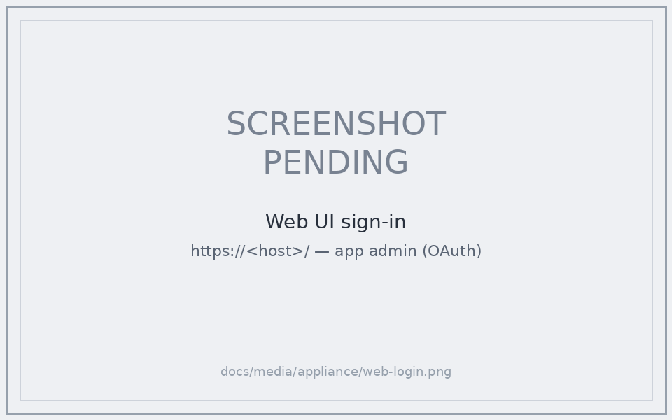
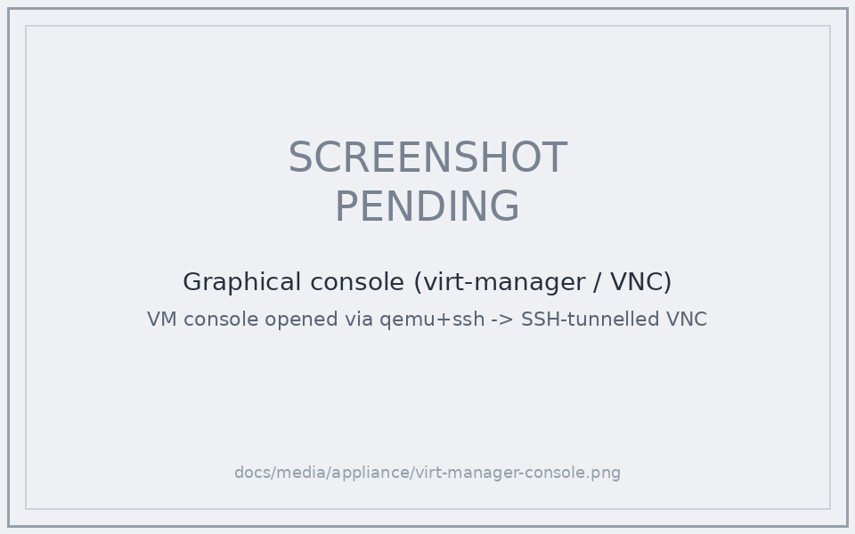
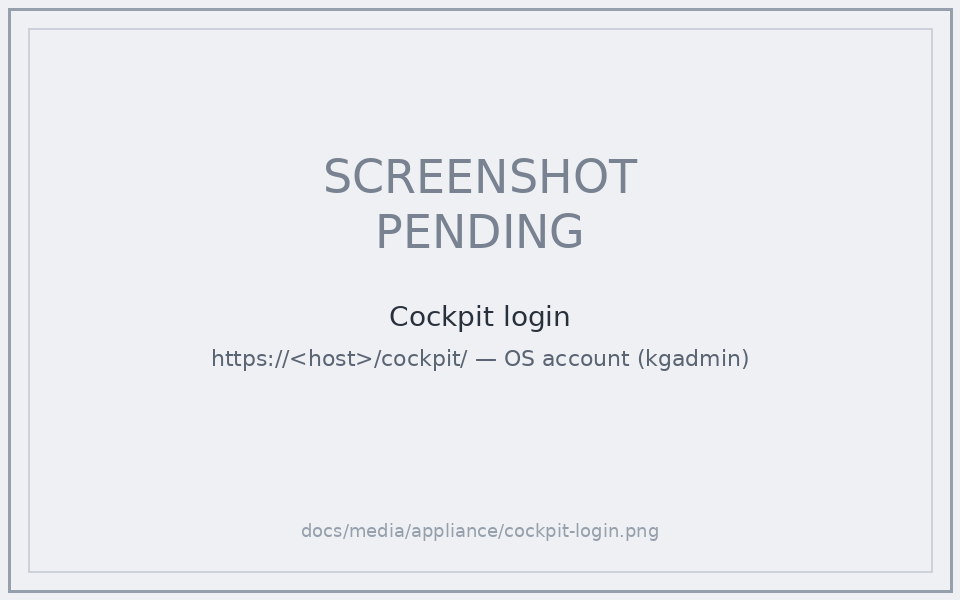
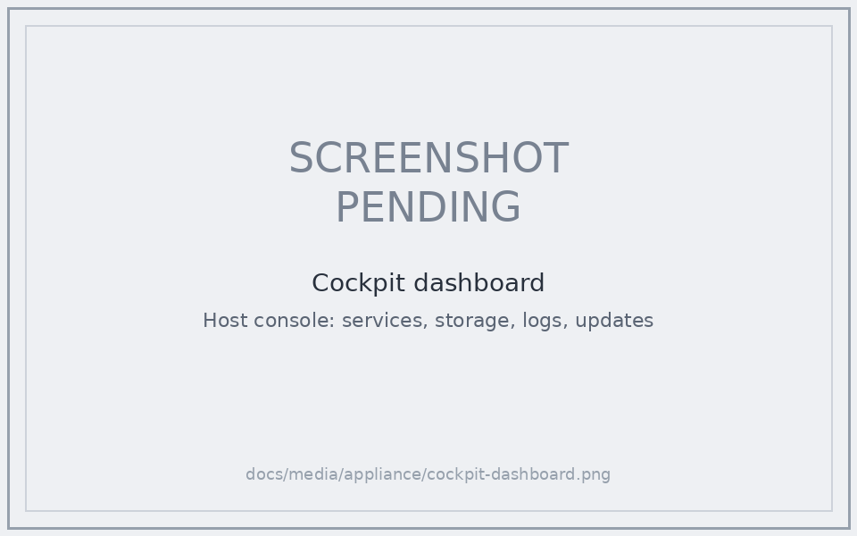

# Appliance on libvirt/KVM

How to deploy and manage the [x86 thin appliance](../../appliance/README.md)
([ADR-103](../architecture/infrastructure/ADR-103-distribution-strategy-nomic-first-thin-appliance-with-app-store-tenancy.md))
as a libvirt/KVM guest, with a self-renewing TLS certificate and no inbound
ports. The worked example is the `cube` deployment (`kg.broccoli.house`), but the
procedure is generic.

The appliance is **thin**: container images pull on first boot, secrets are
minted per-instance, and the box carries no baked `.env`. The image is built by
`appliance/build-appliance.sh`; this page covers everything *after* you have a
`kg-appliance-*.qcow2`.

## What you get

- A single VM that boots, mints its own secrets, pulls images, and starts the
  full stack (traefik / web / api / postgres / garage / operator).
- **Self-renewing TLS** via in-container ACME DNS-01 (lego + a DNS provider such
  as porkbun) — the [TLS guide](tls.md) and
  [ADR-105](../architecture/infrastructure/ADR-105-scenario-driven-tls-via-in-vm-traefik-router.md)
  cover the cert design. DNS-01 is the only ACME challenge that works for a
  private box (RFC-1918, no inbound `:80`/`:443`) that owns a public DNS name.
- Management without SSH — the appliance ships **no sshd**. You drive it through
  the qemu-guest-agent, the Cockpit host console (`:9090`), or the tty1 console
  TUI over VNC.

## 1. The NoCloud seed — attach it as a VIRTIO disk

Provisioning config (`provision.env`) reaches the VM through a cloud-init
NoCloud seed: a small ISO with the `cidata` volume label holding `user-data` +
`meta-data`.

> **Critical:** attach the seed as a **virtio** disk, not a SATA/IDE cdrom. The
> Debian *cloud* kernel has no AHCI/SATA driver, so a `sr0`/`sda` seed is
> invisible → `ds-identify` finds no datasource → cloud-init is disabled → the
> box boots with defaults and your `provision.env` is silently ignored.

Build the seed (run where you can write, then copy into the libvirt pool):

```bash
mkdir -p ~/kg-seed && cd ~/kg-seed
cat > meta-data <<EOF
instance-id: kg-appliance-01
local-hostname: kg-appliance
EOF
cat > user-data <<'EOF'
#cloud-config
write_files:
  - path: /etc/kg/provision.env
    permissions: '0600'
    content: |
      KG_EXTERNAL_URL=https://kg.example.com
      KG_TLS_MODE=letsencrypt
      KG_ACME_CHALLENGE=dns-01
      KG_DNS_PROVIDER=porkbun
      KG_LE_EMAIL=you@example.com
      KG_PORKBUN_API_KEY=pk1_...
      KG_PORKBUN_SECRET_API_KEY=sk1_...
EOF
# label MUST be cidata for NoCloud
xorriso -as mkisofs -V cidata -J -r -o kg-seed.iso user-data meta-data
sudo cp kg-seed.iso /srv/storage/libvirt/images/   # xorriso can't write a root-owned pool dir directly
```

`provision.env` is the appliance's single declarative control surface; unknown
keys are ignored. See [`appliance/files/provision.env.example`](../../appliance/files/provision.env.example).

## 2. Define the VM

```bash
sudo virt-install \
  --name kg-appliance \
  --memory 4096 --vcpus 2 \
  --os-variant debian12 \
  --import \
  --disk path=/srv/storage/libvirt/images/kg-appliance.qcow2,bus=virtio \
  --disk path=/srv/storage/libvirt/images/kg-seed.iso,format=raw,bus=virtio,readonly=on \
  --network bridge=br0,model=virtio,mac=52:54:00:6e:4a:82 \
  --graphics vnc \
  --channel unix,target_type=virtio,name=org.qemu.guest_agent.0 \
  --noautoconsole
```

- **Bridge, not NAT** — put the VM on a real Linux bridge (`br0 ← <nic>`) so it
  gets a routable address and multiple guests can share the NIC.
- **Pin the MAC** to claim a DHCP reservation (and your public DNS A record).
  Changing the MAC later is safe — the image matches its NIC by *name*, not MAC
  (see Troubleshooting). To repoint an existing VM:
  `virsh shutdown kg-appliance && virt-xml kg-appliance --edit --network mac=<reserved> && virsh start kg-appliance`.
- The `org.qemu.guest_agent.0` channel is what lets you manage the box without
  SSH.

First boot pulls images and provisions — watch with `journalctl -u kg-firstboot -f`
(via the console). The admin password is written to `/root/kg-credentials.txt`
inside the VM. Then sign in to the web UI at the external URL:


<!-- TODO(screenshot): replace placeholder — the web UI sign-in page at
     https://<host>/ with the trusted cert. -->

## 3. Managing the box without SSH

The appliance has no sshd. Run commands inside the guest through the
qemu-guest-agent from the libvirt host. This helper executes a command in the VM
and prints its output:

```bash
vmx() {  # usage: vmx "shell command" [wait_seconds]
  local pid
  pid=$(sudo virsh qemu-agent-command kg-appliance \
    "{\"execute\":\"guest-exec\",\"arguments\":{\"path\":\"/bin/sh\",\"arg\":[\"-c\",\"$1\"],\"capture-output\":true}}" \
    | grep -oE '"pid":[0-9]+' | cut -d: -f2)
  [ -z "$pid" ] && { echo "(agent busy / not ready)"; return; }
  sleep "${2:-3}"
  sudo virsh qemu-agent-command kg-appliance \
    "{\"execute\":\"guest-exec-status\",\"arguments\":{\"pid\":$pid}}" \
    | python3 -c 'import sys,json,base64
d=json.load(sys.stdin)["return"]
for k in ("out-data","err-data"):
    if d.get(k): sys.stdout.write(base64.b64decode(d[k]).decode("utf-8","replace"))'
}

vmx "docker ps --format '{{.Names}}: {{.Status}}'"
vmx "cd /opt/kg && ./operator.sh status"
```

For commands with awkward quoting (heredocs, JSON), base64-encode them:
`vmx "echo <base64> | base64 -d | sh"`. Decode `out-data` and `err-data`
*separately* — they are padded independently, so concatenating before decoding
corrupts the base64.

Other management surfaces:

- **Cockpit** — `https://<vm-ip>:9090` (host console: services, storage, logs,
  updates). Cockpit authenticates against **OS accounts**, not the app's OAuth
  admin. First boot provisions a sudo-enabled login (`kgadmin` by default) — set
  it declaratively with `KG_HOST_LOGIN_USER` / `KG_HOST_LOGIN_PASSWORD` in
  `provision.env`, or let it mint a random password recorded in
  `/root/kg-credentials.txt`. Reset it later with
  `sudo /opt/kg/appliance/files/kg-host-login.sh`.
- **virt-manager** — connect to `qemu+ssh://<user>@<host>/system` for lifecycle +
  the VNC console. The remote graphical console has three wiring requirements
  (see below) that each fail with an unhelpful message.
- **Console TUI** — tty1 over VNC offers status / logs / restart / credentials /
  operator shell. Its **"Login shell (host)"** option drops to a **root shell with
  no password** — that's the intended way to a host shell (the serial/SSH root
  login stays locked).


<!-- TODO(screenshot): replace placeholder — VNC console showing the kg-console
     status menu (Platform status / logs / restart / credentials / etc.). -->

### Remote graphical console (virt-manager / virt-viewer)

Getting the VNC console to open from *another* machine needs three things lined
up. Each failure mode looks different, so they're easy to chase one at a time:

1. **Key auth the GUI session can use.** virt-manager spawns `ssh` inside your
   *desktop* session, which often lacks the `SSH_AUTH_SOCK` your terminal has —
   so it can't see your agent and falls back to a **password prompt**. Pin the
   key in `~/.ssh/config` so no agent is needed (use a passphrase-less key, or
   ensure the agent is exported to the GUI session):
   ```
   Host <libvirt-host>
       HostName <libvirt-host>
       User <user>
       IdentityFile ~/.ssh/<key>
       IdentitiesOnly yes
   ```
2. **VNC must listen on `127.0.0.1`, not `0.0.0.0`.** With a routable listen
   address virt-manager tries a **direct** connection to `host:5900` (usually
   firewalled → *"Viewer was disconnected"*). Binding to localhost forces it to
   tunnel over SSH instead — and closes the passwordless-VNC exposure. Set it
   (takes effect after a full power-off, not a reboot):
   ```bash
   virsh shutdown <dom>; virt-xml <dom> --edit --graphics listen=127.0.0.1; virsh start <dom>
   ```
3. **`netcat` on the libvirt host.** virt-manager's SSH tunnel pipes the VNC
   socket through `nc` on the remote host; without it the tunnel dies with
   *"Viewer was disconnected"* and `sh: line 1: nc: command not found`. Install
   it: `pacman -S openbsd-netcat` (Arch) / `apt install netcat-openbsd` (Debian).

Fallback that needs none of virt-manager's auto-tunnel: forward the port yourself
and point any VNC viewer at localhost:
```bash
ssh -L 5901:localhost:5900 <user>@<libvirt-host>   # keep open
remote-viewer vnc://localhost:5901                  # or gvncviewer localhost:5901
```


<!-- TODO(screenshot): replace placeholder — virt-manager (or remote-viewer) VNC
     console showing the appliance VM. -->

### Cockpit behind Traefik (`/cockpit`)

Cockpit's own cert on `:9090` is self-signed, and HSTS on the main hostname stops
a browser from clicking through it. So the appliance fronts Cockpit through the
same Traefik door at **`https://<host>/cockpit/`**, sharing the trusted cert. It's
on by default (`KG_COCKPIT_PROXY`, when `KG_EXTERNAL_URL` + `KG_TLS_MODE=letsencrypt`
are set); `=false` opts out and leaves Cockpit only on `:9090`.

How it fits together (Cockpit runs on the *host*, which Traefik's docker provider
can't see directly):
- `kg-cockpit-proxy.sh` writes `/etc/cockpit/cockpit.conf` (`UrlRoot=/cockpit`,
  `Origins` from `KG_EXTERNAL_URL`, `AllowUnencrypted`) so Cockpit serves the
  sub-path and accepts the proxied origin's login WebSocket.
- `docker-compose.traefik-cockpit.yml` adds a tiny `socat` sidecar that Traefik
  routes `/cockpit` to; it TCP-forwards to the host's `:9090` via the Docker
  host-gateway. A `redirectregex` middleware 301s the bare `/cockpit` → `/cockpit/`
  (Cockpit drops the slashless prefix, which would otherwise surface as a 502).

Log in with the OS account (`kgadmin` by default — see the host-login section
above). Reset the Cockpit config later with
`sudo KG_EXTERNAL_URL=https://<host> /opt/kg/appliance/files/kg-cockpit-proxy.sh`.


<!-- TODO(screenshot): replace placeholder — Cockpit login page at
     https://<host>/cockpit/ (note the trusted-cert padlock). -->


<!-- TODO(screenshot): replace placeholder — Cockpit overview/dashboard after login. -->

## 4. The certificate

With `KG_TLS_MODE=letsencrypt` + `KG_ACME_CHALLENGE=dns-01`, Traefik obtains and
**auto-renews** a real Let's Encrypt cert; `operator.sh recert` is a no-op. The
cert and ACME account live in a persisted bind-mount (`/opt/kg/docker/acme/acme.json`)
so renewals survive restarts. Verify from the libvirt host:

```bash
echo | openssl s_client -connect <vm-ip>:443 -servername kg.example.com 2>/dev/null \
  | openssl x509 -noout -subject -issuer -dates
```

## Worked example: `cube`

| Property | Value |
|----------|-------|
| Host | `cube` (libvirt `qemu:///system`), bridge `br0 ← enp2s0` |
| VM | `kg-appliance` — 2 vCPU / 4 GiB, virtio qcow2 + virtio seed |
| NIC MAC | `52:54:00:6e:4a:82` → DHCP reservation `192.168.1.82` |
| DNS | `kg.broccoli.house` → `192.168.1.82` (UniFi) |
| TLS | in-container DNS-01 via porkbun; self-renewing Let's Encrypt cert |
| Manage | qemu-guest-agent (`vmx`), Cockpit `:9090`, VNC console |

## Troubleshooting

- **`provision.env` ignored / box came up with defaults** — the seed was almost
  certainly attached as a SATA cdrom. The cloud kernel can't see it; reattach as
  a virtio disk (§1). Confirm cloud-init found it: `vmx "cloud-init status --long"`
  should name a `config-disk` datasource.
- **NIC has no address after a MAC change** — only affects images predating the
  MAC-agnostic networking fix. Current images disable cloud-init's network
  rendering and ship a DHCP netplan matched by interface name (`e*`), so MAC
  changes are safe. If stranded, rewrite `/etc/netplan/50-cloud-init.yaml` to
  match by name and `netplan apply`.
- **Traefik can't reach Docker (`client version 1.24 is too old`)** — Traefik v3
  hard-codes Docker API 1.24 while Engine ≥25 serves a minimum of 1.40. Current
  images bake `DOCKER_MIN_API_VERSION=1.24` as a `docker.service` drop-in. To fix
  a running box: write that drop-in and `systemctl restart docker`.
- **TLS stuck on the self-signed default / `acme.json` empty** — Traefik only
  requests a cert for a declared domain; it does not mint on-demand from SNI.
  Ensure `EXTERNAL_URL`/`TLS_DOMAIN` is a public FQDN (not `localhost`) so the
  letsencrypt overlay's `tls.domains` is populated. `operator.sh start` warns when
  it isn't.
- **virt-manager console "Viewer was disconnected" / asks for a password** — the
  remote graphical console needs key auth the GUI session can use, VNC bound to
  `127.0.0.1`, and `netcat` on the libvirt host. See
  [Remote graphical console](#remote-graphical-console-virt-manager--virt-viewer).

## See also

- [Appliance build](../../appliance/README.md) — building the image
- [TLS and Certificates](tls.md) — cert modes and scenarios
- [Troubleshooting](troubleshooting.md) — general platform issues
- [ADR-103](../architecture/infrastructure/ADR-103-distribution-strategy-nomic-first-thin-appliance-with-app-store-tenancy.md),
  [ADR-105](../architecture/infrastructure/ADR-105-scenario-driven-tls-via-in-vm-traefik-router.md)
