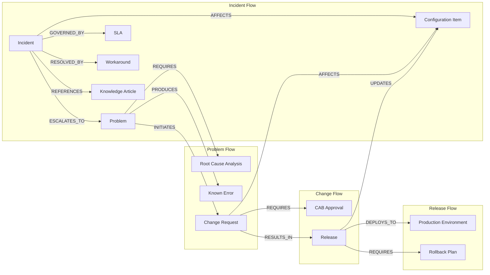
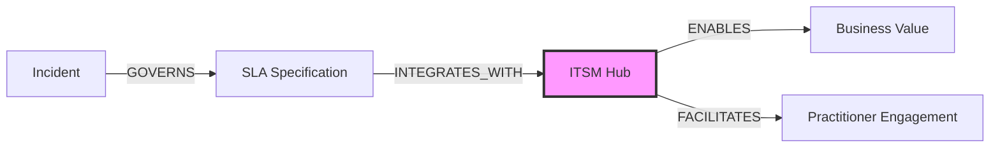
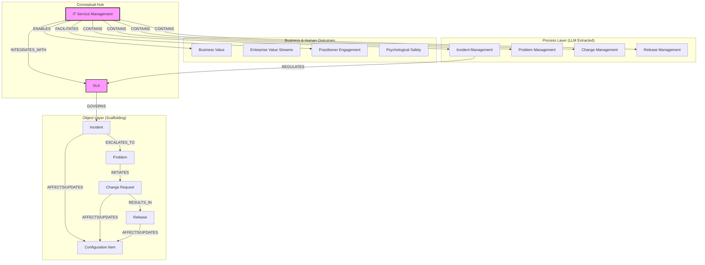
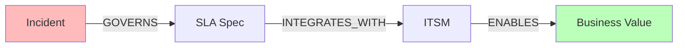
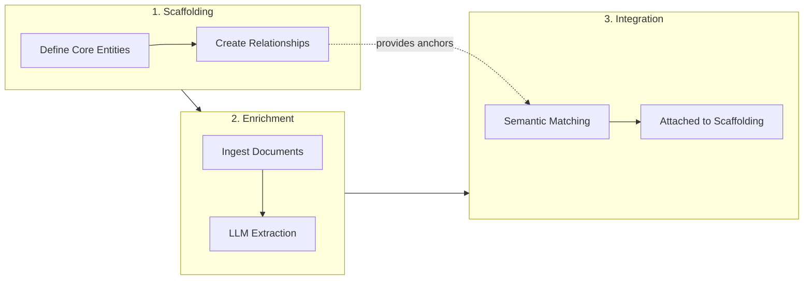

# Building an ITSM Knowledge Graph: An AI Agent's Experience

**Context:** Hands-on session using the knowledge graph MCP tools to build an ITSM ontology

---

## What We Built

Over a single session, we constructed an ITSM ontology in a knowledge graph using two complementary approaches:

1. **Scaffolding** - Manually created core ITSM concepts and relationships using the `graph` tool
2. **Enrichment** - Ingested thought leadership documents that the LLM extraction attached to our scaffolding

### The Scaffolding Layer (16 concepts, 14 edges)

Using the `graph` MCP tool with queue operations, the foundational ITSM object model was created:



This took approximately 6 batched queue operations instead of 30+ individual tool calls.

### The Enrichment Layer (3 documents, ~23 new concepts)

Three prose documents were then ingested:

| Document | Focus | New Concepts | Linked to Existing |
|----------|-------|--------------|-------------------|
| itsm-foundations.md | Core ITSM processes | 6 | 3 |
| itsm-people-engagement.md | Practitioner experience | 4 | 2 |
| itsm-business-value.md | Business outcomes | 13 | 3 |

**Key finding:** The LLM extraction created *process-level* concepts that complement the *object-level* scaffolding:

| Scaffolding (objects) | LLM Extraction (processes) |
|---------------------------|---------------------------|
| Incident | Incident Management |
| Problem | Problem Management |
| Change Request | Change Management |
| Release | Release Management |
| Configuration Item | Configuration Management |

The extraction also created an umbrella concept "IT Service Management (ITSM)" that CONTAINS all the process concepts and INTEGRATES_WITH the SLA concept.

---

## How the Graph Connected

The most interesting discovery was how the documents found **semantic bridges** to the scaffolding:



The SLA concept became a natural connector because:
1. Incident was linked to SLA in the scaffolding (GOVERNED_BY)
2. The LLM extraction linked Incident Management to SLA (REGULATES)
3. The ITSM umbrella concept INTEGRATES_WITH SLA Specification

This created a **hub-and-spoke pattern** where ITSM acts as a conceptual hub connecting:
- Operational objects (Incident, Problem, Change, Release)
- Process disciplines (Incident Management, Change Management, etc.)
- Business outcomes (Business Value, Enterprise Value Streams)
- Human factors (Practitioner Engagement, Psychological Safety)



---

## The Tools Experience

### The `graph` Tool with Queue Action

The queue action was transformative for efficiency:

```json
{
  "action": "queue",
  "operations": [
    {"op": "create", "entity": "concept", "label": "Incident", "ontology": "itsm", "description": "..."},
    {"op": "create", "entity": "concept", "label": "Problem", "ontology": "itsm", "description": "..."},
    {"op": "create", "entity": "edge", "from_label": "Incident", "to_label": "Problem", "relationship_type": "ESCALATES_TO"}
  ]
}
```

**What worked well:**
- Creating 10 concepts in a single tool call
- Semantic resolution (`from_label`/`to_label`) finding concepts by name
- Sequential execution with clear per-operation results
- `continue_on_error` mode for diagnosing issues

**Lessons learned:**
- Generic labels can match unintended concepts at 85% threshold - use IDs for precision
- The `matching_mode: "auto"` default is smart - similar labels get matched automatically
- `force_create` bypasses matching when you need distinct concepts

### The Ingestion Flow

Submitting documents for LLM extraction, then exploring results:

1. **Ingest** - Submit prose document to ontology
2. **Wait** - LLM chunks and extracts concepts/relationships
3. **Explore** - Search, trace paths, discover what connected

The extraction is sophisticated - it created hierarchical relationships (ITSM CONTAINS Incident Management) and cross-references (Incident Management REGULATES SLA) without explicit instruction.

### Path Finding

The `concept connect` action revealed non-obvious relationships:

**Query:** How does Incident connect to Business Value?



**Result:** 3 hops through the SLA and ITSM hub concepts.

This is exactly what knowledge graphs excel at - surfacing connections that aren't obvious from reading individual documents.

---

## Observations for ITSM Practitioners

### 1. Scaffolding Guides Extraction

Pre-seeding an ontology with core concepts influences how LLM extraction builds on it. The extraction found the existing SLA concept and linked to it rather than creating a duplicate. This suggests a workflow:



1. **Define core entities** manually (Incident, Problem, Change, CI)
2. **Define key relationships** between them
3. **Ingest documents** that elaborate on these concepts
4. **Extraction attaches** to existing structure rather than creating islands

### 2. Object vs Process Distinction

The graph naturally developed two layers:
- **Objects** - Things that exist (Incident, Problem, Release)
- **Processes** - Disciplines that manage those things (Incident Management, Problem Management)

This mirrors ITIL's distinction and emerged organically from the combination of manual scaffolding (objects) and document extraction (processes).

### 3. Hub Concepts Matter

Certain concepts become natural connectors:
- **SLA** connects operations to business commitments
- **Configuration Item** connects incidents, changes, and releases
- **ITSM** (umbrella) connects processes to outcomes

Identifying and explicitly creating these hub concepts early improves graph coherence.

### 4. Evidence Trails

Every extracted concept has evidence - quoted text from source documents. This provides traceability:

```
Concept: Psychological Safety
Evidence: "In psychologically safe environments, practitioners report near-misses,
          surface concerns about risky changes, and admit when they don't know something."
Source: itsm-people-engagement.md, paragraph 1
```

This is valuable for ITSM practitioners who need to trace recommendations back to source material.

---

## What This Enables

For ITSM practitioners, this tooling supports:

1. **Knowledge Base Construction** - Build a structured ontology from existing ITSM documentation
2. **Gap Analysis** - Query for missing connections ("What concepts aren't linked to Business Value?")
3. **Impact Analysis** - Trace paths ("What does changing this CI affect?")
4. **Training Material** - Extract evidence supporting specific concepts
5. **Process Design** - Model proposed process changes as graph modifications before implementing

The combination of deterministic editing (graph tool) and intelligent extraction (ingest) means you can architect the structure you want while letting the system fill in details from documentation.

---

## Technical Notes

- **Graph storage:** Apache AGE (PostgreSQL graph extension)
- **Concept matching:** Vector embeddings with 85% similarity threshold
- **MCP Protocol:** Tools are exposed via Model Context Protocol for AI agent access
- **Queue limit:** 20 operations per batch (prevents runaway mutations)

The `graph` tool (ADR-089 Phase 3a) was designed specifically to enable the scaffolding workflow demonstrated here.

---

*This document captures an AI agent's experience building an ITSM knowledge graph using the graph MCP tools.*
